# 第五章：改变数据和结构

数据并不是静态的，它经常发生变化。本章重点介绍了编辑和删除数据以及其支持结构——表和数据库。

这一章分为两个主要部分。第一部分涵盖了改变数据的所有方面。首先我们会看到如何编辑数据，即如何进入编辑模式，如何一次编辑多行数据，以及如何从内联编辑中受益。接下来我们会看到如何删除数据行，以及如何删除表和数据库。

第二部分解释了如何修改表的结构。我们将介绍如何向表中添加列；然后我们将探讨各种列类型，如`TEXT，BLOB，ENUM，DATE`和`BIT`列类型。最后，我们将介绍索引的管理。

# 改变数据

在本节中，我们将介绍编辑和删除数据的各种方法。

## 进入编辑模式

当我们浏览表或查看任何单表查询的搜索结果时，小图标和链接会出现在每个表行的左侧或右侧，如下面的截图所示：

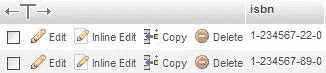

可以使用铅笔形状的图标**(编辑)**来编辑行，使用红色图标**(删除)**来删除行。这些控件的确切形式和位置受以下因素的影响：

```go
$cfg['PropertiesIconic'] = 'both';
$cfg['ModifyDeleteAtLeft'] = true;
$cfg['ModifyDeleteAtRight'] = false;

```

我们可以决定是在左侧显示它们，右侧显示它们，还是两侧都显示。`$cfg['PropertiesIconic']`参数可以有`TRUE, FALSE`或`both`的值。`TRUE`只显示图标，`FALSE`显示**编辑，内联编辑，复制**和**删除**（或它们的翻译等效），`both`显示图标和文本，如前面的截图所示。

每一行旁边的小复选框在本章后面的*多行编辑*和*删除多行*部分中有解释。

点击**编辑**图标或链接会带来以下面板，它与数据输入面板相似（除了下部分）。

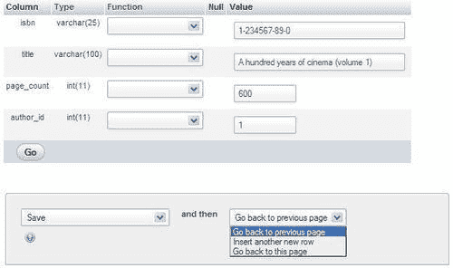

在这个面板中，我们可以通过直接输入（或通过常规操作系统机制剪切和粘贴）来更改数据。我们也可以使用**重置**按钮恢复到原始内容。

默认情况下，下拉菜单设置为**保存**（以便我们对此行进行更改）和**返回到上一页**（以便我们可以继续编辑上一页结果页面上的另一行）。如果我们想要在点击**Go**后留在当前页面以保存然后继续编辑，我们可以选择**返回到此页面**。如果我们想要在保存当前行后插入另一行，我们只需在保存之前选择**插入另一行**。**插入为新行**选项（在**保存**选项下方）在本章后面的*复制数据行*部分中有解释。

### 使用 Tab 键移动到下一个字段

喜欢使用键盘的人可以使用*Tab*键来进入下一个字段。通常情况下，光标从左到右，从上到下移动，所以它会进入**Function**列中的字段（稍后会详细介绍）。然而，为了方便在 phpMyAdmin 中导航数据，正常的导航顺序已经改变。*Tab*键首先通过**Value**列中的每个字段，然后通过**Function**列中的每个字段。

### 使用箭头移动

另一种在字段之间移动的方法是使用*Ctrl* + *箭头*键。当屏幕上有许多字段时，这种方法可能比使用*Tab*键更容易。为了使其工作，`$cfg['CtrlArrowsMoving']`参数必须设置为`true`，这是默认值。

### 注意

在某些情况下，这种技术不能用于在字段之间移动。例如，Google Chrome 浏览器不支持*Ctrl* + *箭头*。另外，在启用了 Spaces 的 Mac OS X 10.5 上，*Ctrl* + *箭头*是在虚拟桌面之间切换的默认快捷键。

### 处理 NULL 值

如果表的结构允许在列中放置`NULL`值，那么在**Null**列中会出现一个小复选框。选择此复选框会在列中放置`NULL`值。每当在此列的**Value**中输入数据时，**Null**复选框会自动清除（这在启用 JavaScript 的浏览器中是可能的）。

在下面的屏幕截图中，我们修改了`author`表中**phone**列的结构，以允许`NULL`值（请参考本章的*编辑列属性*部分）。这里没有选择**Null**复选框：

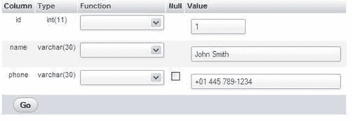

在选择**Null**框后，相应的数据被清除。

### 对值应用函数

MySQL 语言提供了一些函数，我们可以在保存之前应用到数据上。如果`$cfg['ShowFunctionFields']`设置为`TRUE`，则某些函数将出现在每个列旁边的下拉菜单中。

函数列表在`$cfg['Functions']`数组中定义。通常，这些数组的默认值位于`libraries/config.default.php`中。我们可以通过将所需的部分复制到`config.inc.php`中来更改它们。如果我们这样做，由于这些值可能会因版本而异，我们应该注意将我们的更改与新版本的值合并。某些数据类型的最常用函数首先显示在列表中。一些限制在`$cfg['RestrictColumnTypes']`和`$cfg['RestrictFunctions']`数组中定义。

如下面的屏幕截图所示，我们可以在保存此行时将**UPPER**函数应用于**title**列，将标题转换为大写字符：

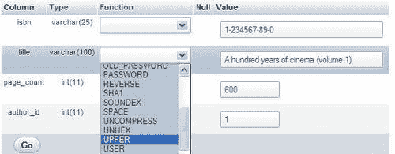

为了节省一些屏幕空间，可以通过将`$cfg['ShowFunctionFields']`设置为`FALSE`来禁用此功能。此外，**Function**列标题是可点击的，因此我们可以即时禁用此功能。

当功能被禁用时，要么通过点击，要么通过配置参数，会出现一个“显示：功能”链接，以便在单击时显示这个“功能”列，如下面的屏幕截图所示：

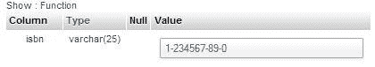

**Type**列标题也可以通过点击或配置`$cfg['ShowFieldTypesInDataEditView']`来使用类似的功能。

### 数据行的复制

在数据维护过程中（用于永久复制或测试目的），我们经常需要生成一行的副本。如果在同一表中进行此操作，我们必须遵守唯一键的规则。

这是一个行复制的例子。我们的作者写了关于电影的第 2 卷书。因此，需要稍作更改的列是 ISBN、标题和页数。我们将现有行显示在屏幕上，更改这三列，并选择**插入为新行**，如下面的屏幕截图所示：

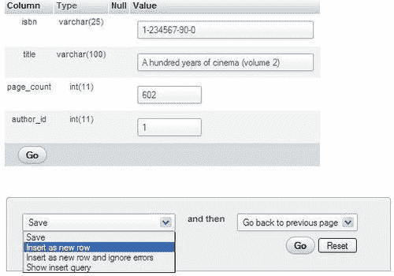

当我们点击**Go**时，将创建另一行，带有修改后的信息，原始行保持不变，如下所示：

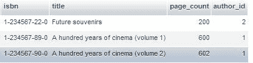

存在一个快捷链接来执行相同的操作。在浏览表时，点击特定行的**复制**会带来该行的编辑面板，并选择**插入为新行**而不是**保存**。

## 多行编辑

多行编辑功能使我们能够在要编辑的行上使用复选框，并在**With selected**菜单中使用**Change**链接（或铅笔形图标）。**Check All / Uncheck All**链接也可以用于快速选中或取消选中所有复选框。我们还可以点击行数据的任何位置来激活相应的复选框。要选择一系列复选框，我们可以点击范围的第一个复选框，然后*Shift* + 点击范围的最后一个复选框。


单击**更改**后，出现包含所有选定行的编辑面板。在查看、比较和更改这些行的数据时，编辑过程可以继续进行。当我们用复选框标记一些行时，我们还可以对它们执行另外两个操作——**删除**（参见本章的*删除多行*部分）和**导出**（参见第六章)）。

## 编辑下一行

在具有整数列上的主键的表上可以进行顺序编辑。我们的`author`表符合这些条件。让我们看看当我们开始编辑具有**id**值**1**的行时会发生什么：

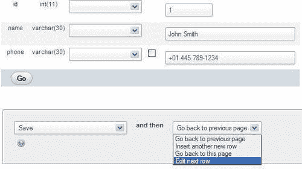

编辑面板出现，我们可以编辑作者编号**1**。然而，在下拉菜单中，**编辑下一行**选项是可用的。如果选择了，下一个作者——第一个主键值大于当前主键值的作者——将可供编辑。

## 行内编辑

版本 3.4 引入了行内编辑，即在编辑时查看结果集的其他行。如果`$cfg['AjaxEnable']`设置为`true`，则可以使用`config.inc.php`或用户首选项。单击行的**行内编辑**显示以下对话框：

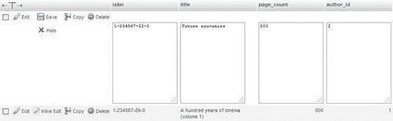

在编辑需要更改的列之后，我们单击**保存**。也可以使用**隐藏**链接中止更改。

## 删除数据

phpMyAdmin 的界面使我们能够删除以下数据：

+   单行数据

+   表的多行

+   表中的所有行

+   所有表中的所有行

### 删除单行

我们可以使用每行旁边的红色**删除**图标来删除行。如果`$cfg['Confirm']`的值设置为`TRUE`，则必须在执行之前确认每个 MySQL `DELETE`语句。这是默认设置，因为允许仅需一次点击即可删除行可能不明智！

确认的形式因浏览器执行 JavaScript 的能力而异。基于 JavaScript 的确认弹出窗将类似于以下截图：

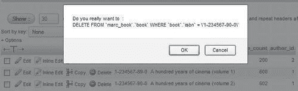

如果我们的浏览器已禁用 JavaScript，则会出现一个不同的面板。

实际的`DELETE`语句将使用所需的任何信息来确保仅删除预期的行。在我们的情况下，已定义了主键并在`WHERE`子句中使用了它。如果没有主键，将根据每列的值生成更长的`WHERE`子句。生成的`WHERE`子句甚至可能阻止`DELETE`操作的正确执行，特别是如果存在`TEXT`或`BLOB`列类型。这是因为用于将查询发送到 Web 服务器的 HTTP 事务可能会受到浏览器或服务器的长度限制。这是另一个为什么强烈建议定义主键的原因。

### 删除多行

让我们假设我们检查了一页的行，并决定一些行必须被删除。与其逐个使用**删除**链接或图标删除它们，有时在检查一组行时必须做出删除决定，`表`视图模式下的行旁边有复选框，如下面的截图所示：

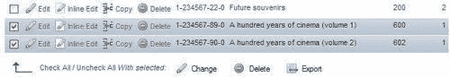

这些复选框与**选择的**菜单中的**删除**图标一起使用。确认屏幕将列出所有即将被删除的行。

### 删除表中的所有行

要完全删除表中的所有行（保持其结构不变），我们首先通过从导航面板中选择相关数据库来显示数据库**结构**页面。然后，我们使用与要清空的表位于同一行的**清空**图标或链接，如下所示：

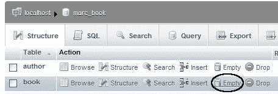

我们收到了确认`TRUNCATE`语句的消息（用于快速清空表的 MySQL 语句）。对于我们的练习，我们不会删除这些宝贵的数据！

### 注意

删除数据，无论是逐行删除还是清空表，都是永久性的操作。除非恢复备份，否则无法恢复。

### 删除多个表中的所有行

每个表名左侧都有一个复选框。我们可以选择一些表。然后，在**选择的操作**菜单中，选择**清空**操作，如下截图所示：

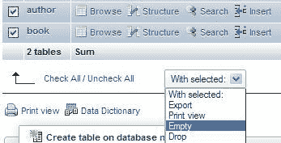

当然，这个决定不能轻率地做出！

## 删除表

删除表会删除数据和表的结构。在`数据库`视图中，我们可以通过使用该表的红色**删除**图标来删除特定表。相同的机制也适用于删除多个表（使用下拉菜单和**删除**操作）。

## 删除数据库

我们可以通过转到`服务器`视图中的**数据库**页面，选择不需要的数据库旁边的复选框，然后点击**删除**链接来删除整个数据库（包括其所有表）：

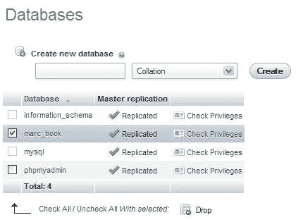

默认情况下，`$cfg['AllowUserDropDatabase']`设置为`FALSE`。因此，该面板不允许非特权用户删除数据库，直到手动将此设置更改为`TRUE`为止。

为了帮助我们三思而后行，在删除数据库之前会出现一个特殊的消息——您即将销毁一个完整的数据库！

### 注意

包含所有用户和权限定义的数据库`mysql`非常重要。因此，即使对于管理员来说，该复选框也被禁用。

# 更改表结构

在开发应用程序时，由于新的或修改后的需求，关于数据结构的要求经常发生变化。开发人员必须通过审慎的表结构编辑来适应这些变化。本节探讨了更改表结构的主题。具体来说，它展示了如何向现有表中添加列和编辑列的属性。然后，我们基于这些概念引入了更多专业的列类型，并通过 phpMyAdmin 解释了它们的处理。最后，我们将涵盖索引管理的主题。

## 添加列

假设我们需要一个新列来存储书籍的语言，并且默认情况下，我们保存数据的书籍是用英语写的。我们称该列为**language**，它将包含由两个字符组成的代码（默认为**en**）。

在`book`表的`表`视图的**结构**页面中，我们可以找到**添加列**对话框。在这里，我们指定要添加多少个新列，以及它们将放在哪里。

表中新列的位置只在开发者的角度上才重要。通常我们会逻辑地分组列，这样我们可以在列的列表中更容易地找到它们。列的确切位置不会影响预期结果（查询的输出），因为无论表结构如何，这些结果都可以进行调整。通常，最重要的列（包括键）位于表的开头。然而，这是个人偏好的问题。

我们想把新列放在表的末尾。因此，我们选中相应的单选按钮，然后点击**执行**。


其他可能的选择是**在表的开头**和**之后**（在这种情况下，我们必须从下拉菜单中选择新列应该放在哪个列之后）。

我们看到了输入列属性的熟悉面板。我们填写它。然而，由于这次我们想输入一个默认值，所以我们进行了以下两个操作：

+   将**默认**下拉菜单从**无**更改为**如定义：**

+   输入默认值：**en**

然后我们点击**保存**。

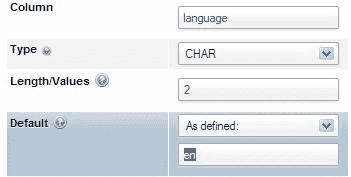

### 垂直模式

前面的面板以垂直模式显示，因为`$cfg['DefaultPropDisplay']`的默认值为`3`。这意味着对于三列或更少，将使用垂直模式，对于三列以上，将自动选择水平模式。在这里，我们可以使用我们选择的数字。

如果我们将`$cfg['DefaultPropDisplay']`设置为`'vertical'`，则添加新列的面板（以及编辑列结构的面板）将始终以垂直顺序呈现。此参数还可以取值`'horizontal'`以强制水平模式。

## 编辑列属性

在**结构**页面上，我们可以对表进行进一步更改：

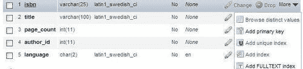

此面板不允许对列进行所有可能的更改。它特别允许：

+   使用特定列上的**更改**链接更改一个列的结构

+   使用**删除**操作删除列

+   向现有**Primary**键添加列

+   在列上设置非唯一**索引**或**唯一**索引

+   设置**FULLTEXT**索引（仅当列类型允许时提供）

这些是一些可能在某些情况下有用的快速链接，但它们不能替代完整的索引管理面板。这两者都在本章中有解释。

我们可以使用复选框选择列。然后，使用适当的**选择**图标，我们可以使用**更改**编辑列，或者使用**删除**进行多列删除。**全选/取消全选**选项允许我们轻松地选中或取消选中所有框。

## TEXT 列类型

我们现在将探讨如何使用**TEXT**列类型和相关配置值来调整最佳的 phpMyAdmin 行为。首先，我们向**book**表中添加一个名为**description**的**TEXT**列。

有三个配置指令控制在**插入**或**编辑**模式下显示的**TEXT**列类型的文本区域的布局。每列的显示列数和行数由以下定义：

```go
$cfg['TextareaCols'] = 40;
$cfg['TextareaRows'] = 15;

```

这默认情况下为**TEXT**列类型提供了工作空间，如下面的屏幕截图所示：


设置只对文本区域施加了视觉限制，如果必要，浏览器会创建垂直滚动条。

### 注意

尽管**MEDIUMTEXT、TEXT**和**LONGTEXT**列类型可以容纳超过 32 KiB 的数据，但某些浏览器并不总是能够使用 HTML 提供的文本区域进行编辑。事实上，实验已经说服了 phpMyAdmin 开发团队，如果内容大于 32 KiB，产品将显示警告消息。该消息警告用户内容可能无法编辑。

最后一个配置指令`$cfg['LongtextDoubleTextarea']`只对**LONGTEXT**列类型有影响。默认值为`TRUE`，可以使编辑空间加倍。

## BLOB（二进制大对象）列类型

**BLOB**列类型通常用于保存二进制数据（如图像和声音），尽管 MySQL 文档暗示**TEXT**列类型也可以用于此目的。MySQL 5.1 手册中说：“在某些情况下，可能希望将媒体文件等二进制数据存储在 BLOB 或 TEXT 列中”。然而，另一句话：“BLOB 列被视为二进制字符串（字节字符串）”，似乎表明二进制数据应该真正存储在**BLOB**列中。因此，phpMyAdmin 的意图是使用**BLOB**列类型来保存所有二进制数据。

我们将在第十六章中看到，有特殊机制可进一步处理**BLOB**列类型，包括能够直接从 phpMyAdmin 中查看一些图像。

首先，我们向`book`表中添加一个名为**cover_photo**的**BLOB**列类型。如果现在浏览表，我们可以看到每个**BLOB**列类型的长度信息**[BLOB - 0B]**。


这是因为**Show BLOB**显示选项（还记得**选项**滑块吗？）默认情况下没有复选标记。因此，它阻止在浏览模式下显示**BLOB**内容。这种行为是有意的。通常，我们无法对以纯文本表示的二进制数据执行任何操作。

### 上传二进制内容

如果我们编辑一行，我们会看到**Binary do - not edit**警告和一个**浏览…**按钮。这个按钮的确切标题取决于浏览器。尽管不允许编辑，但我们可以轻松地将文本或二进制文件的内容上传到这个**blob**列中。

让我们使用**浏览**按钮选择一个图像文件，例如位于客户端工作站上的`phpMyAdmin/themes/pmahomme/img`目录的测试副本中的`logo_left.png`文件。现在点击**Go**。

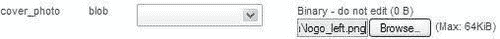

我们需要记住一些上传大小的限制。首先，**blob**列的大小限制为 64 KiB，但在第十六章中，我们将更改此列的类型以容纳更大的图像。因此，phpMyAdmin 通过**Max: 64KiB**警告提醒我们这一限制。此外，PHP 本身可能存在限制（有关更多详细信息，请参阅第七章）。我们现在已经在特定行中上传了一张图片。

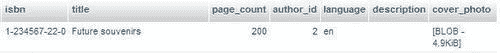

我们注意到**BLOB - 4.9KiB**是一个链接；如果需要，它允许我们下载任何二进制数据到我们的工作站。

如果我们为**Show BLOB Contents**显示选项打上复选标记，我们现在在**BLOB**列类型中看到以下内容：


### 注意

要真正在 phpMyAdmin 中查看图像，请参阅第十六章。

`$cfg['ProtectBinary']`参数控制编辑二进制列**(BLOB**和任何其他带有`binary`属性的列)时可以做什么。默认值**blob**阻止编辑**BLOB**列，但允许我们编辑 MySQL 标记为`binary`的其他列。值为`all`将甚至阻止编辑`binary`列。值为`FALSE`将不保护任何内容，因此允许我们编辑所有列。如果我们选择最后一个选项，我们会在此行的**编辑**面板中看到以下内容：

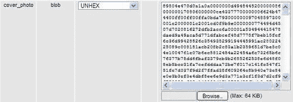

这个`BLOB`列类型的内容已经转换为十六进制，并且默认选择了**UNHEX**函数。我们可能不想以十六进制编辑这个图像数据，但这是在屏幕上安全表示二进制数据的最佳方式。这种十六进制表示的原因是，**Show binary contents as HEX display**选项（在**浏览**模式下）目前被标记。但我们没有标记这个选项；它被选中是因为`$cfg['DisplayBinaryAsHex']`指令默认为`TRUE`。

如果我们决定不标记这个选项，我们将看到这个图像的纯二进制数据：

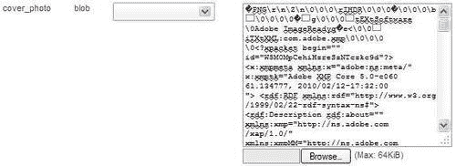

这可能不是我们最喜欢的图像编辑器！实际上，即使我们在不触及**BLOB**列类型的情况下保存这一行，数据也可能会损坏。但是，将`$cfg['ProtectBinary']`设置为`FALSE`的可能性是存在的，因为一些用户在他们的**BLOB**列中放置文本，并且他们需要能够修改这些文本。这就是为什么 phpMyAdmin 可以配置为允许编辑**BLOB**列。

MySQL 的**BLOB**数据类型实际上与它们对应的**TEXT**数据类型类似。但是，我们应该记住**BLOB**没有字符集，而**TEXT**列类型有一个影响排序和比较的字符集。

## ENUM 和 SET 列类型

**ENUM**和**SET**列类型都旨在表示可能的值列表。区别在于用户可以从定义的值列表中选择一个值，**ENUM**，和使用**SET**可以选择多个值。对于**SET**，所有多个值都放入一个单元格；但是多个值并不意味着创建多行数据。

我们在`book`表中添加了一个名为**genre**的列，并将其定义为**ENUM**。目前，我们选择在值列表中放入简短的代码，并将其中一个值**F**作为默认值，如下面的屏幕截图所示：

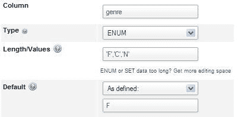

在值列表中，我们必须将每个值用单引号括起来，与默认值字段不同。从 3.4.0 版本开始，针对`ENUM/SET`列的编辑器可用。使用此编辑器，我们无需费心将值用单引号括起来。单击**获取更多编辑空间**即可启用此编辑器：

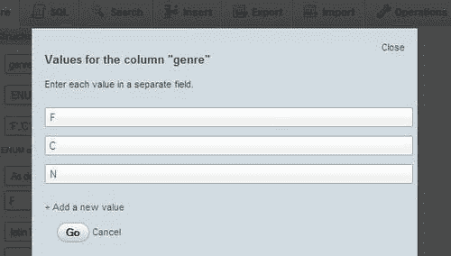

在我们的设计中，这些值代表**幻想，儿童**和**小说**。但是，目前，我们希望看到界面对简短代码的行为。在**插入**面板中，我们现在看到一个单选框界面，如下面的屏幕截图所示：


如果我们决定有更多自描述的值，我们可以回到**结构**模式，并更改**genre**列的值定义。我们还必须将默认值更改为可能的值之一，以避免在尝试保存此列结构修改时收到错误消息。

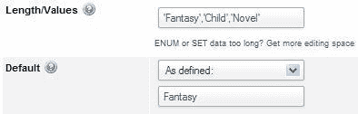

使用修改后的值列表，**插入**面板现在如下所示：


请注意，单选按钮已被下拉列表取代，因为可能的值长度更大。

如果我们想要选择多个可能的值，我们必须将列类型更改为**SET**。可以使用相同的值列表。但是，使用浏览器的多值选择器（在 Windows 或 Linux 桌面上按住 Ctrl 键单击，在 Mac 上按住 Command 键单击），我们可以选择多个值，如屏幕截图所示：


### 注意

在规范化的数据结构中，我们只会在`book`表中存储**genre**代码，并依赖另一个表来存储每个代码的描述。在这种情况下，我们将不使用**SET**或**ENUM**。

## DATE，DATETIME 和 TIMESTAMP 列类型

我们可以使用普通字符列来存储日期或时间信息。但是**DATE，DATETIME**和**TIMESTAMP**对于此目的更有效。MySQL 检查内容以确保有效的日期和时间信息，并提供特殊函数来处理这些列。

### 日历弹出

作为额外的好处，phpMyAdmin 提供了一个日历弹出，方便数据输入。

我们将首先在`book`表中添加一个**DATE**列类型**—date_published—**。如果我们进入**插入**模式，现在应该会看到新列，我们可以在其中输入日期。还有一个**日历**图标可用。此图标会带来一个弹出窗口，与此**DATE**列类型同步。如果列中已经有值，则相应地显示弹出窗口。在我们的情况下，列中没有值，因此日历显示当前日期，如下面的屏幕截图所示：

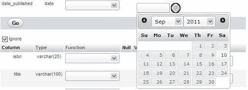

小箭头方便地滚动月份和年份。点击我们想要的日期，将其传输到我们的**date_published**列。对于**DATETIME**或**TIMESTAMP**列类型，弹出窗口提供了编辑时间部分的功能。

### 注意

如果我们输入日期或时间值，如果我们的浏览器启用了 JavaScript，则会进行验证；不正确的值会用红色突出显示。

### 时间戳选项

从 MySQL 4.1.2 开始，有更多选项可以影响**TIMESTAMP**列类型。让我们在`book`表中添加一个名为**stamp**的**TIMESTAMP**类型的列。在**默认**下拉菜单中，我们可以选择**CURRENT_TIMESTAMP**；但是对于此练习，我们不会这样做。但是，在**属性**列中，我们选择**on update CURRENT_TIMESTAMP**。更多详细信息，请参阅[`dev.mysql.com/doc/refman/5.5/en/timestamp.html`](http://dev.mysql.com/doc/refman/5.5/en/timestamp.html)。

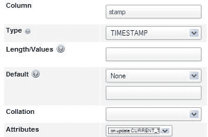

## 位列类型

MySQL 5.0.3 引入了真正的位列。它们在数据库中占用的空间与其定义中的位数相同。假设我们对每本书有以下三个信息，并且每个信息只能是真（1）或假（0）：

+   书是精装

+   书中包含 CD-ROM

+   书只有电子版可用

我们将使用一个单个**BIT**列来存储这三个信息。因此，我们在`book`表中添加一个长度为**3**（即 3 位）的列：

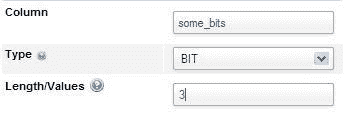

为了构造并随后解释我们存储在此列中的值，我们必须以二进制方式思考，尊重列内每个位的位置。要指示一本书是精装，不包含 CD-ROM，并且仅以电子版形式提供，我们将使用值`101`。

phpMyAdmin 以二进制方式处理`BIT`列。例如，如果我们编辑一行并将值`101`设置为**some_bits**列的值，那么在保存时将发送以下查询：

```go
UPDATE `marc_book`.`book` SET `some_bits` = b '101' 
WHERE `book`.`isbn` = '1-234567-89-0' LIMIT 1;

```

查询的突出部分显示该列实际上接收到了一个二进制值。在浏览时，精确值（在十进制中为`5` ——对于我们的目的来说是一个无意义的值）以其二进制形式`101`重新显示，这有助于解释每个离散的位值。有关位值表示法的更多详细信息，请参阅[`dev.mysql.com/doc/refman/5.5/en/bit-type.html`](http://dev.mysql.com/doc/refman/5.5/en/bit-type.html)。

## 管理索引

正确维护的索引对于数据检索速度至关重要。phpMyAdmin 具有许多索引管理选项，将在本节中介绍。

### 单列索引

我们已经看到**结构**面板通过一些链接（如**添加主键、添加索引**和**添加唯一索引**）提供了快速创建单列索引的方法。在列列表下方，有一个可用于管理索引的界面部分：

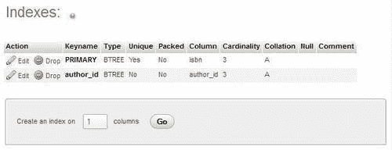

此部分有链接可编辑或删除每个索引。在这里，**列**部分每个索引只列出一个列，我们可以看到整个列参与索引。这是因为在每个列名后面没有大小信息，与我们下一个示例中将看到的情况相反。

现在我们将在标题上添加一个索引。但是，我们希望限制此索引的长度，以减少磁盘上索引结构使用的空间。**在 1 列上创建索引**选项是合适的。因此，我们点击**Go**。在下一个屏幕中，我们指定索引详细信息如下：

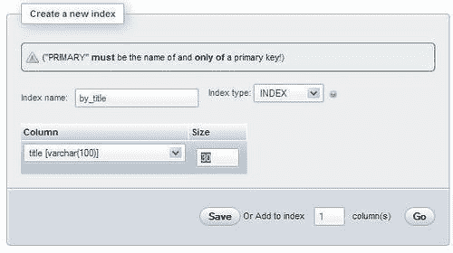

我们在此面板的选项中填写以下信息：

+   **索引名称：**我们发明的描述此索引目的的名称

+   **索引类型：**我们可以选择**INDEX**

+   **列：**我们选择用作索引的列，即**title**

+   **大小：**我们输入**30**而不是 100（列的完整长度），以节省表的物理部分中保存索引数据的空间

保存此面板后，我们可以从以下屏幕截图中确认索引已创建，并且不覆盖**title**列的整个长度：

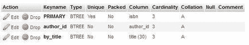

### 多列索引和索引编辑

在下一个示例中，我们假设在将来的应用程序中，我们将需要找到特定作者写的特定语言的书。将**author_id**索引扩展，添加**language**列到其中是有意义的。

我们点击包含**author_id**索引的行上的**Edit**链接（小铅笔图标），这将显示此索引的当前状态。界面上有空间可以向此索引添加另一列。如果需要添加多于一列，我们可以使用**Add to index 1 column(s)**功能。在选择器中，我们选择**language**。这次我们不需要输入大小，因为整个列将被用于索引。为了更好的文档记录，我们更改**Index name (author_language** 为适当的名称，如下图所示：

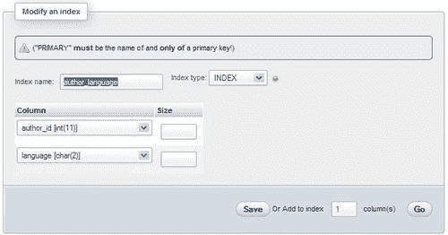

我们保存这个索引修改。在索引列表中，我们可以确认我们的索引修改。

### 全文索引

这种特殊类型的索引允许进行全文搜索。它仅支持`MyISAM`表的**VARCHAR**和**TEXT**列类型，但 MySQL 5.6 也应该为`InnoDB`提供此功能。我们可以在列列表中使用**Add FULLTEXT index**链接，或者转到索引管理面板，并在下拉菜单中选择**FULLTEXT**。

### 使用 EXPLAIN 优化索引

在这一部分，我们想要获取有关 MySQL 用于特定查询的索引以及没有定义索引的性能影响的一些信息。

假设我们想使用以下查询：

```go
SELECT *
FROM `book`
WHERE author_id = 2 AND language = 'es'

```

我们想知道，哪些由`id`为`2`的作者写的书是用`es`语言——我们的西班牙语的代码。

要输入此查询，我们可以使用数据库或表菜单中的**SQL**选项卡，或者 SQL 查询窗口（参见第十一章）。我们在查询框中输入此查询，然后点击**Go**。目前查询是否找到任何结果并不重要。

### 注意

您可以通过按照第八章中的解释来获得相同的查询，以便搜索**author_id 2**和语言**es**。

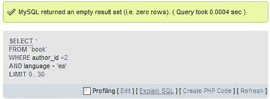

我们现在将使用**[Explain SQL]**链接来获取有关此查询使用了哪个索引（如果有的话）的信息。

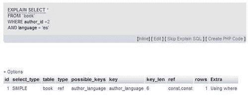

我们可以看到**EXPLAIN**命令已经传递给 MySQL，告诉我们使用的**key**是**author_language**。因此，我们知道这个索引将用于这种类型的查询。如果这个索引不存在，结果将会有很大不同。

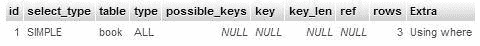

这里，**key (NULL)** 和 **type (ALL)** 意味着没有使用索引，需要检查所有行以找到所需的数据。根据总行数的不同，这可能会严重影响性能。我们可以通过检查 phpMyAdmin 在每个结果页面上显示的查询时间 **(Query took x sec)** 来确定确切的影响，并将其与有无索引进行比较。然而，如果我们只有有限的测试数据，与生产中的真实表相比，时间上的差异可能是微不足道的。有关`EXPLAIN`输出格式的更多详细信息，请参阅[`dev.mysql.com/doc/refman/5.5/en/explain-output.html`](http://dev.mysql.com/doc/refman/5.5/en/explain-output.html)。

### 检测索引问题

为了帮助用户维护最佳的索引策略，phpMyAdmin 尝试检测一些常见的索引问题。例如，让我们访问`book`表并在**isbn**列上添加一个索引。当我们显示这个表的结构时，我们会得到如下截图所示的警告：

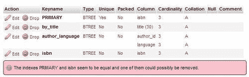

这里的意图是在考虑整个表时警告我们关于索引结构的低效性。我们不需要在同一列上有两个索引。

# 总结

本章讨论了数据更改的概念，例如：

+   编辑数据

+   包括`NULL`列和使用*Tab*键

+   对值应用函数

+   复制数据行

+   删除数据、表和数据库

我们还概述了结构更改技术，例如：

+   如何添加列，包括特殊的列类型，如 TEXT、BLOB、ENUM 和 SET

+   如何使用日历弹出窗口来处理 DATE、DATETIME 和 TIMESTAMP 列类型

+   如何将二进制数据上传到 BLOB 列

+   如何管理索引（多列和全文），并从 MySQL 获取关于特定查询中使用了哪些索引的反馈

在下一章中，我们将学习如何导出表的结构和数据以备份，或者用作连接到另一个应用程序的网关。
