# 第六章：导出结构和数据（备份）

保持良好的备份对于项目至关重要。备份包括最新的备份和在开发和生产阶段进行的中间快照。phpMyAdmin 的导出功能可以生成备份，并且还可以用于将数据发送到其他应用程序。

### 注意

请注意，phpMyAdmin 的导出功能可以按需生成备份，强烈建议实施自动和脚本化的备份解决方案，定期进行备份。实施这样的解决方案的确切方式取决于服务器的操作系统。

# 转储，备份和导出

让我们首先澄清一些词汇。在 MySQL 文档中，您会遇到术语**dump**，在其他应用程序中是**备份**或**导出**。在 phpMyAdmin 上下文中，所有这些术语都具有相同的含义。

MySQL 包括**mysqldump**-一个命令行实用程序，可用于生成导出文件。但并非每个主机提供商都提供命令行实用程序所需的 shell 访问权限。此外，从 Web 界面中访问导出功能更加方便。这就是为什么 phpMyAdmin 提供了比 mysqldump 更多导出格式的导出功能。本章将重点介绍 phpMyAdmin 的导出功能。

在开始导出之前，我们必须清楚地了解导出的预期目标。以下问题可能有所帮助：

+   我们需要完整的数据库还是只需要一些表？

+   我们只需要结构，只需要数据，还是两者都需要？

+   将使用哪个实用程序来导入数据？

+   我们只需要数据的子集吗？

+   预期导出的大小是多少，我们和服务器之间的链接速度是多少？

## 导出的范围

当我们从 phpMyAdmin 点击**导出**链接时，我们可能处于以下视图或上下文之一-`数据库`视图，`表`视图或`服务器`视图（稍后在[第十九章]中更多了解此内容））。根据当前上下文，导出的范围将是完整的数据库，单个表，甚至是多个数据库，如`服务器`视图的情况。我们将首先解释数据库导出和所有相关的导出类型。然后我们将继续表和多数据库导出，强调这些导出模式的区别。

# 导出数据库

在`数据库`视图中，点击**导出**链接。自 3.4.0 版本以来，默认的导出面板如下截图所示：

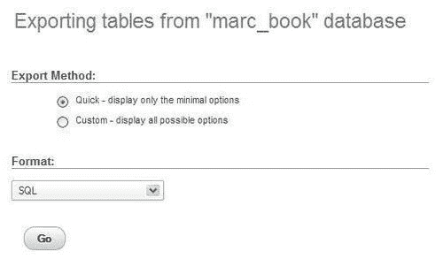

默认情况下，`$cfg['Export']['method']`设置为`'quick'`，`$cfg['Export']['format']`设置为`'sql'`。可用性测试表明，导出的最常见目标是以 SQL 格式生成完整的备份并将其保存在我们的工作站上；只需点击**Go**即可完成。

`$cfg['Export']['method']`的其他值是`'custom'`，它将显示详细的导出选项，以及`'custom-no-form'`，它也会显示详细选项，但不会显示选择快速导出的可能性-这是 3.4.0 版本之前的行为。

在自定义模式下，会显示子面板。**表，输出**和**格式**子面板占据页面顶部。**特定格式选项**子面板会变化，以显示所选择的导出格式的选项。以下截图显示了 SQL 格式面板：

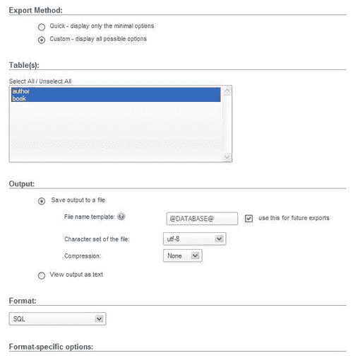

## 表子面板

该子面板包含一个表选择器，我们可以从中选择要导出的表。默认情况下，所有表都被选中，我们可以使用**全选/取消全选**链接来更改我们的选择。

## 输出子面板

默认行为是通过 HTTP 传输导出文件（选择**将输出保存到文件**单选按钮）。这会触发浏览器中的**保存**对话框，最终将文件保存在我们的本地机器上。另一种选择是选择**以文本形式查看输出**，这可以作为测试过程，前提是导出的数据是合理大小。

### 文件名模板

建议文件的名称将遵循**文件名模板**字段。在此模板中，我们可以使用特殊的**@SERVER@、@DATABASE@**和**@TABLE@**占位符。这些占位符将被当前服务器、数据库或表名（对于单表导出）替换。请注意，在这些单词之前和之后都有一个"at sign"字符。我们还可以使用 PHP `strftime`函数中的任何特殊字符；这对于根据当前日期或小时生成导出文件非常有用。最后，我们可以放置任何其他字符串（不是`strftime`特殊字符的一部分），这些字符串将被文字使用。文件扩展名根据导出类型生成。在这种情况下，它将是`.sql`。以下是模板的一些示例：

+   `@DATABASE@`将生成`marc_book.sql`

+   `@DATABASE@-%Y%m%d`将给出`marc_book-20110920.sql`

激活**将来用于导出**选项会将输入的模板设置存储到 cookie 中（用于数据库、表或服务器导出），并在下次使用相同类型的导出时将它们带回来。

默认模板是可配置的，通过以下参数：

```go
$cfg['Export']['file_template_table'] = '@TABLE@';
$cfg['Export']['file_template_database'] = '@DATABASE@';
$cfg['Export']['file_template_server'] = '@SERVER@';

```

可能的占位符，如`@DATABASE@`与窗口标题中使用的占位符相同，并在`Documentation.html`，FAQ 6.27 中描述。

### 选择字符集

我们可以为导出的文件选择确切的字符集。phpMyAdmin 会验证重新编码的条件是否满足。对于实际的数据重新编码，Web 服务器的 PHP 组件必须支持`iconv`或`recode`模块。`$cfg['RecodingEngine']`参数指定实际的重新编码引擎，选择包括`none, auto, iconv`和`recode`。如果设置为`auto`，phpMyAdmin 将首先尝试`iconv`模块，然后尝试`recode`模块。如果设置为`none`，字符集对话框将不会显示。

### 汉字支持

如果 phpMyAdmin 检测到使用日语，它会检查 PHP 是否支持`mb_convert_encoding()`多字节字符串函数。如果支持，导出和导入页面以及查询框上会显示额外的单选按钮，这样我们就可以在`EUC-JP`和`SJIS`日语编码之间进行选择。

以下是从**导出**页面中获取的示例：


### 压缩

为了节省传输时间并获得更小的导出文件，phpMyAdmin 可以压缩为 ZIP、GZIP 或 BZIP2 格式。只有在 PHP 服务器编译时分别使用了`--with-zlib`（用于 ZIP 和 GZIP）或`--with-bz2`（用于 BZ2）配置选项，才会提供这些格式。以下参数控制在面板中呈现哪些压缩选项：

```go
$cfg['ZipDump'] = TRUE;
$cfg['GZipDump'] = TRUE;
$cfg['BZipDump'] = TRUE;

```

安装 phpMyAdmin 的系统管理员可以选择将所有这些参数设置为`FALSE`，以避免大量用户同时压缩其导出所带来的潜在开销。这种情况通常比所有用户同时传输未压缩文件带来更多的开销。

在较旧的 phpMyAdmin 版本中，压缩文件是在 Web 服务器内存中构建的。由此引起的一些问题包括：

+   文件生成取决于分配给运行 PHP 脚本的内存限制。

+   在生成和压缩文件的过程中，没有传输发生。因此，用户倾向于认为操作没有进行，或者发生了崩溃。

+   大型数据库的压缩是不可能实现的。

`$cfg['CompressOnFly']`参数（默认设置为`TRUE`）被添加以生成（对于 GZIP 和 BZIP2 格式）一个包含更多标头的压缩文件。现在，传输几乎立即开始。文件以较小的块发送，因此整个过程消耗的内存要少得多。这样做的缺点是生成的文件稍微更大。

## 导出格式

我们现在将讨论可以在**格式**子面板中选择的格式（以及选择后可用的选项）。

### 注意

即使我们可以导出多种格式，但只有其中一些格式可以使用 phpMyAdmin 导入。

### SQL

SQL 格式很有用，因为它创建了标准的 SQL 命令，可以在任何 SQL 服务器上运行。

如果选中**显示注释**复选框，则导出文件中将包含注释。导出的第一部分包括注释（以`--`字符开头），详细说明了创建文件的实用程序（和版本），日期和其他环境信息。然后我们看到每个表的`CREATE`和`INSERT`查询。

phpMyAdmin 在导出文件中生成与 ANSI 兼容的注释。这些注释以`--`开头。它们有助于在其他 ANSI SQL 兼容系统上重新导入文件。

SQL 选项用于定义导出将包含的确切信息。下面的屏幕截图显示了一般的 SQL 选项：

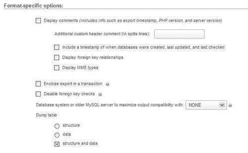

一般的 SQL 选项有：

+   **附加自定义头注释：**我们可以为此导出添加自己的注释（例如，**每月备份**），这些注释将显示在导出标头中（在 PHP 版本号之后）。如果注释有多行，我们必须使用特殊字符`\n`来分隔每一行。

+   **显示外键关系：**在第十章中，我们将看到即使是在`MyISAM`存储引擎下的表，也可以定义关系；此选项将导出这些关系的定义作为注释。这些不能直接导入，但作为可读的表信息仍然很有价值。

+   **显示 MIME 类型：**这会添加信息（以 SQL 注释的形式），描述哪些 MIME 类型已与列关联。第十六章进一步解释了这一点。

+   **将导出封装在事务中：**从 MySQL 4.0.11 开始，我们可以使用`START TRANSACTION`语句。这个命令与在开头使用`SET AUTOCOMMIT=0`和在结尾使用`COMMIT`结合在一起，要求 MySQL 在一个事务中执行导入（当我们重新导入此文件时），确保所有更改都作为一个整体完成。

+   **禁用外键检查：**在导出文件中，我们可以添加`DROP TABLE`语句。但是，通常如果表在外键约束中被引用，就无法删除该表。此选项通过在导出文件中添加`SET FOREIGN_KEY_CHECKS=0`来覆盖验证。此覆盖仅在导入的持续时间内有效。

+   **数据库系统或旧的 MySQL 服务器以最大化输出兼容性：**这让我们选择要导出的 SQL 的类型。我们必须了解我们打算导入此文件的系统。选择包括**MySQL 3.23，MySQL 4.0，ORACLE**和**ANSI**。

我们可能想要导出结构、数据或两者；这是通过**转储表**选项执行的。选择**结构**会生成包含`CREATE`查询的部分，选择**数据**会生成`INSERT`查询。

如果我们选择**结构**，则会出现**对象创建选项**子面板，如下面的屏幕截图所示：

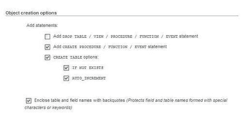

结构选项有：

+   **添加 DROP TABLE / VIEW / PROCEDURE / FUNCTION / EVENT：** 在每个`CREATE`语句之前添加`DROP ... IF EXISTS`语句，例如`DROP TABLE IF EXISTS `author``;。这样，我们可以确保导出文件在已经存在相同元素的数据库上执行，更新其结构但销毁先前元素的内容。

+   **添加 CREATE PROCEDURE / FUNCTION / EVENT：** 这包括在此数据库中找到的所有存储过程、函数和事件定义，在导出中包含它们。

+   **创建表选项/如果不存在：** 将`IF NOT EXISTS`修饰符添加到`CREATE TABLE`语句中，避免在表已经存在时导入时出现错误。

+   **创建表选项/自动增量：** 将表中的自动增量信息放入导出中，确保表中插入的行将获得下一个确切的自动增量 ID 值。

+   **用反引号括起表名和字段名：** 在 MySQL 世界中，反引号是保护可能包含特殊字符的表和列名的常规方式。在大多数情况下，这是有用的。但是，如果目标服务器（导出文件将被导入的地方）运行不支持反引号的 SQL 引擎，则不建议使用反引号。

以下屏幕截图显示了与**数据**导出相关的选项：

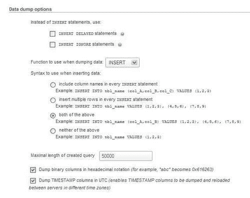

**数据**部分提供的选项包括：

+   **INSERT DELAYED 语句：** 将`DELAYED`修饰符添加到`INSERT`语句中。这会加速`INSERT`操作，因为它被排队到服务器，服务器在表不在使用时执行它。这是 MySQL 的非标准扩展，仅适用于`MyISAM，MEMORY`和`ARCHIVE`表。

+   **INSERT IGNORE 语句：** 通常，在导入时，我们不能为唯一键插入重复的值，因为这会中止插入操作。此选项将`IGNORE`修饰符添加到`INSERT`和`UPDATE`语句中，从而跳过生成重复键错误的行。

+   **在转储数据时使用的函数：** 选择有**INSERT，UPDATE**和**REPLACE**。其中最著名的是默认的**INSERT**—使用`INSERT`语句导入我们的数据。但是，在导入时，我们可能会遇到这样的情况：表已经存在并包含有价值的数据，我们只想更新当前导出表中的列。**UPDATE**生成类似下面这行代码的语句，在找到相同的主键或唯一键时更新一行：

```go
UPDATE `author` SET `id` = 1, `name` = 'John Smith', `phone` = '111-1111' WHERE `id` = '1';

```

第三种可能性，**REPLACE**，生成诸如`REPLACE INTO `author` VALUES (1, 'John Smith', '111-1111');`的语句。这类似于对新行进行插入操作，并根据主键或唯一键更新现有行。

+   **插入数据时使用的语法：** 这里有几种选择。在每个语句中包含列名会使生成的文件更大，但在各种 SQL 系统上更具可移植性，并且更易于文档化。使用一个语句插入多行比使用多个`INSERT`语句更快，但不太方便，因为它使得读取结果文件更加困难。它还会生成一个较小的文件，但是该文件的每一行本身都不可执行，因为每一行都没有`INSERT`语句。如果无法在一次操作中导入完整的文件，则无法使用文本编辑器拆分文件并逐块导入。

+   **创建查询的最大长度：** 为**扩展插入**生成的单个`INSERT`语句可能会变得太大并引起问题。因此，我们为此语句的长度设置了字符数的限制。

+   **以十六进制表示法转储二进制列：**此选项使 phpMyAdmin 以`0x`格式对`BLOB`列的内容进行编码。这种格式很有用，因为根据将用于处理导出文件的软件（例如文本编辑器或邮件程序），处理包含 8 位数据的文件可能会有问题。但是，使用此选项将产生大小为原始大小两倍的`BLOB`列类型的导出。

+   **在 UTC 中转储时间戳列：**如果导出文件将被导入到位于不同时区的服务器上，则这将很有用。

### CSV

这种格式被许多程序理解，您可能会发现它在交换数据时很有用。请注意，这是一种仅包含数据的格式——这里没有 SQL 结构。

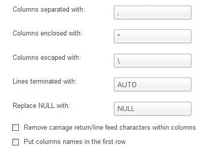

可用的选项有：

+   **用逗号分隔的列：**我们在这里放一个逗号，这意味着每个列后面都会放一个逗号。默认值来自`$cfg['Export']['csv_separator']`。

+   **用以下字符包围的列：**我们在这里放一个包围字符（双引号），以确保不会将包含终止字符（逗号）的列视为两列。默认值来自`$cfg['Export']['csv_enclosed']`。

+   **用以下字符转义的列：**如果导出生成器在列中找到**用以下字符包围**字符，那么该字符将被放在它之前以保护它。例如，`"John \"The Great\"Smith"`。默认值来自`$cfg['Export']['csv_escaped']`。

+   **以以下字符结尾的行：**这决定了每行的结束字符。我们应该根据将操作结果导出文件的操作系统使用适当的行分隔符。此选项的默认值来自`$cfg['Export']['csv_terminated']`参数，默认情况下包含`'AUTO'`。`'AUTO'`值会在浏览器的操作系统为 Windows 时产生值`\r\n`，否则产生值`\n`。但是，如果导出文件打算用于具有不同操作系统的机器，则这可能不是最佳选择。

+   **用以下字符串替换 NULL：**这确定了在导出文件中找到任何`NULL`值的列中占据位置的字符串。

+   **删除列中的回车/换行字符：**由于列可能包含回车或换行字符，这将确定是否应从导出的数据中删除这些字符。

+   **将列名放在第一行：**这会获取有关每列含义的一些信息。一些程序将使用此信息来命名列。在这个练习中，我们选择了这个选项。

最后，我们选择`author`表。

点击**Go**会生成一个包含以下行的文件：

```go
"id","name","phone"
"1","John Smith","+01 445 789-1234"
"2","Maria Sunshine","+01 455 444-5683"

```

### Microsoft Excel 的 CSV

这种导出模式生成了一个专门为 Microsoft Excel 格式化的 CSV 文件（使用分号而不是逗号）。我们可以选择确切的 Microsoft Excel 版本，如下面的屏幕截图所示：

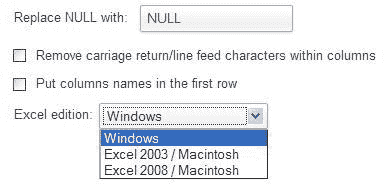

### PDF

通过导出为 PDF，可以创建表的 PDF 报告。此功能始终会生成一个文件。自 phpMyAdmin 3.4.7 以来，我们还可以一次性导出完整数据库或多个表。我们可以为此报告添加标题，并且它也会自动分页。在这种导出格式中，`book`表中的非文本`(BLOB)`数据将被丢弃。

在这里，我们在`author`表上进行测试，要求使用"The authors"作为标题。PDF 很有趣，因为它固有的矢量性质——结果可以被放大。让我们来看一下从 Adobe Reader 中看到的生成的报告：

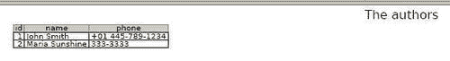

### Microsoft Word 2000

这种导出格式直接生成一个适用于所有理解 Word 2000 格式的软件的`.doc`文件。我们发现与 Microsoft Excel 导出中类似的选项，还有一些其他选项。我们可以独立导出表的**结构**和**数据**。

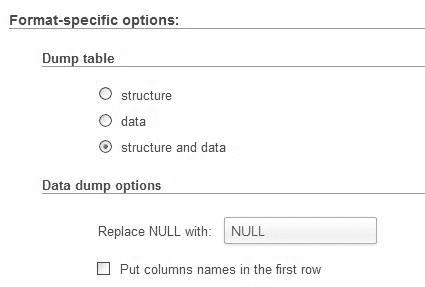

请注意，对于这种格式和 Excel 格式，我们可以选择多个表进行一次导出。但是，如果其中一个表具有非文本数据，将会出现不愉快的结果。以下是`author`表格的结果：

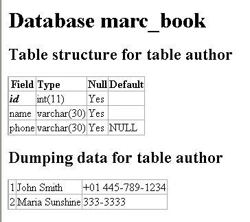

### LaTeX

**LaTeX**是一种排版语言。phpMyAdmin 可以生成一个代表表的结构和/或数据的`.tex`文件，以横向表格的形式呈现。

### 注意

请注意，这个文件不能直接查看，必须进一步处理或转换为预期的最终媒体。

可用的选项有：

| 选项 | 描述 |
| --- | --- |
| **包括表标题** | 在表格输出中显示标题 |
| **结构** 和 **数据** | 请求结构、数据或两者的熟悉选择 |
| **表标题** | 要放在第一页上的标题 |
| **表标题（继续）** | 要放在每一页上的标题 |
| **显示外键关系、注释、MIME 类型** | 我们希望作为输出的其他结构信息。如果 phpMyAdmin 配置存储已经就位，这些选择是可用的 |

### XML

这种格式在数据交换中非常流行。我们可以选择要导出的数据定义元素（如函数、过程、表、触发器或视图）。接下来是`author`表格的输出。

```go
<?xml version="1.0" encoding="utf-8"?>
<!--
- phpMyAdmin XML Dump
- version 3.4.5
- http://www.phpmyadmin.net
-
- Host: localhost
- Generation Time: Sep 16, 2011 at 03:18 PM
- Server version: 5.5.13
- PHP Version: 5.3.8
-->
<pma_xml_export version="1.0" >
<!--
- Structure schemas
-->
<pma:structure_schemas>
<pma:database name="marc_book" collation="latin1_swedish_ci" charset="latin1">
<pma:table name="author">
CREATE TABLE `author` (
`id` int(11) NOT NULL,
`name` varchar(30) NOT NULL,
`phone` varchar(30) DEFAULT NULL,
PRIMARY KEY (`id`)
) ENGINE=InnoDB DEFAULT CHARSET=latin1;
</pma:table>
</pma:database>
</pma:structure_schemas>
<!--
- Database: 'marc_book'
-->
<database name="marc_book">
<!-- Table author -->
<table name="author">
<column name="id">1</column>
<column name="name">John Smith</column>
<column name="phone">+01 445 789-1234</column>
</table>
<table name="author">
<column name="id">2</column>
<column name="name">Maria Sunshine</column>
<column name="phone">333-3333</column>
</table>
</database>
</pma_xml_export>

```

### 打开文档电子表格

这种电子表格格式是开放文档（[`en.wikipedia.org/wiki/OpenDocument`](http://en.wikipedia.org/wiki/OpenDocument)）的一个子集，它在`OpenOffice.org`办公套件中非常流行。我们需要选择一个要导出的表，以便有一个连贯的电子表格。以下截图显示了我们的`author`表格，导出为名为`author.ods`的文件，并随后在 OpenOffice 中查看：

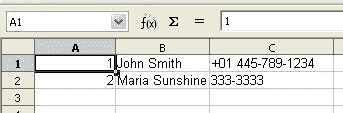

### 打开文档文本

这是开放文档标准的另一个子集，这次是面向文本处理的。我们的`author`表格现在已经从 OpenOffice 中导出并查看。

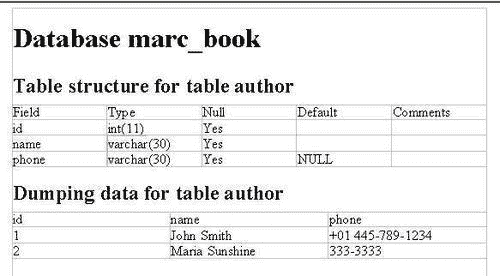

### YAML

**YAML**代表**YAML 不是标记语言**。YAML 是一种人类可读的数据序列化格式；它的官方网站是[`www.yaml.org`](http://www.yaml.org)。这种格式在 phpMyAdmin 中没有我们可以选择的选项。以下是`author`表格的 YAML 导出：

```go
1:
id: 1
name: John Smith
phone: +01 445-789-1234
2:
id: 2
name: Maria Sunshine
phone: 333-3333

```

### CodeGen

这个选择可能有一天会支持与代码开发相关的许多格式。目前，它可以导出 NHibernate **对象关系映射（ORM）**格式。更多详情，请参阅[`en.wikipedia.org/wiki/Nhibernate`](http://en.wikipedia.org/wiki/Nhibernate)。

### Texy!文本

**Texy!**是一个带有自己简化语法的格式化工具（[`texy.info/en/`](http://texy.info/en/)）。以下是以这种格式导出的示例代码：

```go
===Database marc_book
== Table structure for table author
|------
|Field|Type|Null|Default
|------
|//**id**//|int(11)|Yes|NULL
|name|varchar(30)|Yes|NULL
|phone|varchar(30)|Yes|NULL
== Dumping data for table author
|1|John Smith|+01 445 789-1234
|2|Maria Sunshine|333-3333

```

### PHP 数组

在 PHP 中，关联数组可以保存文本数据；因此，可以使用 PHP 数组导出格式。以下是`author`表格的 PHP 数组导出：

```go
<?php
// marc_book.author
$author = array(
array('id'=>1,'name'=>'John Smith','phone'=>'+1 445 789-1234'),
array('id'=>2,'name'=>'Maria Sunshine','phone'=>'333-3333')
);

```

### MediaWiki 表格

MediaWiki（[`www.mediawiki.org/wiki/MediaWiki`](http://www.mediawiki.org/wiki/MediaWiki)）是一个流行的维基包，支持广泛使用的维基百科。这个维基软件实现了一种格式化语言，可以用表格格式描述数据。在 phpMyAdmin 中选择这种导出格式会产生一个文件，可以粘贴到我们正在编辑的维基页面上。

### JSON

JavaScript 对象表示法（[`json.org`](http://json.org)）是一种在网络世界中流行的数据交换格式。以这种格式导出`author`表格的代码如下所示：

```go
/**
Export to JSON plugin for PHPMyAdmin
@version 0.1
*/
/* Database 'marc_book' */
/* marc_book.author */
[{"id": 1,"name": "John Smith","phone": "+01 445 789-1234"}, {"id": 2,"name": "Maria Sunshine","phone": "333-3333"}]

```

# 导出表格

`表`视图中的**导出**链接会显示特定表的导出子面板。它类似于数据库导出面板，但没有表选择器。然而，在**输出**子面板之前，还有一个用于分割导出（行）的额外部分，如下所示：

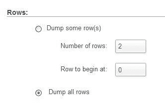

## 分割文件导出

对话框中包含的**行数**和**开始行**部分使我们能够将表分成多个部分。根据确切的行大小，我们可以尝试各种值来找到要查找的行数以及在 Web 服务器中达到内存或执行时间限制之前可以放入单个导出文件中的行数。然后，我们可以为我们的导出文件使用名称，例如`book00.sql`和`book01.sql`。如果我们决定导出所有行，我们只需选择**转储所有行**单选按钮。

# 有选择地导出

在 phpMyAdmin 界面的各个位置，我们可以导出我们看到的结果，或者选择要导出的行。我们将研究导出表的选定部分的各种方法。

## 导出部分查询结果

当从 phpMyAdmin 显示结果（这里是查询要求显示**作者 ID 为 2**的书籍结果）时，页面底部会出现一个**导出**链接。

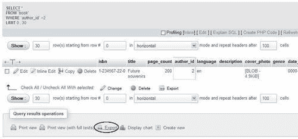

单击此链接会弹出一个特殊的导出面板，其中包含顶部的查询以及其他表导出选项。通过此面板生成的导出将仅包含此结果集中的数据。

### 注意

单表查询的结果可以以所有可用格式导出，而多表查询的结果可以以除 SQL 之外的所有格式导出。

## 导出和复选框

每当我们看到结果（例如浏览或搜索时），我们可以勾选我们想要的行旁边的复选框，然后使用**选择的内容：导出**图标或链接生成一个仅包含这些行的部分导出文件。

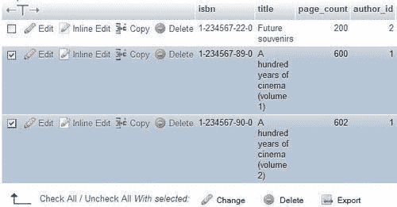

# 导出多个数据库

任何用户都可以在一次操作中导出他/她有权限访问的数据库。

在主页上，**导出**链接将我们带到下面截图所示的屏幕。除了数据库列表之外，它的结构与其他导出页面相同。

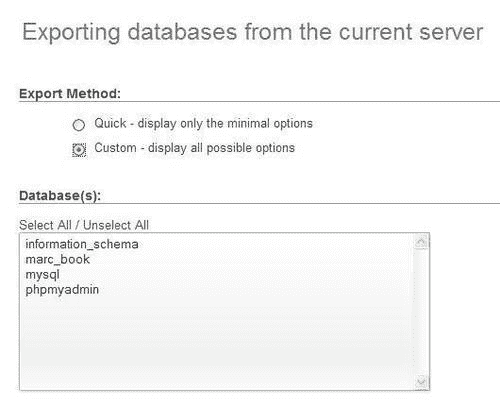

### 注意

导出大型数据库可能有效，也可能无效。这取决于它们的大小，所选择的选项，以及 Web 服务器的 PHP 组件设置（特别是内存大小和最大执行时间）。

# 在服务器上保存导出文件

与通过 HTTP 传输导出文件不同，可以直接将其保存在 Web 服务器的文件系统上。这可能会更快，而且不太受执行时间限制的影响，因为从服务器到客户端浏览器的整个传输被绕过了。最终，可以使用文件传输协议（如 FTP 或 SFTP）来检索文件，因为将其留在同一台机器上不会提供良好的备份保护。

在保存导出文件之前，必须在 Web 服务器上创建一个特殊目录。通常，这是主`phpMyAdmin`目录的子目录。我们将使用`save_dir`作为示例。此目录必须具有正确的权限。首先，Web 服务器必须对此目录具有写权限。此外，如果 Web 服务器的 PHP 组件正在安全模式下运行，则 phpMyAdmin 脚本的所有者必须与`save_dir`的所有者相同。

在 Linux 系统上，假设 Web 服务器以`group apache`运行，以下命令可以解决问题：

```go
# mkdir save_dir
# chgrp apache save_dir
# chmod g=rwx save_dir 

```

### 注意

适当的所有权和权限高度取决于所选择的 Web 服务器和**SAPI（服务器应用程序编程接口）**（参见[`en.wikipedia.org/wiki/Server_Application_Programming_Interface)`](http://en.wikipedia.org/wiki/Server_Application_Programming_Interface))，它影响目录和文件的创建和访问方式。PHP 可能使用脚本所有者作为访问用户，也可能使用 Web 服务器的用户/组本身。

我们还必须在`$cfg['SaveDir']`中定义`'./save_dir'`目录名称。我们在这里使用相对于`phpMyAdmin`目录的路径，但绝对路径同样有效。

**输出**部分将出现一个新的**在服务器上保存..**部分。

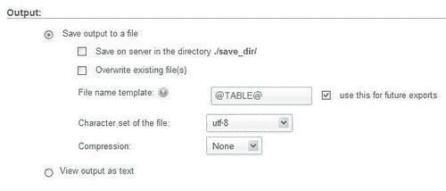

点击**Go**后，我们将收到确认消息或错误消息（如果 Web 服务器没有所需的权限来保存文件）。

### 注意

要再次使用相同的文件名保存文件，请勾选**覆盖现有文件**框。

## 用户特定的保存目录

我们可以在`$cfg['SaveDir']`参数中使用特殊字符串`%u`。这个字符串将被登录的用户名替换。例如，如下行代码所示：

```go
$cfg['SaveDir'] = './save_dir/%u';

```

这将给我们一个屏幕选择，在目录./save_dir/marc/中保存在服务器上。这些目录（每个潜在用户一个）必须存在，并且必须具有适当的权限，如前一节所示。

# 内存限制

生成导出文件会使用一定量的内存，取决于表的大小和选择的选项。`$cfg['MemoryLimit']`参数可以包含 PHP 脚本在 phpMyAdmin 中使用的内存量的限制（以字节为单位）-导出/导入脚本和其他脚本。默认情况下，该参数设置为`0`，表示没有限制。我们可以通过使用`20M`的值来设置 20 MiB 的限制（这里的`M`后缀非常重要，以避免设置 20 字节的限制！）。

### 注意

请注意，如果 PHP 启用了安全模式，更改`$cfg['MemoryLimit']`将不起作用。相反，强制限制来自`php.ini`中的`memory_limit`指令。

除了内存限制，执行时间限制对导出有影响，并且可以通过`$cfg['ExecTimeLimit']`参数进行控制。

# 摘要

在本章中，我们研究了触发导出的各种方式-从`数据库`视图，`表`视图或结果页面。我们还列出了各种可用的导出格式，它们的选项，压缩导出文件的可能性以及可能发送的各种地方。

在下一章中，我们将有机会导入我们的结构和数据，前提是所选的格式得到 phpMyAdmin 支持。
