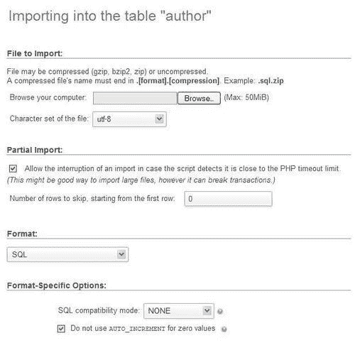
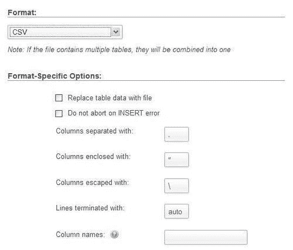
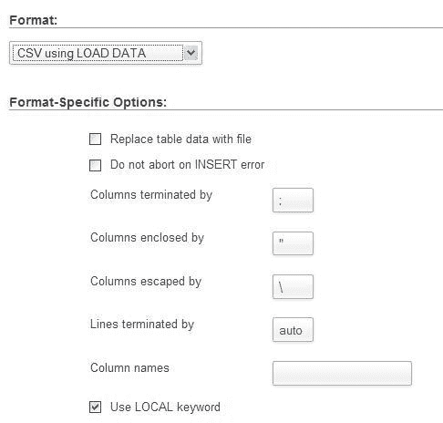

# 第七章：导入结构和数据

在本章中，我们将学习如何导入我们可能为备份或传输目的而导出的数据。导出的数据也可能来自其他应用程序的作者，并且可能包含这些应用程序的整个基础结构以及一些示例数据。

当前的 phpMyAdmin 版本（3.4）可以导入以下内容：

+   包含 MySQL 语句的文件（通常具有`.sql`后缀，但不一定如此）

+   CSV 文件（逗号分隔值，尽管分隔符不一定是逗号）；这些文件可以由 phpMyAdmin 本身导入，也可以通过 MySQL 的`LOAD DATA INFILE`语句导入，该语句使 MySQL 服务器能够直接处理数据，而不是首先由 phpMyAdmin 解析数据

+   打开文档电子表格文件

+   XML 文件（由 phpMyAdmin 生成）

在第五章中涵盖的二进制列上传可以说属于导入系列。

### 注意

在这种情况下，导入和上传是同义词。

一般来说，导出文件可以导入到它来自的同一数据库或任何其他数据库；XML 格式是一个例外，本章后面的 XML 部分中给出了一个解决方法。此外，从旧的 phpMyAdmin 版本生成的文件应该没有问题被当前版本导入，但是导出时的 MySQL 版本与导入时的版本之间的差异可能在兼容性方面起到更大的作用。很难评估未来 MySQL 版本将如何改变语言的语法，带来导入挑战。

可以从几个面板访问导入功能：

+   **导入**菜单可从主页、`Database`视图或`Table`视图中访问

+   **导入文件**菜单在查询窗口内提供（如第十一章中所述）

`Import`界面的默认值在`$cfg['Import']`中定义。

在检查实际导入对话框之前，让我们讨论一些限制问题。

# 传输限制

当我们导入时，源文件通常位于我们的客户端机器上，因此必须通过 HTTP 传输到服务器。这种传输需要时间并使用资源，这些资源可能在 Web 服务器的 PHP 配置中受到限制。

我们可以使用 FTP 等协议将文件上传到服务器，而不是使用 HTTP，如“从 Web 服务器上传目录读取文件”部分所述。这种方法绕过了 Web 服务器的 PHP 上传限制。

## 时间限制

首先，让我们考虑时间限制。在`config.inc.php`中，`$cfg['ExecTimeLimit']`配置指令默认分配了任何 phpMyAdmin 脚本的最大执行时间为 300 秒（五分钟），包括文件上传后处理数据的脚本。值为`0`会移除限制，并在理论上给我们无限的时间来完成导入操作。如果 PHP 服务器运行在安全模式下，修改`$cfg['ExecTimeLimit']`将不会生效。这是因为在`php.ini`或用户相关的 Web 服务器配置文件（如`.htaccess`或虚拟主机配置文件）中设置的限制优先于此参数。

当然，实际花费的时间取决于两个关键因素：

+   Web 服务器负载

+   MySQL 服务器负载

### 注意

文件在客户端和服务器之间传输所花费的时间不计为执行时间，因为 PHP 脚本只有在服务器接收到文件后才开始执行。因此，`$cfg['ExecTimeLimit']`参数只对处理数据的时间（如解压缩或将数据发送到 MySQL 服务器）产生影响。

## 其他限制

系统管理员可以使用`php.ini`文件或 Web 服务器的虚拟主机配置文件来控制服务器上的上传。

`upload_max_filesize`参数指定了可以通过 HTTP 上传的文件的上限或最大文件大小。这个很明显，但另一个不太明显的参数是`post_max_size`。由于 HTTP 上传是通过 POST 方法完成的，这个参数可能会限制我们的传输。有关 POST 方法的更多详细信息，请参考[`en.wikipedia.org/wiki/Http#Request_methods`](http://en.wikipedia.org/wiki/Http#Request_methods)。

`memory_limit`参数用于防止 Web 服务器子进程占用过多服务器内存——phpMyAdmin 在子进程中运行。因此，给这个参数一个较小的值可能会影响正常文件上传的处理，特别是压缩的转储文件。在这里，无法推荐任何首选值；这个值取决于我们想要处理的上传数据的大小和物理内存的大小。内存限制也可以通过`config.inc.php`中的`$cfg['MemoryLimit']`参数进行调整，如第六章所示。

最后，通过将`file_uploads`设置为`On`来允许文件上传；否则，phpMyAdmin 甚至不会显示选择文件的对话框。显示这个对话框是没有意义的，因为后来 Web 服务器的 PHP 组件会拒绝连接。

## 处理大型导出文件

如果文件太大，我们可以通过多种方式解决这个问题。如果原始数据仍然可以通过 phpMyAdmin 访问，我们可以使用 phpMyAdmin 生成较小的导出文件，选择**Dump some row(s)**对话框。如果这不可能，我们可以使用电子表格程序或文本编辑器将文件分割成较小的部分。另一种可能性是使用**上传目录机制**，它访问`$cfg['UploadDir']`中定义的目录。这个功能在本章的后面会有详细解释。

在最近的 phpMyAdmin 版本中，**部分导入**功能也可以解决这个文件大小的问题。通过选择**允许中断...**复选框，如果检测到接近时间限制，导入过程将自行中断。我们还可以指定要从头部跳过的查询数量，以防我们成功导入一些行并希望从那个点继续。

## 上传到临时目录

在服务器上，一个名为`open_basedir`的 PHP 安全功能（将 PHP 可以打开的文件限制为指定的目录树）可能会阻碍上传机制。在这种情况下，或者出于其他任何原因，当上传出现问题时，可以使用`$cfg['TempDir']`参数设置临时目录的值。这可能是 phpMyAdmin 主目录的子目录，Web 服务器允许将上传文件放入其中。

# 导入 SQL 文件

任何包含 MySQL 语句的文件都可以通过这种机制导入。这种格式更常用于备份/恢复目的。对话框可在`服务器`视图、`数据库`视图或`表`视图中，通过**导入**页面或查询窗口中使用。



### 注意

当前选择的表（这里是**author**）与将要导入的 SQL 文件的实际内容之间没有关系。SQL 文件的所有内容都将被导入，决定受影响的表或数据库的是这些内容。但是，如果导入的文件不包含任何选择数据库的 SQL 语句，那么导入文件中的所有语句都将在当前选择的数据库上执行。

让我们尝试一个导入练习。首先，确保我们有一个`book`表的当前 SQL 导出文件（如第六章中所述）。这个导出文件必须包含结构和数据。然后我们删除`book`表——是的，真的！我们也可以简单地重命名它。（有关该过程，请参阅第九章。）

现在是时候将文件导入到当前数据库中了（文件可以在不同的数据库中进行测试导入，甚至可以在另一个 MySQL 服务器上进行）。我们应该在**导入**页面上，可以看到**要导入的文件**对话框。我们只需要点击**浏览**按钮并选择我们的文件。

phpMyAdmin 能够检测文件应用了哪种压缩方法（如果有的话）。根据 phpMyAdmin 版本和 Web 服务器的 PHP 组件中可用的扩展，程序可以解压缩的格式有所不同。

然而，要成功导入，phpMyAdmin 必须知道要导入的文件的字符集。默认值是**utf-8**。但是，如果我们知道导入文件是用另一种字符集创建的，我们应该在这里指定它。

在导入时，可以选择**SQL 兼容模式**选择器。这种模式应该根据之前导出数据的服务器类型来调整，以匹配我们即将导入的实际数据。

另一个选项**不要对零值使用 AUTO_INCREMENT**默认标记。如果我们在主键中有一个零值，并且希望它保持为零而不是自动递增，我们应该使用这个选项。

要开始导入，我们点击**Go**。导入过程继续，我们收到一条消息：**导入已成功完成，执行了 2 个查询**。我们可以浏览我们新创建的表来确认导入操作的成功。

导入文件可能包含`DELIMITER`关键字。这使得 phpMyAdmin 能够模仿`mysql`命令行解释器。`DELIMITER`分隔符用于界定包含存储过程的文件部分，因为这些过程本身可能包含分号。

# 导入 CSV 文件

在本节中，我们将研究如何导入 CSV 文件。有两种可能的方法——**CSV**和**使用 LOAD DATA 的 CSV**。第一种方法是由 phpMyAdmin 内部实现的，因为它的简单性而被推荐。使用第二种方法，phpMyAdmin 接收要加载的文件，并将其传递给 MySQL。理论上，这种方法应该更快。然而，由于 MySQL 本身的要求更多（请参阅*CSV 使用 LOAD DATA*部分的*要求*子部分）。

## SQL 和 CSV 格式之间的区别

通常，SQL 格式包含结构和数据。CSV 文件格式只包含数据，因此如果我们在`表`视图中导入，我们必须已经有一个现有的表。这个表不需要与原始表（数据来自哪里）具有相同的结构；**列名**对话框使我们能够选择目标表中受影响的列。

自 3.4 版本以来，我们还可以在`数据库`视图中导入 CSV 文件。在这种情况下，phpMyAdmin 会检查 CSV 数据并生成一个表结构来保存这些数据（具有通用列名，如`COL 1，COL 2`和一个表名，如`TABLE 24`）。

## 导出测试文件

在尝试导入之前，让我们从`author`表中生成一个`author.csv`导出文件。我们使用**CSV 导出**选项中的默认值。然后我们可以使用**Empty**选项来清空`author`表——我们应该避免删除这个表，因为我们仍然需要表结构。清空表的过程在第五章中有介绍，在*删除表中的所有行*部分。

### CSV

从`author`表菜单中，我们选择**导入**，然后选择**CSV**。



我们可以通过多种方式影响导入的行为。默认情况下，导入不会修改现有数据（基于主键或唯一键）。然而，“用文件替换表数据”选项指示 phpMyAdmin 使用 REPLACE 语句而不是 INSERT 语句，以便用导入的数据替换现有行。

使用“在 INSERT 错误时不中止”，将生成 INSERT IGNORE 语句。这会导致 MySQL 在插入时忽略任何重复键的问题。导入文件中的重复键不会替换现有数据，程序会继续下一行 CSV 数据。

然后我们可以指定终止每一列的字符，包围数据的字符，以及转义包围字符的字符。通常是“\”。

对于“行终止符”选项，应首先尝试“auto”选项，因为它会自动检测行尾字符。我们还可以手动指定终止行的字符。通常 UNIX 系统选择“\n”，DOS 或 Windows 系统选择“\r\n”，Mac 系统选择“\r”（Mac OS 9 及以下）。如果不确定，我们可以在客户端计算机上使用十六进制文件编辑器（不是 phpMyAdmin 的一部分）来检查确切的代码。

默认情况下，phpMyAdmin 期望 CSV 文件与目标表具有相同数量的列和相同的列顺序。这可以通过在“列名”中输入一个逗号分隔的列名列表来改变，以符合源文件格式。例如，假设我们的源文件只包含作者 ID 和作者姓名信息：

```go
"1","John Smith"
"2","Maria Sunshine"

```

我们必须在“列名”中放入“id，name”以匹配源文件。

当我们点击“Go”时，导入将被执行，并且我们会收到确认。如果文件的总大小不太大，我们还可能看到生成的 INSERT 查询。

```go
Import has been successfully finished, 2 queries executed.
INSERT INTO `author` VALUES ('1', 'John Smith', '+01 445 789-1234'
)# 1 row(s) affected.
INSERT INTO `author` VALUES ('2', 'Maria Sunshine', '333-3333'
)# 1 row(s) affected.

```

## 使用 LOAD DATA 的 CSV

使用这种方法（仅在“表”视图中可用），phpMyAdmin 依赖服务器的 LOAD DATA INFILE 或 LOAD DATA LOCAL INFILE 机制来执行实际的导入，而不是在内部处理数据。这些语句是在 MySQL 中导入文本的最快方式。它们会导致 MySQL 开始从 MySQL 服务器上的文件（LOAD DATA INFILE）或其他地方（LOAD DATA LOCAL INFILE）进行读取操作，而在这种情况下，通常是 Web 服务器的文件系统。如果 MySQL 服务器位于与 Web 服务器不同的计算机上，我们将无法使用 LOAD DATA INFILE 机制。

### 要求

依赖 MySQL 服务器会产生一些后果。使用 LOAD DATA INFILE 要求登录用户拥有全局的 FILE 权限。此外，文件本身必须可被 MySQL 服务器的进程读取。

### 注意

第十九章解释了 phpMyAdmin 的界面，系统管理员可以使用该界面来管理权限。

在 PHP 中使用 LOAD DATA LOCAL INFILE 时，必须允许 MySQL 服务器和 MySQL 的客户端库中的 LOCAL 修饰符。

phpMyAdmin 的 LOAD 界面提供了两种 LOAD 方法，试图选择最佳的默认选项。

### 使用 LOAD DATA 界面

我们从`author`表菜单中选择导入。选择 CSV using LOAD DATA 选项会弹出以下对话框：



### 注意

可用的选项已经在 CSV 部分中介绍过了。

在“要导入的文件”部分，我们选择我们的 author.csv 文件。

最后，我们可以选择 LOAD 方法，如前面讨论的，通过选择“使用 LOCAL 关键字”选项。然后点击“Go”。

如果一切顺利，我们可以看到确认屏幕，如下截图所示：


这个屏幕显示了使用的 LOAD DATA LOCAL INFILE 语句。以下是发生的事情：

1.  我们选择了 author.csv。

1.  这个文件的内容通过 HTTP 传输并被 Web 服务器接收。

1.  Web 服务器内的 PHP 组件将此文件保存在工作目录（此处为`/opt/php-upload-tmp/`）并赋予临时名称。

1.  phpMyAdmin 知道这个工作文件的位置后，构建了一个`LOAD DATA LOCAL INFILE`命令，并将其发送到 MySQL。请注意，只执行了一个查询，加载了许多行。

1.  MySQL 服务器读取并加载了文件的内容到我们的目标表中。然后返回受影响的行数**(2)**，phpMyAdmin 在结果页面上显示了这个数字。

# 导入其他格式

除了 SQL 和 CSV 格式，phpMyAdmin 还可以导入 Open Document Spreadsheet 和 XML 文件。但是，这些文件需要由 phpMyAdmin 自己导出，或者紧密遵循 phpMyAdmin 导出时的操作。

## Open Document Spreadsheet

默认情况下，当我们以这种格式通过 phpMyAdmin 导出时，**将列名放在第一行**选项未被标记。这意味着导出的文件只包含数据。在导入时，相应的选项**文件的第一行包含表列名**被提供，并且如果文件的第一行不包含列名，则不应该被标记。

但是，如果导出的文件包含列名，我们可以检查这个选项。因此，当从`数据库`视图导入时，phpMyAdmin 将执行以下操作：

1.  使用文件名`(author.ods)`作为表名`(author)`创建表。

1.  使用第一行的列名作为此表的列名。

1.  根据数据本身确定每个列的类型和适当的大小。

1.  将数据插入表中。

如果我们处于`表`视图中，只有数据将被导入。

还有其他导入选项，用于指示应该如何处理空行以及包含百分比或货币值的数据。

## XML

通过导入 XML 文件创建的结构信息的数量取决于导出时选择的选项。实际上，如果选择了**对象创建选项**对话框的**表**选项，那么精确的`CREATE TABLE`语句将被放置在导出文件中。因此，恢复表中将有相同的表结构。

同样，如果标记了**导出内容**选项，则整个数据都在 XML 文件中准备好导入。在导入时没有可用选项，因为 XML 是一种自描述格式；因此，phpMyAdmin 可以正确解释文件中的内容并做出适当的反应。

由于原始数据库名称是 XML 导出的一部分，当前的 phpMyAdmin 版本只支持将 XML 文件导入到导出源数据库中。要导入到不同的数据库，我们需要首先使用文本编辑器并更改以下行中的数据库名称：

```go
<pma:database name="marc_book" collation="latin1_swedish_ci" charset="latin1">

```

# 从 Web 服务器上传目录读取文件

为了解决 Web 服务器的 PHP 配置完全禁用上传的情况，或者上传限制太小的情况，phpMyAdmin 可以从 Web 服务器文件系统上的特殊目录中读取上传文件。

首先，在`$cfg['UploadDir']`参数中指定我们选择的目录名称，例如，`'./upload'`。我们还可以使用`%u`字符串，如第六章中所述，来表示用户的名称。

现在，让我们回到**导入**页面。我们收到一个错误消息：

**您设置的上传工作目录无法访问**。

这个错误消息是预期的，因为该目录不存在。它应该已经在当前的`phpMyAdmin`安装目录内创建。该消息也可能表明该目录存在，但无法被 Web 服务器读取。

### 注意

在 PHP 安全模式下，目录的所有者和 phpMyAdmin 安装脚本的所有者必须相同。

使用 SFTP 或 FTP 客户端，我们创建必要的目录，现在可以在那里上传文件（例如**book.sql**），绕过任何 PHP 超时或上传最大限制。

### 提示

请注意，文件本身必须具有允许 Web 服务器读取的权限。

在大多数情况下，最简单的方法是允许每个人都可以读取文件。

刷新**导入**页面会出现以下截图：

从 Web 服务器上传目录读取文件的操作如下图所示：

点击**Go**应该执行文件中的语句。

上传目录中的文件也可以自动解压缩。文件名应该具有`.bz2, .gz, .sql.bz2`或`.sql.gz`等扩展名。

### 提示

使用双扩展名`(.sql.bz2)`是指示`.sql`文件已经生成并压缩的更好方式，因为我们看到了生成此文件所使用的所有步骤。

# 显示上传进度条

特别是在导入大文件时，有一个视觉反馈对上传进度的进行是很有趣的。请注意，我们在这里讨论的进度条只通知我们有关上传部分的进度，这是整个导入操作的一个子集。

拥有启用 JavaScript 的浏览器是此功能的要求。此外，Web 服务器的 PHP 组件必须具有 JSON 扩展和以下扩展中的至少一个：

+   广为人知的 APC 扩展（[`pecl.php.net/package/APC`](http://pecl.php.net/package/APC)），无论如何都强烈推荐它的 opcode 缓存优势

+   `uploadprogress`扩展（[`pecl.php.net/package/uploadprogress`](http://pecl.php.net/package/uploadprogress)）

phpMyAdmin 使用 AJAX 技术获取进度信息，然后将其显示为**要导入的文件**对话框的一部分。上传的字节数、总字节数和上传百分比显示在条形图下方。

## 配置 APC

一些`php.ini`指令对上传进度起着重要作用。首先，`apc.rfc1867`指令必须设置为`On`或`true`，否则该扩展将不会向调用脚本报告上传进度。当设置为`On`时，该扩展会使用上传状态信息更新 APC 用户缓存条目。

此外，更新的频率可以通过`apc.rfc1867_freq`指令进行设置，可以采用总文件大小的百分比形式（例如，`apc.rfc1867_freq = "10%"`），或以字节为单位的大小（接受后缀`k`表示千字节，`m`表示兆字节，`g`表示千兆字节）。这里的值为`0`表示尽可能频繁地更新，看起来很有趣，但实际上可能会减慢上传速度。

更新频率的概念解释了为什么在使用这种机制时，进度条以块状而不是连续地进行。

# 总结

本章涵盖了：

+   phpMyAdmin 中允许我们导入数据的各种选项

+   导入文件涉及的不同机制

+   尝试传输时可能遇到的限制，以及绕过这些限制的方法

下一章将解释如何进行单表搜索（涵盖搜索条件规范）以及如何在整个数据库中进行搜索。
