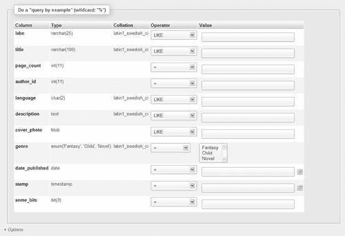
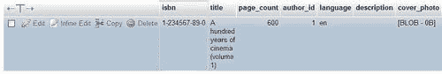
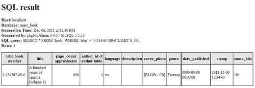
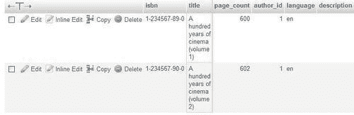
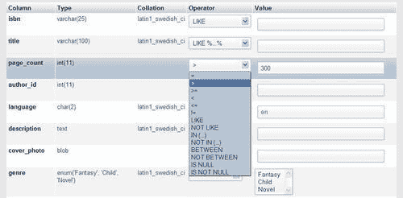
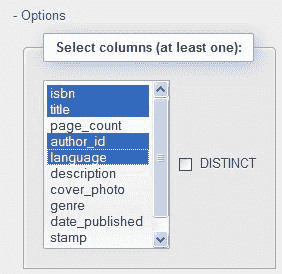
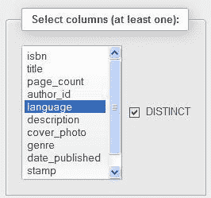
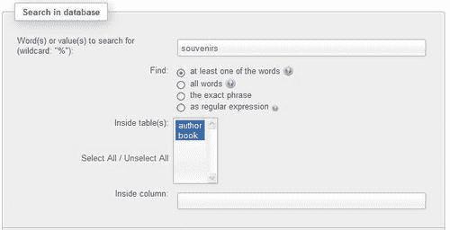
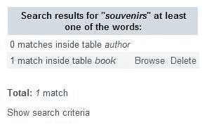

# 第八章。搜索数据

在本章中，我们介绍了可用于查找我们正在寻找的数据的机制，而不仅仅是浏览表格页面并对其进行排序。在**搜索**模式下，应用程序开发人员可以以界面不期望的方式查找数据，调整并有时修复数据。本章涵盖了单表搜索和整个数据库搜索。第十二章是本章的补充，并提供了涉及同时多个表的搜索示例。

# 单表搜索

本节描述了**搜索**页面，其中提供了单表搜索。仅在单个表中搜索仅在单个表中聚合了我们想要搜索的所有数据的情况下才有效。如果数据分散在许多表中，则应该启动数据库搜索，这将在本章后面进行介绍。

## 输入搜索页面

可以通过在`Table`视图中点击**搜索**链接来访问**搜索**页面。这在这里已经为`book`表完成了：

**搜索**界面最常用的部分**（示例查询）**会立即显示，而其他对话框则隐藏在可以通过**选项**链接激活的滑块中（本章后面将更多介绍这些对话框）。

## 按列搜索条件-示例查询

**搜索**面板的主要用途是输入某些列的条件，以便只检索我们感兴趣的数据。这被称为**示例查询**，因为我们给出了我们要查找的内容的示例。我们的第一个检索将涉及查找具有 ISBN **1-234567-89-0**的书。我们只需在**isbn**框中输入这个值，并将**运算符**字段设置为**=**。

点击**Go**会给出以下结果（在下面的截图中部分显示）：

这是一个标准的结果页面。如果结果分页显示，我们可以浏览它们，并在过程中编辑和删除所选择的子集的数据。phpMyAdmin 的另一个特性是，用作条件的列通过更改边框颜色来突出显示，以更好地反映它们在结果页面上的重要性。

并不需要指定**isbn**列被显示，即使这是我们搜索的列。我们可以仅选择**title**列进行显示（参考*选择要显示的列*部分），并选择**isbn**列作为条件。

### 搜索空/非空值

当列具有字符类型（如`CHAR，VARCHAR`或`TEXT`）时，操作符列表中会出现两个方便的操作符：

+   `= ''`

+   `!= ''`

当您想要搜索某列中的空值`(= '')`或非空值`(!= '')`时，可以使用这些。通常，在列的**值**字段中不输入任何内容意味着该列不参与搜索过程。但是，使用这些运算符之一，该列将包括在生成的搜索查询中。

### 注意

请不要将此方法与搜索`NULL`值混淆，这是完全不同的。实际上，`NULL`值（参考[`en.wikipedia.org/wiki/Null_(SQL)`](http://en.wikipedia.org/wiki/Null_(SQL) "http://en.wikipedia.org/wiki/Null_(SQL)")以获取更完整的解释）是一种特殊值，表示该列中缺少一些信息。

## 使用打印视图生成报告

我们在结果页面上看到了**打印视图**和**打印视图（带有完整文本）**链接。这些链接会直接将结果（不包括导航界面）更正式地生成报告并直接发送到打印机。在我们的情况下，使用**打印视图**会产生以下结果：

这份报告包含有关服务器、数据库、生成时间、phpMyAdmin 版本、MySQL 版本和生成的 SQL 查询的信息。另一个链接**打印视图（带有完整文本）**将打印`TEXT`列的全部内容。

## 使用通配符字符进行搜索

让我们假设我们正在寻找一些不太精确的东西——所有标题中带有“电影”一词的书籍。首先，我们回到搜索页面。对于这种类型的搜索，我们将使用 SQL 的**LIKE**运算符。该运算符接受通配符字符——百分号（`%`）字符（匹配任意数量的字符）和下划线（`_`）字符（匹配单个字符）。因此，我们可以使用**%cinema%**让 phpMyAdmin 找到任何与单词“cinema”匹配的子字符串。如果我们省略了通配符字符，我们将只得到包含该单词的精确匹配。

这种子字符串匹配更容易访问，因为它是**运算符**下拉列表的一部分。我们只需输入单词**cinema**并使用运算符**LIKE %...%**进行匹配。我们应该避免在大表上使用这种形式的**LIKE**运算符（包含数千行），因为 MySQL 在这种情况下不会使用索引进行数据检索，导致等待时间取决于服务器硬件及其当前负载。这就是为什么这个运算符不是下拉列表中的默认选项，即使这种搜索方法在较小的表上通常被使用。

以下屏幕截图显示了我们如何使用**LIKE %...%**运算符要求搜索**cinema**：

### 注意

`LIKE`运算符可以用于其他类型的通配符搜索，例如`History%`，这将在标题开头搜索这个词。由于表达式不以通配符字符开头，MySQL 将尝试使用索引来加快数据检索。有关 MySQL 索引的更多详细信息，请参阅[`dev.mysql.com/doc/refman/5.1/en/mysql-indexes.html`](http://dev.mysql.com/doc/refman/5.1/en/mysql-indexes.html)。

使用这两种查询方法之一会产生以下结果：

在搜索表达式中可以重复使用`%`和`_`通配符字符；例如，`histo__`（两个下划线）将匹配`history`，而`histo%`将匹配`history`和`historian`。MySQL 手册在[`dev.mysql.com/doc/refman/5.1/en/string-comparison-functions.html`](http://dev.mysql.com/doc/refman/5.1/en/string-comparison-functions.html)中给出了更多示例。

## 大小写敏感和搜索

在前面的例子中，我们可以用“CINEMA”替换“cinema”并获得类似的结果。原因是**title**列的排序规则是**latin1_swedish_ci**。这种排序规则来自于在数据库创建时默认设置的排序规则集，除非服务器的默认排序规则已更改（参见[`dev.mysql.com/doc/refman/5.1/en/charset-mysql.html)`](http://dev.mysql.com/doc/refman/5.1/en/charset-mysql.html)）。这里，**ci**表示比较是以不区分大小写的方式进行的。有关更多详细信息，请参阅[`dev.mysql.com/doc/refman/5.1/en/case-sensitivity.html`](http://dev.mysql.com/doc/refman/5.1/en/case-sensitivity.html)。

## 组合条件

我们可以为同一查询使用多个条件（例如，查找所有超过 300 页的英文书籍）。在**运算符**中有更多比较选择，因为**page_count**列是数字型的，如下面的屏幕截图所示：

## 搜索选项

**选项**滑块显示了额外的面板，以进一步细化搜索过程。

### 选择要显示的列

在“选项”滑块中，“选择列”面板方便地选择要在结果中显示的列。默认情况下会选择所有列，但我们可以使用“Ctrl”+单击其他列来进行必要的选择。Mac 用户将使用“Command”+单击来选择/取消选择列。

以下是此示例中感兴趣的列：

我们还可以在列选择旁边的文本框中指定每页的行数。稍后将在“应用 WHERE 子句”部分中解释“添加搜索条件”框。

### 排序结果

“显示顺序”对话框允许指定结果的初始排序顺序。在此对话框中，下拉菜单包含所有表的列；我们可以选择要排序的列。默认情况下，排序将按升序进行，但也可以选择降序。

值得注意的是，在结果页面上，我们可以使用第四章中解释的技术来更改排序顺序。

### 应用 WHERE 子句

有时，我们可能希望输入一个在“示例查询”部分的“函数”列表中没有提供的搜索条件。该列表无法包含语言中的每种可能的变化。假设我们想要使用`IN`子句找到所有英语或法语的书。为此，我们可以使用“添加搜索条件”部分。

### 注意

通过将搜索条件和其他条件（在“示例查询”行中输入）与逻辑`AND`运算符组合生成完整的搜索表达式。

我们可以有一个更复杂的搜索条件列表，可以在同一个文本框中输入，可能包括括号和`AND`或`OR`等运算符。

“文档”链接指向 MySQL 手册，我们可以在那里看到大量可用函数的选择。（每个函数适用于特定的列类型。）

### 避免重复结果

`SELECT`语句的正常行为是获取与条件相对应的所有条目，即使有些条目重复。有时，我们可能希望避免多次获取相同的结果。例如，如果我们想知道我们在哪些城市有客户，只显示每个城市的名称一次就足够了。在这里，我们想知道我们的书是用哪种语言写的。在“选择列”对话框中，我们只选择“语言”列，并勾选“DISTINCT”，如下面的屏幕截图所示：

单击“Go”会生成一个结果页面，在那里我们只看到“en”一次；如果没有“DISTINCT”选项，包含“en”的行将出现三次。

如果我们选择了多个列（例如`author_id`和`language`）并标记了`DISTINCT`选项，那么现在我们将在结果中看到两行，因为有两本书是用英语写的（但来自不同的作者）。结果仍然不重复。

# 执行完整的数据库搜索

在前面的示例中，搜索被限制在一个表中。这假设我们知道可能存储所需信息的确切表（和列）。

当数据隐藏在数据库中的某个地方，或者当相同的数据可以以各种列的形式呈现（例如，“标题”列或“描述”列），使用数据库搜索方法会更容易。

我们在`marc_book`数据库的“数据库”视图中进入“搜索”页面：

在“单词或值”部分，我们输入想要查找的内容。在这里，“%”通配符字符可能会很有用，但请记住本章前面提到的通配符字符的性能建议。我们输入“纪念品”。

在**Find**部分，我们指定如何处理输入的值。我们可能需要找到**至少一个输入的单词**，**所有单词**（无特定顺序），或**确切的短语**（单词按相同顺序出现在某个列中）。另一个选择是使用**作为正则表达式**，这是一种更复杂的模式匹配方式。更多细节可在[`dev.mysql.com/doc/refman/5.1/en/regexp.html`](http://dev.mysql.com/doc/refman/5.1/en/regexp.html)和[`www.regular-expressions.info/`](http://www.regular-expressions.info/)找到。我们将保持默认值——**至少一个输入的单词**。

我们可以选择要限制搜索的表，或选择所有表。由于我们只有两个（小）表，我们选择了两个。

### 注意

由于搜索将在所选表的每一行上进行，如果行数或表的数量太大，我们可能会遇到一些时间限制。因此，可以通过将`$cfg['UseDbSearch']`设置为`FALSE`来停用此功能（默认设置为`TRUE`）。

点击**Go**为我们找到以下结果：

这是匹配数量和相关表的概述。我们可能会在我们不感兴趣的表中找到一些匹配。但是，对于看起来有希望的匹配，我们可以点击**browse**来浏览结果页面，或者我们可以选择**delete**来删除不需要的行。**show search criteria**链接将带回我们的条件面板。

## 限制搜索到一列

有时，特定的列名是一个（或多个）表的一部分，我们只想在这个列中进行搜索。例如，假设我们正在寻找"marc"；但这个名字也可能是书名的一部分。因此，我们只想在所有选择的表的"name"列中限制搜索。这可以通过在**inside column**选项中输入"name"来实现。

# 停止错误的查询

假设我们启动了一个复杂的搜索，并注意到浏览器正在等待结果。这可能发生在数据库搜索中，也可能发生在单表搜索中。我们可以指示浏览器停止，但这只会告诉 Web 服务器停止处理我们的请求。然而，此时 MySQL 服务器进程正在忙碌，可能正在进行复杂的连接或完整的表扫描。以下是停止这个错误查询的方法：

1.  我们打开一个不同的浏览器（例如，错误的查询是通过 Firefox 启动的，我们打开 Internet Explorer）。

1.  我们使用相同的帐户通过 phpMyAdmin 登录到 MySQL。

1.  在主页上，我们点击**Processes**。

1.  此时，我们应该在**Command**列下看到一个由**Query**标识的进程，并包含错误的查询（而不是`SHOW PROCESSLIST`，这不是要终止的进程）。

1.  我们点击**Kill**来终止这个进程。

1.  为了验证，我们可以立即再次点击**Processes**，选择的进程现在应该被标识为**Killed**而不是**Query**。

# 摘要

在本章中，我们概述了带有“按示例查询”的单表搜索以及附加条件规范的概述——选择显示的值和排序结果。我们还研究了通配符搜索和完整的数据库搜索。

下一章将解释如何对表执行操作，例如更改表的属性，比如存储引擎。本章还涵盖了修复和优化表的主题。
