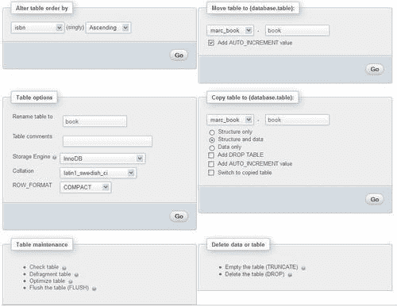
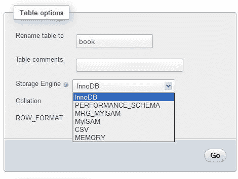
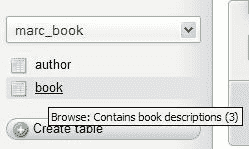
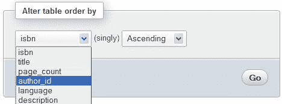
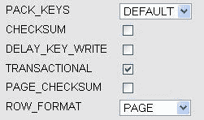
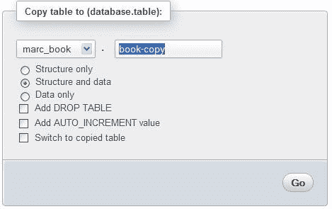
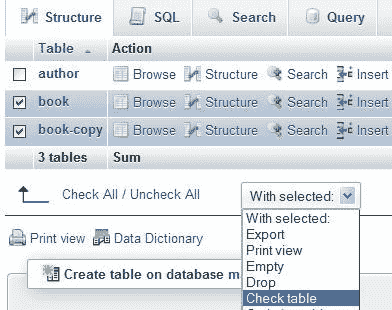
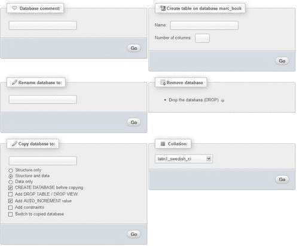
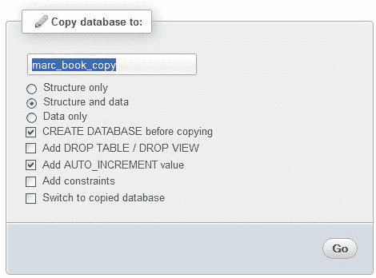

# 第九章。执行表和数据库操作

在前几章中，我们主要处理了表列。在本章中，我们将学习如何执行一些影响整个表或数据库的操作。我们将涵盖表属性以及如何修改它们，并讨论多表操作。

在`表`视图的**操作**页面上汇集了各种启用表操作的链接。以下是此页面的概述：



# 维护表

在其生命周期中，表会反复修改，因此不断增长和缩小。服务器可能会出现中断，导致一些表处于损坏状态。

使用**操作**页面，我们可以执行各种操作，下面列出了这些操作。但是，并非每种存储引擎都支持每种操作。

+   **检查表：**扫描所有行以验证删除的链接是否正确。还会计算校验和以验证键的完整性。如果一切正常，我们将获得一个显示**OK**或**表已经是最新的**的消息；如果出现其他消息，现在是修复此表的时候了（参考**修复表**项目）。

+   **分析表：**分析并存储键分布；这将在后续的`JOIN`操作中用于确定应该连接表的顺序。应定期执行此操作（如果表中的数据已更改）以提高`JOIN`效率。

+   **修复表：**修复`MyISAM`和`ARCHIVE`引擎中表的任何损坏数据。请注意，表可能会损坏到我们甚至无法进入`表`视图！在这种情况下，请参考*多表操作*部分以修复它的程序。

+   **碎片整理表：**在`InnoDB`表中进行随机插入或删除会使其索引碎片化。应定期对表进行碎片整理以加快数据检索。此操作会导致 MySQL 重建表，并且仅适用于`InnoDB`。

+   **优化表：**当表包含开销时，这是有用的。在大量删除行或`VARCHAR`列长度更改后，表中会保留丢失的字节。如果 phpMyAdmin 在各个地方（例如在`结构`视图中）感觉表应该被优化，它会警告我们。此操作将回收表中未使用的空间。在 MySQL 5.x 的情况下，可以优化的相关表使用`MyISAM，InnoDB`和`ARCHIVE`引擎。

+   **刷新表：**当出现许多连接错误并且 MySQL 服务器阻止进一步连接时，必须执行此操作。刷新将清除一些内部缓存，并允许正常操作恢复。

### 注意

操作是基于可用的底层 MySQL 查询进行的 - phpMyAdmin 只调用这些查询。更多详细信息请参阅[`dev.mysql.com/doc/refman/5.5/en/table-maintenance-sql.html`](http://dev.mysql.com/doc/refman/5.5/en/table-maintenance-sql.html)。

# 更改表属性

表属性是表的各种属性。本节讨论了其中一些设置的设置。

## 表存储引擎

我们可以更改的第一个属性称为**存储引擎**。



这控制了表的整体行为 - 其位置（在磁盘上或内存中）、索引结构以及是否支持事务和外键。下拉列表取决于我们的 MySQL 服务器支持的存储引擎。

### 注意

如果行数较多，更改表的存储引擎可能是一个长时间的操作。

## 表注释

**表注释**选项允许我们为表输入注释。


这些注释将显示在适当的位置，例如在导航面板中，在`Table`视图中的表名称旁边，以及在导出文件中。以下屏幕截图显示了当`$cfg['ShowTooltip']`参数设置为其默认值`TRUE`时导航面板的外观：



`$cfg['ShowTooltipAliasDB']`和`$cfg['ShowTooltipAliasTB']`的默认值为`(FALSE)`，会产生我们之前看到的行为—导航面板和`Structure`页面中显示真实的数据库和表名。当光标悬停在数据库或表名上时，注释会显示为工具提示。如果其中一个参数设置为`TRUE`，则行为将反转—默认显示注释，并将真实名称显示为工具提示。当真实表名不具有意义时，这是方便的。

还有另一种可能性是`$cfg['ShowTooltipAliasTB']`的值为`'nested'`。如果使用此功能会发生什么：

+   导航面板中显示真实表名

+   表注释（例如，`project__`）被解释为项目名称，并按原样显示（参见第三章中的*数据库中表的嵌套显示*部分）

## 表顺序

当我们浏览表，或执行诸如`SELECT * from book`之类的语句而没有指定排序顺序时，MySQL 使用行物理存储的顺序。可以使用**Alter table order by**对话框更改表顺序。我们可以选择任何列，表将在此列上重新排序一次。在示例中，我们选择**author_id**，然后单击**Go**，表将按此列排序。

如果我们知道大部分时间将按此顺序检索行，则重新排序是方便的。此外，如果以后使用`ORDER BY`子句，并且表已经在此列上物理排序，可能会获得更好的性能。

默认排序将持续到表中没有更改（没有插入、删除或更新）为止。这就是为什么 phpMyAdmin 显示**(单独)**警告。



在对**author_id**进行排序后，作者**1**的书将首先显示，然后是作者**2**的书，依此类推（我们谈论的是默认浏览表而没有明确排序）。我们还可以指定排序顺序为**升序**或**降序**。

如果我们插入另一行，描述来自作者**1**的新书，然后单击**浏览**，由于排序是在插入之前完成的，该书将不会与此作者的其他书一起显示。

## 表排序规则

基于字符的列具有描述用于解释内容的字符集以及排序规则的排序属性。**name**列当前具有**latin1_swedish_ci**排序规则，可以通过**Structure**页面看到。在**Operations**页面上，如果我们将表`author`的排序规则从**latin1_swedish_ci**更改为**utf8_general_ci**，则会生成以下语句：

```go
ALTER TABLE `author` DEFAULT CHARACTER SET utf8 COLLATE utf8_general_ci

```

因此，我们只更改了将来将添加到此表中的列的默认排序规则；对于现有列，未更改排序规则。

## 表选项

可以使用**表选项**对话框指定影响表行为的其他属性：



选项包括：

+   **PACK_KEYS：**设置此属性会导致较小的索引。这样可以更快地读取，但更新需要更多时间。适用于`MyISAM`存储引擎。

+   **CHECKSUM：**这使得 MySQL 为每一行计算一个校验和。这会导致更新速度变慢，但查找损坏的表变得更容易。仅适用于`MyISAM`。

+   **DELAY_KEY_WRITE：**这指示 MySQL 不立即写入索引更新，而是将它们排队以便稍后写入。这可以提高性能，但存在负面折衷——在服务器故障的情况下可能需要重建索引（参见[`dev.mysql.com/doc/refman/5.1/en/miscellaneous-optimization-tips.html)`](http://dev.mysql.com/doc/refman/5.1/en/miscellaneous-optimization-tips.html)）。仅适用于`MyISAM`。

+   **TRANSACTIONAL、PAGE_CHECKSUM：**适用于`Aria`存储引擎，以前称为`Maria`。**TRANSACTIONAL**选项将此表标记为事务性表；然而，此选项的确切含义会随着此存储引擎的未来版本获得更多的事务性功能而变化。**PAGE_CHECKSUM**计算所有索引页的校验和。目前在[`kb.askmonty.org/en/aria-storage-engine`](http://kb.askmonty.org/en/aria-storage-engine)中有文档记录。

+   **ROW_FORMAT：**对支持此功能的存储引擎（`MyISAM、InnoDB、PBXT`和`Aria`）提供了一种行格式的选择。默认值是该表行格式的当前状态。

+   **AUTO_INCREMENT：**这会更改自动递增值。仅当表的主键具有自动递增属性时才显示。

# 清空或删除表

清空表（删除其数据）和删除表（删除其数据和表的结构）可以通过**清空表（TRUNCATE）**和**删除表（DROP）**链接来完成，这些链接位于**删除数据或表**部分。

# 重命名、移动和复制表

**重命名**操作是最容易理解的——表只是更改其名称并保持在同一数据库中。

**移动**操作（如下截图所示）以两种方式操作表——更改其名称以及存储它的数据库。


MySQL 不直接支持移动表。因此，phpMyAdmin 必须在目标数据库中创建表，复制数据，然后最终删除源表。这可能需要很长时间，具体取决于表的大小。

**复制**操作会保留原始表并将其结构或数据（或两者）复制到另一个表中，可能是另一个数据库中。在这里，**book-copy**表将是`book`源表的精确副本。复制后，我们仍然保持在`book`表的`Table`视图中，除非我们选择了**切换到复制表**选项，此时我们将移动到新创建表的`Table`视图中。



**仅结构**复制用于创建具有相同结构但没有数据的测试表。

## 向表追加数据

复制对话框也可以用于将数据从一个表追加（添加）到另一个表中。两个表必须具有相同的结构。通过输入我们想要复制数据的表并选择**仅数据**来实现此操作。

例如，图书数据来自各种来源（各种出版商）以每个出版商一个表的形式，并且我们希望将所有数据汇总到一个地方。对于`MyISAM`，可以通过使用`Merge`存储引擎（这是一组相同的`MyISAM`表）来获得类似的结果。但是，如果表是`InnoDB`，我们需要依赖 phpMyAdmin 的**复制**功能。

# 执行其他表操作

在**操作**界面上，可能会出现其他对话框。引用完整性验证对话框将在第十章中介绍。分区维护将在第十七章中进行检查。

# 多表操作

在`数据库`视图中，每个表名旁边都有一个复选框，并且在表列表下方有一个下拉菜单。这使我们能够快速选择一些表并一次对所有这些表执行操作。在这里，我们选择**book-copy**和**book**表，并选择所选表的**检查表**操作，如下截图所示：



我们还可以使用**全选/取消全选**选项快速选择或取消选择所有复选框。

## 修复“正在使用”的表

多表模式是修复损坏表的唯一方法（除非我们知道要输入的确切 SQL 查询）。此类表可能在数据库列表中显示为**正在使用**标志。在 phpMyAdmin 的支持论坛中寻求帮助的用户经常会从经验丰富的 phpMyAdmin 用户那里得到这个提示。

# 数据库操作

`数据库`视图中的**操作**选项卡提供了访问面板的权限，使我们能够对整个数据库执行操作，如下截图所示：



## 重命名数据库

**重命名数据库为**对话框可用。虽然 MySQL 不直接支持此操作，但 phpMyAdmin 通过创建新数据库，重命名每个表（从而将其发送到新数据库）并删除原始数据库来间接执行此操作。

## 复制数据库

即使 MySQL 本身不原生支持此操作，也可以对数据库进行完整复制。选项与已经解释的表复制类似。



# 摘要

本章介绍了我们可以对整个表或数据库执行的操作。还介绍了表维护操作，包括表修复和优化，更改各种表属性，表移动（包括重命名和移动到另一个数据库）和多表操作。

在下一章中，我们将开始研究依赖于 phpMyAdmin 配置存储的高级功能，例如关系系统。
