# 第十章：从关系系统中受益

关系系统允许用户更密切地与 phpMyAdmin 合作，我们将在接下来的章节中看到。本章将解释如何定义表格之间的关系。

# 关系型 MySQL

当应用程序开发人员使用 PHP 和 MySQL 构建 Web 界面或其他数据操作应用程序时，他们通常使用底层 SQL 查询来建立表格之间的关系。例如，"获取发票及其所有项目"和"获取作者的所有书籍"等查询。

在早期版本的 phpMyAdmin 中，关系数据结构（表格之间的关系）并未存储在 MySQL 中。表格是通过应用程序进行程序化连接以生成有意义的结果的。

这被 phpMyAdmin 开发人员和用户认为是 MySQL 的一个缺点。因此，团队开始构建基础设施，以支持`MyISAM`表的关系，现在称为 phpMyAdmin 配置存储。这个基础设施发展到支持越来越多的特殊功能，如查询书签和基于 MIME 的转换。

现在，表格之间的关系通常是使用`InnoDB`和`PBXT`存储引擎的`FOREIGN KEY`功能本地定义的。phpMyAdmin 支持这种类型的关系以及为`MyISAM`定义的关系。

## InnoDB 和 PBXT

`InnoDB`（[`www.innodb.com`](http://www.innodb.com)）是由 Innobase Oy，Oracle 的子公司开发的 MySQL 存储引擎。在 MySQL 5.5 之前，这个存储引擎可能不可用，因为它必须由系统管理员激活；然而，在 5.5 版本中，它是默认的存储引擎。

`PrimeBase XT`存储引擎或 PBXT（[`www.primebase.org`](http://www.primebase.org)）是由 PrimeBase Technologies 开发的。最低要求的 MySQL 版本是 5.1，因为这个版本支持可插拔存储引擎 API，这个 API 被`PBXT`和其他第三方用来提供替代存储引擎。这个事务性存储引擎比`InnoDB`更新。通常在从他们的网站下载后进行编译步骤后安装。对于一些操作系统，也有预编译的二进制文件可用-请访问上述网站获取下载和安装说明。

在考虑关系方面，对于表格使用`InnoDB`或`PBXT`存储引擎的好处有：

它们支持基于外键的引用完整性，这些外键是外部（或引用）表中的键。相比之下，仅使用 phpMyAdmin 的内部关系（稍后讨论）不会带来自动的引用完整性验证。

`InnoDB`和`PBXT`表的导出结构包含了定义的关系。因此，它们可以轻松地被重新导入，以实现更好的跨服务器互操作性。

这些存储引擎的外键功能可以有效地替代 phpMyAdmin 配置存储中处理关系的部分。我们将看到 phpMyAdmin 如何与`InnoDB`和`PBXT`外键系统进行交互。

### 注意

phpMyAdmin 的其他部分配置存储（例如书签）在`InnoDB、PBXT`或 MySQL 中没有等价物。因此，仍然需要它们来访问完整的 phpMyAdmin 功能集。然而，在 MySQL 5.x 中，支持视图，并且与 phpMyAdmin 的书签有相似之处。

# 使用关系视图定义关系

安装 phpMyAdmin 配置存储后，在`Database`视图和`Table`视图中有更多选项可用。我们现在将在`Table`视图的**Structure**页面中检查**Relation view**链接。


这个视图用于：

+   定义当前表格与其他表格的关系

+   选择显示列

我们的目标是在`book`表（包含作者 ID）和`author`表（通过 ID 描述每个作者）之间创建关系。我们从`book`表的“表”视图开始，转到“结构”，然后点击“关系视图”链接。

## 定义内部关系

如果`book`表是以`MyISAM`格式，我们会看到以下屏幕（否则，显示会不同，如后面的“定义外键关系”部分所解释的）：

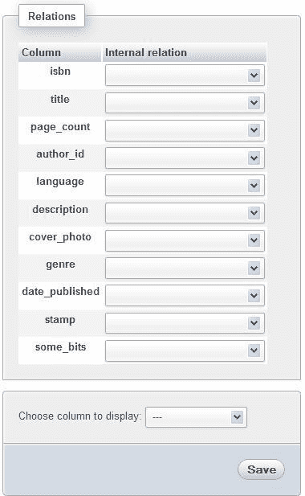

这个屏幕允许我们创建“内部关系”（存储在`pma_relation`表中），因为 MySQL 本身对`MyISAM`表没有任何关系概念。每一列旁边的空下拉列表表示没有与任何外键表的关系（链接）。

### 定义关系

我们可以将`book`表的每一列与另一张表的列（或同一张表，因为自引用关系有时是必要的）相关联。界面会在同一数据库的所有表中找到唯一和非唯一键，并以下拉列表的形式呈现这些键。（目前不支持从界面创建到其他数据库的内部关系。）对于“author_id”列的适当选择是从`author`表中选择相应的“id”列。

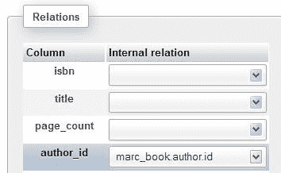

然后点击“保存”，定义将保存在 phpMyAdmin 的配置存储中。要删除关系，只需返回到屏幕，选择空选项，然后点击“保存”。

### 定义显示列

我们的`author`表的主键是`id`，这是我们为主键目的而创造的唯一编号。作者的名字是自然指代作者的方式。在浏览`book`表时看到作者的名字会很有趣。这就是显示列的目的。我们通常应该为每个参与关系的表定义一个显示列，作为外键表。

我们将在“从定义的关系中受益”部分看到这些信息是如何显示的。现在我们转到`author`表的“关系视图”（在这种情况下是外键表），并指定显示列。我们选择“name”作为显示列，然后点击“保存”，如下面的截图所示：

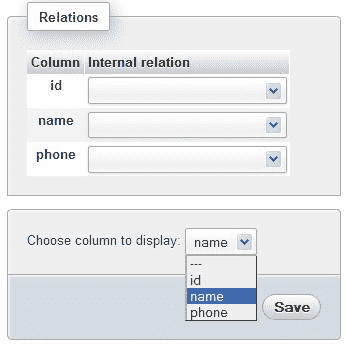

### 注意

phpMyAdmin 只提供为一张表定义一个显示列的选项，并且这一列在使用该表作为外键表的所有关系中都会使用。

现在这个关系的定义已经完成。虽然我们没有将`author`表的任何列与另一张表相关联，但可以这样做。例如，我们可以在这个表中有一个国家代码，并且可以创建到国家表的国家代码的关系。

现在，我们将看到如果我们的表受到`InnoDB`或`PBXT`存储引擎的控制会发生什么。

## 外键关系

`InnoDB`和`PBXT`存储引擎为我们提供了本地外键系统。

### 注意

在本节中，可以选择使用`InnoDB`或`PBXT`存储引擎来完成练习。`InnoDB`已经在文本中选择。

在这个练习中，我们的`book`和`author`表必须使用`InnoDB`存储引擎。我们可以在“表”视图的“操作”页面中进行此操作。

在练习中，为了看到缺少索引的后果，需要采取另一步。我们回到`book`表的“结构”，移除我们在“author_id”和“language”列上创建的组合索引。

`InnoDB`中的外键系统维护相关表之间的完整性。因此，我们无法向`book`表中添加不存在的作者 ID。此外，在对主表执行`DELETE`或`UPDATE`操作时，可以编程执行操作（在我们的情况下是`book`）。

打开`book`表的**结构**页面并进入**关系视图**，现在显示了一个不同的页面：

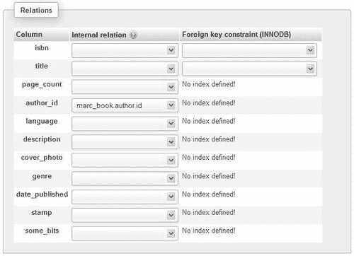

此页面为我们提供以下信息：

+   **author_id**到`author`表有一个内部关系定义。

+   尚未定义任何`InnoDB`关系。

+   当在`InnoDB`中定义了相同的关系时，我们将能够删除内部关系。实际上，悬停在**内部关系**旁边的问号上会显示以下消息：**当存在相应的 FOREIGN KEY 关系时，内部关系是不必要的**。因此，最好将其删除。

在相关键的可能选择中，我们可以看到同一数据库中所有`InnoDB`表中定义的键。 （当前不支持在 phpMyAdmin 中创建跨数据库关系。）当前表中定义的键也会显示，因为自引用关系是可能的。让我们删除**author_id**列的内部关系并单击**保存**。我们的目标是为**author_id**列添加一个`InnoDB 类型`的关系，但是由于此行上出现了**未定义索引！**消息，这是不可能的。这是因为只有在两个列都有索引的情况下，才能在`InnoDB`或`PBXT`中定义外键。

### 注意

有关约束的其他条件在 MySQL 手册中有解释。请参考[`dev.mysql.com/doc/refman/5.1/en/innodb-foreign-key-constraints.html`](http://dev.mysql.com/doc/refman/5.1/en/innodb-foreign-key-constraints.html)。

因此，我们回到`book`表的**结构**页面，并为**author_id**列添加一个普通（非唯一）索引，产生以下屏幕：

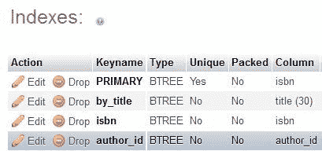

在**关系视图**中，我们可以再次尝试添加我们想要的关系；这次成功了！

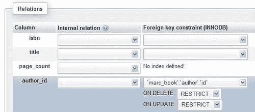

我们还可以使用**ON DELETE**和**ON UPDATE**选项设置一些操作。例如，**ON DELETE CASCADE**会使 MySQL 在从父表中删除相应行时自动删除相关（外键）表中的所有行。例如，当父表是`invoices`，而外键表是`invoice‑items`时，这将非常有用。这些选项是 MySQL 本身支持的，因此在 phpMyAdmin 之外进行删除会导致级联删除。

### 注意

如果我们尚未这样做，应该按照“定义显示列”部分的说明为`author`表定义显示列。

### 没有 phpMyAdmin 配置存储的外键

即使未安装配置存储，我们在`InnoDB`或`PBXT`表的**结构**页面上也可以看到**关系视图**链接。这会带我们到一个屏幕，我们可以在这里定义外键，例如`book`表。

请注意，如果选择此选项，无法定义所链接表（在本例中为`author`）的显示列，因为它属于 phpMyAdmin 的配置存储。因此，我们将失去查看外键相关描述的好处。

# 使用设计师定义关系

基于 Ajax 的**设计师**提供了一种以视觉方式管理关系（内部和基于外键的），并为每个表定义显示列的方法。它还可以充当：

+   访问现有表结构和访问表创建页面的菜单

+   如果我们想要一个包含所有表的 PDF 模式管理器

在**设计师**工作区，我们可以在同一面板上处理所有表的关系。另一方面，**关系视图**只显示单个表的关系。

我们可以通过单击**设计师**菜单选项从`数据库`视图访问此功能。

### 注意

如果此菜单选项未出现，则是因为我们尚未按照第一章中描述的方式安装 phpMyAdmin 配置存储。

## 查看界面

**设计师**页面包含主工作区，可以在其中看到表。该工作区将根据我们的表的位置动态增长和缩小。以下截图展示了包含我们的三个表及其之间关系的**设计师**界面：

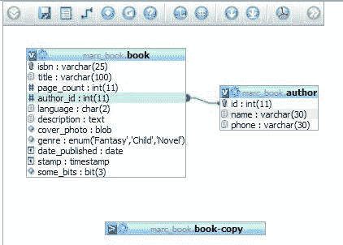

顶部菜单包含图标，将鼠标悬停在上面可以显示其描述。以下表格总结了顶部菜单图标的目标：

| 图标 | 描述 |
| --- | --- |
| **显示/隐藏左侧菜单** | 显示或隐藏左侧菜单。 |
| **保存位置** | 保存工作区的当前状态。 |
| **创建表** | 退出**设计师**并进入对话框以创建表；在单击此按钮之前，我们应该注意保存表的位置。 |
| **创建关系** | 将**设计师**置于创建关系的模式中。 |
| **选择要显示的列** | 指定哪一列代表一个表。 |
| **重新加载** | 在**设计师**之外表的结构发生变化时，刷新表的信息。 |
| **帮助** | 显示有关选择关系的解释。 |
| **Angular 链接/直接链接** | 指定关系链接的形状。 |
| **吸附到网格** | 影响相对于想象网格的表移动行为。 |
| **小/大全部** | 隐藏或显示每个表的列列表。 |
| **切换小/大** | 反转每个表的列显示模式，因为可以使用其角标图标**V**或**>**为每个表选择此模式。 |
| **导入/导出** | 显示一个对话框，以从现有的 PDF 模式定义中导入或导出。 |
| **移动菜单** | 顶部菜单可以向右移动，然后再次返回。 |

单击**显示/隐藏左侧菜单**图标时，会出现一个侧边菜单。其目的是呈现完整的表列表，以便您可以决定哪个表出现在工作区，并启用访问特定表的**结构**页面。在这个例子中，我们选择从工作区中移除**book-copy**表，如下截图所示：

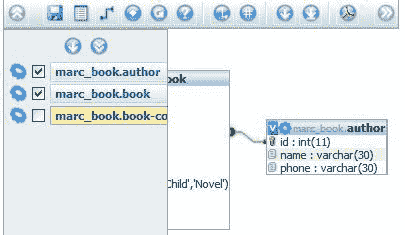

如果我们想永久删除它，我们点击**保存位置**顶部图标。该图标还会保存我们的表在工作区上的当前位置。

表可以通过拖动它们的标题栏在工作区上移动，并且可以通过每个表的左上角图标来显示/隐藏表的列列表。在这个列列表中，小图标显示数据类型（数字、文本和日期），并告诉我们这一列是否是主键。

## 定义关系

由于我们已经使用**关系视图**定义了一个关系，我们首先看看如何删除它。**设计师**不允许更改关系。但是，**设计师**允许删除和定义关系。

问号图标显示一个面板，解释了在哪里点击，以便选择要删除的关系。

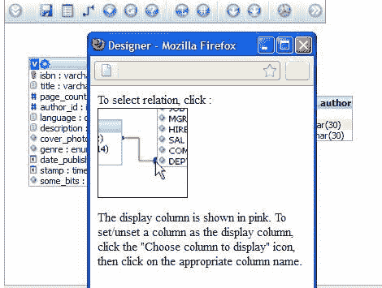

单击关系线以选择它。我们会得到一个确认面板，在上面单击**删除**。

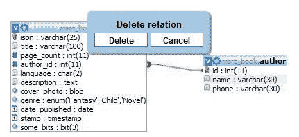

然后我们可以继续重新创建它。要做到这一点，我们首先点击**创建关系**图标：


然后，光标变成一个短消息，上面写着**选择引用键**。在我们的情况下，引用键是**author**表的**id**列；所以我们把光标放在这个列上并点击它。进行验证，确保我们选择了一个主键或唯一键。

接下来，将光标更改为**选择外键**，将其移动到`book`表的`author_id`列上，然后再次点击。这确认了关系的创建。目前，界面不允许创建复合键（具有多个列）。

### 定义外键关系

删除或定义`InnoDB`或`PBXT`表之间的关系的过程与内部关系相同。唯一的例外是，在创建时，会出现一个不同的确认面板，使我们能够指定`on delete`和`on update`操作。

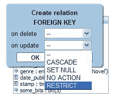

## 定义显示列

在工作空间中，`author`表中的`name`列具有特殊的背景颜色。这表示该列作为显示列。我们只需点击**选择要显示的列**图标，然后将短消息**选择要显示的列**拖到另一列上，例如`phone`列。这将更改显示列为该列。如果我们将消息拖到现有的显示列上，我们将删除该列作为表的显示列的定义。

## 导出 PDF 模式

在第十五章中，我们将看到如何为数据库的子集生成 PDF 模式。我们可以将这样一个模式的表坐标导入到**设计师**的工作空间中，反之亦然，将它们导出到 PDF 模式。**导入/导出坐标**图标可用于此目的。

# 受益于定义的关系

在本节中，我们将看到我们目前可以测试的定义关系的好处。其他好处将在第十二章和第十五章中描述。phpMyAdmin 配置存储的其他好处将在第十四章、第十六章和第十八章中出现。

这些好处适用于内部和外键关系。

## 外键信息

让我们浏览`book`表。我们看到相关键**（author_id）**的值现在是链接。将光标移动到任何**author_id**值上会显示作者的名字（由`author`表的显示列定义）。

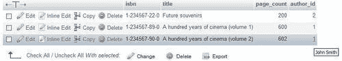

点击**author_id**会带我们到相关的`—author—`表，针对特定的作者：


我们可能更喜欢看到所有行的显示列而不是查看键。返回到`book`表，我们可以选择**关系显示列**显示选项并点击**Go**。这会产生一个类似以下截图的屏幕：

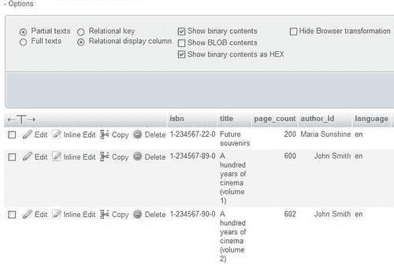

现在我们通过选择**关系键**并点击**Go**来切换回查看键。

## 外键的下拉列表

在**插入**模式（或**编辑**模式）下显示`book`表，现在每个具有定义关系的列都有可能键的下拉列表。列表包含键和描述（显示列）的两种顺序——键到显示列以及显示列到键。这使我们可以使用键盘输入键或显示列的第一个字母。

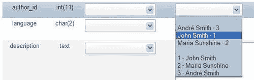

### 注意

只有键（在这种情况下为**1**）将存储在`book`表中。显示列仅用于辅助我们。

默认情况下，如果外部表中最多有 100 行，则会出现此下拉列表。这由以下参数控制：

```sql
$cfg['ForeignKeyMaxLimit'] = 100;

```

对于比这更大的外部表，会出现一个不同的窗口——外部表窗口（参见下一节），可以进行浏览。

我们可能希望以不同的方式查看下拉列表中的信息。这里，**John Smith**是内容，**1**是 ID。默认显示由以下代码控制：

```sql
$cfg['ForeignKeyDropdownOrder'] = array( 'content-id', 'id-content');

```

我们可以在定义数组中使用`—content-id`和`id-content—`中的一个或两个字符串，并按照我们喜欢的顺序。因此，将`$cfg['ForeignKeyDropdownOrder']`定义为`array('id-content')`将产生一个只有这些选择的列表：

```sql
1 John Smith
2 Maria Sunshine
3 André Smith

```

## 可浏览的外键表窗口

我们当前的`author`表中只有很少的条目。因此，为了说明这个机制，我们将把`$cfg['ForeignKeyMaxLimit']`设置为一个人为的低数，1。现在在`book`表的**插入**模式中，我们看到一个小表形状的图标和**浏览外键值**链接，用于**author_id**列。这个图标打开另一个窗口，其中会显示`author`表的值和一个**搜索**输入框。左边的值按键值排序（这里是**id**列），右边的值按描述排序。

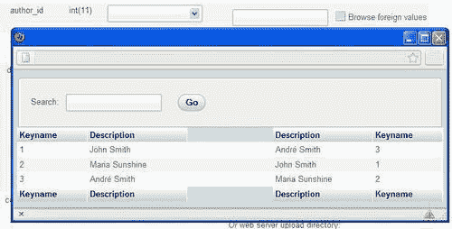

选择一个值（通过点击键值或描述）会关闭这个窗口，并将值带回**author_id**列。

## 引用完整性检查

我们在第九章中讨论了**操作**页面及其**表维护**部分。在这个练习中，我们假设`book`和`author`表都不受`InnoDB`或`PBXT`存储引擎的控制。如果我们为`author`表定义了内部关系，那么`book`表会出现一个新的选项——**检查引用完整性**。

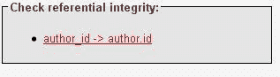

每个定义的关系都会出现一个链接**(author_id -> author.id)**，点击它会开始验证。对于每一行，会验证外键表中相应键的存在性，并报告任何错误。如果结果页面报告零行，那就是好消息！

这个操作存在是因为对于不支持外键的存储引擎下的表，无论是 MySQL 还是 phpMyAdmin 都不会强制执行引用完整性。例如，可以在`book`表中插入无效的**author_id**列的数据。

## 元数据的自动更新

phpMyAdmin 通过在每次通过 phpMyAdmin 对表进行更改时，保持内部关系的元数据同步。例如，重命名作为关系一部分的列会使 phpMyAdmin 在关系的元数据中重命名此列。这保证了内部关系在列名更改后仍然能够正常工作。当删除列或表时也会发生同样的情况。

### 注意

如果从 phpMyAdmin 外部对结构进行更改，元数据应该手动维护。

# 列评论

在 MySQL 4.1 之前，MySQL 结构本身不支持对列添加注释。然而，由于 phpMyAdmin 的元数据，我们可以对列进行注释。然而，自 MySQL 4.1 以来，原生列注释得到了支持。好消息是，对于任何 MySQL 版本，phpMyAdmin 中的列注释始终通过**结构**页面访问，通过编辑每个列的结构。在下面的例子中，我们需要对`book`表的三列进行注释。因此，我们选择它们，然后点击**With selected**旁边的铅笔图标。

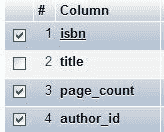

要获得下一个面板，如图所示，我们正在垂直模式下工作。这种模式在第五章中有介绍。我们按照下面的截图输入注释，然后点击**保存**：

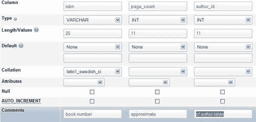

这些注释会出现在各个地方，例如导出文件（参见第六章），PDF 关系模式（参见第十五章），以及浏览模式，如下面的截图所示：

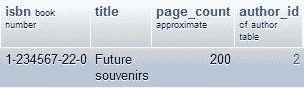

如果我们不希望注释出现在浏览模式中，我们可以将`$cfg['ShowBrowseComments']`设置为`FALSE`。（默认为`TRUE`。）

列注释也会出现在**结构**页面的工具提示中，列名下划线为虚线。要停用此行为，我们可以将`$cfg['ShowPropertyComments']`设置为`FALSE`。（这个也是默认为`TRUE`。）

## 自动迁移列注释

每当 phpMyAdmin 检测到列注释存储在其元数据中时，它会自动将这些列注释迁移到本机 MySQL 列注释中。

# 总结

本章介绍了如何定义`InnoDB`和非 InnoDB 表之间的关系。它还检查了 phpMyAdmin 的修改行为（当存在关系时）和外键。最后，它涵盖了**设计者**功能，列注释以及如何从表中获取信息。

下一章将介绍输入 SQL 命令的方法，当 phpMyAdmin 的界面不足以完成我们需要的操作时，这些命令非常有用。
