# 第十一章。输入 SQL 语句

本章解释了我们如何在 phpMyAdmin 中输入自己的 SQL 语句（查询），以及如何保留这些查询的历史记录。传统上，人们会通过“mysql”命令行客户端与 MySQL 服务器交互，输入 SQL 语句并观察服务器的响应。官方的 MySQL 培训仍然涉及直接向这样的客户端输入语句。

# SQL 查询框

phpMyAdmin 允许我们通过其图形界面执行许多数据库操作。然而，有时我们必须依靠 SQL 查询输入来实现界面不直接支持的操作。以下是两个这样的查询示例：

```go
SELECT department, AVG(salary) FROM employees GROUP BY department HAVING years_experience > 10;
SELECT FROM_DAYS(TO_DAYS(CURDATE()) +30);

```

要输入这样的查询，可以从 phpMyAdmin 中的多个位置使用 SQL 查询框。

## 数据库视图

当进入“数据库”视图中的“SQL”菜单时，我们会遇到第一个 SQL 查询框。

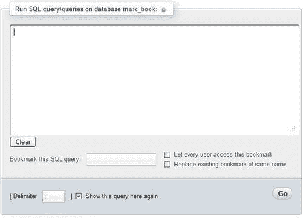

这个框很简单——我们输入一些有效（希望如此）的 MySQL 语句，然后点击**Go**。在查询文本区域下方，有与书签相关的选择（稍后在第十四章中解释）。通常，我们不必更改标准的 SQL 分隔符，即分号。但是，如果需要，有一个**分隔符**对话框（参见第十七章）。

要在此框中显示默认查询，我们可以使用`$cfg['DefaultQueryDatabase']`配置指令进行设置，默认情况下为空。我们可以在这个指令中放置一个查询，比如`SHOW TABLES FROM @DATABASE@`。这个查询中的`@DATABASE@`占位符将被当前数据库名替换，结果就是在查询框中显示`SHOW TABLES FROM `marc_book``。

## 表视图

在“表”视图的`book`表中，“SQL”菜单中有一个略有不同的框。

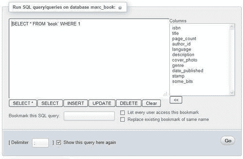

该框已经有一个默认查询，如前一个截图所示。这个默认查询是从`$cfg['DefaultQueryTable']`配置指令生成的，其中包含`SELECT * FROM @TABLE@ WHERE 1`。这里，`@TABLE@`会被当前表名替换。`$cfg['DefaultQueryTable']`中的另一个占位符是`@FIELDS@`。这个占位符将被该表的完整列列表替换，从而生成以下查询：

```go
SELECT `isbn`, `title`, `page_count`, `author_id`, `language`, `description`, `cover_photo`, `genre`, `date_published`, `stamp`, `some_bits` FROM `book` WHERE 1.

```

`WHERE 1`是一个始终为真的条件。因此，查询可以按原样执行。我们可以用我们想要的条件替换**1**，或者我们可以输入一个完全不同的查询。

由于这个 SQL 框出现在“表”视图中，表名是已知的；因此，phpMyAdmin 在查询框下方显示按钮，允许快速创建包含该表名的常见 SQL 查询。这些按钮生成的大多数查询包含完整的列列表。

### 列选择器

“列”选择器是加快查询生成的一种方式。通过选择一个列并点击箭头**<<**，这个列名就会被复制到查询框中当前的光标位置。在这里，我们选择**author_id**列，删除数字**1**，然后点击**<<**。然后我们添加条件**= 2**，如下截图所示：

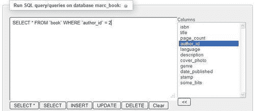

“再次显示此查询”选项（默认选中）确保查询在执行后仍然保留在框中，如果我们仍然在同一页上。这对于像`UPDATE`或`DELETE`这样影响表但不产生单独结果页面的查询更容易看到。

### 点击查询框

我们可能想要通过`$cfg['TextareaAutoSelect']`配置指令来改变在查询框内点击的行为。它的默认值是`FALSE`，这意味着点击时不会自动选择内容。如果将这个指令更改为`TRUE`，那么第一次点击这个框将选择它的所有内容。（这是一种快速将内容复制到其他地方或从框中删除的方法。）下一次点击将把光标放在点击位置。

# 查询窗口

在第三章中，我们讨论了这个窗口的目的，以及更改一些参数（如尺寸）的过程。这个窗口可以很容易地从导航面板中使用**SQL**图标或**查询窗口**链接打开，如下面的屏幕截图所示，非常方便用于输入查询和测试：

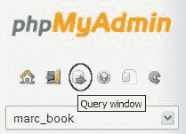

以下屏幕截图显示了出现在主面板上的查询窗口：

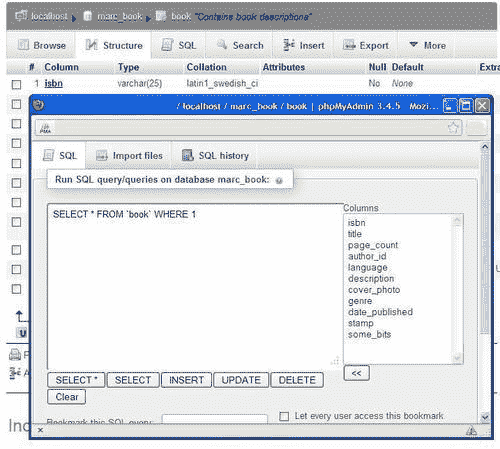

屏幕截图中的窗口包含与`表`视图上下文中使用的相同的**列**选择器和**<<**按钮。这个独特的查询窗口只支持启用了 JavaScript 的浏览器。

## 查询窗口选项

**SQL**选项卡是这个窗口中默认的活动选项卡。这来自于配置指令`$cfg['QueryWindowDefTab']`，默认包含`sql`。

如果我们想要另一个选项卡成为默认活动选项卡，我们可以用`files`或`history`替换`sql`。另一个值`full`一次显示所有三个选项卡的内容。

在查询窗口中，我们可以看到一个**不要从窗口外部覆盖此查询**选择的复选框。通常情况下，这个复选框是选中的。如果我们取消选中它，那么我们在生成查询时所做的更改将反映在查询窗口中。这被称为**同步**。例如，从导航或主面板中选择不同的数据库或表会相应地更新查询窗口。然而，如果我们直接在这个窗口中开始输入查询，复选框将被选中以保护其内容并取消同步。这样，这里组成的查询将被锁定和保护。

## 基于会话的 SQL 历史记录

这个功能将我们作为 PHP 会话数据执行的所有成功的 SQL 查询收集起来，并修改查询窗口以使它们可用。这种默认类型的历史记录是临时的，因为`$cfg['QueryHistoryDB']`默认设置为`FALSE`。

## 基于数据库的 SQL 历史记录（永久）

当我们安装了 phpMyAdmin 配置存储（参见第一章）时，就可以使用更强大的历史记录机制。我们现在应该通过将`$cfg['QueryHistoryDB']`设置为`TRUE`来启用这个机制。

在我们从查询框中尝试一些查询之后，一个历史记录就会建立起来，只有从查询窗口中才能看到，如下面的屏幕截图所示：

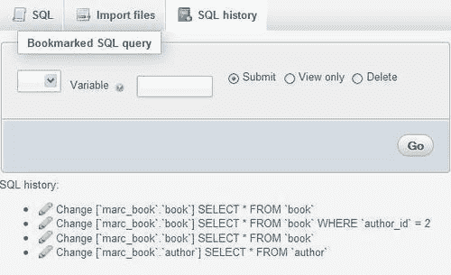

我们可以看到（按相反顺序）最后成功的查询和它们所在的数据库。只有从查询框中输入的查询以及 phpMyAdmin 生成的查询（例如通过点击**浏览**生成的查询）才会保存在这个历史记录中。

它们可以立即执行，**更改**图标可用于将记录的查询插入查询框进行编辑。

将保留的查询数量由`$cfg['QueryHistoryMax']`控制，默认设置为`25`。这个限制不是出于性能原因，而是为了实现一个视觉上不受限制的视图而设置的实际限制。额外的查询在登录时被消除，这个过程传统上被称为**垃圾收集**。查询被存储在`$cfg['Servers'][$i]['history']`中配置的表中。

## 编辑查询

在成功查询的结果页面上，会显示包含执行查询的标题，如下截图所示：

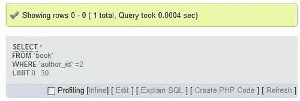

单击**编辑**会打开查询窗口的**SQL**选项卡，并准备修改此查询。这是因为该参数的默认设置如下：

```go
$cfg['EditInWindow'] = TRUE;

```

当它设置为`FALSE`时，单击**编辑**将不会打开查询窗口；相反，查询将出现在**SQL**页面的查询框内。

单击**内联**会将显示的查询替换为文本区域，在这里可以编辑和提交此查询，而不离开当前结果页面。

# 多语句查询

在 PHP 和 MySQL 编程中，我们可以使用`mysql_query()`函数调用一次只发送一个查询。phpMyAdmin 允许我们使用分号作为分隔符，在一次传输中发送多个查询。假设我们在查询框中输入以下查询：

```go
INSERT INTO author VALUES (100,'Paul Smith','111-2222');
INSERT INTO author VALUES (101,'Melanie Smith','222-3333');
UPDATE author SET phone='444-5555' WHERE name LIKE '%Smith%';

```

我们将收到以下结果屏幕：

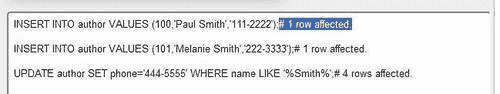

我们通过注释看到受影响的行数，因为`$cfg['VerboseMultiSubmit']`设置为`TRUE`。

让我们再次发送相同的查询列表并观看结果：

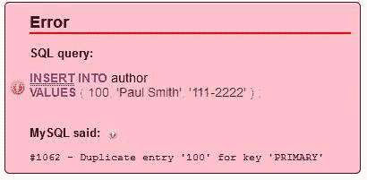

收到“重复条目”错误消息是正常的，该消息表示值**100**已经存在。我们看到第一个**INSERT**语句的结果；但是下一个会发生什么？由于`$cfg['IgnoreMultiSubmitErrors']`设置为`FALSE`，告诉 phpMyAdmin 不要忽略多个语句中的错误，因此执行在第一个错误处停止。如果设置为`TRUE`，程序将依次尝试所有语句，我们会看到两个**重复条目**错误。

如果我们尝试多个`SELECT`语句，此功能将无法按预期工作。我们将只看到最后一个`SELECT`语句的结果。

# 漂亮打印（语法高亮）

默认情况下，phpMyAdmin 解析和突出显示其处理的任何 MySQL 语句的各个元素。这由`$cfg['SQP']['fmtType']`控制，默认设置为`'html'`。此模式对每个不同的元素（保留字、变量、注释等）使用特定颜色，如`$cfg['SQP']['fmtColor']`数组中所描述的那样，该数组位于特定主题的`layout.inc.php`文件中。

将`fmtType`设置为`'text'`将删除所有颜色格式，将换行符插入到 MySQL 语句中的逻辑点。最后，将`fmtType`设置为`'none'`将删除所有格式，保留我们的语法不变。

# SQL 验证器

每次 phpMyAdmin 传输查询时，MySQL 服务器会解释它并提供反馈。查询的语法必须遵循 MySQL 规则，这与 SQL 标准不同。但是，遵循 SQL 标准可以确保我们的查询在其他 SQL 实现上可用。

一个免费的外部服务，**Mimer SQL 验证器**，由 Mimer Information Technology AB 提供。它根据 Core SQL-99 规则验证我们的查询并生成报告。验证器可以直接从 phpMyAdmin 使用，并且其主页位于[`developer.mimer.com/validator/index.htm`](http://developer.mimer.com/validator/index.htm)。

### 注意

出于统计目的，此服务会匿名存储接收到的查询。在存储查询时，它会用通用名称替换数据库、表和列名称。查询中的字符串和数字将被替换为通用值，以保护原始信息。

## 系统要求

此验证器作为 SOAP 服务提供。我们的 PHP 服务器必须具有 XML、PCRE 和 SOAP 支持。SOAP 支持由 PHP 扩展或 PEAR 模块提供。如果选择 PEAR 方式，系统管理员在服务器上执行以下命令安装我们需要的模块：

```go
pear install Net_Socket Net_URL HTTP_Request Mail_Mime Net_DIME SOAP 

```

如果由于某些模块处于测试阶段而导致该命令出现问题，我们可以执行以下命令，安装 SOAP 和其他依赖模块：

```go
pear -d preferred_state=beta install -a SOAP 

```

## 使验证器可用

必须在`config.inc.php`中配置一些参数。将`$cfg['SQLQuery']['Validate']`设置为`TRUE`可以启用**验证 SQL**链接。

我们还应该启用验证器本身（因为将来的 phpMyAdmin 版本可能会提供其他验证器）。这可以通过将`$cfg['SQLValidator']['use']`设置为`TRUE`来完成。

验证器默认使用匿名验证器帐户访问，配置如下命令：

```go
$cfg['SQLValidator']['username'] = '';
$cfg['SQLValidator']['password'] = '';

```

相反，如果 Mimer Information Technology 已经为我们提供了一个帐户，我们可以在这里使用该帐户信息。

## 验证器结果

验证器返回两种报告之一，一种是查询符合标准的，另一种是不符合标准的。

### 符合标准的查询

我们将尝试一个简单的查询：`SELECT COUNT(*) FROM book`。像往常一样，我们在查询框中输入此查询并发送。在结果页面上，我们现在看到了一个额外的链接——**验证 SQL**，如下截图所示：

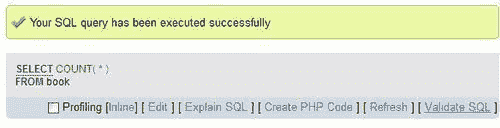

点击**验证 SQL**会生成如下截图所示的报告：

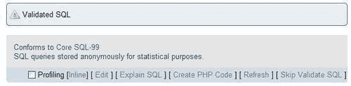

我们可以选择点击**跳过验证 SQL**来查看我们的原始查询。

### 不符合标准的查询

让我们尝试另一个在 MySQL 中正确工作的查询：`SELECT * FROM book WHERE language = 'en'`。将其发送到验证器会生成如下截图所示的报告：

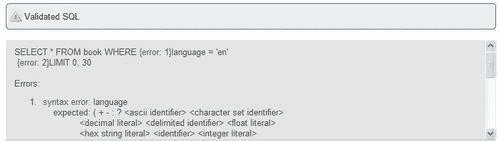

每当验证器发现问题时，它会在错误点添加诸如**{error: 1}**的消息，并在报告中添加脚注。在此查询中，**language**列名是非标准的。因此，验证器告诉我们在此处期望标识符。关于使用`LIMIT`子句的非标准错误也被报告，这是 phpMyAdmin 添加到查询中的。

另一个情况是反引号。如果我们只是点击**浏览**`book`表，phpMyAdmin 会生成`SELECT * FROM `book``，用反引号括起表名。这是 MySQL 保护标识符的方式，标识符可能包含特殊字符，如空格、国际字符或保留字。然而，将此查询发送给验证器会显示反引号不符合标准 SQL。我们甚至可能会得到两个错误，每个反引号一个。

# 摘要

本章帮助我们理解了查询框的目的，并告诉我们在哪里找到它们。它还概述了如何使用列选择器、查询窗口选项、如何获取输入命令的历史记录、多语句查询，最后，如何使用 SQL 验证器。

下一章将展示如何通过 phpMyAdmin 的查询生成器生成多表查询而无需输入太多内容。
