# 第十二章：生成多表查询

“数据库”或“表”视图中的**搜索**页面适用于单表查找。本章介绍了“数据库”视图中可用的多表**查询示例（QBE）**功能。

许多 phpMyAdmin 用户在“表”视图中逐个表地工作，因此往往忽视了多表查询生成器，这是一个用于微调查询的精彩功能。查询生成器不仅在多表情况下有用，也在单表情况下有用。它使我们能够为列指定多个条件，这是“表”视图中的**搜索**页面所不具备的功能。

### 注意

本章的示例假定已经进行了 phpMyAdmin 配置存储的多用户安装（参见第一章），并且在第九章的练习中创建的`book-copy`表仍然存在于`marc_book`数据库中。

要打开此功能的页面，我们转到特定数据库的“数据库”视图（查询生成器一次只支持对一个数据库的操作），然后点击**查询**。

以下屏幕截图显示了初始的 QBE 页面。它包含以下元素：

+   **可视化构建器**链接（本章末尾介绍）

+   条件列

+   添加条件行的界面

+   添加条件列的界面

+   表选择器

+   查询区域

+   更新或执行查询的按钮

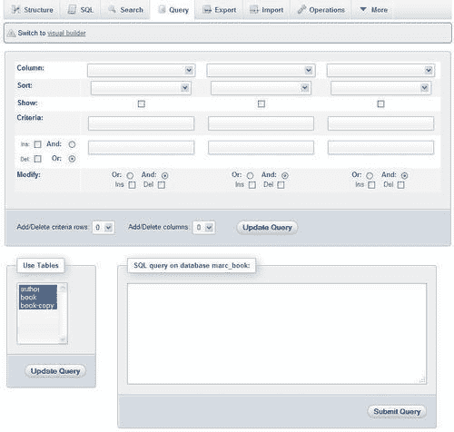

# 选择表

初始选择包括所有表。因此，**列**选择器包含大量列。对于我们的示例，我们将仅使用**author**和**book**表。因此，我们只从**使用表**选择器中选择这两个。

然后我们点击**更新查询**按钮。这将刷新屏幕并减少**列**选择器中可用的列数。我们可以随时使用浏览器的多选机制（通常是控制点击）后来更改所选的表。

# 探索列条件

默认情况下提供了三个条件列。本节讨论了我们编辑它们的条件的选项。这些选项包括选择列、对单个列进行排序、输入单个列的条件等。

## 列选择器：单列或所有列

**列**选择器包含所选表的所有单独列，以及以星号（*）结尾的特殊选择，表示选择了所有列。

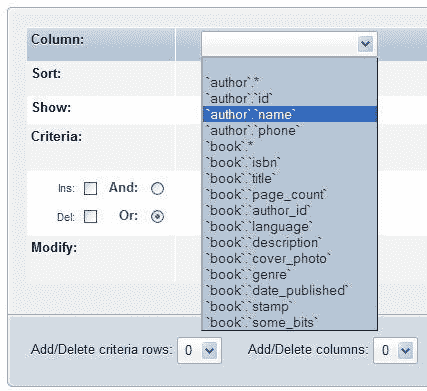

要显示`author`表中的所有列，我们会选择**`author`**并勾选**显示**复选框，而不在**排序**和**条件**框中输入任何内容。在我们的情况下，我们选择**`author`.`name`**，因为我们想为作者的姓名输入一些条件。

## 排序列

对于每个选定的单独列，我们可以指定排序（**升序**或**降序**），或让该行保持不变（无排序，这是默认行为）。如果我们选择了多个排序列，排序将从左到右进行。

### 注意

当我们要求对列进行排序时，通常会勾选**显示**复选框。但这并非必需，因为我们可能只想进行排序操作而不显示该列。

## 显示列

我们勾选**Show**复选框，以便在结果中看到该列。有时，我们可能只想在列上应用一个条件，而不包括它在结果页面中。在这里，我们添加了`phone`列，要求对其进行排序，并选择同时显示姓名和电话号码。我们还要求按照姓名的升序进行排序。如果姓名相同，则首先按姓名排序，然后按电话号码排序。这是因为姓名在左侧的列条件中，因此具有更高的优先级。

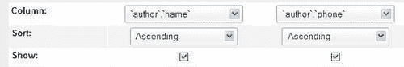

## 更新查询

在任何时候，我们都可以点击**Update Query**按钮来查看我们生成的查询的进展。在执行查询之前，我们必须至少点击一次。现在，让我们点击它，看看在查询区域生成的查询。在接下来的示例中，我们将在每次修改后点击**Update Query**按钮。

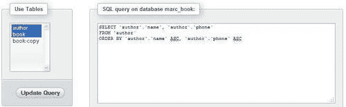

我们已经选择了两个表，但尚未从**book**表中选择任何列。因此，生成的查询中没有提到这个表。

## 向条件框添加条件

在**Criteria**框中，我们可以为每个相应的列输入一个条件（遵守 SQL `WHERE`子句的语法）。默认情况下，我们有两行条件。为了找到所有名字中带有**Smith**的作者，我们使用**LIKE**条件**（LIKE '%SMITH%'）**并点击**Update Query**。

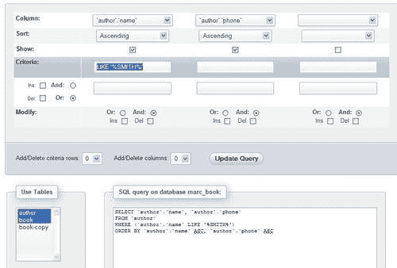

我们还有另一行可用于输入额外的条件。假设我们想要找到作者**Maria Sunshine**。这次，我们使用**=**条件。两个条件行将由默认从界面左侧选择的**Or**运算符连接。

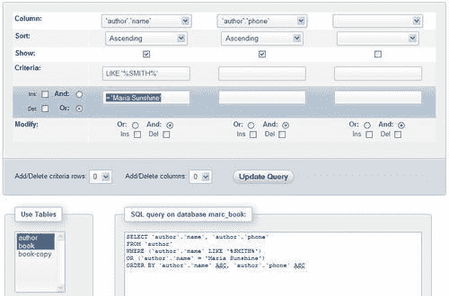

为了更好地展示**Or**运算符如何连接两个条件行，让我们现在在电话号码上添加一个条件**LIKE '%8%'**，如下截图所示：

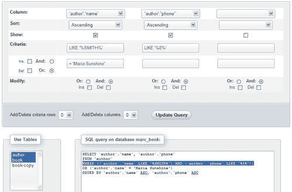

通过检查**AND**和**OR**运算符的定位，我们可以看到条件的第一行是由**AND**（因为在**name**列下选择了**AND**）运算符连接的，而条件的第二行是由**OR**运算符连接的。我们刚刚添加的条件**'（LIKE %8%）**并不是为了找到任何人，因为我们已经将所有名为“Smith”的作者的电话号码更改为“444-5555”（在第十一章中）。

如果我们想在同一列上添加另一个条件，我们只需添加一个条件行。

### 调整条件行的数量

条件行的数量可以通过两种方式进行更改。首先，我们可以在**Criteria**下选择**Ins**复选框来添加一个条件行（在点击**Update Query**后）。由于此复选框一次只能添加一行条件，因此我们将取消选中它，然后使用**Add/Delete criteria rows**对话框。在此对话框中，我们选择添加两行。

再次点击**Update Query**按钮会产生以下屏幕：

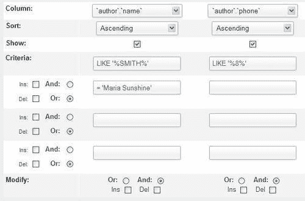

现在，您可以看到有两行额外的条件（目前为空）。我们也可以删除条件行。这可以通过在我们要删除的行旁边勾选**Del**复选框来完成。让我们删除刚刚添加的两行，因为我们现在不需要它们。**Update Query**按钮将根据指定的调整刷新页面。

### 调整条件列的数量

使用类似的机制，我们可以通过在**修改**对话框中的每列下方的**插入**或**删除**复选框，或者**添加/删除列**对话框来添加或删除列。我们已经有一个未使用的列（在前面的图像中未显示）。在这里，我们使用了位于未使用列下方的**插入**复选框添加了一列（这次我们将需要它）：

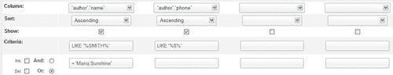

# 生成自动连接（内部关系）

phpMyAdmin 可以生成查询中表之间的连接，前提是已经定义了内部关系。现在让我们用我们**book**表的**title**和**genre**列填充我们的两个未使用的列，看看当我们更新查询时会发生什么。

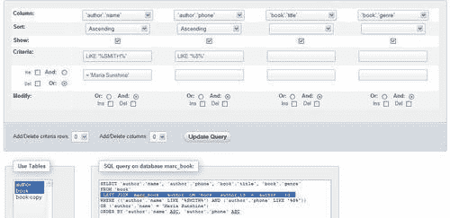

现在有两个与**`book`.`title`**和**`book`.`genre`**列相关的额外条件列。phpMyAdmin 利用其对表之间定义的关系的知识生成了一个**LEFT JOIN**子句（在上面的屏幕截图中突出显示），该子句在**author_id**关键列上。当前版本的一个缺点是只检查了内部关系，而没有检查`InnoDB`关系。

### 注意

可能涉及到多于两个表的连接。

# 执行查询

单击**提交查询**按钮发送查询以执行。在下面的屏幕截图中，您可以看到上部的完整生成的查询，以及下部的结果数据行：

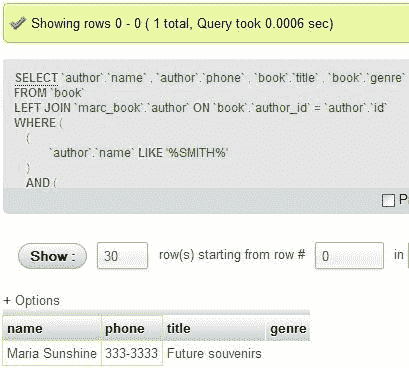

在我们提交查询后，除了使用浏览器的**返回**按钮之外，没有简单的方法返回到查询生成页面。第十四章讨论了如何保存生成的查询以供以后执行。

# 可视化生成器

从 3.4 版本开始，提供了另一种查询构建方法。它利用了**Designer**界面，可能更熟悉于用户，将查询生成与其结合起来。我们可以通过单击**切换到可视化生成器**链接来打开此界面，这将产生一个初始屏幕，如下面的屏幕截图所示：

我们现在应该通过单击**全部展开/收起**图标来打开所有表的列列表。

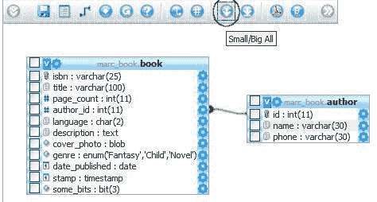

每列都有一个左侧复选框和一个右侧选项图标。复选框用于指示我们希望成为结果的哪一列；而选项图标允许打开一个面板，在面板中我们将指定要应用于此列的条件。例如，如果我们想选择超过 200 页的书，我们将单击**page_count**列旁边的选项图标，并填写条件对话框，如下面的屏幕截图所示：

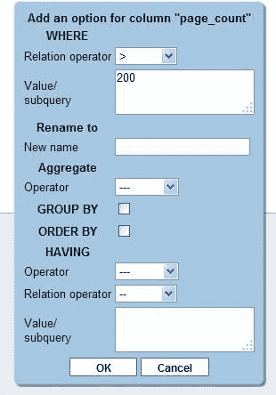

单击**确定**保存此查询选项；现在它可以在右侧的**活动选项**对话框下找到，如果需要查看或删除选项。

为了构建查询，我们使用**构建查询**图标，生成一个如下屏幕截图所示的屏幕：

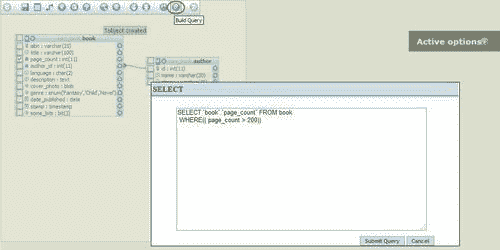

此时，我们要么使用附加选项来完善查询，要么单击**提交查询**以获取结果。

# 摘要

本章涵盖了包括打开查询生成器、选择表、输入列条件、排序和显示列、修改条件行或列的数量等各种方面。我们还学习了如何使用`AND`和`OR`运算符来定义行和列之间的关系，以及如何在表之间使用自动连接。**Designer**集成的可视化查询生成器也被介绍了。

下一章将向您展示如何在服务器之间同步数据以及如何管理复制。
