# 第十三章：同步数据和支持复制

在本章中，我们将介绍 phpMyAdmin 3.3.0 版本中发布的两个功能。第一个功能是同步数据库的能力，这是开发人员要求的，他们在多个服务器上工作。第二个功能允许管理 MySQL 复制，在性能和数据安全性重要的环境中使用。这些功能有些相关，因为在设置复制过程时，通常需要将数据库同步到从服务器。

# 同步数据和结构

在较早的 phpMyAdmin 版本中，可以在同一服务器或不同服务器上的两个数据库之间实现一些结构和数据的同步，但这需要手动操作。可以从一个数据库导出结构和/或数据，然后导入到另一个数据库。我们甚至可以直观地比较两个表的结构，并根据需要进行调整。然而，必须由开发人员自己用眼睛比较两个数据库以确定需要导入的内容。此外，数据库之间的结构差异没有被考虑在内，可能导致目标表中缺少列时出现错误。

phpMyAdmin 的**同步**功能非常灵活，通过处理初始比较过程，当然也通过执行同步本身。我们将首先讨论同步的原因，然后检查并实验涉及的所有步骤。

## 同步的目标

尽管想要同步两个数据库的原因可能很多，但我们可以将它们分为以下几类。

### 在开发和生产服务器之间移动

一个良好的数据库开发策略包括在与生产服务器不同的服务器上进行开发和测试。如果没有单独的开发服务器，至少鼓励使用单独的开发数据库。随着时间的推移，测试和生产环境之间的结构差异会积累，这是正常的。例如，测试版本可能会添加一个列，或者字符列可能会被扩大。同步功能允许我们首先查看差异，然后根据需要将其应用到生产环境。

有时需要以相反的方式移动数据，例如，为了衡量性能而将真实生产数据填充到测试数据库中。

### 数据库设计师之间的协作

由于 MySQL 测试服务器可以轻松设置，可能会出现这样的情况，即开发团队的每个成员都有自己的服务器（或自己的数据库副本），在其中开发项目的某个方面。当需要协调每个人对同一表的更改时，同步功能是非常宝贵的。

### 为复制做准备

MySQL 支持主服务器和一个或多个从服务器之间的异步复制。这种数据复制被称为“异步”，因为主服务器和从服务器之间的连接不需要是永久的。然而，要启动复制过程（假设主服务器已经包含一些数据），就需要将所有数据复制到从服务器上。MySQL 手册中提供了一个完成此复制的建议，可以在[`dev.mysql.com/doc/refman/5.1/en/replication-howto.html`](http://dev.mysql.com/doc/refman/5.1/en/replication-howto.html)找到，如下所述：

“如果您的主服务器已经有数据，并且您想使用它来同步您的从服务器，您需要创建一个数据快照。您可以使用`mysqldump`来创建一个快照（...）”

然而，这需要使用一个命令行工具，这取决于托管选项并不总是可能的。此外，数据库的某些部分可能已经存在于从属数据库；因此，同步功能非常方便，因为它集成到了 phpMyAdmin 中，并且它负责比较阶段。

## 查看同步过程

重要的原则是同步是从源数据库到目标数据库完成的。在此操作期间，源数据库保持不变。我们需要正确识别哪个数据库是源数据库，哪个是目标数据库（可能会被修改）。

整个过程被细分为可以在任何阶段停止的步骤：

+   服务器和数据库选择

+   比较

+   完整或选择性同步

我们可以选择出于以下原因之一停止该过程：

+   我们没有连接到其中一个服务器所需的凭据

+   我们发现两个数据库之间存在差异，并且还没有准备好进行同步，因为需要进一步研究

+   我们在比较阶段之后注意到目标数据库已经充分同步

在执行同步之前，我们将准备好必要的元素。

## 为同步练习做准备

由于我们只会操作`author`和`book`表，因此本练习将假定`marc_book`数据库中没有其他表。我们首先将`marc_book`数据库复制到`marc_book_dev`（有关如何执行此操作的确切方法，请参阅第九章）。然后我们打开`marc_book_dev`数据库并执行以下操作：

+   删除`book`表

+   从`author`表中删除一行

+   将`name`列的类型从`VARCHAR(30)`更改为`VARCHAR(29)`

+   从`author`表中删除`phone`列

第五章介绍了如何执行前面的操作。

## 选择源和目标服务器和数据库

通过“服务器”视图中的**同步**菜单选项显示初始同步页面。请注意，这是唯一可以使用该菜单的地方。

第一个面板允许我们连接到服务器（如果需要）并选择正确的数据库。如果`$cfg['AllowArbitraryServer']`参数设置为其默认值`false`，则会出现以下面板：

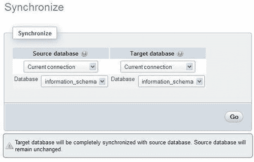

这意味着我们只能使用在`config.inc.php`中已定义的服务器。如果允许任意服务器，则会看到一个不同的面板，如下面的截图所示：

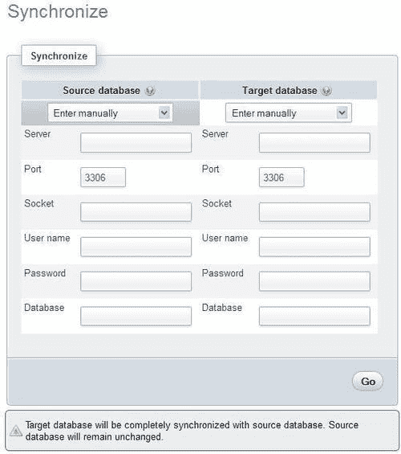

对于源数据库和目标数据库，我们可以选择服务器位置。默认情况下，选择器放置在**手动输入**上，我们可以输入其主机名、端口、套接字名称、用户名、密码和数据库名称。在大多数情况下，端口应该保持默认的 3306，套接字名称应该保持为空。请注意，我们当前连接到一个 MySQL 服务器（通过正常的登录面板），这个面板可以让我们连接到另外两个服务器。

服务器位置的另一个选择是**当前连接**。这指的是我们连接的用于正常 phpMyAdmin 操作的服务器；其名称显示在主面板顶部。如果我们选择这个选项，启用 JavaScript 的浏览器会隐藏除了数据库名称之外的所有选项（在这种情况下，连接凭据是不必要的），并且会出现一个选择器，显示我们可以访问的所有数据库。

在源和目标两侧选择相同的服务器是完全可能的；然而，在这种情况下，我们至少会选择一个不同于目标的源数据库。另一个常见情况是选择当前服务器和某个数据库作为源，以及具有相同数据库的远程服务器作为目标，假设远程服务器是生产服务器，并且两个服务器都拥有同名的数据库。

在这个练习中，让我们为源和目标服务器都选择**当前连接**；然后我们可以选择`marc_book`作为源数据库，`marc_book_dev`作为目标数据库，如下面的截图所示：

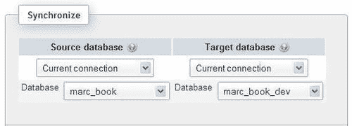

点击**Go**后，phpMyAdmin 尝试连接服务器（如果需要）。此时可能会显示连接错误消息。但是，连接应该会成功，程序将开始比较两个数据库，然后显示结果。

## 分析比较结果

比较结果面板包含三个部分。第一部分显示了结构和数据的差异，并包含将用于启动选择性同步的图标：

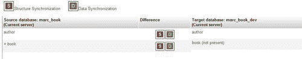

如上部所示，红色的**S**图标触发结构同步，而绿色的**D**图标用于数据同步。然后，对于每个表，我们得到差异的摘要。在相应表的结构和数据相同的情况下，中央的**差异**列将为空。在这里，我们看到两个表的红色**S**和绿色**D**，但原因并不相同。

中部显示了作为同步过程一部分的计划操作（目前没有，如下面的截图所示）：

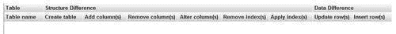

下部包含一个复选框**(您是否要删除目标表中的所有先前行？)**和两个操作按钮。我们将在以下部分看到它们的用途：

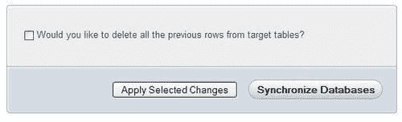

请注意，书表在**源**一侧有一个加号(+)，表示该表在源数据库中但不在目标数据库中。我们甚至在**目标**一侧看到了对该表的**不存在**注释。如果一个表在目标数据库中但不在源数据库中，它将在**目标**一侧标有减号(-)。

此时，我们可以决定我们对比较结果感到满意，不想继续进行；在这种情况下，我们只需在 phpMyAdmin 中选择一个数据库并恢复我们的工作。我们还有机会以一次性的方式同步数据库**(完整同步)**，或者以更细粒度的方式进行更改**(选择性同步)**。让我们检查这两种方法。

## 执行完整同步

如果我们不想问自己太多问题，只需要完全同步，我们点击**同步数据库**。请注意，在这种情况下，我们不必使用任何红色的**S**或绿色的**D**图标。

### 注意

如果目标表中有一些行不在相应的源表中，这些行将保留在目标表中，除非我们勾选**是否要删除..**复选框。这是一个安全网，以避免意外数据丢失。但是，如果我们需要精确同步，我们应该选择此选项。

点击后，我们得到以下消息：**目标数据库已与源数据库同步**。在屏幕的下部，我们看到必须执行的查询以实现此操作。我们还得到了数据库现在已同步的视觉确认：

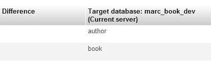

## 执行选择性同步

如果我们更喜欢更谨慎，并且想要对即将执行的操作进行初步反馈，我们可以同步选择的表。本节假设数据库的状态与*为同步练习做准备*部分结束时的状态相同，该部分在本章的前面部分已经涵盖。

如果我们点击描述`author`表的行上的红色**S**图标，这个**S**图标会变成灰色，屏幕中部会更新显示要执行的操作，如下面的截图所示：


实际上还没有对数据进行任何操作！我们仍然可以通过点击相同的图标来改变主意，这会使图中部分所示的建议更改消失，图标也会变回红色。

现在我们点击绿色的**D**图标，看到另一行建议的更改出现，如下面的截图所示：

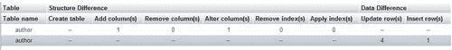

`author`表中需要插入一行，因为目标数据库中少了一个作者。总共需要更新四行，因为我们在同一张表中删除了`phone`列。

现在我们可以点击**应用所选更改**按钮。**您想删除..**复选框不适用于此操作。

现在我们看到屏幕上部提出了更少的更改：

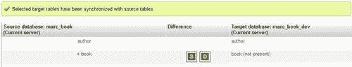

我们可以继续选择结构或数据更改，然后按照我们认为合适的顺序应用它们。

这结束了描述同步功能的部分。我们将继续介绍复制支持。

# 支持 MySQL 复制

在*为复制做准备*部分，我们看到了 MySQL 复制的概述。在本节中，我们将涵盖以下主题：

+   我们如何使用 phpMyAdmin 来配置复制

+   如何准备一个包含一个主服务器和两个从服务器的测试环境

+   如何发送命令来控制服务器

+   如何获取有关服务器、数据库和表的复制信息

phpMyAdmin 的界面提供了一个**复制**页面；然而，其他页面包含有关复制的信息或控制复制操作的链接。在涉及相关主题时，我们将指出每个适当的位置。

如何使用这一部分取决于我们手头有多少服务器。如果我们至少有两台服务器，并且想通过 phpMyAdmin 在主/从关系中配置它们，我们可以按照*配置复制*部分的步骤。如果我们只有一台服务器可以使用，那么我们应该从*设置测试环境*部分中获取建议，在同一台机器上安装多个 MySQL 服务器实例。

## 复制菜单

在`服务器`视图中，**复制**菜单只显示给特权用户，如 MySQL 根用户。当服务器已经配置为主服务器或从服务器（或两者兼有）时，**复制**页面用于显示状态信息并提供发送命令的链接。

## 配置复制

对于这个练习，我们假设服务器目前不占据主服务器或从服务器的角色。phpMyAdmin 不能直接配置 MySQL 复制的所有方面。原因是，与通过向 MySQL 服务器发送查询来操作数据库结构和数据不同，复制配置包括（部分）存储在 MySQL 配置文件中的命令行，通常命名为`my.cnf`。作为一个 Web 应用程序，phpMyAdmin 无法访问这个文件。这是 MySQL 服务器开发人员打算的配置方式——在配置文件级别上。

在这种情况下，phpMyAdmin 能做的最好的就是通过根据我们的偏好生成（在屏幕上）正确的命令行来指导我们，然后由我们将这些行复制到它们需要去的地方并重新启动服务器。phpMyAdmin 甚至不能读取当前的复制配置行；它只能通过一些`SHOW`命令推断服务器状态。

让我们进入“复制”菜单，看看会发生什么：

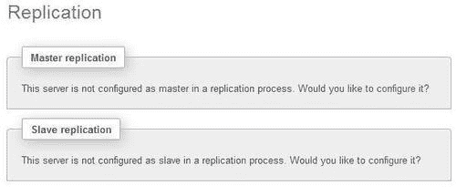

### 主服务器配置

现在我们选择通过点击适当的“配置”链接将服务器配置为主服务器。出现的面板给了我们详细的建议：

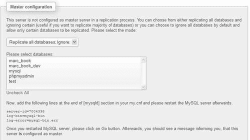

第一段确认了这个服务器目前没有配置为复制过程中的主服务器。我们想要实现这个配置，但首先我们需要考虑我们想要的复制类型。所有数据库都应该被复制，除了其中一些吗？还是我们想要相反的？一个方便的下拉列表为我们提供了这些选择：

+   **复制所有数据库；忽略：**

+   **忽略所有数据库；复制：**

第一个选择（默认）意味着一般情况下所有数据库都被复制；我们甚至不需要在配置文件中列举它们。在这种情况下，数据库选择器用于指定我们想要从复制过程中排除的数据库。让我们选择“mysql”数据库，看看在我们启用 JavaScript 的浏览器中会发生什么：

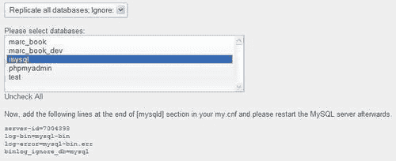

我们注意到出现了一行，说明`binlog_ignore_db=mysql`。这是一个 MySQL 服务器指令（而不是 SQL 语句），告诉服务器忽略将关于这个数据库的事务发送到二进制日志。让我们来解释其他行的含义。`server-id`是由 phpMyAdmin 生成的唯一 ID；参与复制的每个服务器都必须有一个唯一的服务器 ID。因此，我们要么手动跟踪服务器 ID，确保它们的唯一性，要么简单地使用 phpMyAdmin 随机生成的数字。我们还看到了`log-bin`和`log-error`指令；实际上，为了进行任何复制，二进制日志记录是强制性的。

我们可以通过使用*Ctrl* + 点击或*Command* + 点击在列表中添加其他数据库名称，具体取决于我们工作站的操作系统。然而，phpMyAdmin 所做的只是生成正确的行；要使它们生效，我们仍然需要遵循给定的建议，并将这些行粘贴到我们的 MySQL 配置文件的`[mysqld]`部分的末尾。然后我们应该重新启动 MySQL 服务器进程——如何做这取决于我们的环境。

在我们的服务器重新启动后，我们回到“复制”菜单；此时，我们会看到关于主服务器的不同面板：

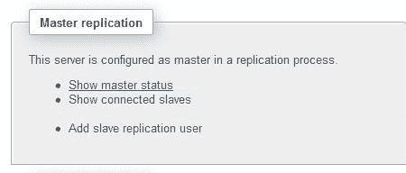

我们可以使用“显示主服务器状态”链接来获取有关主服务器的一些信息，包括当前的二进制日志名称和位置，以及先前指定的要复制或忽略的数据库的信息。

“显示已连接的从服务器”链接目前不会报告任何内容，因为还没有从服务器连接到这个主服务器。

现在是使用“添加从服务器复制用户”链接的时候了，因为这个主服务器需要有一个专门用于复制的单独账户。从服务器将使用在主服务器上创建的这个账户来连接到它。点击这个链接会显示以下面板，其中正在创建一个名为“replic”的用户账户，密码由我们选择：

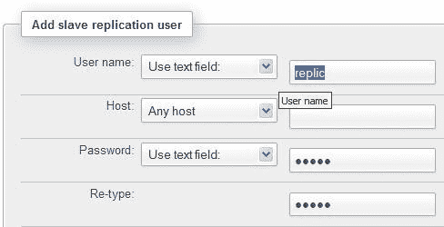

点击“Go”后，phpMyAdmin 会负责创建这个用户并设置正确的权限。

### 从服务器配置

现在，在将作为复制过程中从服务器的机器上，我们启动 phpMyAdmin。在“复制”菜单中，我们点击以下对话框中的“配置”：

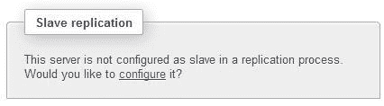

从服务器配置面板显示如下截图所示：

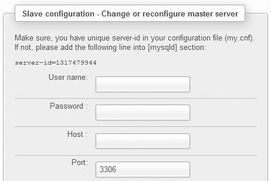

与主配置一样，我们在从服务器的配置文件中得到了关于在配置文件中具有唯一服务器 ID 的建议，我们应该遵循这个建议。

在此面板中，我们输入在主服务器上创建的专用复制帐户的用户名和密码。我们还必须指示与主服务器对应的主机名和端口号。在填写此面板并单击“Go”后，phpMyAdmin 将向从服务器发送适当的`CHANGE MASTER`命令，将此服务器置于从服务器模式。

## 设置测试环境

复制过程发生在至少两个 MySQL 服务器实例之间。在生产中，这通常意味着至少需要两台物理服务器来获得这些好处：

+   更好的性能

+   增加冗余

但是，由于 MySQL 的可配置端口号（默认为 3306）、数据目录和套接字，可能在同一台服务器上有多个 MySQL 实例。此设置可以手动配置，也可以通过安装系统（如 MySQL Sandbox）进行配置。这是一个位于[`mysqlsandbox.net`](http://mysqlsandbox.net)的开源项目。使用这个工具，我们可以非常快速地设置一个或多个 MySQL 服务器。通过使用强大的`make_replication_sandbox` Linux shell 命令，我们可以安装一个包含一个主服务器和两个从服务器的环境。每个服务器可以单独启动或停止。

以下练习假定 MySQL Sandbox 已安装在您的服务器上，并且 phpMyAdmin 的`config.inc.php`包含对这些 Sandbox 服务器的引用，如下面的代码块所示（请根据自己的环境调整套接字名称）：

```sql
$i++;
$cfg['Servers'][$i]['auth_type'] = 'cookie';
$cfg['Servers'][$i]['host'] = 'localhost';
$cfg['Servers'][$i]['socket'] = '/tmp/mysql_sandbox25562.sock';
$cfg['Servers'][$i]['verbose'] = 'master';
$i++;
$cfg['Servers'][$i]['auth_type'] = 'cookie';
$cfg['Servers'][$i]['host'] = 'localhost';
$cfg['Servers'][$i]['socket'] = '/tmp/mysql_sandbox25563.sock';
$cfg['Servers'][$i]['verbose'] = 'slave1';
$i++;
$cfg['Servers'][$i]['auth_type'] = 'cookie';
$cfg['Servers'][$i]['host'] = 'localhost';
$cfg['Servers'][$i]['socket'] = '/tmp/mysql_sandbox25564.sock';
$cfg['Servers'][$i]['verbose'] = 'slave2';

```

在这里，我们使用`$cfg['Servers'][$i]['verbose']`指令为每个实例提供一个唯一的名称，因为所有这些实例的真实服务器名称都是`localhost`。每个 Sandbox 服务器最初包含两个数据库：`mysql`和`test`。

## 控制从服务器

在这里，我们假设 Sandbox 测试环境已经设置。但是，这些解释对于所有具有从服务器的情况都是有用的。连接到从服务器并再次打开“复制”菜单后，我们看到：

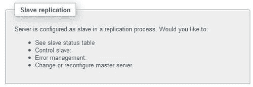

有以下选项可用：

+   “查看从服务器状态表”链接允许我们接收有关此从服务器复制相关的所有系统变量的信息。

+   “控制从服务器：”链接显示更多选项；其中一些可以在停止和启动条件之间切换。

+   “全面停止”选项用于停止 IO 线程（负责从主服务器接收更新并将其写入从服务器的中继日志的 MySQL 服务器的一部分）和 SQL 线程（从中继日志读取更新并执行它们）

+   “重置从服务器”选项停止从服务器，发送`RESET SLAVE`命令导致其忘记在主服务器的二进制日志中的复制位置，然后重新启动从服务器

+   “仅停止 SQL 线程”选项和“仅停止 IO 线程”选项用于仅停止各自的线程

+   错误管理：链接允许告诉从服务器跳过主服务器发送的一些事件（更新）。有关更多详细信息，请参阅[`dev.mysql.com/doc/refman/5.1/en/set-global-sql-slave-skip-counter.html`](http://dev.mysql.com/doc/refman/5.1/en/set-global-sql-slave-skip-counter.html)。

+   更改或重新配置主服务器：链接可用于指定此从服务器现在应该接收来自不同主服务器的更新。

## 获取复制信息

除了**复制**菜单之外，phpMyAdmin 的其他屏幕也会向我们提供有关复制的信息。这些屏幕在其他复制对话框中找不到；相反，它们分散在各个页面上，在相应页面的上下文中显示复制信息。

### 收集复制状态

通过进入`服务器`视图中的**状态**面板，我们首先会得到一个简短的消息，例如：

“这个 MySQL 服务器在复制过程中作为主服务器工作。有关服务器复制状态的更多信息，请访问复制部分。”

在这个页面上有一些**复制**链接，它们向我们展示了主服务器或从服务器的状态变量，以及一些关于连接的从服务器主机数量和复制状态的信息。

### 已复制的数据库

在主服务器上，查看`服务器`视图中的**数据库**菜单会显示一些数据库可能会被复制，**主复制**列中会有一个绿色的勾号：

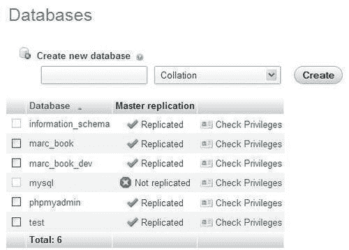

这是因为这台服务器配置了二进制日志，而这些数据库没有被排除在复制之外。

由于我们在主服务器的配置文件的`[mysqld]`部分中有以下代码行，我们可以排除影响`mysql`数据库的所有事务不记录到二进制日志中：

```sql
binlog_ignore_db=mysql

```

因此，**数据库**页面的输出显示了`mysql`数据库旁边的红色图标。

如果这是一个从服务器，将显示一个**服务器复制**列。

### 提示

请注意，从服务器本身可以有一个二进制日志；因此，在这种情况下，**主复制**和**从复制**列都会显示出来。这意味着这个从服务器可以成为另一个从服务器的主服务器。

### 已复制的表

假设在主服务器上，我们在`test`数据库中创建了一个名为`employee`的表。此时，复制会发挥其魔力，我们可以在从服务器上查看`test`数据库：

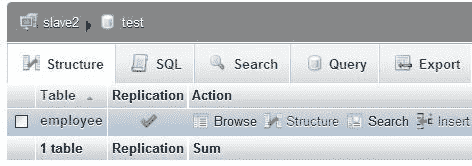

在这里，**复制**列显示为提醒。我们不应该直接在从服务器上修改这个表，因为它的存在只是为了复制目的。如果我们决定直接修改它，我们的更改只会在这个表中进行，导致主服务器和从服务器之间的不一致，这不是一个好主意。

# 总结

在本章中，我们学习了如何将一个数据库的结构和数据同步到另一个数据库，无论是在同一台服务器上还是在不同的服务器上。我们涵盖了同步的目标以及如何执行完整或选择性的同步。然后我们研究了如何使用 phpMyAdmin 来引导我们进行复制设置，包括主服务器和从服务器；如何使用 MySQL Sandbox 准备测试环境，以及如何控制从服务器。

下一章将向您展示如何保留您的查询的永久书签。
