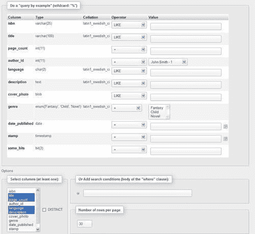
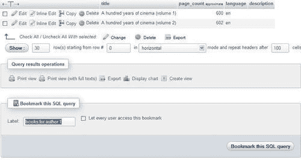
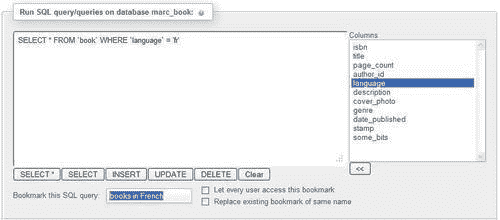
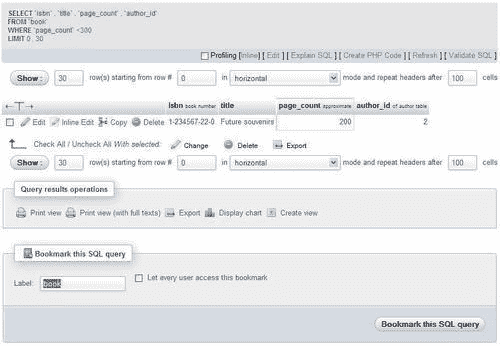
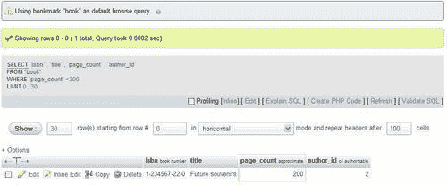
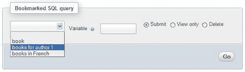
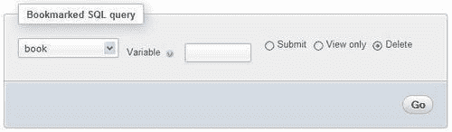
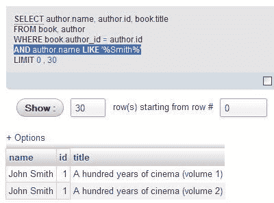

# 第十四章。使用查询书签

本章介绍了查询书签——phpMyAdmin 配置存储的一个功能。能够为查询添加标签，并通过标签进行检索，可以节省真正的时间。书签是具有以下属性的查询：

+   永久存储

+   可查看

+   可擦除

+   与一个数据库相关

+   仅作为用户操作的结果记录

+   已标记

+   默认情况下是私有的（仅对创建它们的用户可用），但可能是公共的

如本章后面的*向书签传递参数*部分所述，书签也可以具有可变部分。

没有用于管理书签的书签页面。相反，书签的各种操作可在特定页面上进行，例如结果页面或查询框页面。

# 比较书签和查询历史功能

在第十一章中，我们了解了 SQL 历史功能，它会自动存储查询（临时或永久）。存储在历史中的查询和书签之间存在相似之处。毕竟，这两个功能都旨在存储查询以供以后执行。然而，关于查询的存储方式和触发查询记录的操作，存在重要的区别。

查询历史的存储是自动的；而查询被保存为书签是通过用户的显式请求。此外，存储在永久历史中的查询数量有可配置的限制（参见第十一章）；然而，书签的数量没有限制。最后，历史功能按照查询发送的时间的倒序呈现查询。然而，书签是按标签显示的（不直接显示查询文本）。

总之，当我们既不打算回忆查询，也不希望记住我们输入的查询时，自动查询历史是有用的。这与书签功能形成对比，我们故意要求系统记住一个查询，甚至给它一个名称（标签）。因此，我们可以通过书签做更多事情，而不仅仅是查询历史，但是这两个功能都有其重要性。

# 创建书签

有两种情况下可以创建书签——在执行查询后（在这种情况下，我们不需要提前计划其创建），以及在将查询发送到 MySQL 服务器执行之前。这两个选项在以下部分中进行了探讨。

## 在成功查询后创建书签

初始书签创建是通过**收藏此 SQL 查询**按钮实现的。此按钮仅在执行生成结果的查询后出现（至少找到一行时）；因此，此方法仅存储`SELECT`语句。例如，由多表查询生成器生成的复杂查询（如第十二章中所示）可以以这种方式存储为书签，前提是它找到了一些结果。

让我们看一个例子。在`book`表的**搜索**页面上，我们选择要在结果中显示的列，并输入如下截图所示的搜索值：



点击**Go**后，我们看到结果页面显示了一个书签对话框。我们仅为此书签输入一个标签**作者 1 的书籍**，然后点击**收藏此 SQL 查询**以将此查询保存为书签。书签保存在由`$cfg['Servers'][$i]['bookmarktable']`定义的表中。



这个书签对话框可以在包含结果的任何页面上看到。作为测试，我们可以只需点击一个表的**浏览**以获取结果，然后将此查询存储为书签。然而，将一个可以轻松点击完成的查询存储为书签并没有太多意义。

## 在发送查询之前存储书签

我们已经看到，在生成结果的`SELECT`语句执行后很容易创建一个书签。有时，即使查询没有找到任何结果，我们也可能希望存储一个书签。如果查询所指的数据尚未存在，或者查询是除`SELECT`之外的语句，就可能出现这种情况。为了实现这一点，我们在`Database`视图、`Table`视图和查询窗口的**SQL**选项卡中提供了**将此 SQL 查询设为书签**对话框。

现在我们转到`book`表的**SQL**页面，输入一个检索法语书籍的查询，并直接将**法语书籍**书签标签放入**将此 SQL 查询设为书签**对话框中。如果此书签标签以前已被使用，除非我们选中**替换同名现有书签**复选框，否则将创建一个同名的新书签。书签带有内部识别号，以及用户选择的标签。



单击**Go**后，查询将被执行并存储为书签。即使查询没有找到任何内容也没关系。这就是我们可以为非`SELECT`查询生成书签的方法，例如`UPDATE, DELETE, CREATE TABLE`等。

### 注意

这种技术也可以用于`SELECT`语句，无论是返回结果还是不返回结果。

## 将书签设为公开

我们创建的所有书签默认都是私有的。创建书签时，我们登录的用户名将与书签一起存储。假设我们勾选了如下屏幕截图中显示的**让每个用户访问此书签**复选框：


这将产生以下效果：

+   所有访问同一数据库（当前数据库）的用户都将可以访问该书签。

+   用户能够从书签中看到有意义的结果，这取决于他们在书签中引用的表上的权限。

+   任何用户都可以删除该书签。

+   用户将被允许通过在发送查询之前存储此书签并使用**替换同名现有书签**选项来更改书签的查询。

公共书签在调用时会显示**(共享)**后缀。

## 表的默认初始查询

在先前的示例中，我们根据自己的喜好选择了书签标签。但是，按照惯例，如果私有书签与表同名，当单击此表的**浏览**时，它将被执行。因此，我们将看到书签的结果，而不是此表的正常**浏览**结果。

假设我们有兴趣查看（默认情况下，以**浏览**模式）所有页数少于 300 页的书。我们首先生成适当的查询，可以从**搜索**页面轻松完成，然后在结果页面上使用**book**作为书签标签。



在此操作之后，每当创建此书签的用户浏览`book`表时，他将看到以下屏幕截图：



## 多查询书签

单个书签还可以存储多个查询（用分号分隔）。这对于非`SELECT`查询非常有用。例如，假设我们需要定期清理有关作者的数据，以删除电话号码中的无效区号。此操作总是会跟随`author`表的显示。

为了实现这一目标，我们存储了一个包含这些查询的书签（在发送执行之前）：

```go
update author set phone = replace(phone,'(123)', '(456)');
select * from author;

```

在书签中，我们可以放置许多数据修改语句，例如`INSERT, UPDATE`或`DELETE`，然后可以选择性地跟随一个`SELECT`语句。堆叠大量`SELECT`语句不会产生预期的结果，因为我们只会看到最后一个`SELECT`语句获取的数据。

# 从书签列表中调用书签

创建的任何书签都可以在以下页面找到：

+   **表**视图：**marc_book**的任何表的**SQL**页面

+   查询窗口：**SQL 历史**选项卡

+   **数据库**视图：**marc_book**数据库的**SQL**页面



在调用书签时有三个选择——**提交、仅查看**和**删除（提交**是默认选项）。

## 执行书签

选择一个书签并点击**Go**执行存储的查询并显示其结果。书签执行后的页面没有另一个对话框来创建书签，因为这将是多余的。

### 注意

我们得到的结果不一定与创建书签时相同。它们反映了数据库的当前内容。只有查询被存储为书签。

## 操作书签

有时，我们可能只想确定书签的内容。这可以通过选择书签并选择**仅查看**来完成。然后查询将被显示，我们有机会重新编辑其内容。这样做，我们将编辑原始书签查询的副本。为了保留这个新的编辑查询，我们可以将其保存为书签。同样，即使我们选择相同的书签标签，这将创建另一个书签，除非我们明确要求替换原始书签。

可以使用**删除**选项来删除书签。没有确认对话框来确认删除书签。我们现在应该继续删除我们的**book**书签。



# 向书签传递参数

如果我们再次查看我们创建的第一个书签（查找**作者 1**的所有书），我们会意识到，虽然它很有用，但只能找到一个作者，总是相同的那个。

特殊的查询语法使得可以向书签传递参数。这种语法利用了 SQL 注释`/*`和`*/`在 MySQL 中被忽略的特性。如果查询中存在`/*[VARIABLE]*/`结构，它将在执行时用提供的值进行扩展。

## 创建一个带参数的书签

假设我们想要找到给定作者的所有书，但不知道作者的`id`。我们首先输入以下查询：

```go
SELECT author.name, author.id, book.title
FROM book, author
WHERE book.author_id = author.id
/* AND author.name LIKE '%[VARIABLE]%' */

```

注释字符`(/* */)`之间的部分将在以后扩展，并且标签将被移除。我们将这个查询标记为一个名为**按姓名查找作者**的书签（在执行之前），然后点击**Go**。查询的第一次执行只是存储了书签，同时检索了所有作者的所有书，因为这次我们没有向查询传递参数。

在这个例子中，我们在`WHERE`子句中有两个条件，其中一个包含特殊语法。如果我们在`WHERE`子句中的唯一条件需要一个参数，我们可以使用诸如`/* WHERE author_id = [VARIABLE] */`的语法。

## 传递参数值

为了测试书签，我们像往常一样调用它，并在**变量**对话框中输入一个值。


当我们点击**Go**时，我们看到了扩展的查询和作者 Smith 的书。



# 总结

在本章中，我们看到了如何记录书签（在发送查询之前或之后），如何操作它们，以及如何使一些书签公开。本章还向我们介绍了**浏览**模式的默认初始查询。它还涵盖了向书签传递参数。

下一章将解释如何通过 phpMyAdmin 提供的工具生成解释数据库结构的文档。
