# 第十五章。系统文档

生成并维护有关数据结构的良好文档对于项目的成功至关重要，特别是在团队项目中。事实上，能够向其他团队成员展示当前数据字典和建议的列更改是一种有价值的沟通手段。此外，表间关系的图形显示可以快速展示数据库的内部工作原理。幸运的是，phpMyAdmin 具有处理这些事情的文档功能。

# 生成结构报告

从`数据库`或`表`视图的**结构**页面，**打印视图**链接可用于生成有关数据库结构的报告。此外，`数据库`视图中的**数据字典**链接会生成不同的报告。这些将在以下部分详细介绍。

## 创建可打印的报告

当 phpMyAdmin 生成结果时，总是有一个**打印视图**链接，可用于生成数据的可打印报告。**打印视图**功能也可用于生成基本的结构文档。这是通过两个步骤完成的。首次单击**打印视图**会在屏幕上显示报告，并在页面末尾有一个**打印**按钮。稍后，此**打印**按钮会生成格式化为打印机的报告。

## 数据库打印视图

单击数据库的**结构**页面上的**打印视图**会生成一个表格列表。此列表包含每个表的行数、存储引擎、大小、注释和创建日期，如下面的屏幕截图所示：

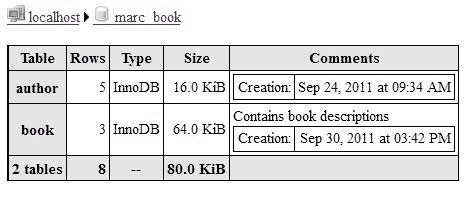

### 选择性数据库打印视图

有时，我们更喜欢为表的子集获取报告。这可以通过从数据库的**结构**页面选择我们想要的表，然后从下拉菜单中选择**打印视图**来完成，如下面的屏幕截图所示：

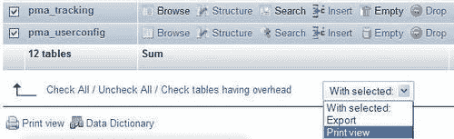

## 表打印视图

对于每个表，**结构**页面上也有一个**打印视图**链接。单击此链接会生成有关表的列和索引的信息，如下面的示例所示：

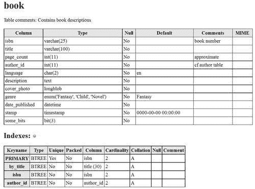

## 使用数据字典准备完整报告

从`数据库`视图的**结构**页面可以获取有关数据库中表和列的更完整的报告。我们只需单击**数据字典**链接即可获取此报告，部分内容如下屏幕截图所示：

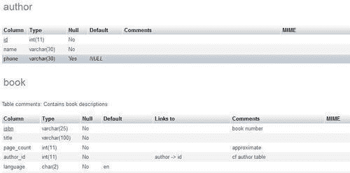

**MIME**列在我们向某些列添加 MIME 相关信息之前为空（如第十六章中所述）。

# 生成关系模式

在第十章中，我们定义了`book`和`author`表之间的关系。这些关系用于各种外键功能（例如，在**插入**模式中获取可能值的列表）。现在，我们将研究一项功能，它使我们能够为我们的表生成定制的关系模式，以流行的 PDF 格式和其他格式。此功能要求正确安装和配置 phpMyAdmin 配置存储。

## 向我们的模型添加第三个表

为了获得更完整的模式，我们现在将向我们的数据库添加另一个表`country`。以下代码块显示了其导出文件的内容：

```go
CREATE TABLE IF NOT EXISTS `country` (
`code` char(2) NOT NULL,
`description` varchar(50) NOT NULL,
PRIMARY KEY (`code`)
) ENGINE=MyISAM DEFAULT CHARSET=latin1;
INSERT INTO `country` (`code`, `description`) VALUES
('ca', 'Canada'),
('uk', 'United Kingdom');

```

现在，我们将此表链接到`author`表。首先，在`country`表的**关系视图**中，我们指定要显示的列，然后单击**保存**。

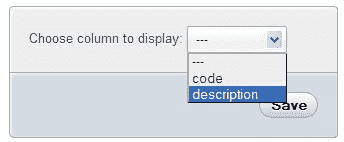

然后，我们向`author`表添加一个**country_code**列（与`country`表中的`code`列相同类型和大小），并在**关系视图**中将其链接到新创建的`country`表。

### 注意

我们必须记得点击“保存”以记录关系。

对于这个例子，不需要为作者输入任何国家数据，因为我们只对关系模式感兴趣。

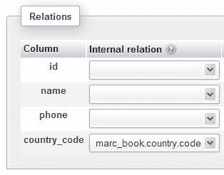

### 生成模式页面

每个关系模式称为“页面”。我们可以通过在“数据库”视图的“操作”页面上点击“编辑或导出关系模式”来创建或编辑页面。

### 页面规划

关系模式不能跨越多个数据库。但即使只使用一个数据库，表的数量可能很大。以清晰的方式表示各种表之间的关系可能是一个挑战。这就是为什么我们可能会使用许多页面，每个页面显示一些表及其关系。

我们还必须考虑最终输出的尺寸。在信纸大小的纸张上打印给我们更少的空间来显示所有的表，并且仍然有一个可读的模式。

### 创建一个新页面

由于没有现有页面，我们需要创建一个。由于我们最重要的表是“书籍”，我们还将把这个页面命名为“书籍”。

我们将选择希望在关系模式中看到的表。我们可以逐个选择每个表。但是，为了一个良好的开始，建议勾选适当的“自动布局”复选框。这样做会将数据库中所有相关的表放入要包括在模式中的表列表中。然后生成适当的坐标，使表格将以螺旋布局的方式出现在模式中，从模式的中心开始。这些坐标以毫米表示，其中`(0, 0)`位于左上角。然后点击“开始”：

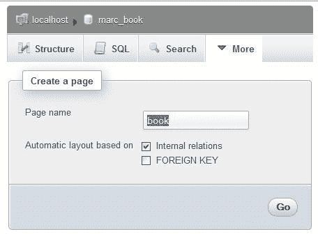

### 编辑页面

现在我们得到了一个有三个不同部分的页面。第一个是页面菜单，我们可以从下拉菜单中选择要操作的页面。我们也可以删除所选的页面。我们最终也可以创建第二个模式（页面）。

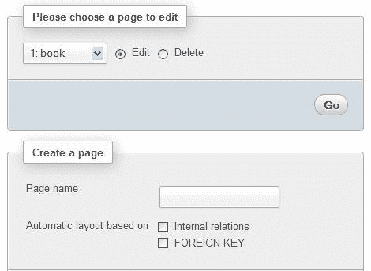

接下来的部分是表的放置部分。我们现在可以看到“自动布局”功能的好处——我们已经选择了我们的三个表，并填写了“X”和“Y”坐标列。我们可以添加一个表（在最后一行），删除一个表（使用复选框），并更改坐标（表示模式上每个表的左上角位置）：

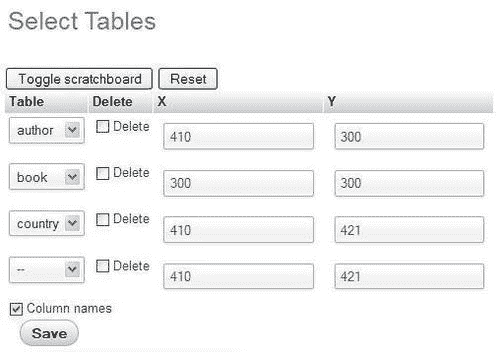

为了帮助设置精确的坐标，JavaScript 启用的浏览器可以使用可视化编辑器。当单击“切换草稿板”按钮一次时，编辑器将出现。当再次单击此按钮时，它将消失。我们可以在草稿板上拖放表格，坐标将相应更改。草稿板上表格的外观提供了最终 PDF 输出的粗略指南。有些人更喜欢在草稿板上只看到表格名称（而不是每个列名称）。这可以通过取消选择“列名称”复选框然后点击“保存”来完成。以下图片显示了这个草稿板的例子：

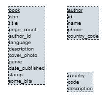

### 注意

当我们对布局感到满意时，必须点击“保存”。

### 为了显示导出页面

屏幕的最后部分是报告生成对话框。现在我们已经创建了一个页面，“显示关系模式”显示一个对话框，如下面的屏幕截图所示：

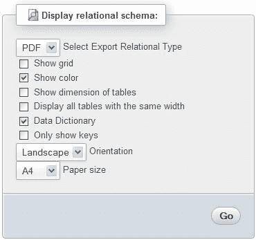

可用的选项有：

| 选项 | 描述 |
| --- | --- |
| 选择导出关系类型允许选择要导出的文件格式（PDF、SVG、DIA、Visio 或 EPS）。 |
| 显示网格 | 模式将具有显示坐标的网格层。在设计和测试模式时很有用。 |
| 显示颜色 | 链接、表名和特殊列（主键和显示列）将以颜色显示。 |
| **显示表的尺寸** | 在表标题中显示每个表的视觉尺寸（例如，**32x30)**。这在设计和测试模式时很有用。 |
| **显示所有具有相同宽度的表** | 所有表将使用相同的宽度显示。（通常，宽度会根据表和列名的长度自动调整。） |
| **数据字典** | 数据字典，本章前面介绍过的，将包含在报告的开头。 |
| **仅显示键** | 不显示未定义索引的列。 |
| **方向** | 在这里，我们选择报告的打印方向。 |
| **纸张尺寸** | 更改此选项将影响模式和草稿板的尺寸。 |

在`config.inc.php`中，以下参数定义了可用的纸张尺寸和默认选择：

```go
$cfg['PDFPageSizes'] = array('A3', 'A4', 'A5', 'letter', 'legal');
$cfg['PDFDefaultPageSize'] = 'A4';

```

以下屏幕截图显示了生成报告的最后一页（模式页面）的 PDF 格式。前四页包含数据字典以及其他功能。

箭头指向相应外部表的方向。如果**显示颜色**复选框已被选中，则主键显示为红色，显示列显示为蓝色，如下面的屏幕截图所示：

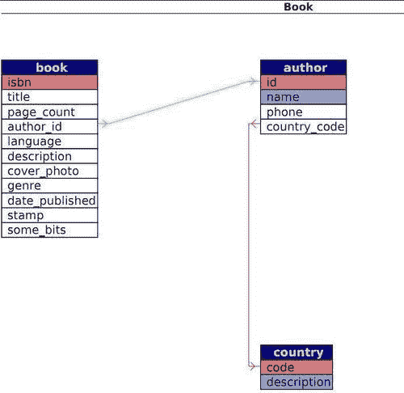

以下屏幕截图提供了从相同的`book`表的 PDF 页面定义生成的另一个示例。这次显示了网格，但没有颜色：

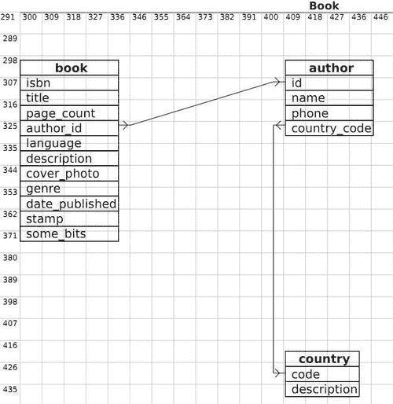

### 更改 PDF 模式中的字体

我们在 PDF 模式中看到的所有文本都是使用特定字体绘制的。phpMyAdmin 使用`DejaVuSans`字体([`dejavu.sourceforge.net`](http://dejavu.sourceforge.net))，该字体涵盖了广泛的字符。

对于实际的 PDF 生成，phpMyAdmin 依赖于`tcpdf`库([`tcpdf.sourceforge.net`](http://tcpdf.sourceforge.net))。该库有两种使用字体的方式——嵌入和非嵌入。嵌入字体会产生更大的 PDF 文件，因为整个字体都包含在 PDF 文件中。这是 phpMyAdmin 选择的默认选项，因为该库不依赖于客户操作系统中特定的`TrueType`字体的存在。

字体位于`phpMyAdmin`主目录下的`libraries/tcpdf/fonts`中。

要使用不同的字体文件，我们必须首先将其添加到库中（工具在原始`tcpdf`工具包中，[`www.fpdf.org`](http://www.fpdf.org)网站上有教程），然后修改 phpMyAdmin 的`libraries/schema/ Pdf_Relation_Schema.class.php`源代码。

## 使用设计者功能布置模式

**设计者**功能（在`数据库`视图中可用）提供了一种更精细的在屏幕上移动表的方式，因为列链接会跟随表的移动。因此，**设计者**保存的表的坐标和模式的坐标之间存在接口。让我们进入**设计者**，并点击小的 PDF 标志。

这将带我们到一个面板，在这里我们可以选择（现有的）模式名称和我们想要执行的操作——在我们的情况下，将**设计者**坐标导出到模式定义中。我们还可以使用**新页面名称**对话框，输入页面名称，然后点击**Go**创建一个空白页面。从这里，我们随后可以导出从**设计者**工作区保存的坐标：

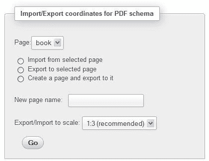

### 注

**设计者**和**编辑或导出关系模式**功能管理的表的跨度存在差异。**设计者**默认情况下操作数据库的每个表，而**编辑或导出关系模式**面板为我们提供了表的选择，使我们能够表示关系的子集，如果有很多表的话。

# 总结

本章介绍了 phpMyAdmin 提供的文档功能，包括数据库或表的打印视图以及完整列列表的数据字典。本章还涵盖了关系模式。特别是，它着重介绍了如何创建、修改和导出模式页面，以及如何使用可视化编辑器（scratchboard）。

下一章将解释如何对数据应用转换，以便在查看时自定义数据格式。
