# 第十六章：使用 MIME 转换数据

在本章中，我们将介绍 phpMyAdmin 的一个强大功能——它能够根据称为转换的特定规则，在表浏览期间转换列的内容。通常，浏览表只显示其中存储的原始数据。然而，基于 MIME 的转换允许改变显示格式。

请注意，这种转换并不像通过`UPDATE`语句进行的永久数据更改那样产生相同的效果。转换后的数据不会被写回到 MySQL 服务器；它只是被发送到浏览器以供显示目的。

# 浏览数据而不进行转换

通常，每行的确切内容都会被显示，只是：

+   **TEXT**和**CHARACTER**列可能会根据`$cfg['LimitChars']`而被截断，取决于我们是否选择查看**完整文本**。

+   **BLOB**和与几何相关的列可能会被替换为诸如**[BLOB - 1.5 KB]**的消息

我们将使用术语**单元格**来指示特定行的特定列。当前显示的包含“未来纪念品”书籍封面照片的单元格（一个**BLOB**列）目前显示为像**‰PNG\r\n\Z\n\0\0\0\rIHDR\0**这样的加密数据，或者显示**BLOB**列的大小的消息。在 phpMyAdmin 中直接看到图片的缩略图（如下面的截图中所示）以及可能的全尺寸图片本身将是很有趣的。通过适当的转换，这将成为可能。


## 切换显示选项

在**浏览**模式下，**选项**链接会显示一个滑块，其中包括一个**隐藏浏览器转换**复选框。我们可以在想要在查看单元格的真实数据和转换后的版本之间切换时使用它。

# 启用转换

我们将**转换**定义为一种机制，通过该机制，与某一列相关的所有单元格在浏览时都会进行转换，使用为该列定义的元数据。只有当前结果页面上可见的单元格会被转换。

这个功能的使用受`config.inc.php`中的`$cfg['BrowseMIME']`指令的控制。该指令的默认值为`TRUE`，表示启用了转换。然而，phpMyAdmin 配置存储必须就位（参见第一章），因为转换所需的元数据在官方 MySQL 表结构中是不可用的。这是专门为 phpMyAdmin 添加的附加功能。

### 注意

转换逻辑本身是通过 PHP 脚本编码的，存储在`libraries/transformations`中，并使用插件架构进行调用。在 phpMyAdmin 官方网站的文档部分（当前位于[`www.phpmyadmin.net/home_page/docs.php)`](http://www.phpmyadmin.net/home_page/docs.php)）中，有一个指向额外信息的链接，供希望了解插件内部结构以编写自己的转换的开发人员参考。

## 配置 MIME 列的设置

如果我们转到`book`表的**结构**页面的`表`视图，并点击**cover_photo**列的**更改**链接，我们会看到三个额外的属性（假设启用了转换功能）：

+   **MIME 类型**

+   **浏览器转换**

+   **转换选项**

如下截图所示：

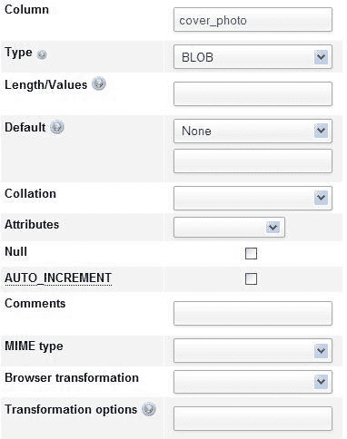

对于特定列，可能只能指定一种类型的转换。在这里，该列是一个**BLOB**。因此，它可以容纳任何类型的数据。为了使 phpMyAdmin 能够正确解释和处理数据，必须通知转换系统数据格式和预期结果。因此，我们必须确保上传的数据始终遵循相同的文件格式。

我们将首先了解这些属性的目的，然后在本章后面的*转换示例*部分尝试一些可能性。

### 选择 MIME 类型

MIME 规范（[`en.wikipedia.org/wiki/MIME`](http://en.wikipedia.org/wiki/MIME)）已被选择为元数据属性，用于对列持有的数据类型进行分类。**多用途互联网邮件扩展（MIME）**，最初设计用于扩展邮件，现在也用于描述其他协议的内容类型。在 phpMyAdmin 的上下文中，当前可能的值是：

+   **image/jpeg**

+   **image/png**

+   **text/plain**

+   **application/octetstream**

**text/plain**类型可用于包含任何类型文本（例如 XHTML 或 XML 文本）的列。在*转换示例*部分，您将看到需要选择哪种 MIME 类型以实现特定效果。

### 浏览器转换

这是我们设置要执行的确切转换的地方。每种 MIME 类型可能支持多个转换。例如，对于**image/jpeg** MIME 类型，我们有两种可用的转换：**image/jpeg: inline**用于图像的可点击缩略图，以及**image/jpeg: link**用于仅显示链接。

以下屏幕截图显示了可用转换的列表：

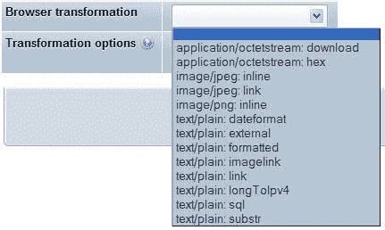

单击**转换选项**旁边的问号图标，然后单击出现的**转换描述**链接，可以获得更完整的转换说明和可能的选项列表。

### 将值分配给转换选项

在*转换示例*部分，我们将看到一些转换接受选项。例如，我们可以指定生成图像的转换的像素宽度和高度。逗号用于在选项列表中分隔值，并且某些选项可能需要用引号括起来。

一些选项具有默认值，我们必须小心遵守选项的文档顺序。例如，如果有两个选项，我们只想为第二个选项指定一个值，我们可以使用空引号作为第一个选项的占位符，让系统使用其默认值。 

## 图像生成的要求

普通缩略图生成需要 Web 服务器上存在一些组件，并且`config.inc.php`中的参数正确配置。

### 配置 GD2 库可用性验证

phpMyAdmin 使用一些内部函数来创建缩略图。这些函数需要 PHP 服务器上存在 GD2 库。

phpMyAdmin 可以检测到正确的 GD2 库的存在，但这种检测需要一些时间。它不是每个会话一次，而是几乎每次在 phpMyAdmin 中执行操作时都会进行。

在`config.inc.php`中将`$cfg['GD2Available']`参数设置为其默认值`'auto'`表示需要检测库的存在和版本。

如果我们知道 GD2 库可用，将`$cfg['GD2Available']`设置为`yes`将使执行更快。如果 GD2 库不可用，建议将此参数设置为`no`。

要找出服务器上有哪个 GD2 库，我们可以转到 phpMyAdmin 的主页，然后单击**显示 PHP 信息**。如果没有此链接，则需要将`$cfg['ShowPhpInfo']`参数设置为`true`。然后查找一个名为**gd**的部分，并验证识别的版本。在下面的屏幕截图中，一切都很好，因为我们可以看到 GD 版本是 2.X，并且支持 JPEG 和 PNG：

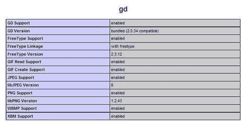

### 确认支持 JPEG 和 PNG 库

如果我们想为这些类型的图像生成缩略图，我们的 Web 服务器中的 PHP 组件需要支持 JPEG 和 PNG 图像。有关更多详细信息，请参阅[`php.net/manual/en/ref.image.php`](http://php.net/manual/en/ref.image.php)。

### 评估内存限制的影响

在一些服务器上，`php.ini`中`memory_limit`的默认值为`8M`，表示 8 MiB。这对于正确的图像处理来说太低了，因为用于生成最终图像的 GD 函数需要工作内存。例如，在一个测试中，需要将`memory_limit`的值设置为`11M`才能从一个 300 KiB 的 JPEG 图像生成缩略图。此外，如果同时查看多行，将需要更多的工作内存。

# 转换示例

我们现在将讨论一些转换示例。显示了典型的选项值，并建议调整它们，直到达到期望的结果。根据 phpMyAdmin 的版本，可能会提供更多的转换。

## 可点击的缩略图（JPEG 或 PNG）

我们将首先将**cover_photo**列的类型从**BLOB**更改为**LONGBLOB**，以确保我们可以上传大小超过 65 KiB 的照片。然后，我们输入以下截图中显示的属性：

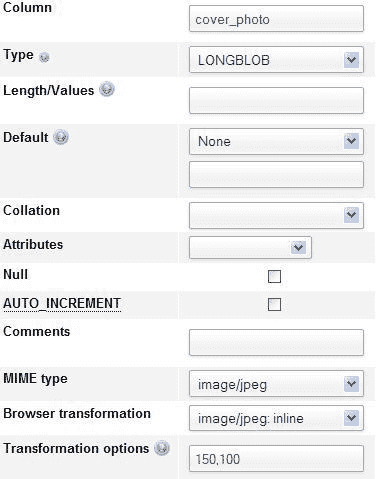

这里，选项以宽度和高度的形式呈现。如果我们省略选项，那么默认值为 100 和 100。缩略图生成代码保留图像的原始宽高比。因此，输入的值是生成图像的最大宽度和高度。然后，我们在一个单元格中上传一个`.jpeg`文件（使用第五章的说明）。结果，我们在该表的**浏览**模式下得到以下屏幕：

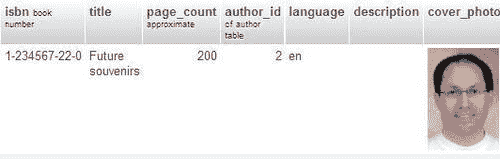

这个缩略图可以点击以显示全尺寸的照片。

### 注意

缩略图不会存储在任何地方，而是每次我们进入这组行的**浏览**模式时生成。在一个双 Xeon 3.2 GHz 服务器上，我们通常每秒可以生成六张 JPEG 图像。phpMyAdmin 不提供这些缩略图的缓存。

对于`.png`文件，我们必须在**MIME 类型**对话框中使用**image/png**，并在**浏览转换**对话框中使用**image/png: inline**。

## 向图像添加链接

为了提供没有缩略图的链接，我们使用**image/jpeg: link**转换。没有转换选项。这个链接可以用来查看照片（通过左键单击链接），然后可能下载它（通过右键单击照片本身）。

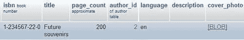

## 日期格式化

在我们的`book`表中有一个名为**date_published**的列；让我们将其类型更改为**DATETIME**。然后，我们将其 MIME 类型设置为**text/plain**，并将浏览器转换设置为**text/plain: dateformat**。下一步是编辑“未来纪念品”书籍的行，并在**date_published**列中输入**2003-01-01 14:56:00**。当我们浏览表时，我们现在看到该列已被格式化。将鼠标悬停在上面会显示未格式化的原始内容，如下截图所示：

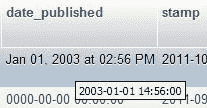

这个转换接受两个选项。第一个是要添加到原始值的小时数（默认为零）。如果我们存储基于**协调世界时（UTC）**的所有时间值，但想要为特定时区（例如 UTC+5）显示它们，添加小时数可能会很有用。第二个选项是我们想要使用的时间格式，使用任何 PHP `strftime`参数指定（更多细节请参阅[`php.net/strftime`](http://php.net/strftime)）。因此，如果我们在**转换选项**中放入**'0'，'Year: %Y'**，我们将得到以下输出：

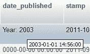

## 文本链接

假设我们在`book`表的**description**列中放入了一个完整的 URL — `http://domain.com/abc.pdf`。在浏览表时，链接的文本将被显示，但我们无法点击它。现在我们将看到在这种情况下使用**text/plain** MIME 类型的用法。

### text/plain: link

如果我们在刚才提到的场景中使用**text/plain** MIME 类型和**text/plain: link**浏览器转换，我们仍然会看到链接的文本，并且可以点击。

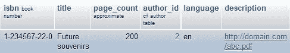

如果我们要指向的所有文档都位于一个共同的 URL 前缀下，我们可以将这个前缀（例如，[`domain.com/`](http://domain.com/)）放在第一个转换选项中，用引号括起来。然后，我们只需要在每个单元格中放入 URL 的最后部分（`abc.pdf`）。

第二个转换选项用于设置标题。这将在**浏览**模式中显示，而不是 URL 内容，但点击后仍会带我们到预期的 URL。

如果我们只使用第二个转换选项，我们必须将第一个选项的值设为引号。可以这样做：`'','this is the title'`。

### text/plain: imagelink

**text/plain: imagelink**转换与前一个类似，只是在单元格中放置一个指向图像的 URL。该图像将被获取并与链接文本一起显示在单元格中。图像可以位于网络上的任何地方，包括我们的本地服务器。

在这里，我们有以下三个选项可用：

+   常见的 URL 前缀（比如`text/plain: link`的前缀）

+   图像的宽度（默认值：100 像素）

+   高度（默认值：50）

对于我们的测试 URL，您应该输入以下选项：

```sql
'','100','123'

```

如果链接的文本太长，转换就不会发生。默认情况下选择**部分文本**显示选项。

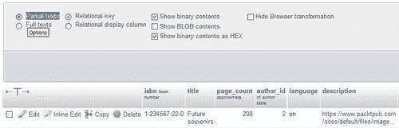

在这种情况下，我们可以切换到**完整文本**以显示完整的链接。然后我们可以看到完整的图片。

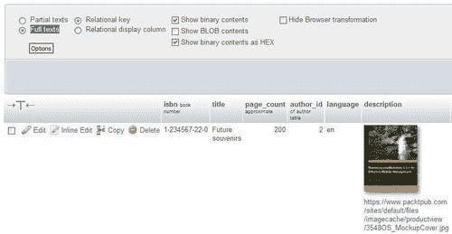

其他转换，如`image/jpeg: inline`和`image/png: inline`，指定了图像的确切 MIME 类型。在这些情况下，phpMyAdmin 使用 GD2 库函数进行缩略图生成。然而，在`text/plain: imagelink`转换中包含的链接可能指向任何浏览器支持的图像类型。因此，phpMyAdmin 只显示一个调整大小的图像，带有 HTML 的`img`标签，并根据转换中定义的大小选项设置`width`和`height`属性。要查看原始图像，我们可以点击链接或缩略图。

## 保留原始格式

通常，当显示文本时，phpMyAdmin 会转义特殊字符。例如，如果我们在一个书籍的**description**列中输入**This book is <b>good</b>**，在浏览表时通常会看到**This book is <b>good</b>**。但是，如果我们对该列使用**text/plain: formatted**转换，那么在浏览时会得到以下输出：


在这个例子中，结果是正确的。但是，列中输入的其他 HTML 标记可能会产生意想不到的结果（包括无效的 HTML 页面）。例如，由于 phpMyAdmin 使用 HTML 表呈现结果，列中的未转义的`</table>`标记会破坏输出。 

## 显示文本的部分

`text/plain: substr`转换用于仅显示文本的一部分。以下是选项：

+   文本的起始位置（默认值：0）

+   有多少个字符（默认值：剩余文本的所有字符）

+   显示截断发生时的后缀；默认情况下显示省略号(...)

请记住，`$cfg['LimitChars']`对于每个非数字列都会进行字符截断。因此，`text/plain: substr`是一种逐列微调的机制。

## 显示下载链接

假设我们想在 MySQL 中为每本书存储一个小的音频评论。我们向`book`表中添加一个新列，名为**audio_contents**，类型为**MEDIUMBLOB**。我们将其**MIME 类型**设置为**application/octetstream**，并选择**application/octetstream: download** 转换。在**转换选项**中，我们插入**'comment.wav'**。

这个 MIME 类型和扩展名将告知我们的浏览器有关传入数据，并且浏览器应该打开适当的播放器。要插入评论，我们首先以`.wav`格式记录它，然后将文件内容上传到其中一个书籍的**audio_contents**列中。在浏览我们的表时，我们可以看到一个名为**comment.wav**的音频评论链接：

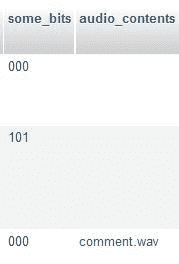

## 十六进制表示

字符以数字数据的形式存储在 MySQL（以及计算机一般），并转换为屏幕或打印机上的有意义的内容。用户有时会从另一个应用程序剪切和粘贴数据到 phpMyAdmin，如果字符不直接受 MySQL 支持，可能会导致意外结果。phpMyAdmin 的帮助论坛中报告了一个案例，涉及在 Microsoft Word 文档中输入特殊引号并粘贴到 phpMyAdmin 中。通过使用`application/octetstream: hex`转换，可以看到确切的十六进制代码。

在以下示例中，此转换将应用于我们`book`表的**title**列。当浏览包含**Future souvenirs**标题的行时，我们可以看到以下屏幕：

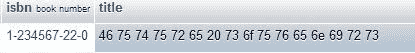

由于我们知道这一列使用的字符集，我们可以将其内容与描述每个字符的图表进行比较。例如，[`en.wikipedia.org/wiki/Latin1`](http://en.wikipedia.org/wiki/Latin1)描述了 Latin1 字符集。

## SQL 漂亮打印

术语**漂亮打印**（[`en.wikipedia.org/wiki/Pretty_printing`](http://en.wikipedia.org/wiki/Pretty_printing)）指的是一种“美化”源代码的方式（在我们的情况下是 SQL 语句）。在 phpMyAdmin 配置存储中，`pma_bookmark.query` 和 `pma_history.sqlquery` 列包含 SQL 语句。通过为这些列定义`text/plain: sql` 转换，当浏览表时，这些 SQL 语句将以带有语法高亮的颜色显示。

## IP 地址

IP（v4）地址可以编码为长整型（例如，通过 PHP 的`iptolong()`函数），并存储到 MySQL 的`UNSIGNED INT`列中。要将其转换回熟悉的点分字符串（例如，`127.0.0.1`），可以使用`text/plain: longToIpv4`转换。

## 通过外部应用程序转换数据

先前描述的转换是直接从 phpMyAdmin 中实现的。然而，一些转换最好通过现有的外部应用程序执行。

`text/plain: external` 转换使我们能够将单元格的数据发送到另一个应用程序，该应用程序将在 Web 服务器上启动，捕获此应用程序的输出，并在单元格位置显示此输出。

### 注意

此功能仅在 Linux 或 UNIX 服务器上受支持（在 Microsoft Windows 下，输出和错误重定向不能轻松地被 PHP 进程捕获）。此外，PHP 不应该运行在安全模式下。因此，该功能可能在托管服务器上不可用。

出于安全原因，无法从 phpMyAdmin 内部设置应用程序的确切路径和名称作为转换选项。应用程序名称直接设置在 phpMyAdmin 脚本中的一个。

首先，在 phpMyAdmin 安装目录中，我们编辑`libraries/transformations/`中的`text_plain__external.inc.php`文件，并找到以下部分：

```sql
$allowed_programs = array();
//$allowed_programs[0] = '/usr/local/bin/tidy';
//$allowed_programs[1] = '/usr/local/bin/validate';

```

默认情况下，没有配置外部应用程序，我们必须明确添加我们自己的应用程序。

### 注意

转换脚本的名称采用以下格式构建——MIME 类型，双下划线，然后是指示应进行哪种转换的部分。

每个允许的程序，以及其完整路径，都必须在此处用从 0 开始的索引号描述。然后我们保存对此脚本的修改，如果需要的话将其放回服务器。其余的设置是从面板完成的，我们在那里选择其他浏览器转换的选项。

当然，我们现在在转换菜单中选择**text/plain: external**。

作为第一个选项，我们放置应用程序编号（例如，0 表示整理应用程序）。第二个选项包含我们需要传递给此应用程序的参数。如果我们希望 phpMyAdmin 对结果应用`htmlspecialchars()`函数，我们将**1**作为第三个参数——这是默认值。我们可以将**0**放在那里，以避免用`htmlspecialchars()`保护输出。

如果我们想避免重新格式化单元格的行，我们将**1**作为第四个参数。这将使用`NOWRAP`修饰符，默认情况下会这样做。

### 外部应用示例：单元格排序

这个例子展示了如何对单个单元格的文本内容进行排序。我们首先修改`text_plain__external.inc.php`脚本，如前一节所述，添加`sort`程序：

```sql
$allowed_programs[0] = '/bin/sort';

```

请注意，我们的新程序带有索引号`0`。

然后，我们向我们的`book`表添加一个名为**keywords**的**TEXT**列。最后，我们填写与 MIME 相关的信息，输入**'0','-r'**作为转换选项，如下截图所示：

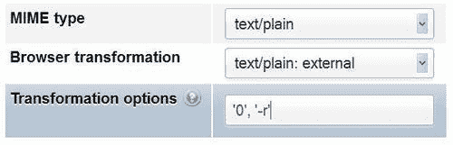

这里的**'0'**是指`sort`的索引号，**'-r'**是`sort`的参数，使程序以相反的顺序排序。

接下来，我们编辑书籍“A hundred years of cinema (volume 1)”的行，以任意顺序输入一些关键词（如下截图所示），然后点击**Go**以保存更改：

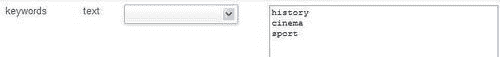

为了测试外部程序的效果，我们浏览表格并查看排序后的单元格关键词：

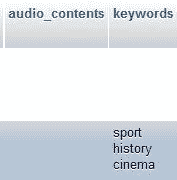

请注意，关键词以相反的排序顺序显示。

# 总结

在本章中，我们学习了如何通过各种方法转换数据来改善浏览体验。特别是，我们看到了如何从`.jpeg`和`.png`的**BLOB**列中显示缩略图和全尺寸图像的概述，如何生成链接，格式化日期，仅显示文本的部分，以及如何执行外部程序来重新格式化单元格内容。

下一章将介绍 phpMyAdmin 对 MySQL 5.0 和 5.1 版本中的新功能的支持。
