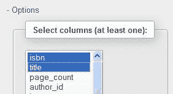
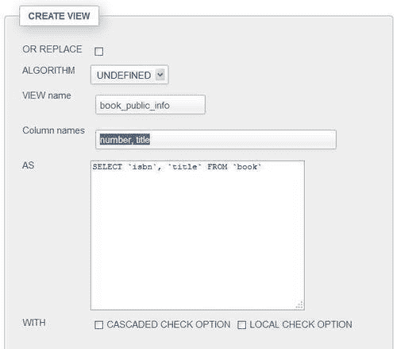
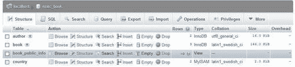
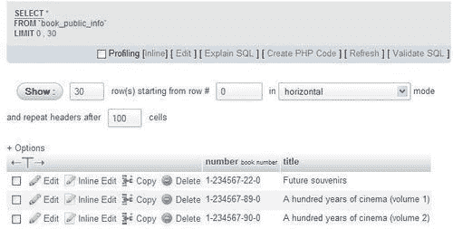
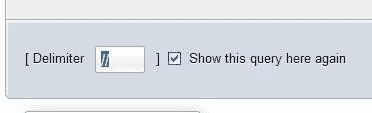
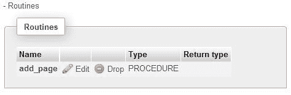
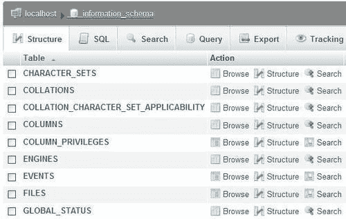
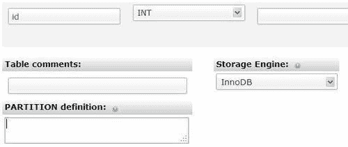
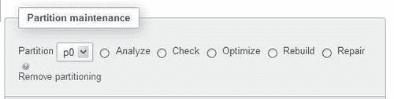
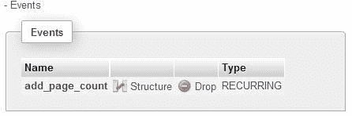

# 第十七章：MySQL 5 中添加的支持功能

MySQL 5.0 引入了许多新功能，平息了许多声称 MySQL 不如竞争对手产品的开发人员和行业观察者的声音。视图、存储过程、触发器、标准的`information_schema`，以及（最近）性能分析机制现在都存在于 MySQL 的范围内。这些功能在本章中进行了介绍。

在 MySQL 5.1 的新功能中，与 Web 界面相关的功能（例如，分区和事件）也受到 phpMyAdmin 的支持，并在本章中进行了介绍。

# 支持视图

MySQL 5.0 引入了对命名和可更新视图的支持（更多详细信息可在[`dev.mysql.com/doc/refman/5.5/en/views.html)`](http://dev.mysql.com/doc/refman/5.5/en/views.html)找到）。视图是一个派生表（将其视为虚拟表），其定义存储在数据库中。对一个或多个表（甚至是视图）执行的`SELECT`语句可以存储为视图，并且也可以进行查询。

视图可以用于：

+   限制列的可见性（例如，不显示薪资信息）

+   限制行的可见性（例如，不显示特定世界地区的数据）

+   隐藏更改后的表结构（以便旧应用程序可以继续工作）

与在许多表上定义繁琐的特定列权限相比，更容易准备一个包含这些表中有限列集的视图。然后我们可以授予整个视图的权限。

在从 5.0 之前的版本升级后，要在服务器上激活对视图的支持，管理员必须执行`mysql_upgrade`程序，如 MySQL 手册中所述（[`dev.mysql.com/doc/refman/5.0/en/upgrading-from-previous-series.html`](http://dev.mysql.com/doc/refman/5.0/en/upgrading-from-previous-series.html)）。

### 注意

每个用户必须具有适当的`SHOW_VIEW`或`CREATE_VIEW`权限才能查看或操作视图。这些权限存在于全局（服务器）、数据库和表级别。

创建视图意味着用户对涉及的表具有权限，或者至少具有`SELECT`或`UPDATE`等权限来操作视图中提到的所有列。

## 从结果创建视图

我们可以利用 phpMyAdmin 的**搜索**（在表级别）或**查询**（在数据库级别）功能来构建一个相当复杂的查询，执行它，然后轻松地从结果中创建一个视图。我们将看到这是如何完成的。

我们提到视图可以用来限制列（实际上也包括表）的可见性。假设一本书的页数是高度机密的信息。我们打开`book`表，点击**搜索**，并选择不包括**page_count**列的列子集（我们可能需要打开**选项**滑块）。



点击**Go**会生成一个结果页面，在**查询结果操作**部分我们会看到一个**CREATE VIEW**链接。我们使用这个链接来访问视图创建面板，其中已经有了**AS**框中的基础查询。我们需要为这个视图选择一个名称（这里我们使用**book_public_info)**，并且我们可以选择为它设置不同的列名（这里我们使用**number, title)**，如下截图所示：



其他选项可能会影响视图的行为，并在 MySQL 手册中有解释（[`dev.mysql.com/doc/refman/5.5/en/create-view.html`](http://dev.mysql.com/doc/refman/5.5/en/create-view.html)）。`LOCAL CHECK OPTION`子句会影响可更新视图的行为（这在前面引用的 MySQL 手册页面中有解释）。

点击**Go**生成我们要求的视图。此时，视图已经创建。如果我们刷新浏览器的页面，然后访问`marc_book`数据库，我们将看到以下截图：



在主面板中，我们看到了新创建的视图的信息。目前视图的行数指示为**~0**（稍后在本章的*控制行计数以提高性能*部分中会详细介绍），**类型**列中显示**视图**。视图没有排序或大小相关联。

## 主面板和视图

由于视图与表相似，它的名称与普通表的名称一样。单击视图名称时，会显示一个类似于表的面板，但是菜单选项比普通表少。事实上，有些操作在视图上是没有意义的，例如**导入**。这是因为视图实际上不包含数据。但是，其他操作，如**浏览**，是完全可以接受的。

让我们浏览以下截图中显示的视图：



我们注意到，在生成的 SQL 查询中，我们没有看到原始的`CREATE VIEW`语句。原因是我们正在使用`SELECT`语句从视图中进行选择，隐藏了我们从视图中提取数据的事实。然而，导出视图的结构将显示 MySQL 如何内部存储我们的视图：

```go
CREATE ALGORITHM=UNDEFINED DEFINER=`root`@`%` SQL SECURITY DEFINER VIEW `book_public_info` AS
select `book`.`isbn` AS `number`,`book`.`title` AS `title` from `book`;

```

主面板的菜单可能看起来类似于表的菜单。但是在必要时，phpMyAdmin 会生成处理视图的适当语法。

### 注意

要对现有视图执行操作，用户需要在视图级别具有适当的权限，但不一定需要在涉及此视图的表上具有任何权限。这是我们可以实现列和表的隐藏。

## 控制行计数以提高性能

phpMyAdmin 有一个配置参数`$cfg['MaxExactCountViews']`，用于控制 phpMyAdmin 的行计数阶段。有时，一个视图包含许多巨大的表，浏览它会导致大量的虚拟行出现。因此，该参数的默认值为 0 确保视图不进行行计数。在这种情况下，当浏览视图时，我们会看到相当奇怪的结果：**显示行 0 - -1（共 0 行，查询耗时 0.0006 秒）**。这比减慢服务器速度更可接受。

尽管如此，如果我们希望看到视图的更准确的行数，我们可以在该参数中放入一个较大的值，该值作为行计数阶段的上限。

# 支持例程-存储过程和函数

phpMyAdmin 在开始支持存储过程和函数之前花了一些时间。原因是这些是作为数据库的一部分保存的代码块（类似于子程序）。作为一个 Web 界面的 phpMyAdmin 更倾向于使用鼠标快速执行的操作。

尽管如此，phpMyAdmin 有一些功能允许开发人员创建这样的例程，保存它们，调用它们进行一些修改，并删除它们。

通过`CALL`语句访问存储过程，我们可以传递参数（更多细节请参阅[`dev.mysql.com/doc/refman/5.5/en/call.html)`](http://dev.mysql.com/doc/refman/5.5/en/call.html)）。另一方面，函数可以从 SQL 语句（例如`SELECT`）中访问，并且类似于其他 MySQL 内部函数，因此返回一个值。

需要`CREATE ROUTINE`和`ALTER ROUTINE`权限才能创建、查看和删除存储过程或函数。需要`EXECUTE`权限来运行例程，尽管该权限通常会自动授予例程的创建者。

## 创建存储过程

我们将创建一个过程，通过添加特定数量的页面来更改特定书籍的页数。该过程的输入参数是书籍的 ISBN 和要添加的页数。我们正在使用 SQL 查询框（参考第十一章)来输入这个过程。

### 更改分隔符

标准的 SQL 分隔符是分号，这个字符将被用来在我们的存储过程中分隔 SQL 语句。然而，`CREATE PROCEDURE`语句本身就是一个 SQL 语句；因此，我们必须想办法告诉 MySQL 解析器这个语句在哪里结束。查询框中有一个**分隔符**输入框，默认包含一个分号。因此，我们将其更改为另一个字符串，按照惯例是双斜杠`"//"`。



### 输入存储过程

然后我们在主查询框中输入存储过程的代码：

```go
CREATE PROCEDURE `add_page`(IN param_isbn VARCHAR(25),
IN param_pages INT, OUT param_message VARCHAR(100))
BEGIN
IF param_pages > 100 THEN
SET param_message = 'the number of pages is too big';
ELSE
UPDATE book SET page_count = page_count + param_pages WHERE
isbn=param_isbn;
SET param_message = 'success';
END IF;
END
//

```

点击**Go**，如果语法正确，我们会收到一个成功消息。如果不正确，那么是时候检查我们的打字能力或调试我们的语法了。不幸的是，MySQL 没有存储过程调试器。

## 测试存储过程

同样，在查询框中，我们通过输入以下语句来测试我们的存储过程。在这里，我们使用了一个 SQL 变量`@message`，它将接收`OUT`参数`param_message`的内容：

```go
call add_page('1-234567-22-0', 4, @message);
SELECT @message;

```

如果一切顺利，我们应该看到**@message**变量包含**success**。

然后我们可以验证这本书的页数是否增加了。我们还需要测试有问题的情况：

```go
call add_page('1-234567-22-0', 101, @message);
SELECT @message;

```

现在可以调用这个存储过程（例如）从您的 PHP 脚本中使用`mysqli`扩展，这是推荐的访问 MySQL 4.1 及以上版本提供的所有功能的扩展。

## 操作存储过程和函数

存储过程存储在数据库中，不与特定表绑定。因此，用于操作存储过程和函数的接口可以在数据库级别找到，在**结构**页面下的**例程**滑块下，如果已经定义了至少一个例程，则会出现该滑块。



第一个图标将这个存储过程的文本带入查询框进行编辑。第二个图标用于删除这个存储过程。在编辑存储过程时，我们注意到文本已经被稍微修改。

```go
DROP PROCEDURE `add_page`//
CREATE DEFINER=`marc`@`%` PROCEDURE `add_page`(IN param_isbn VARCHAR(25), IN param_pages INT, OUT param_message VARCHAR(100))
BEGIN
IF param_pages > 100 THEN
SET param_message = 'the number of pages is too big';
ELSE
UPDATE book SET page_count = page_count + param_pages WHERE
isbn=param_isbn;
SET param_message = 'success';
END IF;
END

```

首先出现一个`DROP PROCEDURE`语句。这是正常的，因为 MySQL 没有提供一个允许更改存储过程主体的语句。因此，我们必须每次想要更改它时删除一个存储过程。`ALTER PROCEDURE`语句确实存在，但它只能改变存储过程的特性，例如添加注释。然后，显示了一个`DEFINER`子句。它是在创建时生成的，指示谁创建了这个存储过程。

在这一点上，我们对代码进行任何需要的更改，并点击**Go**来保存这个存储过程。

### 注意

也许会有诱惑打开**结构**页面上的`book`表，查找操作这个表的存储过程列表，比如我们的`add_page()`存储过程。然而，所有存储过程都存储在数据库级别，代码本身`(UPDATE book)`和存储过程存储的地方之间没有直接的链接。

## 手动创建一个函数

函数类似于存储过程。然而，函数可能只返回一个值，而存储过程可以有多个`OUT`参数。另一方面，从`SELECT`语句中使用存储函数可能更自然，因为它避免了需要一个中间的 SQL 变量来保存`OUT`参数的值。

函数的目标是什么？例如，函数可以用来计算订单的总成本，包括税费和运费。将这个逻辑放在数据库中而不是在应用程序级别有助于记录应用程序-数据库接口。它还避免了在每个需要处理这个逻辑的应用程序中重复业务逻辑。

我们不应该混淆 MySQL 5.0 函数和**UDF**（用户定义函数），它们存在于 MySQL 5.0 之前。UDF 由用 C 或 C++编写的代码组成，编译成共享对象，并通过`CREATE FUNCTION`语句和`SONAME`关键字引用。

phpMyAdmin 对函数的处理在许多方面类似于我们在例程中所涵盖的内容：

+   一个查询框，用于输入函数

+   使用分隔符

+   操作已定义的函数的机制

让我们定义一个函数，根据其代码检索国家名称。我更喜欢在函数定义内清楚地标识参数使用`param_`前缀和局部变量使用`var_`前缀。我们将使用我们信任的 SQL 查询框再次输入函数的代码，并指示该框使用`//`作为分隔符。

```go
CREATE FUNCTION get_country_name(param_country_code CHAR(2))
RETURNS VARCHAR(50)
READS SQL DATA
BEGIN
DECLARE var_country_name VARCHAR(50) DEFAULT 'not found';
SELECT description
FROM country
WHERE code = param_country_code
INTO var_country_name;
RETURN var_country_name;
END
//

```

我们应该注意，我们新创建的函数可以在数据库的**结构**页面上看到，以及它的朋友`add_page`过程：

手动创建函数

## 测试函数

要测试我们刚刚创建的函数，请在查询框中输入以下查询（参见[第十一章]：(ch11.html "第十一章。输入 SQL 语句")）

```go
SELECT CONCAT('ca->', get_country_name('ca'), ', zz->',
get_country_name('zz')) as test;

```

这将产生以下结果：

```go
ca->Canada, zz->not found

```

## 导出存储过程和函数

在导出数据库时，存储过程和函数会出现在 SQL 导出中。这是因为在**导出**页面的**对象创建选项**对话框中默认选择了**添加 CREATE PROCEDURE / FUNCTION / EVENT**复选框（在**自定义**导出模式中可以看到）。以下是与存储过程和函数相关的导出文件部分：

```go
DELIMITER $$
--
-- Procedures
--
CREATE DEFINER=`marc`@`%` PROCEDURE `add_page`(IN param_isbn
VARCHAR(25), IN param_pages INT, OUT param_message VARCHAR(100))
BEGIN
IF param_pages > 100 THEN
SET param_message = 'the number of pages is too big';
ELSE
UPDATE book SET page_count = page_count + param_pages WHERE
isbn=param_isbn;
SET param_message = 'success';
END IF;
END$$
--
-- Functions
--
CREATE DEFINER=`marc`@`%` FUNCTION `get_country_name`
(param_country_code CHAR(2)) RETURNS varchar(50) CHARSET latin1
READS SQL DATA
BEGIN
DECLARE var_country_name VARCHAR(50) DEFAULT 'not found';
SELECT description into var_country_name FROM country WHERE
code = param_country_code;
RETURN var_country_name;
END$$
DELIMITER ;

```

# 执行触发器代码

**触发器**是我们与表关联的代码，当发生某些操作时执行，例如，在`book`表中的新`INSERT`语句之后。操作不需要在 phpMyAdmin 中发生。

与与整个数据库相关的例程不同，每个表的触发器可以从该特定表的**结构**页面访问。

### 注意

在 MySQL 5.1.6 之前，我们需要`SUPER`权限来创建和删除触发器。在 5.1.6 版本中，特权系统中添加了`TRIGGER`表级特权。因此，用户不再需要强大的`SUPER`权限来执行这些任务。

为了执行以下练习，我们将需要在我们的`author`表中添加一个新的`INT`列`total_page_count`。

这里的想法是，每次创建一本书时，它的页数将被添加到该作者的书的总页数中。有些人可能主张最好不要为总数保留单独的列，而是在需要时每次计算总数。实际上，在处理这种情况时必须做出设计决策。我们是否需要非常快速地检索总页数，例如用于网页目的？从具有数千行的生产表中计算此值的响应时间是多少？无论如何，由于我需要它作为一个例子，这里的设计决策很容易做出。

我们不要忘记，在将其添加到表的结构后，`total_page_count`列应该最初用正确的总数进行填充。（但是，这不是我们触发器的目的。）

## 手动创建触发器

当前的 phpMyAdmin 版本没有触发器创建界面。因此，我们在查询框中输入触发器定义时要特别注意在分隔符框中输入`//`： 

```go
CREATE TRIGGER after_book_insert AFTER INSERT ON book
FOR EACH ROW
BEGIN
UPDATE author
SET total_page_count = total_page_count + NEW.page_count
WHERE id = NEW.author_id;
END
//

```

稍后，我们的`book`表的**结构**页面显示了一个新的**触发器**部分，可以像例程一样使用，用于编辑或删除触发器，如下面的屏幕截图所示：

手动创建触发器

## 测试触发器

与测试存储过程或函数相反，触发器中没有`CALL`序列，也没有在`SELECT`语句中执行触发器的函数。每当发生定义的操作（例如书籍`INSERT`）时，代码将执行（在我们的案例中是在插入后）。因此，我们只需插入一本新书，就可以看到`author.total_page_count`列被更新。

当然，完全自动管理此列将涉及在`book`表上创建`AFTER UPDATE`和`AFTER DELETE`触发器。

# 使用 information_schema

在 SQL:2003 标准中，通过称为`information_schema`的结构提供对数据字典（或数据库元数据）的访问。由于这是标准的一部分，并且已经存在于其他数据库系统中，决定将此功能实现到 MySQL 中是一个非常好的决定。

### 注意

MySQL 添加了一些标准之外的信息，例如`INFORMATION_SCHEMA.COLUMNS.COLUMN_TYPE`。请注意，如果您在软件项目中使用此信息，可能无法在其他 SQL 实现中移植。

phpMyAdmin 用户将`information_schema`视为包含视图的普通数据库。这些视图描述了托管在此服务器上的数据库结构的许多方面。以下屏幕截图显示了可以看到的部分内容（实际上，对于此数据库唯一可能的操作是`SELECT`）：



在内部，phpMyAdmin 可以调用`information_schema`，而不是相应的`SHOW`语句来检索元数据。这种行为由`$cfg['Servers'][$i]['DisableIS']`指令控制。当服务器托管数百个数据库或表时，一些涉及`information_schema`上`WHERE`子句的`SELECT`操作非常慢（等待时间长达几分钟），而 MySQL 团队尚未解决这个问题；这就是为什么此指令默认设置为`true`，从而避免使用`information_schema`。

`$cfg['Servers'][$i]['hide_db']`参数可用于隐藏这个对于对 MySQL 水平不够熟悉的用户来说突然出现的数据库。这可能取决于他们在 MySQL 中的专业水平。在 phpMyAdmin 的多用户安装中，我们无法满足每个人对于此参数值的期望。

# 分区

MySQL 5.1 提供了用户定义的分区（参考[`dev.mysql.com/doc/refman/5.1/en/partitioning.html`](http://dev.mysql.com/doc/refman/5.1/en/partitioning.html)）。它允许我们根据需要设置规则，将表的部分分布到文件系统中。在 phpMyAdmin 中使用此功能需要了解其语法，因为有许多分区类型。此外，对于每种分区类型，分区的数量和与每个分区关联的值过于随机，无法在 Web 界面上轻松表示。

## 创建带有分区的表

让我们尝试通过创建名为`test`的表并添加一个**id**列来测试。在连接到 MySQL 5.1 服务器时，如果在表创建面板上，phpMyAdmin 会显示一个**分区定义**对话框，如下屏幕截图所示：



在这里，我们输入一个`PARTITION BY RANGE`子句，它将在**id**列上创建分区：

```go
PARTITION BY RANGE (id) (
PARTITION p0 VALUES LESS THAN (1000),
PARTITION p1 VALUES LESS THAN (2000),
PARTITION p2 VALUES LESS THAN (30000)
);

```

## 维护分区

对于已定义分区的表，**操作**页面显示了一个**分区维护**对话框，我们可以：

+   选择一个分区，然后请求一个操作，比如**重建**

+   移除分区



## 导出分区定义

最后，在 SQL 模式下导出此`test`表会生成带有嵌入式注释的语句，MySQL 5.1 服务器将识别并解释这些语句以重新创建相同的分区：

```go
CREATE TABLE `test` (
`id` int(11) NOT NULL
) ENGINE=MyISAM DEFAULT CHARSET=latin1
/*!50100 PARTITION BY RANGE (id)
(PARTITION p0 VALUES LESS THAN (1000) ENGINE = MyISAM,
PARTITION p1 VALUES LESS THAN (2000) ENGINE = MyISAM,
PARTITION p2 VALUES LESS THAN (3000) ENGINE = MyISAM) */;

```

# 探索事件调度程序

**事件调度程序**([`dev.mysql.com/doc/refman/5.1/en/events.html`](http://dev.mysql.com/doc/refman/5.1/en/events.html))，是 MySQL 5.1 的另一个新功能，允许创建根据时间表自动运行的任务。时间表非常灵活，允许例如，从 2011 年 5 月 18 日午夜开始，每十秒运行一次语句。这些可以是一次性事件或定期事件。

## 激活调度程序

我们应该首先验证调度程序是否在我们的服务器上处于活动状态。如果没有，我们需要激活它。否则，什么也不会发生！我们将首先在查询框中输入以下语句：

```go
SHOW VARIABLES LIKE 'event%';

```

接下来，我们在结果中查找名为`event_scheduler`的变量。如果此变量设置为`OFF`，我们需要要求系统管理员（或具有`SUPER`特权的人）执行以下语句：

```go
SET GLOBAL event_scheduler = ON;

```

## 授予 EVENT 权限

每个想要创建或删除事件的用户都需要`EVENT`权限，可以是全局的，也可以是计划添加事件的数据库上的权限。有关授予此类权限的详细信息，请参阅第十九章。

## 创建事件

当前的 phpMyAdmin 版本没有一个界面，我们可以在其中选择`CREATE EVENT`语句的各个部分。因此，唯一剩下的方法是使用 SQL 查询框来输入语句并理解其语法！在这里，我们将使用一个完全虚构的例子：

```go
CREATE EVENT add_page_count
ON SCHEDULE
EVERY 1 MINUTE
DO
UPDATE author set total_page_count = total_page_count + 1
WHERE id = 1;

```

现在，您可以偶尔浏览`author`表，看到作者 1 的计数器递增，从而获得一些乐趣。

## 操作事件

事件与单个数据库相关，这就是为什么在`marc_book`数据库的**Structure**页面上看到一个**Events**滑块。激活它会显示以下面板：



事实上，这是一个经常发生的事件。我们可以使用第一个图标来编辑事件（这将导致删除和重新创建事件），使用第二个图标来删除事件。

## 导出

可以通过选择**Add CREATE PROCEDURE / FUNCTION / EVENT**选项，在 SQL 数据库导出文件的末尾生成与事件相关的语句。请记住，一些事件可能有过期时间。因此，除非在创建事件时使用了`ON COMPLETION PRESERVE`子句，否则它们可能在您创建它们和尝试导出它们之间消失。

# 总结

MySQL 5.0 的新功能帮助产品符合标准。尽管 phpMyAdmin 对这些功能的支持有限（尤其是缺乏面向语法的编辑器），但它具有一组基本的功能，可用于处理视图、例程、触发器和`information_schema`。phpMyAdmin 还支持 MySQL 5.1 的分区和事件。

下一章介绍了使用跟踪功能，允许通过 phpMyAdmin 记录对 MySQL 数据库所做的更改。
