# 第十八章：跟踪变化

本章将研究如何使用跟踪机制，以记录从 phpMyAdmin 界面进行的结构和数据更改，并获取有关此类更改的报告。

# 了解跟踪系统的目标

每个软件应用程序都有自己的想法，对于其用户来说，跟踪哪些变化是重要的。本节描述了其他应用程序中存在的跟踪系统，并将它们与 phpMyAdmin 提供的系统进行了比较。

## 其他软件应用程序中的跟踪

访问显示信息系统的所有更改的历史数据是许多软件产品中被视为理所当然的功能。任何严肃的文字处理软件的“撤消”功能就是能够回到过去的一个例子，尽管是一步一步的。更复杂的例子是 MediaWiki 的历史功能（维基百科的核心软件）。它使我们能够回到给定页面的任何状态，查看任何两个版本之间的更改，甚至将任何旧版本标记为当前版本。跟踪信息包括作者（或 IP 地址）、更改的日期和时间以及评论。

在 MySQL 本身中，日志系统（`binlog`）记录对数据库所做的所有更改；但是，在这种情况下，目标是双重的：

+   允许主从同步

+   通过`mysqlbinlog`命令行实用程序启用恢复

## phpMyAdmin 中的跟踪

phpMyAdmin 的跟踪系统允许用户指定要跟踪的表，因此可以称为**选择加入系统**。默认情况下，除非开发人员选择这样做，否则不会跟踪任何表；当开发人员为表激活跟踪时，即使由其他人执行，更改也开始记录。只记录通过 phpMyAdmin 进行的更改。

此外，对于给定的表，我们可以指示我们有兴趣跟踪哪些语句。语句列表分为两组：数据定义和数据操作。

假设一个团队正在进行涉及对表结构进行更改的项目。启用跟踪并假设每个开发人员都使用自己的帐户登录到 MySQL，现在我们可以访问历史数据，包括有关哪个开发人员删除了一些关键列的信息！当然，这种跟踪并不是防篡改的；毕竟，它存储在 MySQL 表中，因此此跟踪信息的安全性取决于谁可以访问跟踪表。

# 先决条件

phpMyAdmin 配置存储包含跟踪机制的所有元数据。如果我们之前实现了此存储（例如，对于以前的 phpMyAdmin 版本，如 3.1 或更早版本），我们可以使用当前 phpMyAdmin 版本的`scripts/create_tables.sql`来升级配置存储，以添加缺少的表（在我们的情况下，`pma_tracking`表）。原因是该脚本通过使用`CREATE TABLE IF NOT EXISTS `pma_tracking``语句谨慎地创建此表，从而确保如果表已经存在，则不会创建该表。

### 注意

在 phpMyAdmin 3.3.3 中，`pma_tracking`中的`data_sql`列的类型从`TEXT`更改为`LONGTEXT`，在`create_tables.sql`脚本中。因此，如果我们在 3.3.3 版本之前运行了此脚本，重要的是在我们自己的`pma_tracking`表中手动进行此更改。

## 配置基本跟踪机制

在`config.inc.php`中，对于特定 MySQL 服务器的配置，`$cfg['Servers'][$i]['tracking']`应包含跟踪表的名称；建议的名称是`pma_tracking`，以匹配`scripts/create_tables.sql`中的默认值。

### 注意

如果此指令留空，则在此服务器上无法进行跟踪（我们将看不到**跟踪**菜单）。

默认情况下，跟踪必须针对每个表进行激活。如果我们希望跟踪机制自动开启所有未来的表和视图，可以将`$cfg['Servers'][$i]['tracking_version_auto_create']`设置为`TRUE`。请注意，这仅适用于未来的表和视图——我们仍然需要为现有的表激活跟踪。

使用自动创建的优势在于我们不必考虑它；跟踪是从表的诞生开始的。这种不便之处是我们无法选择要跟踪的语句；这些将从默认列表中获取（请参阅本章后面的“选择要跟踪的语句”部分）。

其他配置指令将在相关部分中讨论。

# 原则

本节定义了跟踪机制的重要原则：版本控制、快照和跟踪信息的归档问题。

## 版本控制

使用版本号是我们熟悉的事情；例如，本书描述了 phpMyAdmin 版本 3.4.x。然而，在这一点上，我们必须确切地理解为什么要使用版本号。

关于软件版本控制的良好参考资料可以在维基百科的[`en.wikipedia.org/wiki/Software_versioning`](http://en.wikipedia.org/wiki/Software_versioning)找到。这篇文章提到可以使用版本名称，但版本号更常见。更重要的是，它指出版本号“对应于软件的新发展”。

如果我们将这个原则应用到数据库开发中，那么当一个表即将发生重大变化时，决定是否为该表创建新版本应该由开发团队做出。触发新版本的变化有多重要是团队内部解释的问题。至少有一个决定是容易做出的：版本 1 始终代表我们首次为特定表启用跟踪的时刻。

在跟踪数据操作语句的情况下，我们还应该注意到变化可能与数据本身有关，而不一定与结构有关。

### 注意

phpMyAdmin 的跟踪系统只使用正整数作为版本号；不可能使用小数点，比如"1.1"。

## 拍摄当前结构的快照

每次创建新版本时，跟踪系统都会拍摄表的当前结构和索引的快照，并在跟踪系统中创建一个新条目。在这个条目中存储了数据库名称、表名称、版本号、创建日期和完整的结构信息。

### 注意

这个跟踪快照不包含表的数据！因此，跟踪系统不能替代备份系统。

在快照被拍摄后，表的整个生命周期中，所有被跟踪的语句都会与这个快照一起存储。因此，表的跟踪版本包括快照以及在拍摄快照后进行的所有更改，直到启动新版本。

## 理解归档问题

当一个表被删除时，它的跟踪信息会被保留，除非我们决定将其删除。这个影响将在后面的“删除跟踪信息”部分中讨论。

# 启动单个表的跟踪

在这一部分，我们将在“表”视图中使用“跟踪”菜单来开始收集`author`表发生的变化。因此，我们打开`author`表，然后点击“跟踪”，会出现以下屏幕：

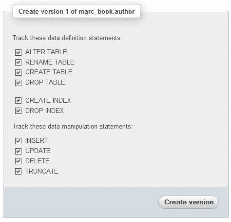

这个面板告诉我们，我们即将创建表的版本 1；这是我们预期的。我们可以选择数据定义和数据操作语句；现在我们将它们全部标记，然后点击“创建版本”按钮。下一部分将解释如何指定要在上面显示的面板中出现的语句。

创建版本 1 后，会显示以下确认面板：

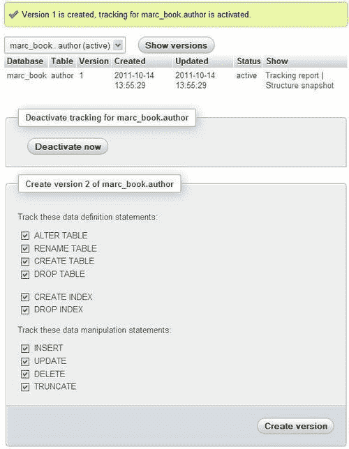

我们注意到发生了两个不同的动作：

+   版本 1 本身的创建

+   为这个表激活跟踪

实际上，一个表可能存在一个或多个版本，每个版本包含从某个时间点开始的快照和自此快照以来的更改；但这与表是否处于跟踪状态并且更改正在记录无关。

在这个面板中，我们看到将在*选择要跟踪的语句*和*停用和启用跟踪*部分中涵盖的子面板。

## 选择要跟踪的语句

`$cfg['Servers'][$i]['tracking_default_statements']`包含一个由逗号分隔的字符串。这些是在我们可以选择要跟踪哪些语句的面板中提供的语句。默认语句列表定义如下；请注意 PHP 中允许字符串连接的点字符的存在：

```sql
$cfg['Servers'][$i]['tracking_default_statements'] =
'CREATE TABLE,ALTER TABLE,DROP TABLE,RENAME TABLE,' .
'CREATE INDEX,DROP INDEX,' .
'INSERT,UPDATE,DELETE,TRUNCATE,REPLACE,' .
'CREATE VIEW,ALTER VIEW,DROP VIEW,' .
'CREATE DATABASE,ALTER DATABASE,DROP DATABASE';

```

# 测试跟踪机制

我们现在准备验证这个跟踪系统是否真的有效！由于系统应该跟踪`ALTER TABLE`语句，我们将进行一个轻微的结构更改，看看会发生什么。我们转到**作者**表的**结构**面板，选择**姓名**列，并将其大小从**30**增加到**40**个字符（详细步骤请参阅第五章）。

我们会收到一条消息，如下截图所示：

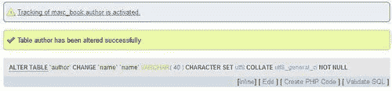

我们将执行另一个动作，这次与数据本身有关——将作者**John Smith**的电话号码更改为**111-2222**。

为了确保这些动作被跟踪系统记录下来，让我们编制一份报告。

## 跟踪报告

回到**跟踪**面板（仍然在**作者**的`表`视图中），我们点击版本 1 的**跟踪报告**，生成如下截图所示的报告：

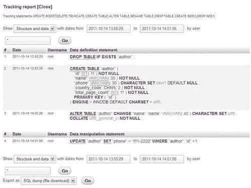

实际上，报告是附加在主要跟踪信息之前的；我们可以点击**关闭**，回到之前的位置。

我们可以看到，在**跟踪报告**标题下，显示了被跟踪的语句列表。然后我们有一个选择器，确定我们是否要在报告中查看与之对应的语句：

+   **结构和数据**

+   **仅结构**

+   **仅数据**

我们还可以指定要生成报告的日期和时间范围。还可以指示我们要报告的用户（星号代表所有用户）。

报告的主要部分包括语句本身；这里我们看到四个语句。第一个语句是一个`DROP TABLE`语句，如果我们需要导出这个版本并将其重新导入，这将有用。第二个语句（`CREATE TABLE`）包含了在初始化版本 1 时拍摄的快照。然后我们看到对应于我们执行的操作的`ALTER TABLE`和`UPDATE`语句。

如何导出结构将在本章后面的*导出版本*部分中介绍。

# 确定跟踪状态

让我们覆盖界面中所有可以确定表的跟踪活动的地方。首先，在`表`视图中，我们可以看到一个消息，位于菜单选项卡下方，说明对于这个表，跟踪已激活，如下截图所示：

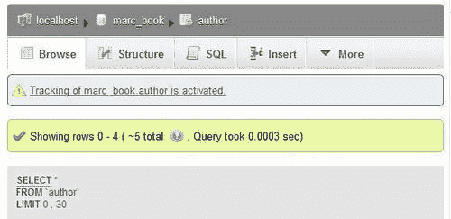

在**跟踪**面板本身，**状态**列告诉我们最新版本的跟踪是**激活**还是**未激活**。实际上，当我们为表创建另一个版本时，我们会发现只有当前版本可以具有激活的跟踪状态，因为以前的版本现在只包含历史数据。

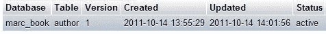

在`数据库`视图中，系统跟踪的每个表（具有活跃或非活跃状态）都显示为一个眼睛图标，颜色或灰色取决于其状态。在下面的示例中，眼睛是彩色的：

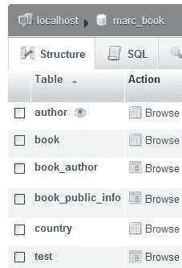

这个眼睛图标是可点击的，可以将我们带到这个特定表的**跟踪**面板。

最后，在`数据库`视图中，**跟踪**菜单为我们提供了所有表的概览。首先呈现被跟踪的表，然后是未被跟踪的表。对于任何一类别，我们都有链接可以查看更多信息或开始跟踪：

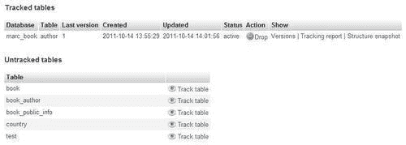

对于被跟踪的表，以下表格提供了所呈现信息的细分，以及可用的链接：

| 标题或链接 | 描述 |
| --- | --- |
| **数据库** | 表位于哪个数据库 |
| **表** | 被跟踪的表 |
| **最新版本** | 最新的被跟踪版本；看到这个表有多少版本存在很有趣 |
| **创建时间** | 此版本创建时间 |
| **更新时间** | 上次为此表存储的跟踪语句是什么时候 |
| **状态** | 活跃或非活跃 |
| **操作** | **删除**链接可用于删除所有跟踪（请参阅本章后面的*删除跟踪信息*部分） |
| **显示** &#124; **版本** | 进入此表的`表`视图，并显示跟踪版本 |
| **显示** &#124; **跟踪报告** | 进入此表的`表`视图，并显示跟踪报告 |
| **显示** &#124; **结构快照** | 进入此表的`表`视图，并显示结构快照（请参阅本章后面的*结构快照*部分） |

对于未被跟踪的表，**跟踪表**链接允许我们直接在**跟踪**面板中进入此表的`表`视图，从而创建版本 1 以开始跟踪机制。

## 停用和激活跟踪

从特定表的**跟踪**页面，**立即停用**按钮（作为切换，变为**立即激活)** 是我们希望停止（暂时或永久）进一步存储跟踪语句的按钮。存储的过去语句将保持不变，与当前版本相关的跟踪数据。

# 结构快照

在`表`视图的**跟踪**面板中，**结构快照**链接显示了在创建此版本时表的过去状态。该面板显示了存储的 SQL 代码以及熟悉的 phpMyAdmin **结构**面板格式的可视化表示。

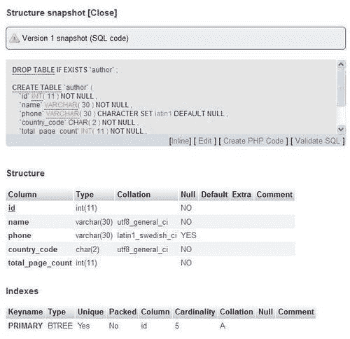

# 导出版本

由于在创建特定版本时存储了完整的 SQL 代码以及自那时起发生的所有跟踪语句，我们可能希望以可执行形式重用它们。在**跟踪报告**面板的底部，有一个**导出为**对话框可用，提供了三种导出变体。如果我们选择**SQL 转储（文件下载）**菜单选项，那么为此版本存储的所有语句将转移到一个文件中，我们可以保存到我们的工作站。对于`author`表，这将产生一个包含以下行的文件：

```sql
# Tracking report for table `author`
# 2011-10-14 14:24:12
DROP TABLE IF EXISTS `author`;
CREATE TABLE `author` (
`id` int(11) NOT NULL,
`name` varchar(30) NOT NULL,
`phone` varchar(30) CHARACTER SET latin1 DEFAULT NULL,
`country_code` char(2) NOT NULL,
`total_page_count` int(11) NOT NULL,
PRIMARY KEY (`id`)
) ENGINE=InnoDB DEFAULT CHARSET=utf8;
ALTER TABLE `author` CHANGE `name` `name` VARCHAR(40) CHARACTER SET utf8 COLLATE utf8_general_ci NOT NULL;
UPDATE `author` SET `phone` = '111-2222' WHERE `author`.`id` = 1;

```

如果我们选择**SQL 转储**选项，语句将显示在屏幕上的文本区域中；从这一点上，我们可以剪切和粘贴 SQL 代码或点击**Go**来运行它。作为预防措施，额外的语句会在代码的顶部生成；这些语句处理了在其中表将被创建的另一个数据库的创建。当然，用户必须有创建此数据库的权限。

最后，**SQL 执行**选项允许直接执行当前数据库中存储的语句。但是，由于这些语句可能反映表的旧状态，因此会发出警告消息；我们可能不想恢复到这个旧状态。此外，默认情况下，第一个语句是`DROP TABLE`，这取决于是否有外键约束阻止删除表。

# 创建一个新版本

如前所述，我们可以决定为某个表标记一个新的里程碑；换句话说，我们可以开始一个新版本。现在我们将创建一个新版本作为练习。

在`author`表的**跟踪**面板中，我们看到了创建**版本 2**的对话框（因为最高的是当前版本 1）：

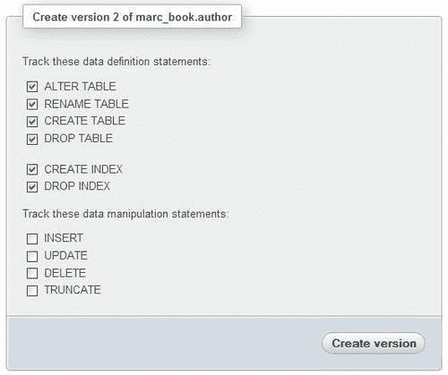

我们注意到每个版本可以跟踪自己的一组语句；在这方面，版本是彼此独立的。在这里，我们决定版本 2 将仅跟踪数据定义语句。现在我们看到了与这些版本的状态相关的一些有趣的东西，如下面的屏幕截图所示：

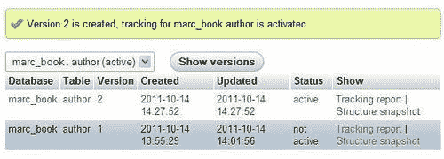

实际上，版本 1 被自动标记为**不活跃**；它进入了某种历史状态。我们还可以查看版本 2 的快照，其中反映了**name**列是**VARCHAR(40)**。

## 快速访问跟踪信息

当我们在一个表的**跟踪**面板中时，一个快捷对话框允许我们直接转到任何其他已跟踪表的**跟踪**面板。

为了探索这个功能，让我们现在创建`book`表的版本 1。完成后，我们检查**显示版本**按钮旁边的下拉列表，如下面的屏幕截图所示：

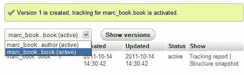

这个列表与查看**跟踪**面板中数据库`marc_book`的**已跟踪表**部分时所看到的类似，但无需返回到此面板。

# 删除跟踪信息

跟踪系统的一个特性可能不明显的是，当相应的表被删除时，表的所有版本以及其整个生命周期的跟踪信息仍然保留。原因是保持历史信息完整，以防我们以后创建具有相同名称的表。

让我们复制`author`表（如果需要，请参阅第九章），并将其命名为`author_copy`。然后我们在这个新表上激活跟踪。最后一个操作是删除`author_copy`表。即使我们在正常的表列表中不再看到它，在数据库`marc_book`的**跟踪**面板中却不同。

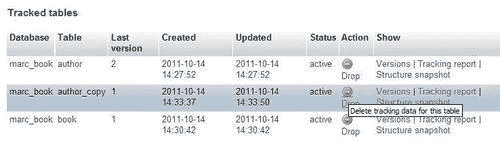

此时，我们可以回到过去，看看已删除表的版本的跟踪报告和快照。如果我们真的想要删除表曾经存在的所有证据，那么我们可以使用**删除**链接来销毁跟踪数据（在随后的确认面板中单击**确定**后）。

# 总结

在本章中，我们概述了语句跟踪功能所带来的好处，然后介绍了用于创建和维护表版本的所有面板。

下一章将涵盖 MySQL 服务器的管理，重点是管理用户帐户和权限。
