# 第十九章。管理 MySQL 服务器

本章讨论了系统管理员如何使用 phpMyAdmin 服务器管理功能进行日常用户帐户维护、服务器验证和服务器保护。还涵盖了非管理员如何从 phpMyAdmin 获取服务器信息的主题。

服务器管理主要通过`服务器`视图完成，可以通过 phpMyAdmin 主页上可用的菜单选项卡访问。

# 管理用户及其权限

**权限**页面（仅在我们以特权用户身份登录时可见）包含了管理 MySQL 用户帐户的对话框。它还包含了管理全局、数据库和表级别权限的对话框。此页面是分层的。在编辑用户的权限时，我们可以看到全局权限以及特定于数据库的权限。然后，在查看用户的特定于数据库的权限时，我们可以查看并编辑该用户在该数据库中的任何表的权限。

## 用户概述

当我们进入**权限**页面时显示的第一页称为**用户概述**。这显示了所有用户帐户及其全局权限的摘要，如下面的屏幕截图所示：

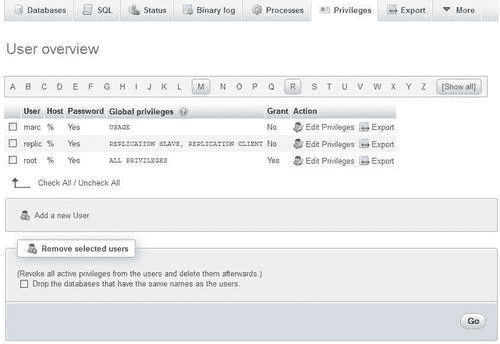

从这个页面，我们可以：

+   通过**编辑权限**链接编辑用户的权限

+   通过用户**导出**链接导出用户的权限定义

+   使用复选框通过**删除所选用户**对话框删除用户

+   访问**添加新用户**对话框可用的页面

显示的用户列表具有以下特征的列：

| 列 | 特征 |
| --- | --- |
| **用户** | 我们正在定义的用户帐户。 |
| **主机** | 此用户帐户将连接到 MySQL 服务器的机器名称或 IP 地址。这里的**%**值表示所有主机。 |
| **密码** | 如果定义了密码，则包含**是**，如果没有定义，则包含**否**。密码本身无法从 phpMyAdmin 的界面或直接查看`mysql.user`表中看到，因为它是使用单向哈希算法加密的。 |
| **全局权限** | 用户的全局权限列表。 |
| **授权** | 如果用户可以将他/她的权限授予他人，则包含**是**。 |
| **操作** | 包含一个链接，用于编辑此用户的权限或导出它们。 |

### 导出权限

这个功能在我们需要在另一个 MySQL 服务器上创建具有相同密码和权限的用户时非常有用。单击**导出**用户**marc**会产生以下面板：

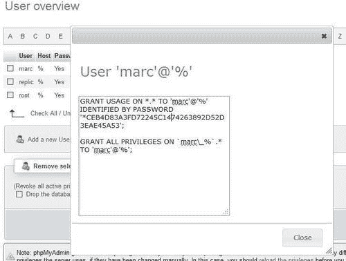

然后只需选择这些**GRANT**语句，并将它们粘贴到另一个已登录到另一个 MySQL 服务器的 phpMyAdmin 窗口的 SQL 框中。

### 权限重新加载

在**用户概述**页面底部显示了以下消息：

```go
Note: phpMyAdmin gets the users' privileges directly from MySQL's privilege tables. The content of these tables may differ from the privileges the server uses, if they have been changed manually. In this case, you should reload the privileges before you continue.

```

在这里，“重新加载权限”文本是可点击的。有效权限（服务器基于其访问决策的权限）是位于服务器内存中的权限。从**用户概述**页面进行的权限修改在内存中和`mysql`数据库中都进行了修改。直接对`mysql`数据库进行的修改不会立即生效。**重新加载权限**操作会从数据库中读取权限，并使其在内存中生效。

## 添加用户

**添加新用户**链接打开了一个用户帐户创建对话框。首先，我们看到的是我们将描述帐户本身的面板，如下面的屏幕截图所示：

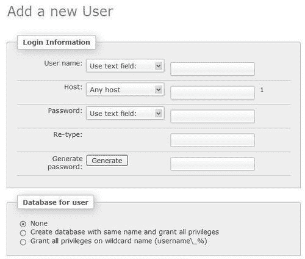

**添加新用户**对话框的第二部分是我们将指定用户的全局权限的地方，这些权限适用于整个服务器（请参阅本章的*分配全局权限*部分），如下面的屏幕截图所示：

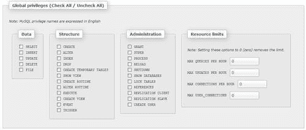

### 输入用户名

**用户名**菜单提供两个选择。我们可以选择**使用文本字段：**并在框中输入用户名，或者我们可以选择**任何用户**来创建匿名用户（空用户）。有关匿名用户的更多详细信息，请参见[`dev.mysql.com/doc/refman/5.5/en/connection-access.html`](http://dev.mysql.com/doc/refman/5.5/en/connection-access.html)。让我们选择**使用文本字段：**并输入**bill**。

### 分配主机值

默认情况下，此菜单设置为**任何主机**，主机值为**%**。**本地**选择意味着`localhost`。**使用主机表**选择（在主机字段中创建空值）意味着在`mysql.host`表中查找特定于数据库的权限。选择**使用文本字段：**允许我们输入我们想要的确切主机值。让我们选择**本地**。

### 设置密码

即使可以创建一个没有密码的用户（选择**无密码**选项），最好还是有一个密码。我们必须输入两次（因为我们看不到输入的内容）以确认预期的密码。安全密码应该有超过八个字符，并且应该包含大写和小写字母，数字和特殊字符的混合。因此，建议使用 phpMyAdmin 生成密码-这在启用 JavaScript 的浏览器中是可能的。在**生成密码**对话框中，点击**生成**按钮会在屏幕上输入一个随机密码（明文），并在**密码**和**重新输入**输入字段中填入生成的密码。在这一点上，我们应该记住密码，以便将其传递给用户。

### 理解数据库创建的权限

一个常见的约定是将用户的权限分配给与该用户同名的数据库。为了实现这一点，**用户数据库**部分提供了**创建具有相同名称并授予所有权限的数据库**单选按钮。选择此复选框会自动化该过程，通过创建数据库（如果尚不存在）并分配相应的权限。请注意，使用此方法，每个用户将被限制为一个数据库（用户`bill`，数据库`bill`）。

另一种可能性是允许用户创建具有与其用户名相同前缀的数据库。因此，另一个选择**授予通配符名称（username\_％）的所有权限**通过分配通配符权限来执行此功能。有了这个设置，用户`bill`可以创建数据库`bill_test, bill_2, bill_payroll`等；在这种情况下，phpMyAdmin 不会预先创建数据库。

### 分配全局权限

全局权限决定用户对所有数据库的访问权限。因此，有时这些被称为**超级用户权限**。普通用户不应该拥有这些权限，除非有充分的理由。此外，如果拥有全局权限的用户帐户受到损害，损害可能会更大。

如果我们真的在创建一个超级用户，我们将选择他或她需要的每个全局权限。这些权限进一步分为**数据，结构**和**管理**组。

在我们的例子中，**bill**将不会拥有任何全局权限。

### 限制使用的资源

我们可以限制此用户在此服务器上使用的资源（例如，每小时的最大查询数）。零表示没有限制。我们不会对**bill**施加任何资源限制。

以下屏幕截图显示了在点击**创建用户**之前创建此用户定义的屏幕状态（其余字段设置为默认值）：

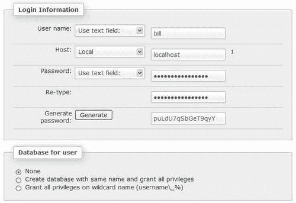

## 编辑用户配置文件

每当我们在**用户概述**页面上为用户点击**编辑权限**时，用于编辑用户配置文件的页面就会出现。让我们尝试为我们新创建的用户**bill**尝试一下。此页面有四个部分，每个部分都有自己的**Go**按钮。因此，每个部分都是独立操作的，并且具有不同的目的。

### 编辑全局权限

编辑用户权限的部分与**添加新用户**对话框看起来一样，并用于查看和更改全局权限。

### 分配特定于数据库的权限

在这个部分，我们定义用户可以访问的数据库，以及他/她在这些数据库上的确切权限。

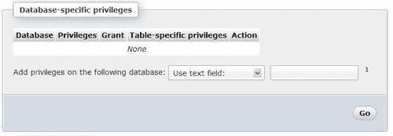

如前面的截图所示，我们看到**None**，因为我们尚未定义任何权限。定义数据库权限有两种方式。首先，我们可以从下拉菜单中选择一个现有的数据库，如下截图所示：

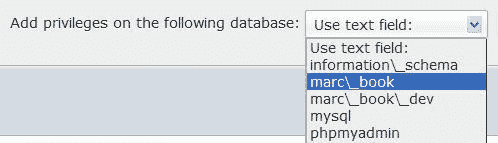

这仅为所选数据库分配权限。其次，我们还可以选择**使用文本字段：**并输入数据库名称。我们可以输入一个不存在的数据库名称，以便用户稍后可以创建它（前提是我们在下一个面板中给予他/她`CREATE`权限）。我们还可以使用特殊字符，如下划线和百分号，作为通配符。

例如，在这里输入**bill**会使他能够创建一个**bill**数据库，输入**bill%**会使他能够创建以**bill**开头的任何名称的数据库。在我们的例子中，我们将输入**bill**并点击**Go**。

下一个屏幕用于设置**bill**在**bill**数据库上的权限，并创建特定于表的权限。

要了解特定权限的含义，我们可以将鼠标悬停在权限名称上（始终为英文），并且会出现关于此权限的解释。我们在这个数据库上给予**bill** **SELECT, INSERT, UPDATE, DELETE, CREATE, ALTER, INDEX**和**DROP**权限，然后点击**Go**。

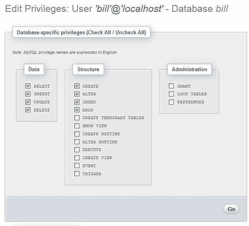

在分配了权限之后，界面仍停留在原地，以便我们可以进一步细化这些权限。目前我们无法分配特定于表的权限，因为数据库尚不存在。

要返回到**bill**的一般权限页面，请点击**'bill'@'localhost'**标题。

这将使我们回到以下熟悉的页面，除了一个部分的变化：

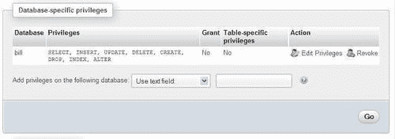

我们看到**bill**在**bill**数据库上的现有权限（我们可以点击**编辑权限**链接进行编辑，或点击**撤销**链接进行撤销），并且我们可以为**bill**在另一个数据库上添加权限。我们还可以看到**bill**在**bill**数据库上没有特定于表的权限。

### 更改密码

**更改密码**对话框是**编辑用户**页面的一部分，我们可以使用它来更改**bill**的密码或删除密码。删除密码将使**bill**可以无密码登录。对话框提供了密码哈希选项的选择，并建议保持默认的**MySQL 4.1+**哈希。有关哈希的更多详细信息，请访问[`dev.mysql.com/doc/refman/5.1/en/password-hashing.html`](http://dev.mysql.com/doc/refman/5.1/en/password-hashing.html)。

### 更改登录信息或复制用户

此对话框可用于更改用户的登录信息，或将其登录信息复制到新用户。例如，假设 Bill 打电话告诉我们，他更喜欢登录名**billy**而不是**bill**。我们只需在用户名后添加一个**y**，然后选择**从用户表中删除旧的**单选按钮，如下截图所示：

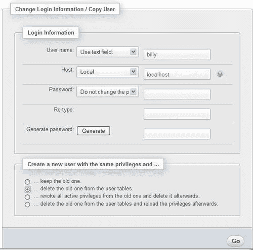

点击**Go, bill**后，`mysql`数据库中将不再存在**bill**。此外，他的所有权限，包括对**bill**数据库的权限，都将被转移到新用户**billy**。但是，**bill**的用户定义仍将存在于内存中，因此仍然有效。如果我们选择了**从用户表中删除旧用户并重新加载权限**选项，**bill**的用户定义将立即失效。

或者，我们可以基于**bill**创建另一个用户，通过使用**保留旧用户**选项。我们可以通过选择**不更改密码**选项将密码转移到新用户，或者通过两次输入新密码来更改密码。**撤销所有活动权限…**选项立即终止了该用户的当前有效权限，即使他或她当前已登录。

## 删除用户

从**权限**页面的**用户概述**部分删除用户。我们选择要删除的用户。然后（在**删除选定的用户**中）我们可以选择**删除与要删除的用户同名的数据库**选项，以删除以这些用户命名的任何数据库。点击**Go**有效地删除了选定的用户。

# 数据库信息

**数据库**页面旨在创建新数据库，并快速获取每个数据库的权限信息。还可以用来获取这些数据库的全局统计信息，而无需在导航面板中单击每个数据库。当我们进入**数据库**页面时，我们会看到现有数据库的列表：

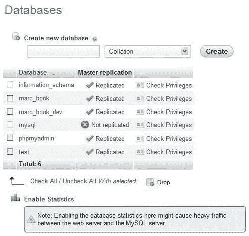

我们还看到一个**启用统计信息**链接。默认情况下，统计信息是未启用的，因为计算所有数据库中所有表的数据和索引大小可能会消耗宝贵的 MySQL 服务器资源。

## 启用统计信息

如果我们点击**启用统计信息**链接，会出现一个修改后的页面。对于每个数据库，我们可以得到该数据库中表的默认排序规则，以及该数据库中表的数量和所有表的总行数。接下来是有关表数据部分使用的空间的信息，然后是所有索引占用的空间，以及所有表的总空间。接下来，在**开销**列标题下呈现了通过优化该数据库中的一些表可以回收的空间。最后，我们可以看到复制信息，然后是**检查权限**链接：

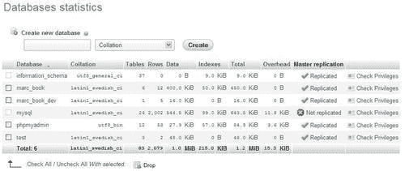

## 排序统计信息

默认情况下，统计信息列表按数据库名称按升序排序。如果我们需要找到具有最多表的数据库或占用最多空间的数据库，只需简单点击**表**或**总计**列标题，列表将相应地排序。第二次点击将反转排序顺序。

## 检查数据库权限

点击**检查权限**图标或链接会显示特定数据库上的所有权限。用户的全局权限可能会显示在这里，因为它也允许他或她访问这个数据库。我们还可以看到特定于这个数据库的权限。**编辑权限**链接会带我们到另一个页面，用于编辑用户的权限。

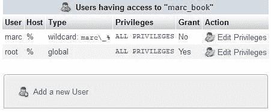

我们注意到这个面板还包含**添加新用户**链接。点击这个链接是创建一个具有对我们当前正在检查的数据库的权限的用户的便捷方式。事实上，在从这个链接进入用户创建面板后，数据库创建或授予权限对话框中显示并默认选择了第四个选项，如下截图所示：

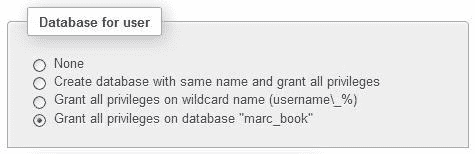

## 删除选定的数据库

要删除一个或多个数据库，我们转到`服务器`视图，单击**数据库**菜单选项；在要删除的数据库名称旁边打勾；然后单击**所选项下的删除**链接。然后我们会得到一个确认屏幕。两个数据库（`mysql`和虚拟的`information_schema`）不能被选择；第一个是为了避免犯大错并删除所有我们的账户，第二个不能被选择，因为这不是一个真正的数据库。

### 注意

这是一个不应轻率对待的操作，可能明智的是首先将整个数据库导出备份。

# 服务器信息

管理员和普通用户都可以从监控服务器并获取有关其一般配置和行为的信息中受益。**状态，变量**和**进程**菜单选项可用于获取有关 MySQL 服务器的信息，或者对特定进程进行操作。

## 验证服务器状态

服务器状态统计反映了 MySQL 服务器的总活动，包括（但不限于）从 phpMyAdmin 发送的查询生成的活动。

单击**状态**菜单选项会生成有关服务器的运行时信息。页面有几个部分。首先，我们获取有关已运行时间和启动时间的信息。然后，我们获取流量和连接的总值和平均值（其中**ø**表示平均值），如下面的屏幕截图所示：

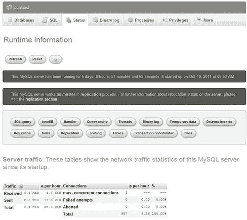

接下来，显示有关查询的统计信息（在屏幕截图中部分显示）。每小时、每分钟和每秒的平均查询次数很好地指示了服务器的负载。

查询统计后是有关执行的每个 MySQL 语句的统计信息，包括：

+   每个语句执行的绝对次数

+   执行的小时平均值

+   与所有语句相比，该语句的执行百分比

演示顺序按利用率降序排列；在下面的屏幕截图中，我们看到**set option**语句是此服务器上最常接收的语句，占**37.40%**：

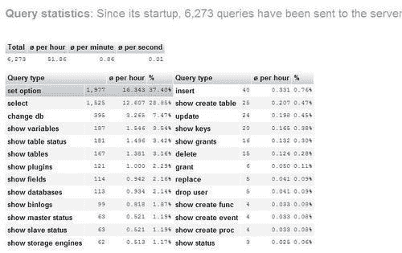

在**查询统计**之后，单击**显示查询图表**链接会生成一个显示此服务器上流行查询类型的图表，如下面的屏幕截图所示：

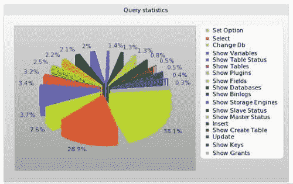

根据 MySQL 版本，还会显示许多其他包含服务器信息的部分。

## 服务器变量

**变量**页面显示了 MySQL 服务器的各种设置，这些设置可以在`my.cnf` MySQL 配置文件中定义。这些值无法在 phpMyAdmin 内更改。

## 服务器进程

**进程**页面可供超级用户和普通用户使用。普通用户只能看到属于他们自己的进程，而超级用户可以看到所有进程。

此页面列出了服务器上的所有活动进程。有一个**终止**链接，允许我们终止特定进程，如下面的屏幕截图所示：

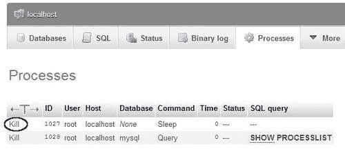

此示例仅有两个正在运行的进程，包括由`SHOW PROCESSLIST`命令本身创建的进程。此进程无法终止，因为当我们看到页面时，它已经不再运行。在繁忙的服务器上，我们会看到更多正在运行的进程。

## 存储引擎

有关各种存储引擎的信息以两级格式提供。首先，**引擎**选项卡显示了当前 MySQL 版本的可能引擎的概述。在此服务器上启用的引擎的名称是可点击的。

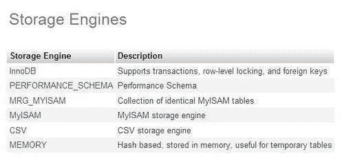

其次，单击一个引擎名称会显示有关其设置的详细面板。将鼠标悬停在上标数字上会显示有关特定设置的更多信息。

## 可用字符集和校对规则

主页上的“字符集”菜单选项卡打开了“服务器”视图的“字符集”页面，其中列出了 MySQL 服务器支持的字符集和校对规则。每个字符集的默认校对规则显示为不同的背景颜色（使用在$cfg['BrowseMarkerColor']中定义的行标记颜色）。

## 检查二进制日志

如果我们的服务器上激活了 MySQL 的二进制日志记录，那么“服务器”视图中的菜单会发生变化，出现一个“二进制日志”选项卡。该选项卡通过`SHOW BINLOG EVENTS`命令提供了访问接口。该命令生成了更新了我们服务器上数据的 SQL 语句列表。这个列表可能非常庞大，目前 phpMyAdmin 没有使用分页技术限制其显示。因此，我们可能会达到浏览器的内存限制，这取决于我们使用的特定浏览器。

在下面的截图中，我们选择要检查的二进制日志（除非服务器只有一个二进制日志），然后显示语句：

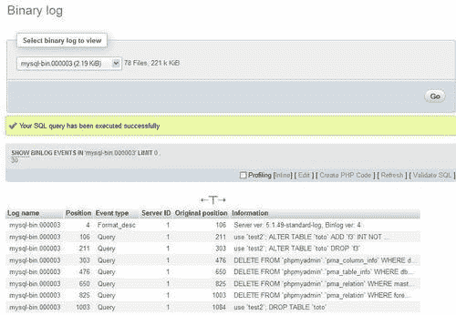

# 总结

本章介绍了系统管理员可以使用的各种功能，如用户帐户管理、权限管理、数据库权限检查和服务器状态验证。适当的了解 MySQL 权限系统对于充分维护 MySQL 服务器至关重要，本章提出了围绕用户及其权限概念的练习。

附录，故障排除和支持，描述了在哪里获取支持以使 phpMyAdmin 高效运行。
