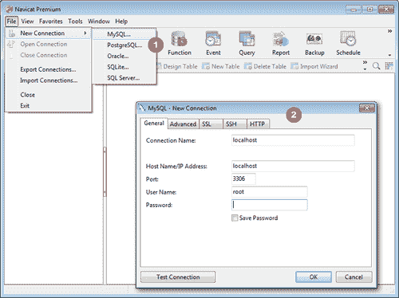
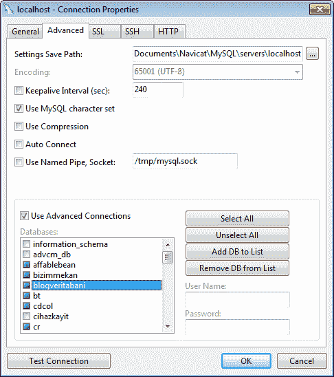

# 第一章。入门

本章旨在介绍带有**图形用户界面**（**GUI**）的 Navicat 数据库管理工具，并描述如何设置不同类型的连接和基本设置到高级配置，例如 SSH，到已安装的 MySQL 服务器。在本章中，您将学习以下内容：

+   Navicat 的不同版本，适合什么人和什么用途

+   建立到 MySQL 服务器的基本连接

+   设置高级连接，例如 SSH 或 HTTP 隧道

# 进入 Navicat

**Navicat**不仅是一个功能强大、复杂且易于使用的带有图形用户界面的数据库管理工具，也是开发人员在处理基于数据库的应用程序时非常有用的助手。它适用于 Windows、Mac 和 Linux。

**Navicat** **for** **MySQL**是 Navicat 家族的第一个成员，具有高级功能，允许您在 GUI 中导入/导出数据，备份或将整个数据库转移到另一个服务器，并设计查询，具有点对点和拖放功能。

**Navicat** **Premium**是家族的终极成员，是一款全能的数据库管理和迁移工具，结合了所有 Navicat 版本，使用户能够在单个应用程序中同时连接到 MySQL、SQL Server、SQLite、Oracle 和 PostgreSQL 数据库，大大简化了多个品牌数据库的数据库管理。

虽然 MySQL 之外的其他数据库不在本书的范围之内，但您可能想查看 Packt 的其他标题，例如 Oracle 数据库（[www.packtpub.com/books/oracle-database](http://www.packtpub.com/books/oracle-database)）和 Microsoft SQL Server（[www.packtpub.com/books/microsoft-sql-server](http://www.packtpub.com/books/microsoft-sql-server)）。

Navicat 不是免费产品，但您可以从创建该产品并将其推向市场的公司 PremiumSoft 的网站上轻松获取 30 天的评估。

在整本书中，示例将使用 Navicat Premium 版本 10.0.9 进行演示，尽管您可以使用 Navicat for MySQL 10.0.9 来跟随每个示例和练习。即使您使用的 Navicat 版本旧至 v.8.0，您也应该能够跟上大多数示例。

要下载 Navicat，您可以转到[www.navicat.com/download/download.html](http://www.navicat.com/download/download.html)并获取 Navicat for MySQL 或 Navicat Premium。在撰写本文时，最新版本是 10.0.9。

# 建立到数据库的连接

在这一点上，我假设您已经安装、设置和运行了您的 MySQL 服务器以及 Navicat，这样我们就可以立即开始使用 Navicat 了。

要在 Windows 7 及更早版本中启动 Navicat，转到**开始菜单** | **所有程序** | **PremiumSoft**，然后单击您在 PC 上安装的 Navicat 版本。

如果您使用的是 Mac，Navicat 应该简单地位于您的`应用程序`文件夹中，除非您从安装程序窗口中拖放到其他位置。

要定义一个新连接，转到**文件**菜单或**连接**按钮，这是 Navicat 主工具栏（或我们可能称之为功能区）中的第一个图标，并选择**文件** | **新连接** | **MySQL**以打开名为**MySQL - 新连接**的连接配置窗口，在那里我们可以指定要建立的连接的设置。

您可以参考以下截图：

正如您在截图的第二部分中所看到的，**MySQL - 新连接**窗口是您可以指定设置以定义连接的地方。它有五个选项卡；第一个选项卡是您设置基本连接属性的地方，在大多数情况下是足够的，如下所示：

+   **连接名称**：完全由您决定，因此您可以输入任何名称来描述您的连接。

+   **主机名/IP 地址**：这是非常直观的，您可以输入数据库服务器的域名或其 IP 地址。

+   **端口**：此字段包括 MySQL 服务器的 TCP/IP 端口号，在大多数情况下是`3306`。

+   **用户名**：此字段包括数据库用户名（我选择`root`，这是我新安装的本地服务器的默认管理员用户）。

+   **密码**：此字段包括上述输入用户名的密码。在新的 MySQL 安装中，`root`的密码为空，所以如果这是您第一次连接到刚刚安装的数据库服务器，您可能希望在此时将其留空，因为我将在本章末尾指导您如何修改所有这些设置。

如果您要连接到远程 MySQL 服务器，必须确保为您将要使用的用户名授予了远程访问权限。在某些情况下，MySQL 服务提供商不直接提供远程访问服务器的情况下，通过**安全** **Shell**（**SSH**）或 HTTP 隧道进行连接可能是一种替代解决方案。我们将在以下各节中分别看到如何设置这些类型的连接。

## 通过安全外壳（SSH）进行连接

SSH 是一个命令行工具，用于以安全的方式通过网络登录到服务器或另一台计算机上，在远程机器上运行命令或传输数据。为了增强安全性，SSH 提供了强大的身份验证机制，可以使用密码或公钥/私钥对，也简称为公钥。

为了通过 SSH 设置与 MySQL 服务器的连接，首先输入前一节中描述的基本连接设置，然后转到连接设置窗口中的**SSH**选项卡，单击标记为**使用 SSH 隧道**的复选框，然后输入以下信息：

+   **主机名/IP 地址**：此字段包括 SSH 服务器的地址或 IP。

+   **端口**：此字段包括 SSH 服务器的端口号（默认为`22`）。

+   **用户名**：此字段包括 SSH 服务器的用户，通常是 UNIX 机器的用户，而不是数据库的用户名。

+   **认证方法**：此字段允许您在**密码**认证和**公钥**认证之间进行选择，视情况而定。

+   **密码**（如果适用）：此字段包括 SSH 用户的密码（而不是数据库）。

+   **私钥**（如果适用）：如果选择**公钥**认证，此字段将出现，您需要通过单击其后面的小矩形按钮指定私钥文件的路径。

+   **口令短语**（如果适用）：在**公钥**认证的情况下，此字段也会出现，并与**私钥**一起使用。它基本上就像一个密码，但是适用于您的密钥而不是账户。

## 通过 HTTP 隧道进行连接

在某些情况下，通过任何协议连接到服务器是不可能的，但 HTTP 却可以，特别是当一方位于防火墙后时。例如，一些公司希望限制其用户的互联网访问，以便他们只能浏览网页，而不能进行其他操作；没有 FTP，没有即时通讯等。这就是 HTTP 隧道的用武之地。它允许您通过端口`80`（HTTP 默认端口）而不是`3306`或任何其他端口连接到服务器（在本例中是 MySQL）。

要设置 HTTP 连接，请按照以下步骤进行：

1.  将随 Navicat 安装程序一起提供的 HTTP 隧道脚本上传到 MySQL 服务器所在的 Web 服务器上。这个文件叫做`ntunnel_mysql.php`。

1.  转到 Navicat 的**MySQL - 新连接**窗口中名为**HTTP**的选项卡。

1.  启用复选框**使用 HTTP 隧道**。

1.  输入您上传隧道脚本的 URL（例如，[`www.ozar.net/mysql/ntunnel_mysql.php`](http://www.ozar.net/mysql/ntunnel_mysql.php)）。

1.  如果您知道上传脚本的 Web 服务器已安装了 ModSecurity，则可以选中**使用 base64 对传出查询进行编码**选项。

1.  如果隧道脚本位于受密码保护的服务器上，或者您的互联网连接经过代理，您可以在**身份验证**或**代理**选项卡下提供所需的身份验证详细信息。

### 注意

请注意，HTTP 隧道选项卡和 SSH 隧道选项卡不能同时使用。您需要选择其中一个。

# 设置安全套接字层（SSL）

**安全套接字层**（**SSL**）是一种安全协议，用于在服务器和其客户端之间建立加密链接，确保两方之间所有数据传输的隐私和完整性。

要在 Navicat 中使用 SSL，您需要拥有 SSL 证书；您可以从[www.openssl.org](http://www.openssl.org)获取一个免费的解决方案，如 OpenSSL，并在本地服务器上安装它，并为 SSL 配置您的 MySQL 服务器，并为其设置服务器端证书。最后，您可以设置客户端证书，然后可以从 SSL 服务器获取。有关如何为 MySQL 安装和设置 OpenSSL 以及 Navicat 证书的完整说明在 Navicat 手册中有详细解释。

## 高级设置

Navicat 提供了一个选项，用于设置高级数据库属性，您可以通过单击**MySQL - 新连接**窗口中的**高级**选项卡来控制。

第一个标记为“设置保存路径”的字段允许您将设置保存在您指定的本地驱动器位置。您可以调整一些其他设置，比如覆盖字符编码，对数据库服务器的 ping 间隔，自动连接，使用套接字文件，即`mysql.sock`等等。

这里最有用的功能是能够在 Navicat 主窗口的左窗格上隐藏和显示某些数据库，其中列出了所有连接配置文件和属于它们的数据库的树形视图。只要您勾选**使用高级连接**复选框，此功能就会激活。

名为**数据库**的列表框变为活动状态，并且列表中的每个项目旁边都有一个略小的复选框。您突出显示复选框的数据库将是下次打开连接时出现的数据库。您还可以为每个数据库单独指定用户名和密码。如果您对给定数据库具有不同权限的多个帐户，则这一点尤其有用。

您还可以使用右侧的按钮添加或删除列表中的项目。

### 测试和保存您的设置

现在我们已经完成了配置连接，我们只需要测试连接并单击**确定**。您可以随时通过右键单击左窗格上列出的连接配置文件的名称并选择**连接属性...**来修改这些设置，以重新打开我们的连接配置窗口。

# 总结

在本章中，我们通过学习如何在 Navicat 中建立到 MySQL 服务器的连接，为本书的其余部分奠定了基础，从使用简单的习惯参数到安全配置，如 SSH 或 HTTP 隧道，以克服有限的互联网访问情况。

在下一章中，我们将开始处理数据库，并逐步指导您处理数据库对象，如表，视图，函数，过程，并使用 Navicat 的复杂但易于使用和令人上瘾的工具设计查询。乐趣才刚刚开始。
