# 第二章：与数据库一起工作

在上一章中，我们看到了如何从 Navicat 连接到 MySQL 服务器的不同类型的连接。现在我们准备好连接到服务器，是时候开始处理数据库了。在本章中，您将学习如何：

+   从头开始创建数据库

+   使用 Navicat 的可视化设计工具创建表和视图

+   创建外键约束和触发器

+   定义存储过程和函数

+   创建计划事件

+   处理数据库查询

# 使用 Navicat 管理数据库对象

我们所说的数据库对象是什么意思？基本上，表、视图、函数和事件是我们所说的对象。对于每个对象，在 Navicat 的主窗口中都有一个工具栏图标，它们也出现在导航窗格左侧的树视图列表中。可以通过取消选中**工具** | **选项**中的**在连接树中显示对象**选项来隐藏对象层次结构，但这对于新手用户来说可能是微不足道的。

Navicat 主窗口的工具栏上有大按钮和图标，用于处理数据库对象。例如，单击工具栏上的**表**按钮相当于在导航窗格中的**连接**下选择**表**。在工具栏下方的主窗口右侧剩余的较大部分称为对象窗格，用于显示所选类型的对象。以下屏幕截图显示了**表**的对象：

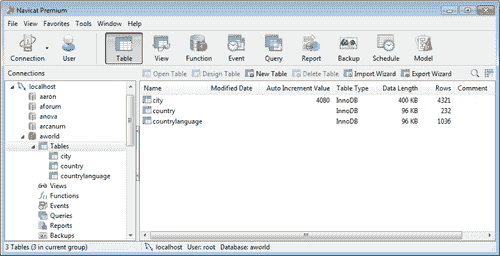

# 从头开始创建数据库

Navicat 使得从头开始创建数据库和对象（如表和视图）变得非常容易。由于我们在上一章中已经连接到了 MySQL 服务器，现在是时候开始使用我们自己的空白数据库了。以下步骤描述了如何从头开始创建数据库：

1.  双击**localhost**（或者您命名的服务器）在**连接**窗格中以连接。

1.  然后右键单击服务器名称，并从弹出的上下文菜单中选择**新建数据库...**。

1.  在打开的新较小窗口中，将**数据库名称**输入为`our_first_db`，将**字符集**指定为**utf8--UTF-8 Unicode**，将**校对**指定为**utf8_unicode_ci**。

1.  最后点击**确定**。

现在**our_first_db**应该出现在**localhost**下的其他数据库中。通过右键单击它，您可以查看可以在我们的新空白数据库上执行的操作，例如打开它，查看和编辑其属性，如**字符集**，**校对**和删除它。在同一弹出菜单中还有一个名为**数据传输...**的项目，我认为这是 Navicat 最强大的功能之一。它允许您直接在另一个数据库之间传输数据，我们将在第三章 *使用 Navicat 进行数据管理*中介绍。

### 注意

由于 MySQL 5.x 的限制，无法通过 GUI 工具重命名数据库。这样做的最佳方法是将数据库转储到 SQL 文件中，创建一个具有所需名称的新数据库，并执行转储文件以填充其内容。您还可以在第三章 *使用 Navicat 进行数据管理*中找到此类任务的详细信息。

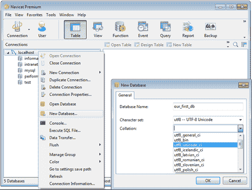

## 创建表

现在让我们按照以下步骤为**our_first_db**创建一些表：

1.  通过双击其名称，从导航窗格中选择并打开数据库。

1.  然后要么单击工具栏上的**新建表**按钮，要么右键单击**our_first_db**下的**表**。 

1.  最后，从弹出菜单中选择**新建表**。

Navicat 的表设计窗口将出现。这里的控件非常直观。我们将为一个简单的员工数据库创建一个部门表，我们需要三个字段：`id`（**int**）、`name`（**varchar**）和`manager_id`（**int**）。要创建这些字段，请按照以下步骤进行：

1.  创建第一个名为`id`的字段，选择**类型**为**int**，将**长度**列留空，因为它将自动设置为`11`，取消**允许空值**，通过单击带有黄色钥匙图标的小按钮或单击**允许空值**复选框旁边的空单元格，将其设置为**主键**，最后在底部勾选**自动递增**选项。

1.  添加新字段就像单击工具栏上的**添加字段**按钮一样简单，或者在最近创建的字段的最后一个单元格中按下*Tab*键。

1.  接下来，我们将创建一个名为`name`的字段，选择**类型**为**varchar**，长度为`31`个字符，再次取消**允许空值**复选框。

1.  最后，选择**类型**为**int**，将**长度**列留空，因为它将自动设置为`11`，我们还希望为此字段保留**允许空值**的选中状态。

1.  现在，通过单击工具栏上的**保存**或**另存为**按钮之一，将此表保存为`department`。Navicat 还会在我们试图关闭窗口而没有保存时提示我们保存进度。参考以下截图：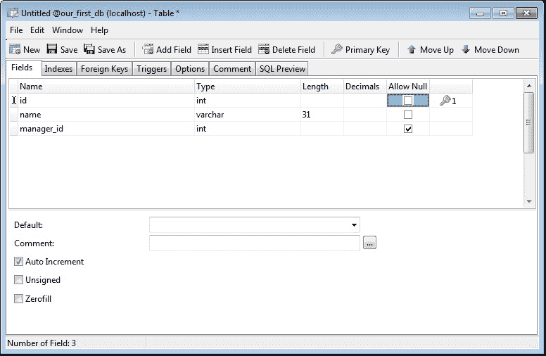

### 注意

可以通过单击现有字段并单击工具栏上的**插入字段**按钮在先前创建的字段之间插入新创建的字段。我们还可以通过选择字段并使用工具栏上的**上移**和**下移**按钮来更改字段的顺序。

现在，我们将重复之前的步骤来创建员工表，但这次使用以下规格定义字段。在下表中，false 表示取消选中，true 表示选中：

| **名称** | **类型** | **长度** | **小数** | **允许空值** | **主键** |
| --- | --- | --- | --- | --- | --- |
| `id` | **int** |   |   | false | X (自动递增) |
| `first_name` | **varchar** | `50` |   | true |   |
| `last_name` | **varchar** | `40` |   | false |   |
| `email` | **varchar** | `60` |   | true |   |
| `title` | **varchar** | `35` |   | true |   |
| `salary` | **decimal** | `10` | `2` | true |   |
| `perks` | **int** |   |   | false |   |
| `department_id` | **int** |   |   | true |   |
| `manager_id` | **int** |   |   | true |   |

接下来，我们需要通过定义一些外键约束来在两个表之间建立一些关系。

## 定义外键

首先，我建议保存表并将其命名为`employee`（如果您在那之后关闭了表设计师，请右键单击表的名称，然后从弹出菜单中选择**设计表**）。回到表设计师后，执行以下步骤：

1.  切换到**外键**选项卡。

1.  在第一行的第一个字段中输入`fk_employee_4_department`作为外键的名称。

1.  在第二列中选择**字段**为**department_id**。

1.  在第三列中选择**our_first_db**作为**参考数据库**。

1.  在第四列中选择**department**表作为**参考表**。

1.  选择**参考字段**为**id**。

1.  根据您的编程策略，您还可以选择级联选项**在删除时**和**在更新时**。

例如，在这种情况下选择级联选项**在删除时**意味着，当删除部门记录时，该部门中的所有员工也将被删除。将**在删除时**和**在更新时**留空将默认设置为限制，这意味着您无法删除与之关联员工的部门。

上述定义将强制执行引用完整性检查，以确保每个员工都被分配到现有部门，通过**department_id**列。这意味着您不能为给定的员工设置不存在的部门 ID。

现在重复之前提到的步骤，为**manager_id**定义一个外键，命名为`fk_employee_4_manager_id`，将**引用表**设置为**employee**，**引用字段**设置为**id**，如下图所示：

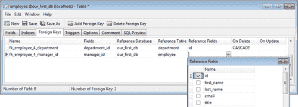

如果在保存更改之前切换到**SQL 预览**选项卡，您将能够看到一些自动生成的 SQL 命令，用于向表中添加设计的外键约束。实际上，您对表设计所做的每一项更改都有相应的 SQL 命令，Navicat 在幕后执行这些命令并在数据库服务器上执行它们。这对于学习 SQL 也很有用，或者在服务器出现错误时，用于分析幕后发生了什么。**SQL 预览**选项卡的屏幕截图如下：

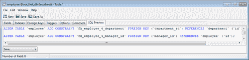

重复相同的步骤，为**department**表中的**manager_id**定义一个外键约束，引用**employee 表**的**id**字段，并命名为`fk_department_4_manager`。

### 注意

至于表命名约定，我鼓励使用单个名词作为表名，特别是为了让使用**对象关系映射**（**ORM**）API 的开发人员更容易，这些 API 具有用于开发基于数据库的应用程序的反向工程工具。

Navicat 的表设计器还具有一个名为**索引**的选项卡，使得创建索引与使用类似方法创建字段和定义外键一样简单。实际上，创建外键需要相应的索引也要被创建，Navicat 会自动为我们创建每个定义和创建的外键的索引。

您还会注意到**触发器**选项卡，您可以轻松地为表定义触发器。让我们定义一个简单的触发器，每当向员工表添加新行时都会被激活。在这个例子中，我们将需要一个我称之为**emp_log**的辅助表。

## 定义触发器

您可以通过使用表设计器创建**emp_log**表来练习本节学到的知识，定义三个基本字段：`id`（**类型**-**int**，检查主键自动递增），`emp_id`（**类型**-**int**）和`date_created`（**类型**-**datetime**），或者转到 Navicat 主窗口的菜单栏，选择**工具** | **控制台...**（或者按*F6*作为快捷键），并在 MySQL 控制台窗口中输入以下命令：

```
CREATE TABLE if not exists emp_log (
 id int auto_increment primary key,
 emp_id int,
 date_created datetime
);

```

创建**emp_log**表后，我们准备定义一个触发器，用于记录我们在**employee**表中创建的每个员工记录。右键单击**employee**表，选择**设计表**，然后在员工表的表设计器中执行以下步骤：

1.  转到**触发器**选项卡，然后从工具栏中单击**添加触发器**。

1.  将触发器命名为`ins_trig`。

1.  在**触发**列中，选择**之后**。

1.  勾选**插入**，其他复选框保持不变。

1.  在**定义**窗格中输入以下代码：

```
BEGIN
    INSERT INTO emp_log SET emp_id = NEW.id, date_created = NOW();
END
```

**触发器**选项卡的屏幕截图如下：

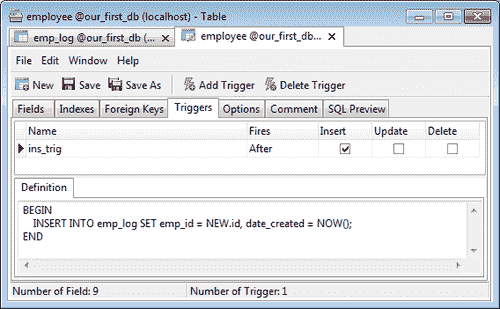

**Options**选项卡是另一个有用的辅助工具，它允许您修改 MySQL 表的某些设置。MySQL 数据库设计者的一个主要陷阱是，在创建 MySQL 表时，他们可能会意外地得到一个 MyISAM 表，而实际上他们打算使用 InnoDB 引擎。Navicat 使得将引擎更改为 InnoDB 变得容易。不过，这种修改并不是绝对安全的。由于 MySQL 的内部机制，如果表中已经输入了一些数据，这可能会使转换变得困难，有时甚至是不可能的。这里的其他选项包括**字符集**和**校对**修改，设置或重置下一条记录的**自动增量**值，并为所有行维护一个实时校验和——这是 MyISAM 表的一个独有特性。

在这个屏幕上还可以进行更高级的调整，这在 Navicat 的手册中有详细介绍。

### 注意

只需点击表的名称，然后从弹出菜单中选择**Duplicate Table**，即可复制表。Navicat 的另一个相关功能是，您可以以相同的方式复制表，并将其粘贴到另一个数据库中。

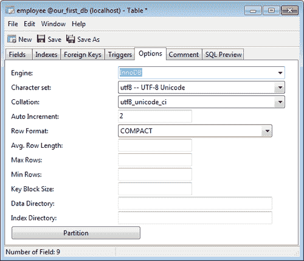

# 在表中输入数据

现在我们已经建立了数据库的基础，最好在表中输入一些数据。要打开表进行数据输入，只需双击它。

Navicat 提供了两种在表中输入数据的方法：其中一种是使用**Grid View**，这是最常见的输入数据的方式，就像在电子表格中一样。

只需点击单元格即可开始输入数据，完成后，可以按*Tab*键移动到下一个单元格，或者单击活动单元格外的任何位置。具有外键约束的字段将包含一个小方形按钮，用于从下拉列表中选择数据，该列表将显示来自具有引用的表字段的数据项。在我们的情况下，**department_id**可以从部门表中输入的记录的 ID 中选择，如下面的屏幕截图所示。

编辑行完成后，可以单击窗口底部的小勾选**P**按钮保存更改，或者单击**O**按钮放弃更改。如果需要，可以单击(**+**)加号或减号(**-**)删除记录，如下面的屏幕截图所示：

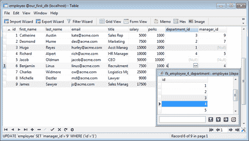

如果您之前使用过 Microsoft Access 或 Oracle Forms，表单视图对您来说会很熟悉。在该视图中，每个表行或记录将显示在单独的页面上，字段垂直对齐。请参阅下面的屏幕截图：

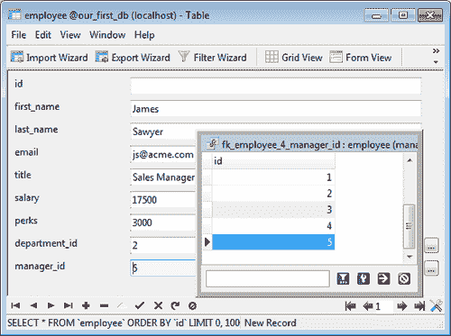

# 创建视图

数据库视图通常用于隐藏某些表的复杂细节，并且在某些情况下，它们仅用作安全机制，通过限制用户被允许检索的数据。在本节中，我将向您展示如何在 Navicat 的视图设计器中创建视图。它具有一个强大的可视化编辑工具称为**View Builder**，它允许您使用点按和拖放手势直观地设计视图。

要将表添加到视图中，只需在左侧窗格上单击其名称，然后将其拖动到图形视图区域，或者只需在树视图中双击其名称，然后单击**View Builder**选项卡，然后按照以下步骤操作：

1.  当您在图形视图中放置了所有表后，可以单击左侧字段名称旁边的小框，将其包含在视图中。如果单击表名称左侧的框，所有字段将包含在视图的**SELECT**查询中，如下面的屏幕截图所示：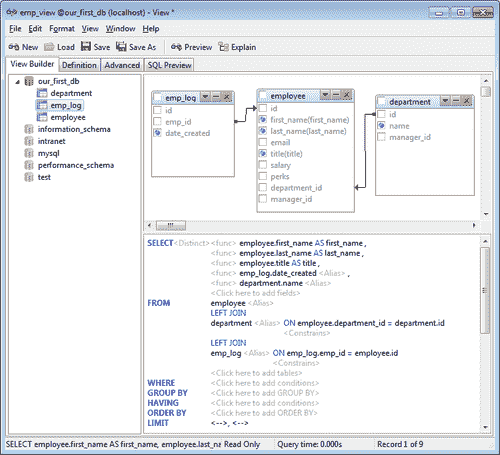

1.  要定义关系，请点击表的字段名称，并将其拖动到相关的表的字段上。例如，在这个视图中，我们希望显示每个员工的部门名称，而不是他/她的部门 ID。

1.  点击**employee**表中的**department_id**字段，将其拖动到**department**表的**id**字段上。将会画出一条连接线，表示两个表之间的关系。

与此同时，可视设计的 SQL 表示将相应更新在右下角的语法视图中。关系将默认创建为**INNER JOIN**；但是，您可以通过点击其在 SQL 语法中以蓝色突出显示的部分，并从弹出菜单中选择不同的连接类型来将其更改为**LEFT JOIN**或**RIGHT JOIN**。

或者，您可以切换到视图设计器的**Definition**选项卡，使用纯 SQL 进行操作。您可以随时在两者之间切换，因为可以从可视化设计生成 SQL 查询，反之亦然。但是，请确保在每个步骤保存视图定义，甚至在每个主要步骤将 SQL 备份到外部文件，因为在可视化编辑器中尝试复杂操作时可能会导致 SQL 查询混乱。

对于我们的示例，在**Definition**窗格中输入以下 SQL 查询：

```
SELECT
employee.first_name AS `first name`,
employee.last_name AS `last name`,
employee.title AS title,
emp_log.date_created AS `date joined`,
department.`name` AS `department`
FROM
employee
LEFT JOIN department ON employee.department_id = department.id
LEFT JOIN emp_log ON emp_log.emp_id = employee.id
```

要预览生成的 SQL 的结果，请点击工具栏上的**Preview**按钮。如果您的 SQL 语句没有错误，您将在名为**Result1**的选项卡中看到视图检索的数据。

工具栏上的**Explain**按钮显示视图的查询计划。

对于高级用户，还有一个名为**Advanced**的选项卡，您可以在其中为视图设置高级属性。其中之一是**Algorithm**，它使您能够在执行 SQL 时强制 MySQL 使用特定的算法。

+   默认是**Undefined**，将选择权留给 MySQL

+   由于**Merge**算法在大多数情况下更有效，因此 MySQL 在可能的情况下会选择它

+   另一种选择是**Temptable**算法，它在将结果缓存在临时表中后检索结果

**Security**选项允许您通过选择定义视图的用户和调用视图的用户之间进行访问权限的自定义。

有关这些设置的更多详细信息，请参阅 Navicat 的手册。

双击保存的视图，将在一个网格窗口中获得结果，这与打开表进行查看或输入数据非常相似。从这个窗口，可以将数据以各种格式导出。有关此功能的详细信息在第三章中有所涵盖，*使用 Navicat 进行数据管理*。

创建的**视图**将看起来像以下的屏幕截图：

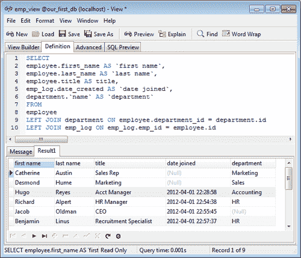

# 使用函数和存储过程

MySQL 从版本 5 开始支持函数和存储过程。存储过程是一组 SQL 语句，可以存储在服务器上，以便稍后由客户端、触发器甚至另一个存储过程调用。

现在，我们将创建一个简单的存储过程，该存储过程将选择公司中工资最低、最高和平均的员工。

在 Navicat 中创建这样的例程的默认方式是通过**Function Wizard**，可以通过工具栏上的**New function**按钮或者右键单击弹出菜单中选择**New Function**命令来调用。

在**Function Wizard**窗口中，选择**Procedure**，然后点击**Next**。

然后在点击**Finish**之前，输入存储过程的以下参数：

| **Mode** | **Name** | **Type** |
| --- | --- | --- |
| **OUT** | `lowest_salary` | **decimal(10,2)** |
| **OUT** | `l_emp` | **varchar** |
| **OUT** | `highest_salary` | **decimal(10,2)** |
| **OUT** | `h_emp` | **varchar** |
| **OUT** | `average_salary` | **decimal(10,2)** |

在上表中输入参数后，屏幕截图将如下所示：

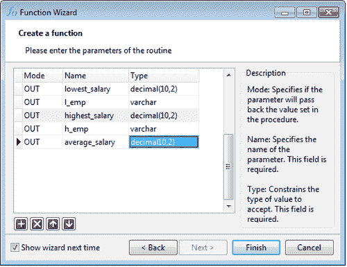

点击**完成**后，创建的**Procedure**将如下所示：

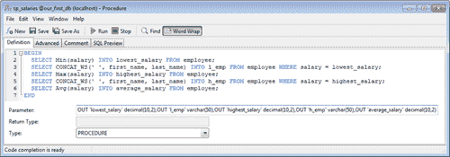

最后，在下一个屏幕的例程**定义**中输入以下代码，并将存储过程保存为`sp_salaries`。

```
BEGIN
SELECT Min(salary) INTO lowest_salary FROM employee;
 SELECT CONCAT_WS(‘’ ‘’, first_name, last_name) INTO l_emp FROM em ployee WHERE salary = lowest_salary;
 SELECT Max(salary) INTO highest_salary FROM employee;
 SELECT CONCAT_WS(‘’ ‘’, first_name, last_name) INTO h_emp FROM em ployee WHERE salary = highest_salary;
 SELECT Avg(salary) INTO average_salary FROM employee;
END
```

在输入上述代码时，您可以享受 Navicat 的代码编辑功能，如代码高亮、自动换行、自动完成和代码折叠。

现在，为了测试该过程，转到**查询**节点，创建一个**新查询**，然后在**查询编辑器**中输入以下语句：

```
CALL sp_salaries(@lowestsalary, @low_emp, @highestsalary, @high_emp, @averagesalary );
SELECT @lowestsalary, @low_emp, @highestsalary, @high_emp, @averagesalary;

```

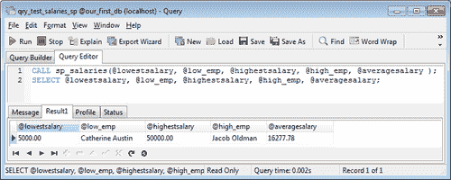

要查看查询结果，请点击工具栏上的**运行**按钮，然后就可以看到公司中薪水最低和最高的员工、他们的薪水以及公司所有员工的平均薪水了。

最后，由于我们没有一个用于员工全名的单个字段，而是为名字和姓氏分别创建了单独的字段，我们将创建一个函数，通过将名字和姓氏用单个空格字符分隔起来，返回员工的全名，其 ID 作为输入参数。

为此，我们将几乎按照本节开头的相同步骤进行，只是在**函数向导**的第一个屏幕中，我们将选择**函数**而不是**存储过程**。

接下来，我们将指定类型为**int**的`emp_id`作为输入参数，然后点击**完成**。最后，在函数的**定义**区域中输入以下代码：

```
BEGIN
DECLARE fullname VARCHAR(50);
SELECT CONCAT(first_name, ‘’ ‘’, last_name) INTO fullname
FROM employee WHERE id = emp_id;
RETURN fullname;
END
```

将函数保存为`fn_fullname`，并通过单击工具栏上的**运行**来测试它。在提示时，输入您想要显示全名的员工的**id**。参考下面的屏幕截图：

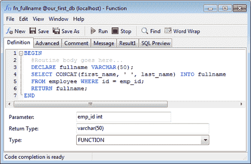

# 使用 Navicat 的 MySQL 事件设计器

从版本 5.1.6 开始，MySQL 引入了**事件调度程序**功能，允许您设计定期任务。在 MySQL 中，事件是由一个或多个 SQL 语句组成的定期任务，这些语句将在特定间隔、开始和结束日期和时间执行。

在本节中，我将向您展示如何创建一个定期事件，该事件将备份我们的员工表，并在特定间隔重复。作为先决条件，我们需要确保 MySQL 的全局事件调度程序处于活动状态（默认情况下处于禁用状态）。

为此，请从 Navicat 主窗口的**工具**菜单中选择**控制台**，以获取对 MySQL 服务器的命令行访问，如下面的屏幕截图所示：

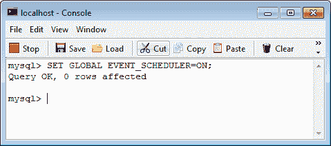

在**localhost - 控制台**提示中，键入以下命令：

```
mysql> SET GLOBAL EVENT_SCHEDULER=ON;

```

其次，我们需要创建一个新的存储过程，其中包含一组命令来备份员工表并删除任何现有的备份。

是时候将你在上一节中学到的知识付诸实践了：

1.  创建一个名为`refresh_employee_bu`的新存储过程，没有输入或输出参数，并在其定义中输入以下代码：

```
BEGIN
DROP TABLE IF EXISTS employee_backup;
CREATE TABLE employee_backup LIKE employee;
ALTER TABLE `employee_backup`
MODIFY COLUMN `id` int(11) NOT NULL FIRST;
INSERT employee_backup SELECT * FROM employee;
END
```

1.  现在我们准备在 Navicat 中创建一个定期事件；点击工具栏中的**事件**按钮，然后选择**新事件**。这将引入 Navicat 的事件设计器。

1.  在事件设计器的**定义**选项卡中，将**Definer**设置为`root@localhost`或使用`root`建立连接时设置为`CURRENT_USER`。将**Status**设置为**ENABLE**，并选择**ON COMPLETION**的**PRESERVE**，如下面的屏幕截图所示：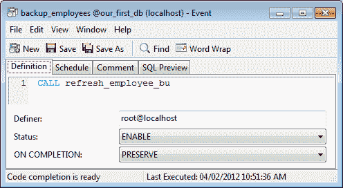

1.  然后在定义代码区域输入以下代码：`CALL refresh_employee_bu`。这将调用您之前创建的用于备份员工表的存储过程。

1.  最后，切换到事件设计师的**日程安排**选项卡，调整事件的时间，如下截图所示：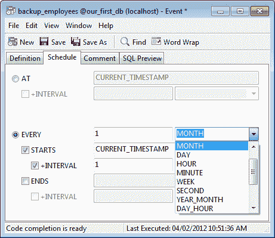

我们希望备份过程每个月运行一次，因此请参考上一个截图，调整设置，使事件每个月触发一次，**从** **CURRENT_TIMESTAMP** + `1` **小时间隔**开始。将此事件保存为`backup_employees`，然后完成。

### 注意

要测试预定的事件是否有效，可以设置一个更早的日期和时间以及更短的间隔开始，然后验证其是否有效后，可以将时间设置回合理的频率。

# 在 Navicat 中使用查询

在 Navicat 中设计查询很像设计视图，不同之处在于视图仅限于 SELECT 语句，而查询可以执行任何**CRUD**（**创建**，**读取**，**更新**和**删除**）操作。

就像**视图构建器**一样，Navicat 的可视化查询构建器允许您以图形方式表示表和字段以及它们之间的关系（连接），并且通过将 SQL 生成交给 Navicat，但是，这种方法仅适用于 SELECT 查询。对于创建，更新和删除查询，您仍然必须手动编写 SQL。

在这一部分，我们将通过一个关于虚构公司`Acme.com`的想象情景，CEO 对上一财政年度的财务结果感到不满，并认为公司的组织应该进行修订。为此，他希望初步分析公司中谁在做什么，以及他或她在公司中获得多少薪水。

首先，我们将设计一个简单的查询来列出所有部门及其经理。

## 设计查询

让我们通过点击工具栏上的大**查询**按钮或从左侧导航窗格中选择**查询**，然后点击工具栏上较小的**新查询**按钮，进入**查询**视图。

在打开的窗口中，默认情况下**查询编辑器**选项卡是活动的。这是您可以手动编写 SQL 语言来构建查询的地方。我们想要的是可视化设计师，因此我们将切换到**查询构建器**选项卡。

在这个视图中，我们有一个可视化图表窗格，可以通过在左侧窗格上双击它们的名称，或者简单地通过拖放手势将它们移动到空白区域来创建表和视图的图形表示。

对于这个查询，我们需要**部门**和**员工**表并排；因此，在将它们带到舞台后，通过点击它们名称旁边的小方框选择以下字段来构建一个 SELECT 查询：**部门**表的**名称**，**员工**表的**名**，**姓**和**职称**。

接下来，点击**部门**表的**manager_id**，将其移动到**员工**表的**id**字段上。应该会出现一个带有圆形端点的连接两个字段的线，并且在下面的窗格中预览了可编辑的 SQL 代码。您可以点击 SQL 查询中的灰色单词来添加语法，例如字段和表的别名。这个查询现在几乎准备好了，只是我想在这里使用**部门**和**员工**之间的**LEFT JOIN**而不是**INNER JOIN**。点击蓝色的**INNER JOIN**表达式，使用自动显示的下拉列表将其更改为**LEFT JOIN**，如下截图所示：

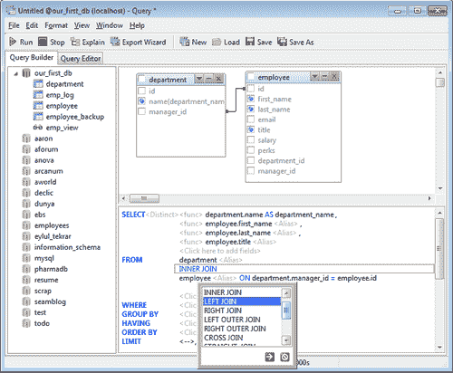

现在让我们保存这个查询并执行它，以了解公司的组织情况。我将其命名为`qry_departments`。

单击窗口工具栏上的**运行**按钮来执行查询。调用它将切换回查询编辑器，并在生成的 SQL 代码下方的数据网格中检索结果。在这个阶段，我们可以将结果数据导出为各种格式，如文本（csv）、Excel 电子表格、XML、MS Access 数据库（仅限 Windows），甚至是 DBase 文件。Navicat 的导入/导出数据功能的详细信息在第三章*使用 Navicat 进行数据管理*中有介绍。请参考以下屏幕截图：

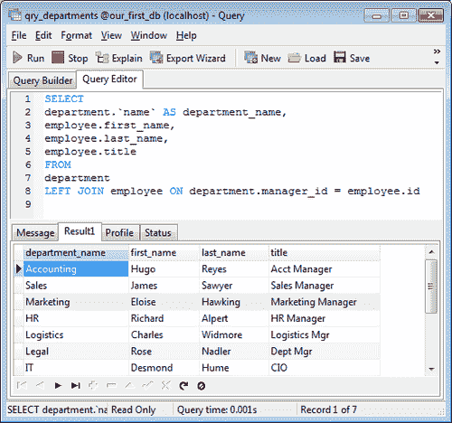

### 注意

与其他数据库对象不同，Navicat 在关闭查询设计器窗口时不会提示您保存查询，因此请确保保存您的工作以避免丢失更改。

## 构建进一步的查询

在上一节中设计了我们的第一个查询之后，我认为我们可以通过添加一些内容来丰富我们所学到的知识。

回到我们的场景，老板想要一个员工（特别是经理）的名单，他们的月薪超过 15000 美元，他们所在的部门，以及他们的汇报对象。这是我们将设计的下一个查询的规范。如果你擅长 SQL 编程，你可以很快地手工编写这样一个查询。Navicat 的代码编辑器也非常有用，因为它具有代码补全功能、SQL 格式化、代码折叠和括号高亮等功能。然而，为了演示可视化构建器提供的便利性，我想再介绍一些功能来设置过滤条件。对于这个查询，我们将使用**department**表来检索与员工部门 ID 相关联的部门名称，以及**employee**表的两个实例——一个用于员工本身，另一个用于获取他们的经理的名称。

打开一个新的查询窗口，并通过从左窗格拖动它们或双击它们的名称将两个**employee**表和一个**department**表添加到（图形）图表视图区域。使用别名将第二个**employee**表命名为**manager**。您可以通过双击表的标题栏或单击语法视图中略暗的**<Alias>**并输入**manager**来执行此操作。（前一种方法类似于在 Windows 资源管理器或 Macintosh Finder 中单击文件名下方或旁边的图标来重命名文件。）请参考以下屏幕截图：

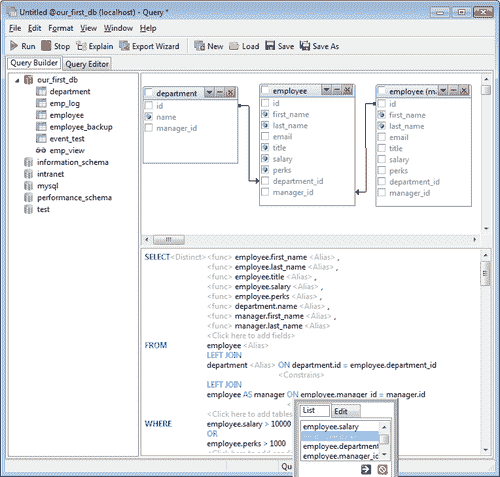

通过将**department**表的**id**与**employee**表的**department_id**相关联，然后将**employee**表与**manager**表相关联，将**employee**表的**manager_id**与**manager**表的**id**相关联。将这些关联转换为**LEFT JOIN**实例，以便我们还可以检索未分配给任何经理或部门的员工。

接下来，选择以下字段：**employee**表的**first_name**，**employee**表的**last_name**，**employee**表的**title**，**employee**表的**salary**，**employee**表的**perks**，以及查询的**department**表的**name**。

现在我们需要指定两个条件：**employee.salary**必须大于`15000`或**employee.perks**必须大于`1500`。

要在可视化编辑器中添加条件，请单击语法视图中**WHERE**子句中的符号组**<--> = <-->**。单击**<-->**以从查询中所有可用的表字段列表中选择字段。要定义自己的条件，可以直接在**编辑**选项卡中输入值。单击等号（**=**）以更改条件运算符。

现在，如果我们执行查询，我们将得到更多或更少我们想要的结果；所有工资超过$15,000 或津贴超过$1,500 的员工。但 CEO 也在列表中。此外，结果表的列名有些奇怪，并且名字和姓氏出现在不同的列中，不太令人满意。在查询编辑器中，我们将手动编辑 SQL 以解决这些问题，同时享受 Navicat 代码编辑器的舒适性。

我认为将名字和姓氏连接起来显示在一个列中是个好主意，将部门名称的列标题更改为有意义的内容，通过向查询添加另一个条件来排除 CEO 的查询结果，并按工资金额降序排序结果。

为了实现这些小目标，我们将修改 SQL 以使其类似于以下代码清单，并重新运行查询：

```
SELECT
CONCAT_WS(‘’ ‘’,employee.first_name,employee.last_name) AS FullName,
employee.Title,
CONCAT(‘’$ ‘’,FORMAT(employee.salary,2) ) AS Salary,
employee.Perks,
department.`name` AS Dept,
CONCAT_WS(‘’ ‘’,manager.first_name,manager.last_name) AS ManagerName
FROM employee
LEFT JOIN department ON department.id = employee.department_id
LEFT JOIN employee AS manager ON employee.manager_id = manager.id
WHERE
(employee.salary > 15000 OR
employee.perks > 1500) AND
employee.title <> ‘’CEO’’ 
ORDER BY employee.salary DESC, employee.perks DESC
```

Navicat 还为我们提供了显示查询概要和状态的能力，借助这一功能，我们可以监视某些状态参数，如表锁定、系统锁定和统计信息，在查询结果窗口的**概要**选项卡下。参考以下屏幕截图：

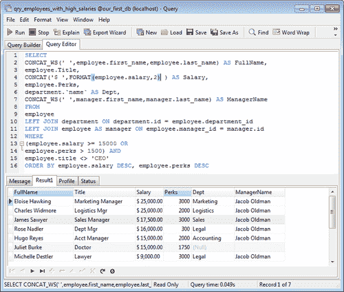

# 总结

在本章中，我们已经涵盖了许多 Navicat 的数据库功能，并学会了如何使用 Navicat 的可视工具创建和管理数据库对象。

我们现在知道如何使用 Navicat 的 GUI 工具来：

+   创建数据库并执行其初始设置

+   创建和管理数据库对象，如表和视图

+   定义外键约束和触发器

+   创建存储过程和函数

+   使用 MySQL 事件调度任务

+   设计和自定义查询

在下一章中，我们将详细了解 Navicat 的数据管理工具，并学习如何使用 Navicat 轻松操作和转换数据库。
