# 第三章。使用 Navicat 进行数据管理

过去，我们中的一些人会以艰难的方式使用控制台窗口中的命令键入数据库及其内容，或者使用功能有限的原始 GUI 工具。当涉及将数据库从一个服务器迁移到另一个服务器，甚至从备份中简单恢复时，这些花招可能变得繁琐。在本章中，我们将看到使用 Navicat 执行所有这些任务是多么简单和节省时间。

此外，我们将使用 Navicat 的复杂工具来操作大块数据，并且您将学会如何：

+   使用各种格式导入和导出数据，如 XML、Excel 文件、`.csv`和`.sql`

+   不同数据库之间的直接数据传输

+   同步数据和结构

+   备份数据库以便以后恢复

+   创建和安排批处理作业

# 使用现有数据库

从这一点开始，我们将使用一个名为 Sakila 的现有示例数据库。除了是 MySQL 标志中海豚的名字外，Sakila 是由 Mike Hillyer 开发的电影数据库的示例，他是 MySQL AB 文档团队的前成员，并旨在提供可用于书籍、教程和文章等的标准模式。它还用于突出显示 MySQL 5.x 中引入的功能，包括视图、存储过程和触发器。MySQL 5.5 社区版的默认安装包括 Sakila 的副本以及另一个名为 World 的示例数据库。如果您的计算机上已经安装了 MySQL 服务器的版本（早于 5.5）并且出于特定原因不想升级，我们已经在本书的示例代码中包含了 Sakila 数据库的转储文件的副本。您也可以从[`dev.mysql.com/doc/index-other.html`](http://dev.mysql.com/doc/index-other.html)下载它。一旦到达页面，选择**其他文档**选项卡，并查看**示例数据库**部分。在那里，您还可以找到其他示例数据库，通过这些示例数据库，您可以实验并应用本章中学到的知识，如下图所示：

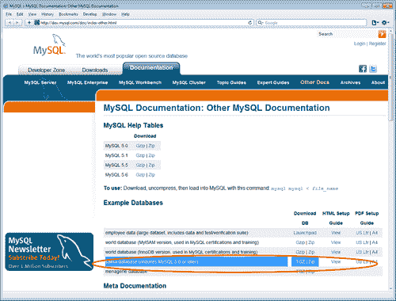

一旦您下载了 Sakila 的压缩存档（以`.zip`或`.tgz`格式）并提取了其内容，您将在名为`sakila-db`的文件夹中找到三个文件，这些文件称为 SQL 转储文件。我们只需要其中两个——`sakila-schema.sql`和`sakila-data.sql`。我们将使用`sakila-schema.sql`来在我们的 MySQL 服务器上生成 Sakila 数据库；将创建构成数据库结构的所有表、视图、函数和存储过程。另一个文件`sakila-data.sql`将填充 Sakila 数据库的数据。

## 从 SQL 转储文件创建数据库模式

现在，要在服务器上生成 Sakila 数据库，我需要您右键单击 Navicat 主窗口的**连接**窗格中的**localhost**（或者您为其定义了连接的任何服务器），并按照以下步骤操作：

1.  从弹出的上下文菜单中选择**执行 SQL 文件...**，如下图所示：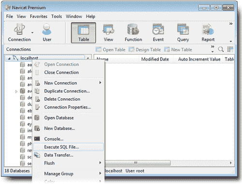

1.  然后将打开一个新的较小窗口，其中将有两个选项卡，在这里您将指定要执行动作查询的 SQL 文件，即此案例中的 SQL 命令，以创建数据库及其对象。在**执行 SQL 文件**窗口的**常规**选项卡下，单击标有**文件**的字段右端的小方形按钮，以选择`sakila-schema.sql`。

1.  如果此窗口中的其他设置看起来像屏幕截图中所看到的那样，例如**编码**应为**65001（UTF-8）**，则可以直接点击**开始**按钮。

可选地，你可以取消勾选**继续错误**，以确保你的设置正确，然后 Sakila 将按照预期在你的机器上生成；如果不是，操作将中断，你会提前知道需要重新检查关于数据库服务器安装和连接属性的设置。换句话说，操作应该按照默认设置进行，但如果在执行查询过程中出现任何错误，可能是由于可能的错误配置，最好停止创建数据库，并通过参考前一章节来修订设置。

或者，你可以保持**继续错误**选项勾选，并执行 SQL 文件中的所有查询。在出现任何错误的情况下，你可以参考这个窗口的第二个选项卡下的**消息日志**。参考下面的截图：

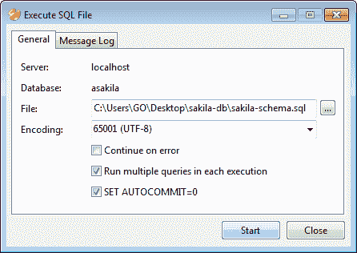

1.  在执行完 SQL 文件后，你将自动切换到**消息日志**选项卡，如下面的截图所示：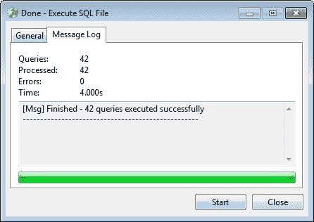

1.  在这个阶段，你可以通过再次点击**开始**按钮或关闭窗口来重新开始。

1.  回到 Navicat 的主窗口，似乎没有变化。现在怎么办？不用担心；我们只需要刷新视图，就能看到我们新创建的 Sakila 数据库及其对象。再次右键单击**localhost**，从弹出菜单中选择**刷新**（在 Mac 上标记为**刷新连接**）。

这是 Navicat 最强大的功能之一。仅仅几秒钟，我们就执行了一个 SQL 转储文件，重新创建了一个数据库，而不需要在控制台窗口中输入命令，也不需要经过复杂的屏幕，如下面的截图所示：

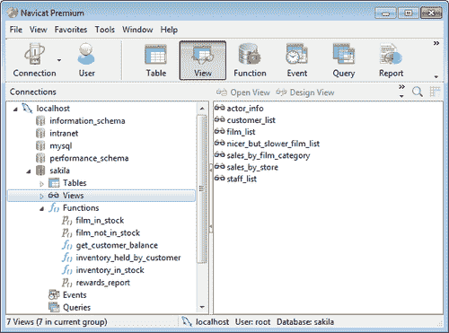

所有的**表**，**视图**，**函数**和存储过程现在都列在主窗口中。点击**表**查看我们有什么。我们几乎拥有典型关系型电影数据库中会找到的每个元素，比如电影，演员，类别，工作人员，以及一些关联表，也称为连接表，比如**film_actor**和**film_category**。双击其中一些表来查看它们在 Navicat 中的样子。还有一些自定义视图，比如**nicer_but_slower_film_list**和**sales_by_film_category**。

然而，你会注意到这些**表**和**视图**都是空的，没有数据。这是因为我们执行的`.sql`文件只包含了数据库结构。所以我们只创建了空白的数据库模式，我们需要重复本节开头的步骤，执行另一个名为`sakila-data.sql`的 SQL 转储文件，其中包含了填充数据库的数据。

现在我们拥有了完整的数据库，具有完整的结构，是时候用一些数据填充它了。

在左侧面板的树形视图中右键单击**sakila**数据库，确保它已连接，验证其小圆柱形图标是否为绿色，然后从弹出菜单中选择**执行 SQL 文件**。这次选择`sakila-data.sql`并点击**开始**。辅助窗口的标题应该变成**执行 SQL 文件**，**消息日志**选项卡应该显示**[Msg] 完成 - 成功执行了 56 个查询**。

# 导入和导出数据

在上一节中，我们实际上是使用 SQL 转储文件导入了**sakila**数据库。在本节中，我们将更详细地介绍 Navicat 的导入/导出功能。

作为我们的第一个练习，我们将导出**our_first_db**，这是我们在第二章*与数据库一起工作*中创建的数据库，以`.sql`文件的形式，以便可以在另一个 MySQL 服务器上或者作为同一服务器上数据库的另一个实例上重新生成。要导出**our_first_db**，请按照以下步骤进行：

1.  右键单击**our_first_db**，然后从弹出菜单中选择**Dump SQL file...**（如果该菜单项变暗，因此无法使用，您可以首先从同一弹出菜单中选择**Open Database**，然后再次右键单击进行下一步操作。）

1.  最后，指定您希望创建 SQL 转储文件的路径和文件名，并单击**保存**。您的数据库将被导出或转储到一个`.sql`文件中，当按照前一节中描述的方式执行时，将会以与您创建的相同结构和数据重新生成，如下面的屏幕截图所示：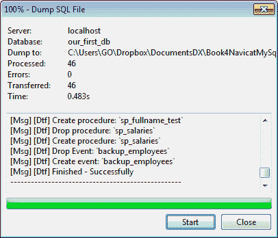

前面的步骤离导出整个数据库只差一步，尽管 Navicat 中还有其他数据导出方法的变体，这将在本章稍后进行介绍。例如，**sakila**数据库分为两个独立的`.sql`文件，一个用于架构，另一个用于数据。如果您使用相同的方法导出**sakila**，即通过运行**Dump SQL file**命令，Navicat 将会将整个数据库导出到单个转储文件中。

关于 Navicat 导出 SQL 转储文件的一件事是，Navicat 不会在文件中包含创建数据库的命令，比如`CREATE` `DATABASE` `db_name`。

因此，在执行 Navicat 创建的转储文件之前，您应该首先选择一个数据库或创建一个新数据库，然后继续执行以生成架构并填充数据（如果有）。

如果您打算在不同的管理工具中使用导出的`.sql`转储文件，比如 phpMyAdmin 或 MySQL Workbench，您应该手动添加 SQL 命令来创建数据库。例如，您可以使用文本编辑器在文件开头添加一行代码`CREATE` `DATABASE` `our_first_db`。

Navicat 最受好评的另一个功能是其能够将数据导出到各种格式。一些主要的格式将在稍后进行介绍。

## 详细导出

如果您是数据库管理员或某种类型的 IT 分析师，您可能经常收到业务请求，要求您在公司内部网络上提供表或数据库查询的输出，通常以 Microsoft Excel 格式。在这种情况下，Navicat 非常方便，可以导出所需的数据，并提供广泛的导出选项。

您可以打开任何**Table**、**View**或**Query**，然后单击窗口工具栏上的**Export Wizard**按钮。这样做时，Navicat 会询问您是否要导出表中的所有数据（在 Windows 版本中）。

现在这部分有点棘手。首先，*表*在表达式**表中的所有数据**中指的是您正在处理的数据库对象的类型。当您导出**View**或**Query**的结果时，**导出表中的所有数据**意味着您正在处理的**View**或**Query**结果列表中的所有数据。其次，**所有数据**意味着数据库表中的所有记录，即使您显示了有限数量的数据。请注意，Navicat 默认最多显示一千行，以防止对数据库服务器造成过大的负担，当显示**Table**、**View**或**Query**的内容时。

您可以通过单击结果窗口右下角的一个小工具集图标来更改或删除此限制，如下面的屏幕截图所示：

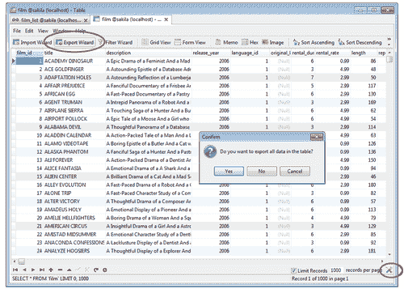

要查看此操作的效果，请按照以下步骤操作：

1.  转到**sakila**数据库中的**Tables**，双击名为**film**的表。您应该会看到一列电影，其中包含**标题**、**描述**、**发行年份**等详细信息。

1.  单击底部右侧的工具集图标，以设置前一个屏幕截图中显示的结果数量限制。无论如何，数据库**sakila**中的电影表包含一千个标题，所以在测试下一步将导出多少行之前，将限制设置为`500`。

1.  现在，单击工具栏上的**导出向导**按钮（或**文件**菜单中也有**导出向导**命令），然后在提示**是否要导出表中的所有数据？**时单击**是**。 

您将看到**导出向导**窗口，在那里您需要指定导出文件格式，选项范围从**Dbase**文件格式到**MS Access 数据库**或**Excel 电子表格**到**XML**。

尽管 Windows 版本的 Navicat 提供了多种文件格式选项可供选择，但 Mac 版本提供的导出文件格式选项较少（这解释了为什么 Mac 版本略微便宜）。具体来说，CSV、纯文本、XML、Dbase 文件（`.dbf`）和 Excel 格式是文件格式。您可以参考下面的屏幕截图，其中包含 Mac 和 Windows 版本 Navicat 的屏幕截图。此屏幕截图比较了用户界面元素的差异，例如工具栏和图标以及文件导出选项：

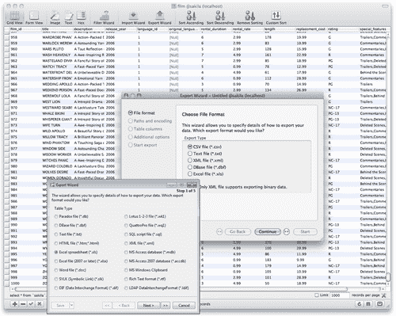

在导出到 Excel 时需要注意的另一点是，将创建的电子表格的版本取决于您计算机上安装的 Microsoft Excel 的版本。

1.  选择所需的输出文件格式后，您可以单击 Windows 中的**下一步**（或 Mac 版本中的**继续**按钮）进行下一步，那里您将设置目标文件名、编码和一些其他选项。

即使您开始在单个表输出上进行导出操作，此步骤也允许您选择数据库中的其他表以将其导出到单独的文件中（除非您最初在提示是否导出**所有数据**时点击了**否**）；也就是说，您可以将每个表导出到单独的文件中，如下面的屏幕截图所示：

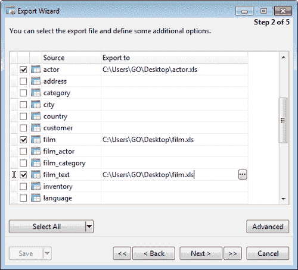

更重要的是，您甚至可以将一个以上的表（或全部表）导出到单个文件中。只需在**导出到**列下的相应字段中为每个源表指定相同的文件名（和路径）即可完成此操作。这种方法会根据您最初选择的文件格式而产生不同的后果。例如，如果您选择将两个或更多表导出到单个 Excel 文件（`.xlsx`），每个表将成为同一文件中的单独电子表格。

要设置将要导出的文件的编码，请单击**高级**按钮以显示一个小弹出对话框。默认的**编码**是恰当的**65001（UTF-8）**，您可以从下拉列表中进行更改。

在**编码**选择框下，还有一个复选框，可以将时间戳添加为导出文件名的后缀。这在您经常执行此任务并最终在具有相同名称的文件夹中积累一堆导出文件的情况下非常有用。您甚至可以在**YYYY-MM-DD-HHNNSS**和**MM-DD-YYYY**等不同日期模式之间进行选择，以添加后缀到输出文件名中。

### 注意

在 Navicat 的 Windows 版本中，您有两个选项可以导出到 Excel。其中一个是**Excel 电子表格（*.xls）**，这也是 Mac 版本中唯一可用的选项。第二个是**Excel 文件（2007 或更高版本）（*.xlsx）**。使用前者选项，您无法成功地将多个源表导出到单个目标文件中，而后者可以实现这一点，因为它使用了安装有 Microsoft Office 的计算机上的某些组件。使用此选项导出的 Excel 文件创建速度较慢，但其版本与 PC 上安装的 Office 版本完全匹配。

1.  下一步是通过默认情况下勾选表、视图或查询的所有复选框来选择要导出的列（或字段）。为了省略其中一些列，只需先取消选中**所有字段**，然后取消选中**可用字段**下列出的（不）需要的字段。

如果要导出多个表并且要为每个表指定不同的列选择，您需要为要导出的每个表重复此步骤，通过从标记为**源表**的下拉列表中选择，然后在其下方的列表中选中/取消选中字段名称，当您在表之间切换时，列表会自动更新。

1.  在下一个屏幕上，您可以指定是否要在导出文件的顶部包含包含列标题的额外行。此外，您可以选择将导出的记录追加到现有文件中。此外，您可以勾选**出现错误时继续**选项，这将防止在出现错误时操作停止。

如果您要导出其他文件格式，例如 XML 或文本文件，可能会出现其他选项，例如指定行和字段分隔符、文本限定符以及日期、时间和数字的格式。

### 注意

从 MySQL 到 Oracle 或 Microsoft SQL 数据库之间传输或交换数据的最佳且可靠的方法之一是在从表中导出数据时使用 XML 格式。

1.  完成后，单击**下一步**以进入最后一步并开始导出过程。如果选择了`.xls`格式而不是`.xlsx`，则导出应在几秒钟内完成。操作完成后，您可以从进度条和**消息日志**中看到。

## 将文件导入表格

用于导出**表**、**视图**或**查询**的文件格式与导入数据到表中的文件格式相同。Excel 电子表格、XML 和 CSV 文件是最常用的数据源文件格式之一。

一个业务部门定期向 IT 部门发送 Excel 电子表格，并要求使用其内容更新公司数据库的情况是工作中最常见的情况之一。在某些情况下，制作电子表格的人经常忽略保持列名一致，例如，SALES_REP 可能会在下一次变成 SALES_PERSON，而在另一次变成 SALES_REP_NAME。幸运的是，Navicat 会提示您将源列与目标字段匹配，并灵活地允许您省略一些或添加额外的字段。

从 Excel 或 CSV 文件导入数据时，请记住正确设置字段名称行和第一行数据行，通常情况下不应相同。

在屏幕截图中给出的示例中，您可以看到额外的演员是如何从 Excel 文件导入演员表中的，但是一些列名必须手动匹配命名差异，比如**actor_id**–**actor_no**和**first_name**–**name**：

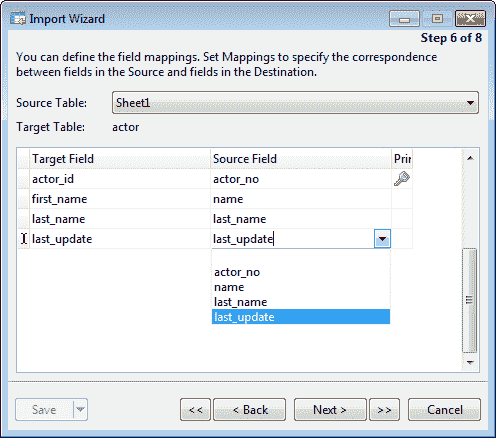

除了前面提到的流行数据格式之外，在 Navicat 的 Windows 版本中还可以从 ODBC 数据源导入数据。这需要一些关于 ODBC 设置的知识，以便能够指定连接参数。您可以在 Navicat 的官方手册中找到有关 ODBC 导入的详细信息。

# 两个数据库之间的直接数据传输

Navicat 的另一个旗舰功能是其能够将数据库对象（**表**、**视图**、**函数**和**事件**）从一个数据库传输到另一个数据库，或者传输到 SQL 转储文件。目标数据库可以位于同一服务器上，也可以位于另一台服务器上。您只需要按照第一章 *入门*中描述的方式定义一个连接。数据传输设置也可以保存为配置文件以供以后检索，或者可以安排为作业。

您可以通过从主菜单栏中的**工具**选择**数据传输...**，或者右键单击左侧导航窗格中的数据库并选择**数据传输...**来启动数据传输过程。一旦启动，您可以开始在**数据传输**窗口中指定设置，如下图所示：

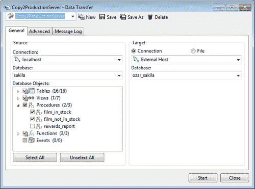

尽管界面相当直观，在**常规**选项卡下有两个主要区域，分为**源**和**目标**，只需让您选择要将哪些对象传输到哪里，但在开始之前有一些要点需要了解，除非您希望通过试错的艰难方式来学习如何使用它。首先，您需要提前准备好目标数据库，这意味着您至少需要创建一个空数据库作为接收数据库对象的目标，因为 Navicat（在我写这篇文章时）不会创建数据库本身，而是将对象复制到指定的目标。您还可以选择将其传输到已包含一些对象的现有数据库，但在这种情况下，您可能希望确保它们与源中的对象名称不同，除非您希望它们被覆盖或跳过。

其次，您可以选择导出到 SQL 转储文件，这在某种程度上类似于我在本章开头展示的内容，只是在此屏幕上，您可以指定 SQL 格式，范围从 MySQL 3.23 到 6.0，通过文件编码。

如果目标服务器版本与您的源服务器版本不同，直接传输可能会失败，您可能需要以这种方式导出 SQL 文件。

**高级**选项卡是您可以指定一些额外设置的地方，例如在错误时继续和在创建之前删除目标对象。这意味着任何现有的与源相同名称的对象将被覆盖。

与 Navicat 的所有其他实用程序窗口一样，配置设置完成后，单击**开始**开始过程。该过程可能需要几秒钟到几分钟，甚至几个小时，具体取决于数据库的大小、数据量、两个服务器之间的距离和您的连接速度。我个人通常不需要等待太长时间才能将我的博客数据库从另一个大陆上的网络托管公司的服务器转移，我的博客包括约 2860 篇帖子和评论。

# 数据和结构同步

如果您在不同服务器上有多个数据库实例，例如一个用于开发，一个用于测试，另一个用于生产，有时要保持一致性可能会很具挑战性，有时在一个服务器上进行更改（很可能是在开发中）需要将完全相同的更改应用到其他服务器上。我们人类经常会忽略一个或多个服务器上的更改，最终在部署后出现意外错误。

Navicat 在这个领域也提供了帮助，其结构和数据同步向导可从**工具**菜单中访问。

另一个同步工具可能有用的情况是，之前执行的数据传输操作未成功完成。目标数据库可以在此之后使用结构和数据同步进行修饰。

这两个工具的使用方式与**数据传输**界面几乎相同，您可以彻底指定要比较的源和目标数据库对象以及详细信息。例如，在**结构同步**中，您可以选择比较表以及主键、外键和索引，还可以选择排除触发器、字符集和**常规**（Mac 上为**常规设置**）选项卡下的自动增量值。因此，您可以通过单击适当的复选框来指定要执行的 SQL 命令类型，例如 CREATE、ALTER 和 DROP。您甚至可以选中一个选项，在执行过程后再次进行比较。在 Navicat 的 Windows 版本中，窗口的右下角有一个标有**比较**的按钮。在 Mac 版本中，按钮位于窗口工具栏的左上角，带有一个天平图标。单击它开始比较源和目标数据库的结构。请参考以下截图：

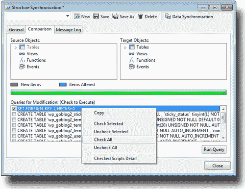

接下来，我们需要转到名为**比较**（Mac 上为**比较结果**）的第二个选项卡，它将为我们提供源和目标之间存在的差异的预览，并且将列出用于同步的 SQL 查询，这些查询将根据窗口后半部分的所需修改进行列出。您可以通过单击相应的复选框来单独选择要执行的查询，或者单击列表中的任何位置以显示弹出菜单，该菜单将允许您选择/取消选择所有内容，并复制 SQL 语法。

完成后，单击**运行查询**继续。然后，您可以观看**消息日志**以查看结果。

**数据同步**稍微简单，您只需选择源和目标数据库。Navicat 会自动列出并匹配双方的表，以便您可以验证双方每个表是否有对应。在**高级**选项卡下，您可以指定是否要：

+   使用事务

+   显示同步详细信息

+   插入记录

+   删除记录

+   更新记录

最后，您可以单击**预览**以查看数据将如何同步，然后单击**开始**按钮让它实际发生，并在**消息日志**中查看执行的命令。

# 备份和恢复

在灾难发生时，无论是电力中断导致磁盘故障导致数据库损坏，还是简单地用户错误删除了错误的对象或数据行导致数据丢失，都至关重要备份您的数据库。Navicat 允许您备份所有**表**（及其记录）、**视图**、**函数**和**事件**，以便以后恢复。

在 Navicat 主窗口的工具栏上有一个带有磁带盒图标的大**备份**按钮，它将带您进入一个专门用于管理备份的特殊视图，在主工具栏下方出现一个较小的工具栏。这个较小的工具栏有用于创建新备份、恢复备份或删除备份的较小按钮，以及用于从备份中提取 SQL 的按钮。

要创建新的备份，请按照以下步骤操作：

1.  从对象窗格工具栏（在 Windows 版本中）单击**新备份**按钮，或者在对象窗格本身的任何位置右键单击，然后从弹出菜单中选择**新备份**（Windows 和 Mac）。

1.  在出现的窗口中，输入您想要进行备份的备份的属性，例如备份的自己的评论和要包括在备份中的对象。（默认情况下选择所有对象。）

1.  然后，单击**开始**以使用指定的设置执行备份。

Navicat 还在这里提供了一些高级选项，例如压缩、表锁定以及在 InnoDB 表中使用单个事务的能力。

### 注意

如果选择在**高级**选项卡中使用压缩，将创建具有`.psc`扩展名或`.psb`扩展名的备份文件。

右键单击备份并从弹出菜单中选择**对象信息**将在窗口底部打开一个附加窗格，您可以在其中查看文件的大小和完整路径，以及最后修改日期。备份默认保存为**我的文档**下子文件夹的层次结构中的单个文件。例如，我的备份存储在`C:\Users\GO\Documents\Navicat\MySQL\servers\localhost\sakila\sakila_bu.psc`中。您可以像在 Windows 资源管理器或 Macintosh Finder 中处理任何其他文件一样，将`.psc`或`.psb`格式的备份文件复制或移动到另一台计算机。

恢复备份甚至更简单。您可以右键单击备份列表中的备份，然后从弹出菜单中单击**恢复备份**。要恢复在另一台计算机上创建并复制到您正在使用的计算机上的备份，请单击工具栏上的**恢复备份**按钮。否则，右键单击对象窗格的空白区域，从弹出菜单中选择**恢复备份**，并使用打开文件对话框选择备份文件。除非使用**root**用户连接到数据库，否则请确保您具有创建、删除和插入操作的必要权限。

要删除不需要的备份，您也可以右键单击它并选择**删除**。

备份也可以通过运行以下命令从命令行界面创建：

| Navicat 对象 | 命令和参数 | 文件扩展名 |
| --- | --- | --- |
| 备份 | `Navicat.exe /backup ConnectionName DatabaseName` | `.psc`（压缩）/`.psb`（未压缩） |
| 备份服务器 | `Navicat.exe /backupserver ConnectionName` |
| 备份数据库 | `Navicat.exe /backupdatabase ConnectionName DatabaseName` |

# 创建和安排批处理作业

在计算机或服务器上执行一系列任务而无需手动干预称为**批处理处理**，这是大多数数据库管理员每天都在做的事情，如果不是一直在做。这些任务称为**作业**，设置它们可以在后台无人值守地运行，所有输入数据都是通过脚本或命令行参数预先选择的。

Navicat 提供了类似的功能，允许您创建批处理作业并设置计划，可以在定义的间隔或特定日期和时间执行，或两者兼而有之。

批处理作业可以用于查询、报表打印、备份、数据传输、数据同步以及数据导入和导出。您可以定义要在单个批处理作业中执行的操作列表，可以手动运行，也可以安排在指定时间运行，甚至可以定期运行。

您可以通过选择菜单栏中的**查看** | **计划**或按下主工具栏上的日历图标按钮切换到与批处理作业和计划相关的视图。

要创建新的批处理作业，请按照以下步骤进行：

1.  单击对象窗格中的空白区域。

1.  右键单击并从弹出菜单中选择**新批处理作业**，或者从对象窗格工具栏中单击**新批处理作业**按钮。

1.  输入作业的属性基本上包括从可用作业中选择要执行的操作，将它们按照所需顺序放置，并指定一些高级设置，例如配置电子邮件通知，如下图所示：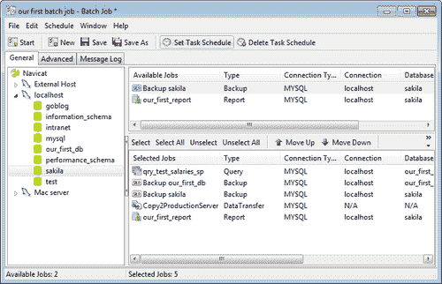

您可以通过按下工具栏上的**设置任务计划**按钮来设置此作业的执行时间。这将带来另一个弹出窗口，在其中您可以在**计划**选项卡下设置作业的周期或频率，或指定开始日期和可选的结束日期，以及重复次数。

高级选项卡允许您配置电子邮件，以便在批处理作业自动运行后通知用户或一组用户的结果。甚至可以附加从导出向导或数据传输中生成并发送的电子邮件的文件输出。

要基于现有作业创建批处理作业，请选择作业，然后单击对象窗格工具栏上的“设计批处理作业”，或者从右键单击作业触发的弹出菜单中选择它。完成修改后，您可以单击编辑窗口工具栏上的“另存为”按钮，或者从菜单栏中选择“文件”|“另存为…”。

实现相同结果的另一种快速简便的方法是在选择作业后复制并粘贴作业，然后对复制的作业进行所需的修改。

# 总结

在本章中，我们已经处理了不同的数据操作技术，将数据从一个数据库转移到另一个数据库，并将其转换为各种文件格式。

您还学会了通过结构和数据的方式同步数据库的两个实例。

备份和恢复操作，以及批处理作业的创建和调度，在数据库的生命周期（以及 DBA 的生活）中也是必不可少的，您已经学会了如何使用 Navicat 提供的快速简便工具来完成这些任务。

在下一章中，您将进入 Navicat 的数据建模。
