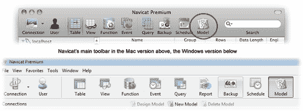
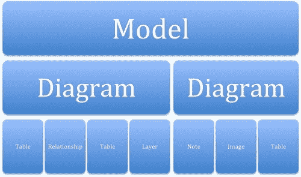
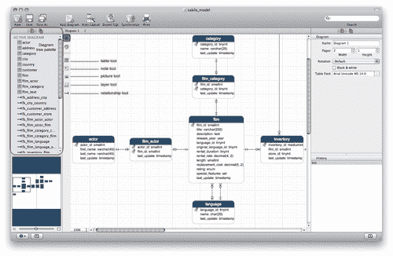
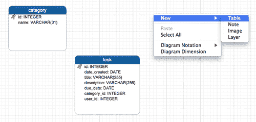
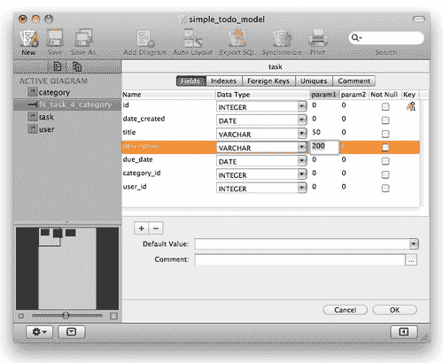
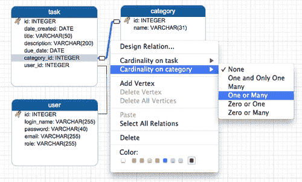
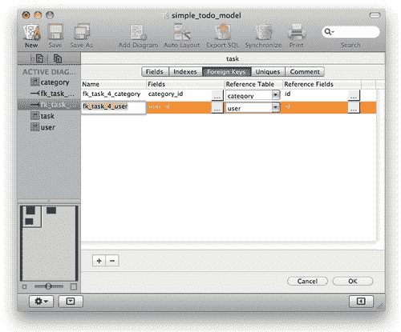
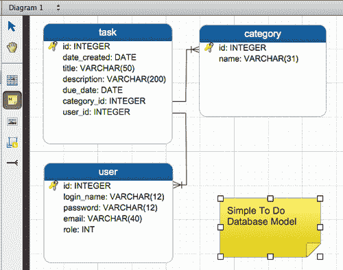
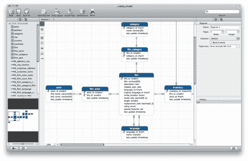

# 第四章：使用 Navicat 进行数据建模

从 Navicat 的 10 版本开始，该应用程序增加了一个数据建模功能，允许用户在可视化编辑器中创建和编辑数据库对象，如表、字段和关系。

PremiumSoft（Navicat 的制造商）还将此功能作为一个名为**Navicat Data Modeler**的独立应用软件产品发布，可在 Windows、Mac OS X 和 Linux 上使用。对于那些专门需要数据建模的可视化工具，而不需要其他管理和数据管理工具的人来说，Navicat Data Modeler 可能是一个合适的选择。

虽然 Oracle 的 MySQL Workbench（用于 MySQL 的 GUI 管理和数据库建模工具）可以被认为是一个免费的替代品，但 Navicat Data Modeler 提供了更容易操作模型对象的手段，并且还提供了一些高级功能，如历史跟踪和数据库同步；由于这一点，您可以异步地处理数据图表，以便稍后与实际数据库结构进行同步。为了更好地理解 Navicat 建模工具的功能，我们将通过跟随教程来设计我们的第一个数据模型，以帮助您逐步学习每个功能。

在本章中，我们将学习如何掌握 Navicat 的可视化数据建模工具，这使得以下操作变得容易：

+   在 GUI 中设计数据模型

+   在可视化编辑器中创建、编辑和操作表结构

+   将数据模型转换为`.sql`文件

+   将现有数据库反向工程成可视化表示

# 使用 Navicat 的模型设计师

在我们开始设计第一个数据模型之前，熟悉 Navicat Data Modeler 提供的工具是一个好主意，我们可以利用这些工具。

在 Navicat 的主窗口的主工具栏上的最后一个按钮是**Model**按钮。单击此按钮将带您进入模型视图。另一种方法是从**View**菜单中选择**Model**（在 Mac 上，您可以同时按下*+*键和*8*键作为快捷键）。然后，您可以通过右键单击主窗口的对象窗格中的任何位置并选择**New model**来创建一个新的空模型。

### 注意

在 Mac 上，同时按下*+*键和*N*键作为快捷键，或者在主窗口的左下方框架上单击*+*按钮。在 Windows PC 上，只需单击主窗口中主工具栏下方的次工具栏上的**New Model**按钮。

Navicat 在 Mac 和 Windows 上的工具栏截图如下：



这个操作也会弹出一个名为**模型设计师**的新窗口，您可以在其中编辑数据模型。**模型设计师**窗口的左侧窗格包含了一个树形调色板的图表，可以帮助您切换到其对应的模型树调色板；通过点击其上方的小图标，可以获得一个模型树调色板。图表树调色板按字母顺序列出了模型对象，如表、关系、注释和活动图表的图片。模型树调色板只列出了模型中所有图表对象。这些隐喻可能会非常令人困惑，所以我将简要描述每个隐喻的含义，并解释它们的层次结构。

每个模型可以包含一个或多个图表，这也可以称为数据库管理员的**实体-关系图**（**ER 图**）。数据库设计可以分布在模型内的多个图表中。还有**层**的概念，但与图形和图像处理应用程序不同，Navicat 的数据建模器中的层不是容器或占位符。与其他对象一样，它们绘制在画布上，但有一个细微的区别，使它们不透明并且可以叠加在其他对象上。层可以用于通过将相关对象分组并根据不同的关注点进行分离来组织某些对象。例如，在设计 ERP 数据库时，您可能希望将与会计和财务相关的表汇集在一层中，并将与销售和营销相关的表汇集在另一层中。



其右侧对齐的是一个垂直工具栏，也称为模型图表调色板，您可以从中选择要放置在图表中的数据库对象类型。在此上下文中可用的对象包括表、注释（标签）、图片（图像）、层和关系。窗口的右侧包含**属性**调色板（在 Windows 中位于左下角），用于显示和编辑活动图和其中包含的对象的属性。在这里，您可以管理与画布中所选项目相关的每个设置，包括重命名图表、调整页面数量（打印时很重要）、调整对象标签的字体和颜色，以及图表的符号。有五种可用的符号——**默认**、**简单**、**IDEF1X**、**UML**和**Crow's Foot**。

**属性**调色板下方是**历史**调色板（在 Mac 版本中），它逐步列出您执行的每个操作，允许您按照您希望的步骤数撤消这些操作。在相反的一侧还有一个预览窗格，几乎对称地放置，您可以用它进行类似地图的导航。在 Windows 版本中，这两个调色板放置在彼此的确切相反位置。请参考 Mac 版本中 Navicat 的以下截图：



## 创建我们的第一个模型

本节介绍了一个教程，我们将为数据库创建一个相当简单的待办事项应用程序的模型。我们的新数据库将包括三个表——任务、类别和用户。使用模型设计工具，我们将设计这些表，还将定义字段类型、主键和关系。这三个表将使用外键相互关联。然后我们将对模型进行注释，最终生成实际的数据库，将我们创建的模型进行正向工程。要开始对模型进行操作，请切换到“模型视图”窗口（如果尚未这样做），方法是单击 Navicat 主窗口主工具栏上的大“模型”图标；或者从“视图”菜单中选择“模型”，然后右键单击对象窗格中的空白区域，选择“新建模型”。在 Navicat 的 Windows 版本中，您还可以直接单击主窗口下方主工具栏下方的“新建模型”按钮。在 Mac 版本中，没有次要工具栏。相反，在足够宽的下框架上，有一个“+”号。这个“+”号直观地表示在所选上下文中添加对象的功能。在这种情况下，一个模型伴随着另外两个按钮；一个是带有“-”符号的按钮，表示删除，另一个是带有铅笔图标的按钮，表示编辑。（Windows 版本有相应的按钮，明确标记为“设计模型”和“删除模型”）完成此步骤后，将弹出一个名为“Untitled-Model”的新模型设计师窗口，向您呈现一个名为“Diagram 1”的空白图。现在，让我们准备开始编辑模型，通过在图表中创建我们的第一个表。单击垂直模型图工具栏上的“表”按钮（一个带有表形图标的小按钮），然后单击画布的空白区域。您还可以右键单击画布，然后从弹出菜单中选择“新建”|“表”。在您上次单击的位置，将在画布上绘制一个新的类似正方形的带有圆角的框，带有蓝色标题栏标记为“表 1”，也突出显示，表示它已准备好为您方便地重命名。为了重命名它，请键入`category`并按“Enter”键。接下来，在框内右键单击，然后从弹出菜单中选择“添加字段”。（另一种快捷方式是在编辑表或字段名称时，从键盘上按下箭头键或“Tab”键。）您会注意到一个文本光标在代表表的框内闪烁。

键入`id`并按“Enter”键。当 Navicat 创建字段时，它还会根据您输入的名称感知到这个字段的用途，并自动将字段定义为**INTEGER**类型的主键。现在继续并重复上一步，这次键入`name`作为字段名称，并按“Enter”键。欣喜！Navicat 也正确感知到了这个字段，并将其创建为长度为 255 个字符的 varchar 类型。255 个字符的长度也许有些夸张，但我们将看到如何稍后将其缩小。ID 和名称字段对于类别表已经足够了，所以我们现在转向第二个表。请参考以下屏幕截图，查看表“category”和“task”是如何创建的：



1.  创建另一个表，并将其命名为`task`。

1.  为此也添加一个名为`id`的字段（看看 Navicat 如何将其创建为另一个**INTEGER**类型的主键）。

1.  将第二个字段命名为`title`并按“Enter”键。（Navicat 将创建一个**VARCHAR(255)**类型的字段。）

1.  以同样的方式，添加以下字段——`description`、`due_date`、`category_id`和`user_id`。（Navicat 将确定它们应该创建的类型。）

1.  创建最后一个表，并将其命名为`user`。

1.  为此创建以下字段—`id`、`login_name`、`password`、`email`和`role`。

现在，我们需要微调一些这些字段。例如，我们将把这些 varchar 字段的长度从 255 个字符减少到一些更合理的长度。要做到这一点，右键单击**任务**，然后从弹出菜单中选择**设计表**。这将使一个表设计界面非常类似于您在第二章*与数据库一起工作*中看到的表。在 Mac 上，表将看起来类似于以下截图：



在这个屏幕上，您可以添加或删除字段，或重命名它们，更改它们的数据类型，更改数据长度，分配或删除主键，为字段定义默认值，添加索引，甚至添加诸如外键或唯一性定义之类的约束。

您甚至可以通过手势将鼠标拖放字段来重新排列字段。

在这个例子中，我们将把标题的长度减少到`50`，描述的长度减少到`200`。

您可以参考第二章*与数据库一起工作*，了解有关表设计界面及其提供的功能的更多详细信息，用于编辑和调整表结构。

## 定义关系

现在我们有了三个相关的表，是时候定义它们之间的关系了。这个模型是用于一个**简单的待办事项**数据库，我们的主要数据将存储在**任务**表中。在这里输入的每个任务都将有一个标题、描述、录入日期、截止日期、类别和用户。我们在单独的表中存储类别和用户，因此我们需要从**任务**表中引用相关的类别和用户，使用 ID 列。**类别**表和**任务**表之间存在多对一的关系。在我们的情况下，一个任务可以与一个类别关联，但一个类别可以有多个任务。因此，一个任务可以分配给一个用户，但一个用户可以有多个任务。

要在两个表之间建立连接，首先从垂直调色板中选择关系工具，然后将指针移动到**任务**表，点击并拖动**category_id**字段，将其拖放到**类别**表的**id**字段上。这样应该建立了两个表之间的连接，在画布上连接它们的一条线应该出现。

但这还不是全部。到目前为止，我们所做的是建立一个基本的一对一关系，没有进一步的关于两个对象之间基数的信息，如下图所示：



现在，右键单击相邻的线，然后从弹出菜单中选择**类别上的基数** | **一对多**。现在，两个表之间建立了一对多的关系，从**类别**到**任务**的外键也自动创建了；此外，连接线的类别端将在图表中有一个类似叉子的连接点。图表编辑器（直接在画布上编辑）的一个缺点是，当关系通过点按和拖放手势进行视觉定义时，线的连接点可能不会放置在引用和被引用字段的开始或结束位置。因此，您需要通过点击和拖动连接点来手动调整它们，将它们调整到图表对象的正确位置（当然，如果您希望在这些关系的视觉表示中获得更多精度）。

我们也可以使用弹出菜单中的**设计关系...**命令，这相当于双击连接线，这将带我们回到具有**外键**选项卡激活的表设计界面。在这里，您可以微调相邻表-字段对的外键定义；此外，它还为您提供了引用多个字段的灵活性。

正如你所见，最好同时使用画布编辑和表设计工具，而不是作为替代方案，以充分利用两个世界，并在数据建模中获得最大的灵活性。参考以下截图，看看**外键**是如何创建的：



### 注意

正如许多数据库管理员和软件项目经理所建议的（如果不是必须的），在创建数据库对象时遵守某些命名约定是一个好主意，特别是像**外键**这样的约束。我喜欢将**外键**命名为以表名为前缀的`fk_`，然后是`_4_`，然后是被引用的表名，最后是其主键字段的名称。例如，在任务-类别关系的情况下，我使用`fk_task_4_category_id`作为外键名称，这意味着这个约束是为**任务**表定义的外键，它引用**任务**表自身的**category_id**字段从**类别**表的**id**字段。

虽然 Navicat 为数据库对象管理提供了许多人性化的功能，特别是约束和索引管理，但许多其他工具却没有。如果需要修改，对于不使用复杂 GUI 工具来管理数据库的人来说，要找到数据库中的外键或其他约束可能会变得很麻烦，除非从头到尾都遵守某种命名标准，并且所有人都遵守。

编辑完成后，点击屏幕右下角的**确定**按钮保存更改，或者点击**取消**放弃更改。

## 通过注释和图片为模型增添一些活力

想象一种情况，你正在设计一个数据库模型作为项目提案的一部分，你希望你的模型看起来漂亮和吸引人。嗯，除了一个精心设计的 ER 图表之外，可能还需要更多。垂直模型图表面板上的附加对象，我称之为注释工具，可以帮助你实现这一点。

点击垂直模型图表面板上一个黄色图标的小按钮，激活注释工具，然后点击画布上的空白区域放置一个便利贴。你可以双击它来编辑它的文字，如下截图所示：



我们刚刚添加的注释看起来确实像一个便利贴，我个人认为它看起来很不错。但如果你想改变注释的外观（比如颜色和文字样式），你可以在属性窗格中尝试不同的设置。属性编辑器可以让你调整注释的颜色，（矩形）大小，位置，甚至字体大小和样式。

如果你不想在你的模型上贴一个便利贴，而是想要更现代的东西，你可以选择让纸张状的图形完全消失，只留下文字。要做到这一点，只需点击箭头工具，使注释保持高亮（或选中），然后在属性窗格中从下拉列表**注释样式**中选择**标签**。在 Windows 中，右键点击注释，然后转到**样式** | **注释**。

在注释图标的下方，有一个带有小图片图标的图片工具。你可以通过首先点击激活此工具，然后在画布上的任何位置点击来向图表中添加任何图片或图像。这将提示你使用操作系统的标准**打开**文件对话框，从磁盘中选择一个图像文件或照片。这样做后，你选择的图像将被放置在你在画布上点击的位置。例如，你可以将公司标志放在一个角落，使外观更加企业化。

## 使用图层

正如前面提到的，Navicat 的模型设计中的图层只用于给画布的某些区域上色以进行注释，并且可以用于标记画布的某些业务逻辑类型的表。例如，你可能想要将与人力资源相关的表分开，并将它们放在一个特定图层的边界内，将与制造和物流相关的表放在另一个图层中，例如，在一个由不同图层区分的不同区域中，最好是用不同的颜色在同一个图表中。

要创建一个图层，只需点击垂直调色板上关系工具上方（图像工具下方）的图标，然后在画布上点击并拖动你想要放置图层的矩形区域。

### 注意

请记住，图层既不是容器也不是占位符，它们除了作为视觉辅助外没有其他用途。

## 删除不需要的对象

当你在模型设计中创建一个表时，它会同时存在于图表和模型中。此后从图表中删除表并不一定意味着它会从模型中删除，但好消息是，你会被询问你想从哪个上下文中删除表，只要你右键点击表并选择“删除”|“从图表中删除”或“删除”|“从图表和模型中删除”。

有什么不同？嗯，这个决定会影响从模型设计生成数据库时将创建的对象。在本节的最后，你将学会如何通过从模型设计生成 SQL 来正向工程化数据库。

除了表和关系之外的对象对数据库结构没有影响，因此从图表中删除它们也会从模型中删除它们。

## 使用多个图表

正如本章开头所讨论的，一个模型可以包含多个图表。如果你正在处理非常庞大的数据库，其模型太大无法管理，那么在模型内使用多个图表可能是必要的，你别无选择，只能将它们分成子组并放置在不同的图表中。

我们不会详细介绍在同一个模型中使用多个图表的工作。但是，我想在这里提到一些要点。此外，Navicat for Windows 的用户界面在某些方面与 Mac 版本不同，因此我将尝试简要解释两个用户界面之间的区别。

在 Windows 和 Mac 平台上，你可以通过在模型设计窗口的工具栏上点击“新建图表”按钮来创建一个新的图表。在 Windows 上这样做时，新的图表会出现在画布区域上方的新标签下。你可以通过点击它们的标签来在图表之间切换。

在 Mac 版本中，画布的左上方没有标签栏，而是一个下拉菜单，标有活动图表的名称。此外，在 Mac 版本中，每个窗口的左下方都有一个形状像齿轮的小黑色图标。点击它会弹出一个菜单，让你添加与当前上下文相关的对象。要在 Mac 上切换图表，只需点击其名称，然后从打开的下拉菜单中选择你想要切换的图表的名称。

# 将模型图表导出到 SQL

我们已经完成了一个简单但功能齐全的数据库模型设计。现在是时候将其投入使用了。

我之前提到过，可以从模型生成数据库的可能性。要实现这一点，我们首先需要将我们的设计导出到一个`.sql`文件中。

在 Mac 上，模型设计窗口的工具栏上有一个标有**导出 SQL**的按钮。当您按下它时，画布上会出现一个导出设置表单，您必须在其中指定要导出的表，并可选择指定一些高级设置，例如排除生成的 SQL 中的 DROP 语句、主键、索引和外键。如果您不想省略任何内容，可以将这些设置保持不变。

然而，在 Windows 版本中，工具栏上没有导出按钮；相反，您必须从菜单栏中选择**工具** | **导出 SQL...**。

我建议您取消 DROP 语句的选项，因为这是我们第一次创建**Simple To Do**数据库，可能会导致 SQL 错误。

您可以将要导出的文件命名为`simple-todo.sql`，然后继续导出过程。

导入和导出数据在第三章中有详细讨论，*使用 Navicat 进行数据管理*。

导出文件的源代码应该类似于以下内容：

```
CREATE TABLE category (
id INTEGER NULL,
name VARCHAR(31) NULL,
PRIMARY KEY (id) 
);
CREATE TABLE task (
id INTEGER NULL,
date_created DATE NULL,
title VARCHAR(50) NULL,
description VARCHAR(200) NULL,
due_date DATE NULL,
category_id INTEGER NULL,
user_id INTEGER NULL,
PRIMARY KEY (id) 
);
CREATE TABLE user (
id INTEGER NULL,
login_name VARCHAR(12) NULL,
password VARCHAR(12) NULL,
email VARCHAR(40) NULL,
role INT NULL,
PRIMARY KEY (id) 
);
ALTER TABLE task ADD CONSTRAINT fk_task_4_category FOREIGN KEY (category_id) REFERENCES category (id);
ALTER TABLE task ADD CONSTRAINT fk_task_4_user FOREIGN KEY (user_id) REFERENCES user (id);
```

最后，通过应用您在第二章中学到的知识，*与数据库一起工作*和第三章中学到的知识，*使用 Navicat 进行数据管理*，您可以创建一个名为**simple_todo**或**todo**的新数据库，并**执行 SQL 文件...**从我们导出的模型生成数据库。

### 注意

您还可以将以下代码粘贴到查询窗口中，并执行查询以实现相同的结果，前提是您已经创建了空白数据库。

# 将数据库反向工程成模型

在前几节中，我们学会了如何从头开始设计数据模型。现在您已经熟悉了数据建模工具和图表结构，我们可以开始从现有数据库生成模型。

对于这一部分，我选择了 Sakila 示例数据库，我在第三章中介绍了*使用 Navicat 进行数据管理*。如果您已经按照上一章的教程操作，那么您必须有一个可用于反向工程成数据模型的**sakila**数据库的工作副本。如果没有，现在是一个好时机来看一看，并至少按照步骤将**sakila**数据库导入到您的 MySQL 服务器中。

转到 Navicat 的主窗口，在**连接**窗格中找到**sakila**数据库；右键单击其名称，然后从弹出菜单中选择**反向数据库到模型...**。

新的模型设计窗口应该立即显示出 Sakila 数据库的所有表和关系的可视图表，如下面的屏幕截图所示：



您可以尝试应用本章学到的知识，例如添加注释和图层，以及微调连接线。

如果您最终修改了模型，添加了表、字段和关系，您可以将这些更改同步回**sakila**数据库，而无需从 SQL 文件重新生成整个数据库。

要做到这一点，只需点击工具栏上的**同步**按钮（在 Mac 上），或者从菜单栏中选择**工具** | **同步到数据库...**（在 Windows 上）。

有关数据同步过程及其设置的详细信息在第三章中有详细介绍，*使用 Navicat 进行数据管理*。

# 总结

我们从让您熟悉 Navicat 的可视化数据建模工具开始，介绍了它引入的隐喻，以及如何设计表、字段、约束和这些对象之间的关系。这些都是视觉和基于表单的工具，类似于前几章介绍的 Navicat 的其他工具。

使用这些工具，您学会了如何从头开始设计数据库模型，然后实际从模型生成了数据库。

最后，我们对一个更大的现有数据库进行了逆向工程，并使用一键向导自动生成了其可视化模型，您已经学会了如何在模型上进行进展时将更改同步回数据库。
