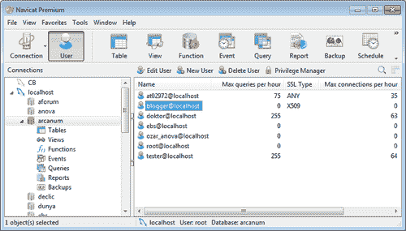
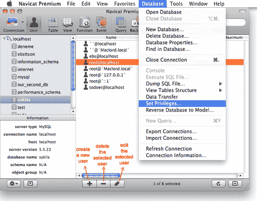
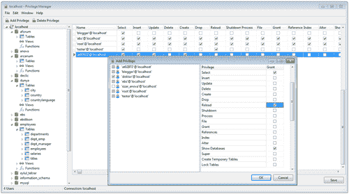
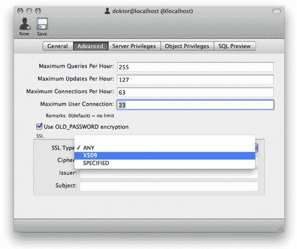
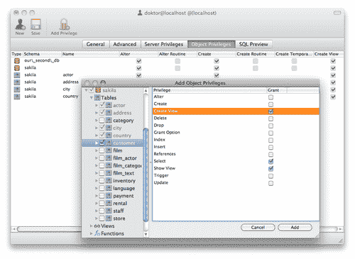
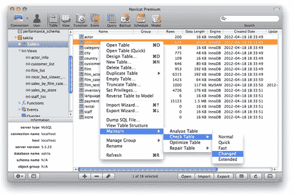

# 第五章 数据库维护和安全管理

MySQL 是最流行的数据库平台之一，被广泛用于驱动互联网上的数据库驱动网站，并经常被用于用 PHP 编程的 Web 应用程序。MySQL 提供了高性能、易用性和简单安装等功能，但是在 5.5 版本之前，MySQL 的默认安装带有一个名为**root**的用户，没有密码，这带来了一个相当令人担忧的安全漏洞。

MySQL 5.5 及更高版本需要一些基本配置，包括某些安全措施，不限于在安装后立即为**root**用户设置密码，而 MySQL 5.1 的新安装必须在尽早的时候为**root**用户设置密码。Navicat 不仅使这些配置易于管理，而且还提供了一些有用的安全管理和数据库维护工具。

本章重点介绍使用 Navicat 进行 MySQL 的基本**数据库管理员**（**DBA**）功能，涉及安全和维护。通过本章结束时，您应该能够掌握在 Navicat 中为 MySQL 执行以下操作：

+   创建和编辑 MySQL 用户

+   管理用户权限

+   执行维护任务，如数据库分析、优化和修复

# 使用 Navicat 进行用户和权限管理

MySQL 数据库安全的第一个主题是用户和权限管理。在 Navicat 主窗口中带有图标的工具栏上的第二个按钮是**用户**按钮。激活它将在对象窗格中显示属于连接窗格中所选 MySQL 服务器的所有用户。所有属于屏幕左侧的选定 MySQL 服务器的用户都在屏幕左侧。

添加、编辑、复制和删除用户与在 Navicat 中管理任何其他数据库对象一样，所以如果您感到迷失，请快速回顾一下。以下截图显示了所有属于选定 MySQL 服务器的用户：



与用户管理上下文相关的次要工具栏，在 Navicat 的 Windows 版本中，明确展示了用于编辑现有用户、添加新用户和删除现有用户的实用按钮，此外，您还会注意到一个带有锁图标的不同按钮，名为**权限管理器**。**权限管理器**按钮是在 Navicat 的第 10 版中引入的，它就像一个命令中心，您可以在其中管理所有模式的所有用户，并在单个窗口内查看整个服务器的所有权限矩阵，或者特定目录（数据库）的所有权限。

在 Navicat 的 Mac 版本中，界面是完全不同的，因为主窗口下面没有次要工具栏；相反，您可以使用窗口底部的小图标（带有加号、减号和铅笔形状图标）来创建、编辑和删除用户。至于**权限管理器**按钮，您需要从菜单栏中的**连接**菜单（在连接窗格中选择服务器时）或**数据库**菜单（在选择服务器下的数据库时替换**连接**菜单）中选择**设置权限...**命令。以下截图显示了 Mac 平台上的用户列表：



**权限管理器**按钮提供了对定义的服务器的所有连接、它们拥有的所有数据库以及为它们存在的所有用户定义和设置的各种权限的底层视图。

起初可能会显得有些复杂，因为它旨在从一个地方控制与特权相关的一切。但这并不一定是管理权限的唯一手段。在后面的部分中，您将看到如何逐步为特定用户设置它们。事实上，“特权管理器”按钮在单个界面中概括了您将在后面部分中看到的有关编辑对象权限的内容。



在第一章，“入门”中，当您首次连接到 MySQL 服务器时，还定义了**root**用户的设置。**root**用户在切换到“用户”视图时始终显示在对象窗格中（除非出于特定原因被删除，当然，这应该是一个很好的原因，我可能会补充说明）。用户名后面添加了`@`符号，该符号后面是用户被允许连接的服务器名称；在这种情况下，服务器名称是`localhost`。如果您希望**root**用户从远程机器连接，那么您必须添加另一个具有相同名称的用户；在这种情况下，用户名是**root**，但在“主机名”字段中指定该远程机器的域名或 IP 地址。例如，您可以看到`myuser@workpc`。

## MySQL 如何处理访问权限

Navicat 的在线手册提供了以下关于 MySQL 的信息：

+   MySQL 权限系统的主要功能是对连接到给定主机的用户进行身份验证，并将该用户与数据库上的特权（如 SELECT、INSERT、UPDATE 和 DELETE）关联起来。

+   有关用户权限的信息存储在名为**mysql**的数据库中的**user**、**db**、**host**、**tables_priv**、**columns_priv**和**procs_priv**表中。MySQL 服务器在启动时读取这些表的内容。

+   MySQL 访问控制在运行连接到服务器的客户端程序时涉及两个阶段，即 Navicat：

+   阶段 1：服务器检查是否应允许您连接。

+   阶段 2：假设您可以连接，服务器将检查您发出的每个语句，以确定您是否具有足够的权限执行它。例如，创建表权限、删除表权限或修改表权限。

+   服务器在访问控制的两个阶段都使用 mysql 数据库中的 user、db 和 host 表。

## 深入了解在 Navicat 中创建和编辑用户

Navicat 的用户设计工具提供了灵活性，可以向任何用户授予或撤销服务器权限，并采用选择性方法，以便在特定数据库、表、视图（甚至单个字段）、函数和过程上单独管理权限。

与任何其他对象一样，为了在 Navicat 中创建和编辑用户，您可以使用相关的工具栏按钮（在前一节中描述），或者右键单击用户列表以从弹出菜单中选择必要的操作，“添加用户”、“编辑用户”或“删除用户”。

在打开的用户编辑窗口中，您必须在“常规”选项卡下填写基本用户属性，如“用户名”、“主机”和“密码”。

完成后，您可以切换到“高级”选项卡，在那里您可以指定每小时为用户分配的查询和连接数量（限制）。所有值都设置为 0（默认），在这种情况下意味着无限制。

您需要勾选**使用 OLD_PASSWORD 加密**选项，以为需要连接到 4.1 或更高版本的 MySQL 服务器的任何早于 4.1 的客户端设置密码。否则，服务器将生成长密码哈希。该选项不影响身份验证（MySQL 4.1 及更高版本仍然可以使用具有长密码哈希的帐户），但它确实防止了在用户表中创建长密码哈希作为更改密码操作的结果。以下是**高级**选项卡的屏幕截图：



SSL 窗格允许您指定与 SSL 相关的选项，例如身份验证类型和证书属性。有关配置 SSL 选项的更多信息，您可以参考 Navicat 的在线手册。相关部分位于**服务器安全管理** | **MySQL 安全管理** | **MySQL 用户设计** | **设置高级 MySQL 属性**下。

**服务器权限**选项卡是您可以向用户授予服务器范围的权限，然后应用于该服务器上的所有数据库的地方。一旦授予，用户将在服务器上的所有数据库上具有相同的定义权限。由于权限列表按字母顺序排列，您只需在第二列中的列表项对应的小框中选中或取消选中。当您编辑**root**用户时，您会注意到所有权限都将显示为已选中。要选择（或取消选择）列表中的所有项目，请右键单击列表中的任何位置，弹出菜单中显示**授予所有**和**撤销所有**命令。

在 Mac 中，在**对象权限**选项卡下，您可以为任何选定的数据库对象（无论是整个数据库本身还是特定表、字段、视图或过程）添加单独的权限，如下屏幕截图所示：



在 Windows 中，单击**权限**选项卡以添加权限。

要编辑用户的特定对象权限，请单击**添加权限**以打开次要模型窗口，并按照以下步骤操作：

1.  展开树视图中的节点，显示从数据库到单个对象（如表和字段）的层次结构，直到达到您想要定义权限的目标对象。

1.  勾选对象以在右侧窗格上显示权限列表。

1.  在列表中，针对**权限**列下列出的权限类型，选中**授予**选项以分配给用户。当然可以授予多个权限。

1.  完成后单击**添加**按钮，然后记得按下用户编辑窗口主工具栏上的**保存**按钮（用软盘图标表示）。

**SQL 预览**选项卡生成 SQL 命令，需要在服务器上运行以授予或撤销权限，自上次保存权限设置以来。因此，这些 SQL 命令在单击**保存**按钮后会自动执行。

以下是编辑权限生成的 SQL 命令的一些示例：

```
GRANT Alter, Create View, Grant Option, Create ON `sakila`.* TO `producer`@`localhost`;
GRANT Alter, Create View, Grant Option, Create ON TABLE `sakila`.`actor` TO `producer`@`localhost`;
GRANT Alter, Create View, Grant Option, Create ON TABLE `sakila`.`address` TO `producer`@`localhost`;
GRANT Alter, Create View, Grant Option, Create ON TABLE `sakila`.`city` TO `producer`@`localhost`;
GRANT Alter, Create View, Grant Option, Create ON TABLE `sakila`.`country` TO `producer`@`localhost`;
GRANT Create View, Select, Show View ON TABLE `sakila`.`customer` TO `producer`@`localhost`;
```

# 使用 Navicat 执行维护任务

Navicat 提供了一组用于数据库和表维护任务的图形工具，实际上是本机 MySQL 服务。为此，Navicat 支持可以在 MySQL 数据库表上执行的四个主要任务：

+   分析

+   检查

+   优化

+   维修

在编写本书时，Navicat 没有专门的菜单（在菜单栏中）或按钮来触发这些任务。基本上，您需要在 Navicat 的主窗口中切换到**表**或**视图**，然后右键单击要执行其中一个任务的表或视图。然后，从弹出菜单中选择**维护**，然后选择相关任务作为子菜单项。现在，让我们更仔细地看看这些任务是什么，以及它们有什么用处，如下屏幕截图所示：



## 使用 Navicat 分析 MySQL 表或视图

**分析表**命令分析并存储所选表的关键分布。MySQL 使用存储的关键分布来决定表应该以何种顺序连接。

当分析开始时，如果表的底层数据库引擎是 MyISAM 或 BDB，则使用读锁定表。在 InnoDB 的情况下，使用写锁定表。目前，MySQL 仅支持对 MyISAM，BDB 和 InnoDB 表进行分析。对于 MyISAM 表，此操作相当于运行命令`myisamchk --analyze`。

## 检查表或视图

此维护任务检查表中的错误。在撰写本书时，MySQL 仅支持对 MyISAM，InnoDB 和 ARCHIVE 表进行检查。检查 MyISAM 表时，它们的关键统计信息也会更新。

以下是检查的其他选项的摘要：

| 选项 | 功能 |
| --- | --- |
| **快速** | 不扫描行以检查不正确的链接。适用于 InnoDB 和 MyISAM 表和视图。 |
| **快速** | 仅检查那些未正确关闭的表。仅适用于 MyISAM 表和视图。 |
| **更改** | 仅检查自上次检查以来已更改或未正确关闭的表。仅适用于 MyISAM 表和视图。 |
| **扩展** | 对每一行的所有键进行完整的键查找。这确保表是 100％一致的，但需要很长时间。仅适用于 MyISAM 表和视图。 |

## 优化变得简单

优化表的主要原因是回收未使用的空间并整理与表相关的数据文件。如果您从表中删除了大量行或经常更新具有可变长度行的表（具有`varchar`，`blob`或`text`字段的表），则应优化表。由于优化任务，删除的记录将保留在链接列表中，并且随后的`INSERT`操作将重用旧的行位置。

在撰写本书时，MySQL 仅支持对 MyISAM，InnoDB 和 BDB 表进行优化。

对于 MyISAM 表，表优化的工作如下：

+   如果表中有已删除或拆分的行，请修复表

+   如果索引页未排序，请对其进行排序

+   如果表的统计信息不是最新的（并且无法通过对索引进行排序来修复），请更新它们

## 修复表

标题的意思就是字面意思。如果您怀疑表格损坏或者工作状态不佳，您可以执行**修复表**，在大多数情况下它可以解决所有问题。修复可以以两种模式进行——**快速**或**扩展**。**快速**修复仅尝试修复表的索引树。在扩展模式下，MySQL 逐行创建索引，而不是一次创建一个索引。

# 总结

您已经到达本章的末尾。到目前为止，您应该能够在 Navicat 中创建，编辑和删除用户，为他们分配服务器范围的特权，甚至为特定数据库对象定义个别特权，并为特定用户分配它们。

在故障排除方面，您现在也知道如何分析和检查 MySQL 表或视图的错误，并确保它们正常运行。您还学会了如何使用 Navicat 的一键维护工具来优化和修复 MySQL 表。
