# 第六章。使用 Navicat 设计报表

Navicat 版本 10 的 Windows 版本附带了强大的**报表生成器**，并且在书写本书时，它独家出现在企业版中。使用 Navicat 的报表生成器，您可以在各种报表中呈现来自 MySQL 数据库的数据，例如发票、销售数据、订单摘要，甚至表单和邮寄标签（也称为邮件合并）。您甚至可以设置调度程序（参见第三章，*使用 Navicat 进行数据管理*）以便在特定时间和/或定义的间隔自动传递报告。

正如您将在接下来的章节中看到的，Navicat 的**报表设计器**的外观和感觉在许多方面都类似于 Microsoft Access 的**报表模块**。

为了能够在本章中跟随教程，您需要导入第三章中介绍的 Sakila 示例数据库。

从 Navicat Premium 和 Navicat for MySQL 的版本 10 开始，Windows 的企业版中包含了一个强大的报表生成器工具。本章将培训您开发技能，例如：

+   通过设计 GUI 中的查询来准备报表的数据集

+   使用向导设计报表

+   自定义报表设计

+   以各种格式打印到纸张或文件

# 与工具的初次接触

要访问 Navicat 的**报表管理器**，您只需要从左侧导航窗格中选择服务器和数据库，然后从 Navicat 主窗口的工具栏中单击大的**报表**按钮。或者，您可以从主菜单栏中选择**查看** | **报表**。在**报表**（管理器）的上下文中，您可以使用次要工具栏上的按钮创建、编辑或删除报表，或者在对象窗格的任何位置右键单击以调用弹出菜单，执行相同的操作，如下面的屏幕截图所示：

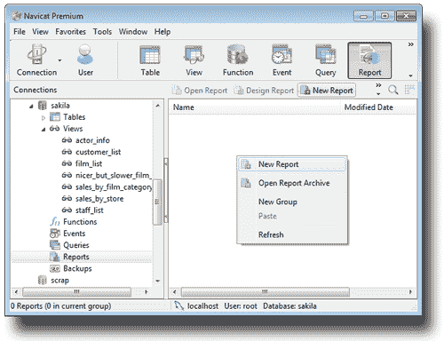

现在让我们继续设计一个简单的报表，基于**sakila**数据库中名为**film_list**的视图。

使用先前描述的方法创建一个新报表。应该会出现一个新的更大的**Untitled**窗口，默认情况下其**Design**选项卡处于活动状态。您还会注意到，这个窗口的用户界面可能是 Navicat 所有其他工具中最复杂的，因为 Navicat 的报表设计器是一个完整的报表生成应用程序。

在空白报表中，我们首先需要做的是选择一个数据集，用它来填充我们的报表。因此，我们需要切换到窗口的**Data**选项卡，以指定报表数据的来源。

# 使用查询向导准备数据

当我们首次打开**Data**选项卡时，会看到一个空白页面。从这里很难弄清楚接下来的步骤是什么。请参考下面的屏幕截图：

使用查询向导准备数据

在这一点上指定一些数据源有点令人沮丧，因为右键单击空白区域没有任何反应，**Data**选项卡下也没有工具栏。相反，您需要转到菜单栏的**文件**菜单，然后选择**新建...**。这将弹出一个小的模态对话框，要求您运行**查询向导**或**查询设计器**，如下面的屏幕截图所示：

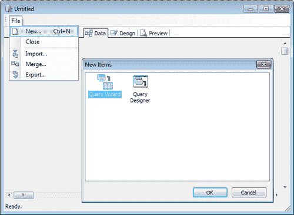

这次我们将使用**查询向导**，因此请确保其图标被突出显示，然后单击**确定**。**查询向导**窗口显示两个可滚动的列表框（并排），一些程序员也称之为穿梭列表。左侧的列表框标题为**可用表**包含了我们**sakila**数据库中所有**表**和**视图**的名称，右侧的列表框标题为**已选择的表**指示了我们从可用表中选择的项目。

您需要点击并选择左侧列表中的一个或多个项目，然后按下**>**按钮后，它们将被转移到右侧的列表中。

出于我们简单教程的目的，我们只需要**film_list**视图。只需点击其名称并将其移动到名为**已选择表**的列表框中，然后点击**下一步**。**查询向导**窗口的屏幕截图如下所示：

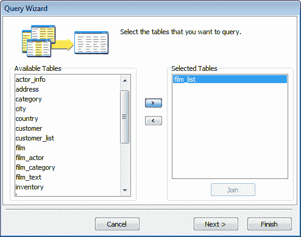

您可以通过再次点击**下一步**来跳过下一个屏幕，因为我们想要选择我们已经选择的数据库视图中的所有字段，而这个选项在此屏幕上已经默认选择了。

在显示是否要**向查询添加计算字段**的屏幕上，我们将再次点击**无计算**，然后再次点击**下一步**。

现在，我们被提供了**根据共同字段值将行分组**的选项，我们也希望通过点击**无分组**来跳过，并再次点击**下一步**。

至于**限制返回的行数**屏幕，我们这里不需要限制，所以保持选择**所有行**，不改变其他任何内容，然后再次点击**下一步**。点击**下一步**后，显示的窗口将类似于下面的屏幕截图：

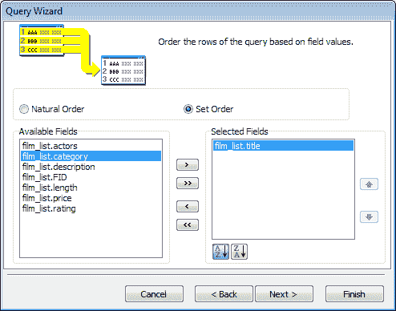

在这里，我们将被询问我们选择的数据集的行将如何排序。默认选项是**自然顺序**，这应该会将结果按照它们在**视图**中出现的顺序带到报告中（这很可能会按照 ID 对项目进行排序）。然而，我认为对于我们的报告，按类别和电影标题对它们进行排序是个好主意。因此选择**设置顺序**，然后将**film_list.category**移动到名为**已选择字段**的列表框中，然后对**film_list.title**做同样的操作，最后再次点击**下一步**。

最后一步将要求我们给我们的查询取一个我们选择的名称，在最后点击**完成**之前，我们可以指示我们是否**返回到数据工作区**、**预览查询**或**修改查询设计**的偏好。选择第一个选项，这也是默认选项。完成后，我们的数据工作区现在将包含**film_list**视图，如下面的屏幕截图所示：

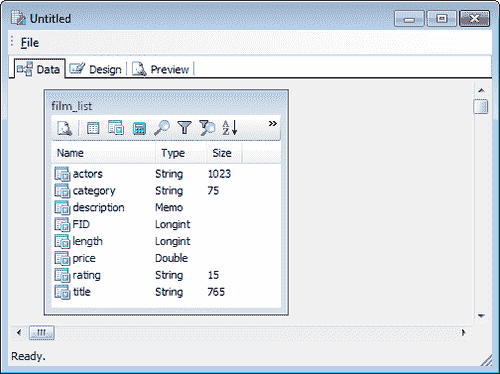

现在，为了了解我们刚刚准备的数据集，点击**film_list**窗口工具栏上的第一个小按钮，这将弹出一个名为**预览数据 - film_list**的弹出窗口，显示我们刚刚创建的查询中的电影记录。您可能需要放大窗口，并通过将鼠标箭头悬停在列标题边界上，然后点击并拖动列到所需的长度来手动调整列的长度，如下面的屏幕截图所示：

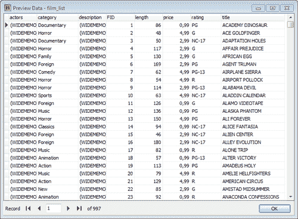

当您完成预览查询结果后，只需点击此窗口右下角的**确定**。

工具栏上的其他七个按钮帮助我们打开报告的**查询设计器**窗口，该窗口允许您通过选择表和字段、定义过滤条件、对字段进行分组等来修改查询。

现在，您可以点击**film_list**表工具栏上的第二个按钮，调用**查询设计器**，并激活其**表**选项卡，通过连接它们来向查询中添加更多的表或视图。同样，第三个按钮将帮助您打开**查询设计器**，并激活其**字段**选项卡，以修改我们在第一次使用**查询向导**时指定的选定字段，如下面的屏幕截图所示：

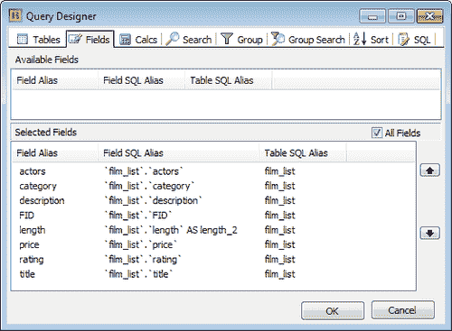

**查询设计器**具有一些高级功能，这里只会简要提及，但不会详细介绍。

例如，**计算**选项卡是您可以在其中使用聚合函数定义一些动态字段，比如`sum()`、`avg()`、`min()`、`max()`和`count()`，或者您可以使用 MySQL 支持的任何 SQL 表达式作为函数。

另一个例子是**搜索**选项卡，您可以在其中定义一些预过滤条件，并将其添加到 SQL 查询作为`WHERE`条件。

为了这份简单的报告，我们现在将暂时离开**查询设计器**，并切换到报告生成器的**设计**选项卡，最终开始处理我们报告的布局。当我们回到**设计**选项卡时，我们会被提醒画布仍然被分成三个区域，作为**页眉**、**详细信息**和**页脚**（也如上方左侧面板中的**报告树**所示），但是在窗口的右侧，我们现在看到**film_list**在**数据树**下，**film_list**下方是**film_list**的**字段**。

# 设计报告

虽然我们可以通过点击和拖动右侧列出的字段到画布上并对齐它们来设计报告的布局，但这是没有向导正常设计报告的方式。这可能会变得非常复杂，所以我会向你展示一个更简单的方法，这将帮助你在很短的时间内完成报告。

转到**文件**菜单，选择**新建...**。一个名为**新项目**的对话框将弹出，并呈现给我们四个按钮作为图标，分别标有**报告向导**、**报告**、**标签模板**和**交叉表向导**。我承诺了更简单的方法，所以我们需要**报告向导**。它应该默认高亮显示，但请确保已选择。然后点击**确定**，如下截图所示：

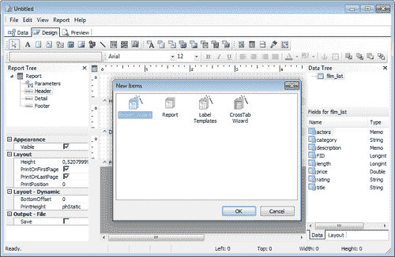

现在，我们应该看到一个名为**报告向导**的模态窗口，它与其他应用程序中的向导非常相似，比如 Microsoft Access。使用这个向导非常直观，因为每个步骤都包括易于理解的解释和用户界面元素。在**报告向导**的第一个屏幕上，您将被要求选择数据集及其字段，这些字段需要出现在报告中。

对于这份报告，在选定字段中按照这个顺序添加**FID**、**标题**、**类别**、**演员**、**评分**和**价格**，然后点击**下一步**。

**报告向导**的下一个屏幕是我们可以指定选定数据可能被分类的组。从**可用字段**中点击**类别**，然后通过按下两个列表框之间的相应下箭头将其移动到**组**列表框中。当您这样做时，您还应该注意到报告布局预览将通过反映此更改而更新，如下截图所示：

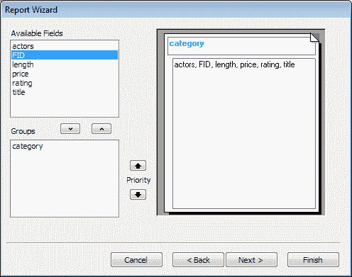

点击**下一步**，继续到屏幕，我们将选择一个**布局**样式并选择（默认）页面打印**方向**。现在，因为我们选择了根据类别对报告输出进行分组，所以在这里我们呈现了共计六种**布局**样式选项。在其他情况下，我们只能选择两种布局——**垂直**（打印标签或卡片样式）或普通的**表格**。

我们在这种情况下拥有的**布局**样式选项是：

+   **分步**

+   **块**

+   **大纲 1**

+   **大纲 2**

+   **左对齐 1**

+   **左对齐 2**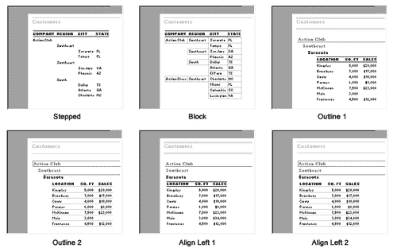

至于**方向**选项，它们只包括**纵向**和**横向**，你应该对这些非常熟悉，因为你每天在其他程序的打印选项中都会用到。

对于我们的报告，我建议您选择**左对齐 2**作为**布局**样式，并将页面（打印）**方向**选项设置为**纵向**，这是默认设置。除非您渴望以后手动调整报告布局上的列宽，您应该保持**调整字段宽度以使所有字段适合页面**选项被选中。

完成后点击“下一步”。参考以下截图：

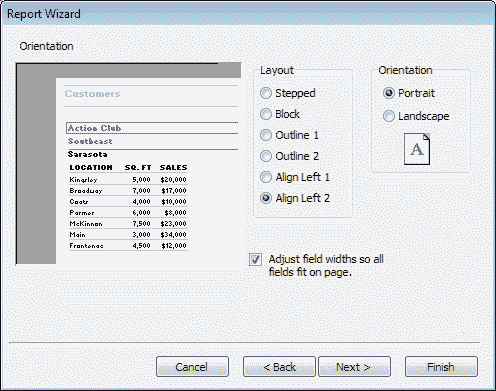

“报告向导”窗口将要求您从现成的报告设计或模板的选择列表中选择一个主题样式，您有以下选项：

+   粗体

+   休闲

+   紧凑

+   企业

+   正式

+   柔和灰

尽管在左侧设计预览中，每次点击选项时，它都会动态更新，让您对报告的外观有一个概念。多次尝试这个可能是个好主意，这样您就可以熟悉报告上反映的每种样式。

我个人最喜欢的是“休闲”，从本章开始的报告设计和预览的截图中您将看到。

当您点击“下一步”时，您会感激现在已经提供了创建报告所需的所有必要信息，并且您将被提供立即预览报告或直接修改报告设计的选择。

首先，在我们预览报告之前，让我们做一些最后的润色，所以在点击“完成”之前检查第二个选项。

当我们回到报告设计时，我们会高兴地发现画布不再是空白的。此外，“标题”、“页眉”、“详细”和“页脚”有点奇怪，因为它们都填满了我们之前在“报告向导”中定义的标签和数据占位符，但看起来仍然很小。

为了使报告看起来更“人性化”，我们可以从将标题更改为更自然的内容开始，比如`Sakila 电影列表`，并通过给列标题标签取一个更好的名字来修改它。例如，将其命名为“项目#”而不是**FID**（代表电影 ID）。参考以下截图：

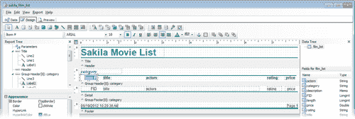

您还需要调整列宽以有效利用空间。例如，您会特别注意到“评分”、“价格”和“类别”列的宽度都比必要的宽。因此，您可以将它们向右移动并减小宽度。然后，增加“演员”和“标题”的宽度。记得垂直对齐列名和数据字段（数据的占位符），它们分别放在页眉和详细区域。

此外，调整“类别”字段的外观是非常推荐的，这将极大地影响报告的外观和感觉，使其看起来更令人愉悦。

# 切换到预览选项卡

现在，是时候切换到“预览”选项卡，看看我们的报告和输出是什么样子了。

在报告预览中，您可以尝试工具栏上的按钮来调整您的查看设置，比如选择如何将报告数据调整到页面上，打印选项，以及在报告输出上进行文本搜索。您还可以使用小的箭头形状按钮在报告的页面之间导航。参考以下截图：

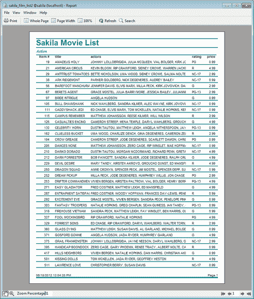

如果您还没有保存报告，现在是保存报告的好时机。Navicat 在保存报告时有一些特殊之处，不像它对待其他对象（如**查询**、**事件**和**模型**）那样。首先，要保存报告，您需要转到菜单栏并选择**文件**|**保存**。当您首次保存报告时，将提示您使用标准的**另存为**对话框。然后，指定一个带有文件扩展名`.rtm`的报告名称和文件系统中的位置，这表明您可以将报告存储在驱动器的任何位置。但是，一旦您单击对话框的**保存**按钮，Navicat 将提示您确认警告，警告您如果将报告保存在 Navicat 报告的默认目录之外，您的报告将无法在程序内的**报告**视图中看到（在这种情况下，您将不得不每次需要在 Navicat 中访问报告时使用**打开文件**对话框来定位报告）。参考以下截图：

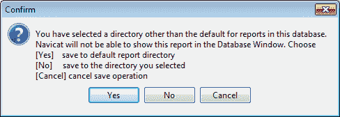

即使您想将报告文件保存在文件的特定文件夹中，最好还是将其保存到默认位置，您可以通过以下路径在 Windows 资源管理器中访问：

`\Users\<user_name>\Documents\Navicat\MySQL\servers\localhost\sakila`

保存报告并退出**报告设计器**后，您需要在**报告**视图中右键单击其名称，并从弹出菜单中选择**设计报告**。直接双击已保存的报告会打开报告输出窗口（与设计者的**预览**选项卡非常相似），从中您可以打印报告或仅查看其内容。

您不仅可以将报告打印在纸上，还可以以多种格式输出，包括 PDF、Excel、文本和 HTML。您可以在**打印**对话框中即时指定此选项。

如果您的目标是基于文本的输出，您可能希望通过选择**文件**|**打印到文件设置...**并指定一些参数，如列分隔符和要包含在输出中的字段，来调整一些更多的设置。

Navicat 的报告构建和管理可以做的事情不仅限于本章讨论的内容，也不仅限于本介绍性书籍的范围之外。但是，您可以通过自己的实验和参考 Navicat 网站上可访问的 Navicat 官方手册来深入探索这些功能。在那里，您还可以找到更多的逐步和屏幕教程，这些教程可以教您如何创建更高级的报告，如发票、详细的订单摘要、销售统计、交叉表报告、邮寄标签，甚至相册。

# 摘要

在 Navicat 中构建报告包括两个主要阶段——准备数据和基于该数据设计报告。

在本章中，我们已经看到了 Navicat 的报告构建和管理工具，以及通过简单教程设计报告的基础知识，这也有助于熟悉一些可用于更高级目的的工具。

我们还看到了报告可以打印在纸上，也可以导出到各种流行的文件格式中。
