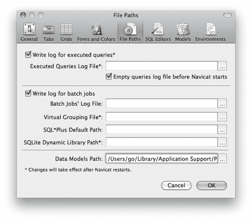
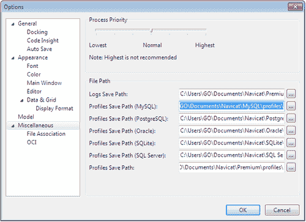
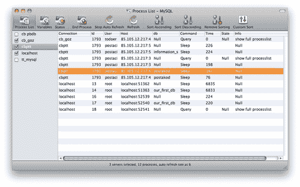
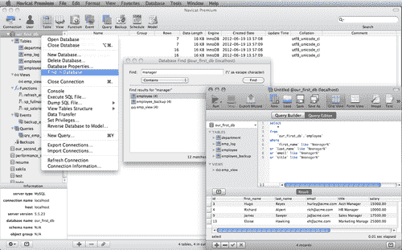

# 附录 A. 额外提示和技巧

在本书中，我们已经介绍了 Navicat 中一些最有用和最常见的任务，但并非它所提供的一切。本附录旨在为您提供有关使用 Navicat 一些不太明显功能的一些额外提示和技巧，例如：

+   将您的设置复制到另一个 Navicat 用户或计算机

+   监视 MySQL 服务器并干预运行中的进程

+   强大的数据库搜索和发现新的查询设计方式

# 将设置从一台计算机转移到另一台计算机

在使用多台计算机（每台计算机都有 Navicat 的副本）的情况下，您可能希望将您的设置、连接配置、自定义查询、数据模型图表甚至批处理作业复制到您使用的所有计算机上。即使不是这种情况，您也可以使用这里的提示来备份 Navicat 设置，以便在重新设置计算机时恢复数据。

## 在 Mac 上转移设置

在 Mac 上，Navicat 中的所有设置、连接配置、保存的查询和模型都存储在两个文件夹中，位于`/Users/<user_name>/Library/Application Support/`中。您可以从**首选项**窗口中自定义**数据模型路径**（只需从**苹果**菜单旁边的应用程序菜单中选择**首选项...**，然后转到打开窗口中的**文件路径**选项卡）。`Application Support`下的一个文件夹名为`PremiumSoft CyberTech`，另一个是`Navicat Premium`或`Navicat for MySQL`，具体取决于您使用的版本和版本。

在 Finder 中，从菜单栏中选择**前往** | **前往文件夹...**（或同时按**+**和**G**键），然后输入`/Users/<user_name>/Library/Application Support/`，然后按**前往**按钮即可到达。最后，将这两个文件夹复制到目标机器或用户的相同文件夹层次结构中。

这将把所有设置、连接配置和保存的模型图表复制到目标机器上。在传输过程中，目标机器或用户不应该运行 Navicat。参考以下截图：

## 在 Windows 上转移设置

某些用户数据，如查询和数据模型图表，以及 Navicat 的报告（仅限 Windows 版本）默认存储在用户的`Documents`文件夹中的`Navicat`目录内。其他设置和连接配置存储在 Windows 版本的注册表中。

您可以通过在 Navicat 的主菜单栏中选择**文件** | **导出连接...**，或者右键单击左侧窗格中的连接定义（数据库服务器名称）并选择相同的菜单项来导出连接设置。然后在目标系统（或用户帐户）上，您可以重复相同的步骤，只是这次选择**导入连接...**并通过**打开文件**对话框指定先前导出的文件（及其路径）。

在 Windows 7 中，用户文档文件夹的完整路径可能是`C:\Users\<user_name>\Documents\Navicat`。

但是，您可以通过转到**工具** | **选项** | **杂项**来自定义默认目录（和路径）。

您可以通过简单地将整个`Navicat`文件夹复制到目标用户的`Documents`文件夹来将查询和数据模型图表转移到另一台 Windows PC。在执行此转移时，请确保目标机器上没有运行 Navicat。请参考以下截图：

# 监视 MySQL 服务器

使用 Navicat，您可以监视数据库服务器以查看运行中的进程、服务器的当前状态以及数据库的属性，如变量。您可以实时获取所有服务器的此信息，以单个、底层视图的形式呈现。

**服务器监视器**可以直接从 Navicat 的主菜单中的**工具**菜单中访问，它有三个主要视图，分为 Windows 版本的选项卡和 Mac 版本的主工具栏按钮。参考以下截图：

## 进程列表

这是您在窗口右侧的复选框列表中选择的所有服务器上运行的进程或任务。您在此屏幕上获得的信息可以列举如下：

+   连接设置中定义的服务器名称

+   在服务器上运行的进程的**ID**

+   登录到服务器的**用户**

+   用户连接的**主机**或 IP

+   当前正在使用的数据库名称

+   用户发出的最后一个**命令**

+   进程的**时间**，**状态**和**信息**

只需点击列表中的进程以突出显示它，然后点击**结束进程**按钮，就可以强制结束一个进程。

您还会注意到工具栏上的其他按钮，它们提供了自动或手动刷新视图的选项。一个不那么明显的技巧是，在自动刷新的情况下，您可以通过从**编辑**菜单中选择**设置刷新速率...**来更改**1**秒默认的间隔为您喜欢的任何值。

## 变量

在此选项卡下，您可以获取所有服务器变量，如**character_set_server**和**date_format**，以及按字母顺序列出的这些变量的值。这些信息通常是通过在 MySQL 服务器控制台中执行**SHOW VARIABLES**命令获得的。

只需选择一行，然后单击包含变量值的单元格右端的方形按钮，就可以在飞行中更改值。（这是一个高级用户真正知道自己在做什么的功能。）

## 状态

**状态**选项卡列出了通过发出**SHOW STATUS**命令从 MySQL 服务器中检索到的相同标准信息。

这会输出一些长的，只读的信息，只有高级用户和 DBA 能理解。

# 揭示 Navicat 的隐藏搜索功能

您可以使用 Navicat 来查找符合某些条件的一个或多个数据库表记录。在 Navicat 主窗口的左侧窗格中选择一个数据库或模式，右键单击它，您将在打开的弹出菜单项中看到**在数据库中查找...**命令。执行此命令将显示一个弹出窗口，让您输入搜索字符串和匹配标准（如**精确**或**包含**，甚至评估**正则表达式**）。

例如，选择我们在第二章中创建的**our_first_db**，*与数据库一起工作*，右键单击它，选择**在数据库中查找...**。然后，在搜索框中输入`manager`，将匹配标准保留为**包含**，然后单击**查找**按钮。

搜索应该产生 12 个匹配项，结果应该总结在搜索框下方。这个功能很酷的地方在于，当你双击其中一个结果时，一个新的查询窗口将打开，其中包含从我们的搜索条件转换而来的生成的 SQL 查询，该查询会自动执行一次，并显示结果。参考以下截图：

# 摘要

本附录为我们提供了一些额外的技巧和窍门，比如如何备份或转移我们的 Navicat 设置。更重要的是？我们已经揭示了一些 Navicat 的隐藏功能（比如**服务器监视器**），它不仅可以为我们提供有关运行进程的详细信息，如客户端用户信息和连接用户运行的命令类型，还可以完全控制手动终止进程。我们还看到了如何使用这个强大的工具获取其他详细信息，比如服务器变量和服务器状态。

最后，我们看到了一个搜索功能，它使我们能够从包含搜索字符串的任何表中检索特定记录，并自动生成一个 SQL 查询，这个查询可以被重复使用来执行相同的搜索，作为标准的 Navicat 查询。
