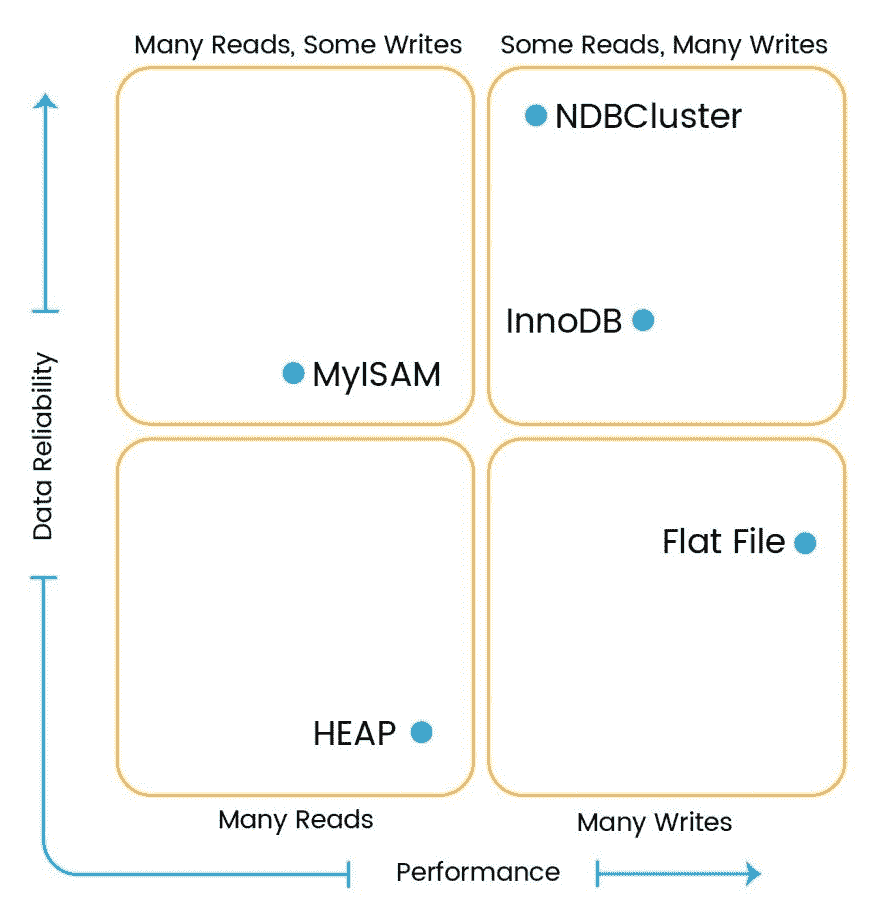
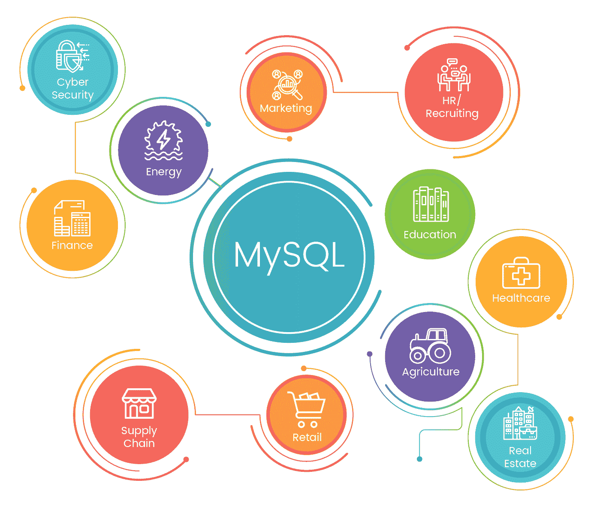

# 第一章：MySQL 8 简介

MySQL 是一个著名的开源结构化数据库，因为其性能、易用性和可靠性。这是关系数据库的最常见选择。在当前市场上，成千上万的基于 Web 的应用程序依赖于 MySQL，包括 Facebook、Twitter 和 Wikipedia 等巨头行业。它还被证明是“软件即服务”（SaaS）应用程序的数据库选择，如 Twitter、YouTube、SugarCRM、Supply Dynamics、Workday、RightNow、Omniture、Zimbra 等等。我们将在本章后面的“MySQL 的用例”部分详细讨论这一点。MySQL 由瑞典公司 MySQL AB 开发，现在由 Oracle Corporation 分发和支持。MySQL 带有宝贵的历史。

MySQL 一直在不断改进，以成为企业级数据库管理系统。预计 MySQL 8 将成为一个改变游戏规则的版本，因为今天我们处于数字化时代。MySQL 8 已经调整好了，以满足以前版本中难以实现的许多新用例。一些产生大量数据的用例包括社交网络、电子商务、银行/信用卡交易、电子邮件、存储在云上的数据等等。对所有这些结构化、非结构化或半结构化的普遍数据进行分析有助于发现隐藏的模式、市场趋势、相关性和个人偏好。

"我们每个人都有很多东西"

- 詹姆斯·特鲁斯洛·亚当斯

让我们深入了解 MySQL 8 的新功能、优势、用例以及 MySQL 8 的一些限制，这是令人兴奋的，让我们做好准备。

# MySQL 概述

结构化查询语言（SQL）用于操作、检索、插入、更新和删除关系数据库管理系统（RDBMS）中的数据。简单地说，SQL 告诉数据库要做什么，以及它需要什么。SQL 是所有 RDBMS 系统（如 MySQL、MS Access、MS SQL、Oracle、Postgres 等）使用的标准语言。

关系数据库管理系统是 SQL 和所有现代数据库系统（如 MS SQL Server、IBM DB2、Oracle、MySQL 和 Microsoft Access）的基础。

SQL 允许用户从 MySQL 访问数据并定义和操作数据。要嵌入其他语言，您可以利用 SQL 模块、库和预编译器，这些可以帮助您创建/删除数据库和表，允许用户创建视图和存储过程、函数等等。它还可以执行各种其他操作，如允许用户在表、存储过程和视图上设置权限。

# MySQL 作为关系数据库管理系统

关系数据库中的数据以有组织的格式存储，以便可以轻松检索信息。数据将存储在由行和列组成的不同表中。然而，还可以在不同表之间建立关系，有效地存储大量数据并有效地检索所选数据。这为数据库操作提供了巨大的速度和灵活性。

作为关系数据库，MySQL 具有与不同表建立关系的能力，如一对多、多对一和一对一，通过提供主键、外键和索引。它还可以执行表之间的连接以检索精确的信息，如内连接和外连接。

SQL 用作与 MySQL 中的关系数据交互的接口。SQL 是美国国家标准学会（ANSI）的标准语言，我们可以用它操作数据，如创建、删除、更新和检索。

# MySQL8 的许可要求

许多行业更喜欢开源技术，因为该技术具有灵活性和节省成本的特点，而 MySQL 通过成为最受欢迎的 Web 应用程序关系数据库而在市场上留下了自己的足迹。开源意味着您可以查看 MySQL 的源代码，并根据自己的需求进行定制，而无需任何费用。您可以从其网站下载源代码或二进制文件，并相应地使用它们。

MySQL 服务器受到**通用公共许可证**（**GNU**）的保护，这意味着我们可以自由地将其用于 Web 应用程序，研究其源代码，并修改以满足我们的需求。它还有企业版，包括高级功能。许多企业仍然购买 MySQL 的支持合同，以获取有关各种问题的帮助。

# 可靠性和可扩展性

MySQL 具有出色的可靠性，无需进行大量故障排除即可良好运行。它还包括许多性能增强机制，如索引支持，负载实用程序和内存缓存。MySQL 使用 InnoDB 作为存储引擎，提供高效的 ACID 兼容事务功能，确保高性能和可扩展性。为了处理不断增长的数据库，MySQL 复制和集群有助于扩展数据库。

# 平台兼容性

MySQL 具有出色的跨平台可用性，这使其更受欢迎。它灵活地运行在主要平台上，如 RedHat，Fedora，Ubuntu，Debian，Solaris，Microsoft Windows 和 Apple macOS。它还提供**应用程序编程接口**（**APIs**）以与各种编程语言（如 C，C++，C#，PHP，Java，Ruby，Python 和 Perl）进行互连。

# 发布

到目前为止，MySQL 的主要版本发布列表如下：

+   MySQL 5.0 GA 版本于 2005 年 10 月 19 日发布

+   MySQL 5.1 GA 版本于 2008 年 11 月 14 日发布

+   MySQL 5.5 GA 版本于 2010 年 12 月 3 日发布

+   MySQL 5.6 GA 版本于 2013 年 2 月 5 日发布

+   MySQL 5.7 GA 版本于 2015 年 10 月 21 日发布

现在是时候进行主要版本发布了--MySQL 8--它于 2016 年 9 月 12 日宣布，并仍处于开发里程碑模式。

# MySQL 的核心功能

让我们回顾一下 MySQL 的一些核心功能。随着我们的进展，我们将在整本书中详细讨论各种功能。

# 结构化数据库

结构化数据库是传统数据库，许多企业已经使用了 40 多年。然而，在现代世界中，数据量变得越来越大，一个常见的需求已经出现--数据分析。随着数字数据的数量和速度日益增长，使用结构化数据库进行分析变得困难；我们需要以一种有效和高效的方式满足这些需求。在开源世界中，最常用作结构化数据库的数据库是 MySQL。

许多组织使用结构化数据库以有组织的方式存储其数据。基本上，结构化数据库中的数据具有固定字段，预定义的数据长度，并定义了要存储的数据类型，例如数字，日期，时间，地址，货币等。简而言之，在插入数据之前已经定义了结构，这使得我们更清楚地知道哪些数据可以驻留在那里。使用结构化数据库的主要优势是数据易于存储，查询和分析。

非结构化数据库与此相反；它没有可识别的内部结构。它可以有一个庞大的无组织的聚集或各种对象。主要，结构化数据的来源是机器生成的，这意味着信息是从机器生成的，没有人为干预，而非结构化数据是人为生成的数据。组织使用结构化数据库来存储诸如 ATM 交易、航空公司预订、库存系统等数据。同样，一些组织使用非结构化数据，如电子邮件、多媒体内容、文字处理文档、网页、商业文件等。

# 数据库存储引擎和类型

让我们现在来看一下不同 MySQL 存储引擎的概述。这是一个重要的部分，它简要介绍了不同的数据库存储引擎；我们将在第六章中详细讨论这个问题，*MySQL 8 存储引擎*。MySQL 将数据存储在数据库中作为子目录。在每个数据库中，数据被存储为表。当你创建一个表时，MySQL 将表定义存储在与表名相同的`.frm`文件中。您可以使用`SHOW TABLE STATUS`命令来显示有关您的表的信息：

```sql
mysql> SHOW TABLE STATUS LIKE 'admin_user' \G;
*************************** 1\. row ***************************
 Name: admin_user
 Engine: InnoDB
 Version: 10
 Row_format: Dynamic
 Rows: 2
 Avg_row_length: 8192
 Data_length: 16384
 Max_data_length: 0
 Index_length: 16384
 Data_free: 0
 Auto_increment: 3
 Create_time: 2017-06-19 14:46:49
 Update_time: 2017-06-19 15:15:08
 Check_time: NULL
 Collation: utf8_general_ci
 Checksum: NULL
 Create_options:
 Comment: Admin User Table
1 row in set (0.00 sec)
```

这个命令显示这是一个带有列名`Engine`的`InnoDB`表。还有其他信息，您可以参考其他用途，比如行数、索引长度等。

存储引擎是处理不同表类型的 SQL 操作的方式。每个存储引擎都有其自己的优点和缺点。了解每个存储引擎的特性，并选择最适合您的表的存储引擎，以最大限度地提高数据库的性能是很重要的。在 MySQL 8 中创建新表时，`InnoDB`是默认的存储引擎。

MySQL 服务器使用即插即用的存储引擎架构。您可以使用`SHOW ENGINES`命令从 MySQL 服务器加载所需的存储引擎，并卸载不必要的存储引擎。

```sql
mysql> SHOW ENGINES \G;
*************************** 1\. row ***************************
 Engine: InnoDB
 Support: YES
 Comment: Supports transactions, row-level locking, and foreign keys
Transactions: YES
 XA: YES
 Savepoints: YES
*************************** 2\. row ***************************
 Engine: MRG_MYISAM
 Support: YES
 Comment: Collection of identical MyISAM tables
Transactions: NO
 XA: NO
 Savepoints: NO
*************************** 3\. row ***************************
 Engine: MEMORY
 Support: YES
 Comment: Hash based, stored in memory, useful for temporary tables
Transactions: NO
 XA: NO
 Savepoints: NO
*************************** 4\. row ***************************
 Engine: BLACKHOLE
 Support: YES
 Comment: /dev/null storage engine (anything you write to it disappears)
Transactions: NO
 XA: NO
 Savepoints: NO
*************************** 5\. row ***************************
 Engine: MyISAM
 Support: DEFAULT
 Comment: MyISAM storage engine
Transactions: NO
 XA: NO
 Savepoints: NO
*************************** 6\. row ***************************
 Engine: CSV
 Support: YES
 Comment: CSV storage engine
Transactions: NO
 XA: NO
 Savepoints: NO
*************************** 7\. row ***************************
 Engine: ARCHIVE
 Support: YES
 Comment: Archive storage engine
Transactions: NO
 XA: NO
 Savepoints: NO
*************************** 8\. row ***************************
 Engine: PERFORMANCE_SCHEMA
 Support: YES
 Comment: Performance Schema
Transactions: NO
 XA: NO
 Savepoints: NO
*************************** 9\. row ***************************
 Engine: FEDERATED
 Support: NO
 Comment: Federated MySQL storage engine
Transactions: NULL
 XA: NULL
 Savepoints: NULL
9 rows in set (0.00 sec)
```

# InnoDB 概述

`InnoDB`是所有其他可用存储引擎中广泛使用的默认存储引擎。它于 2008 年作为插件与 MySQL 5.1 一起发布。MySQL 5.5 及更高版本将`InnoDB`作为默认存储引擎。它于 2005 年 10 月被 Oracle Corporation 收购，从芬兰公司 Innobase Oy 手中接管。

InnoDB 表支持符合 ACID 的提交、回滚和崩溃恢复功能，以保护用户数据。它还支持行级锁定，有助于更好的并发性和性能。它将数据存储在聚集索引中，以减少基于主键的所有 SQL 选择查询的 I/O 操作。它还支持`FOREIGN KEY`约束，允许更好地维护数据库的数据完整性。InnoDB 表的最大大小可以扩展到 64 TB，这应该足够满足许多实际用例的需求。

# MyISAM 概述

`MyISAM`是 MySQL 5.5 之前的默认存储引擎。`MyISAM`存储引擎表不支持 ACID 兼容，与`InnoDB`相反。`MyISAM`表只支持表级锁定，因此`MyISAM`表不是事务安全的；但是，它们经过了优化，用于压缩和速度。通常在需要主要读操作和最小事务数据的情况下使用。`MyISAM`表的最大大小可以增长到 256 TB，这有助于数据分析等用例。`MyISAM`支持全文索引，可以帮助进行复杂的搜索操作。使用全文索引，我们可以索引存储在`BLOB`和`TEXT`数据类型中的数据。

# 内存概述

内存存储引擎通常被称为堆存储引擎。它用于极快地访问数据。这种存储引擎将数据存储在 RAM 中，因此不需要 I/O 操作。由于数据存储在 RAM 中，服务器重新启动时所有数据都会丢失。这种表基本上用于临时表或查找表。该引擎支持表级锁定，从而限制了高写并发性。

关于内存表的重要说明如下：

+   由于内存表将数据存储在 RAM 中，RAM 的存储容量非常有限；如果尝试向内存表中写入过多数据，它将开始将数据交换到磁盘，然后您将失去内存存储引擎的好处

+   这些表不支持`TEXT`和`BLOB`数据类型，也不需要，因为它的存储容量有限

+   这种存储引擎可用于缓存结果；例如查找表、邮政编码和州名

+   内存表支持 B 树索引和哈希索引

# 存档概述

这种存储引擎用于存储大量历史数据而不需要任何索引。存档表没有任何存储限制。存档存储引擎针对高插入操作进行了优化，并支持行级锁定。这些表以压缩和小的格式存储数据。存档引擎不支持`DELETE`或`UPDATE`操作；它只允许`INSERT`、`REPLACE`和`SELECT`操作。

# BLACKHOLE 存储引擎概述

这种存储引擎接受数据但不存储数据。它在每次`INSERT`后丢弃数据而不是存储数据。

现在，这种存储引擎的用途是什么；为什么有人会使用它？为什么我们要运行一个不向表中插入任何内容的`INSERT`查询？

这种引擎对于具有大量服务器的复制非常有用。`BLACKHOLE`存储引擎充当主服务器和从服务器之间的过滤服务器，不存储任何数据，只应用`replicate-do-*`和`replicate-ignore-*`规则并写入`binlogs`。这些`binlogs`用于在从服务器中执行复制。我们将在第八章中详细讨论这一点，*MySQL 8 中的复制*。

# CSV 概述

**逗号分隔值**（**CSV**）引擎使用逗号分隔值格式将数据存储在`.csv`文件类型中。该引擎从数据库中提取数据并将其复制到数据库之外的`.csv`中。如果从电子表格创建 CSV 文件并将其复制到 MYSQL 数据文件夹服务器中，则可以使用 select 查询读取数据。同样，如果在表中写入数据，外部程序可以从 CSV 文件中读取数据。此存储引擎用于软件或应用程序之间的数据交换。CSV 表不支持索引和分区。CSV 存储引擎中的所有列都需要使用`NOT NULL`属性进行定义，以避免在创建表时出现错误。

# 合并概述

这种存储引擎也被称为`MRG_MyISAM`存储引擎。这种存储引擎合并`MyISAM`表并将其创建为单个视图。对于合并表，所有列都按相同顺序列出。这些表非常适用于数据仓库环境。

该表通常用于管理与日志相关的表。您可以在单独的`MyISAM`表中创建不同月份的日志，然后使用合并存储引擎合并这些表。

`MyISAM`表对操作系统有存储限制，但`MyISAM`（合并）表集合没有存储限制。因此，使用合并表可以将数据分割成多个`MyISAM`表，有助于克服存储限制。

合并表不支持分区。此外，您不能将合并表或合并表的任何基础`MyISAM`表分区到不同的分区中。

# 联合概述

这个存储引擎允许您在多个物理服务器上创建一个单一的数据库。它打开到另一个服务器的客户端连接，并对那里的表执行查询，根据需要检索和发送行。它最初被宣传为支持许多企业级专有数据库服务器的竞争特性，如 Microsoft SQL Server 和 Oracle，但至少可以说，这总是一个牵强的说法。尽管它似乎能够实现很多灵活性和巧妙的技巧，但它已经被证明是许多问题的根源，并且默认情况下是禁用的。这个存储引擎在 MySQL 中默认是禁用的；要启用它，您需要使用联合选项启动 MySQL 服务器二进制文件。

# NDB 集群概述

NDB 集群（也称为**NDB**）是一种内存存储引擎，提供高可用性和数据持久性功能。

NDB 集群存储引擎可以配置一系列故障转移和负载平衡选项，但最容易的方法是从集群级别开始使用存储引擎。NDB 集群使用 NDB 存储引擎，其中包含完整的数据集，仅依赖于集群中可用的其他数据集。

NDB 集群的部分是独立配置的，与 MySQL 服务器无关。在 NDB 集群中，集群的每个部分被视为一个节点。

每个存储引擎都有其自己的优势和可用性，如下所示：

+   **搜索引擎**：NDBCluster

+   **事务** **数据**：`InnoDB`

+   **会话数据**：`MyISAM`或 NDBCluster

+   **本地化计算**：内存

+   **字典**：`MyISAM`

以下图表将帮助您了解哪种存储引擎适合您的需求：



现在您对各种存储引擎以及不同用例有了更好的了解，这将帮助您根据自己的需求做出决策。

现在是时候转到我们的下一个主题，我们将看看 MySQL 8 中可用的令人愉快的新功能。

# MySQL 8 中的改进功能

MySQL 数据库开发团队最近宣布了其主要版本 MySQL 8 **开发里程碑发布**（**DMR**）。它包含了对迫切需要的问题的重大更新和修复。

您可能会想知道为什么是 5.7 之后的 8！中间版本，也就是 6 和 7，被跳过了吗？当然不是！实际上，6.0 作为更频繁和及时发布的转变的一部分被保留了下来，而 7.0 则是 MySQL 的集群版本。

让我们看看在这个最新版本中引入的一些令人兴奋的功能，如下图所示：


现在是时候详细了解 MySQL 8 的功能了，这将使我们对升级到 MySQL 的主要版本有兴奋和信心的理由。

# 事务数据字典

直到上一个版本，MySQL 的数据字典是存储在不同的元数据文件和非事务表中的，但从这个版本开始，它将有一个事务性数据字典来存储关于数据库的信息。不再有`.frm`、`.trg`或`.par`文件。所有信息将存储在数据库中，这消除了执行繁重文件操作的成本。文件系统元数据存储存在许多问题，如文件系统的脆弱性、过多的文件操作、难以处理崩溃恢复故障或复制；还很难添加与新功能相关的元数据。现在这次升级通过集中存储信息使其变得简单，并且由于这个数据字典对象可以被缓存在内存中，因此性能得到了改进，类似于其他数据库对象。

这个数据字典将包含执行 SQL 查询所需的数据，如目录信息、字符集、排序规则、列类型、索引、数据库信息、表、存储过程、函数和触发器等。

# 角色

在 MySQL 8 中，通过引入角色来改进了权限模块，这意味着权限的集合。现在我们可以创建具有多个权限的角色，并将它们分配给多个用户。

以前版本的问题是我们无法为一组用户定义通用权限，每个用户都有单独的权限。假设已经存在 1,000 个具有共同权限的用户，并且您想要删除这 1,000 个用户的写入权限，那么在以前的版本中该怎么做呢？您将不得不采取耗时的方法来更新每个用户，对吗？哎呀！那是一个漫长的任务。

现在使用 MySQL 8，很容易更新权限的任何更改。角色将定义所有所需的权限，并且该角色将分配给那 1,000 个用户。我们只需要在角色中进行任何权限更改，所有用户将自动继承相应的权限。

角色可以创建、删除、授予或撤销权限，从用户账户中授予或撤销权限，并且可以在当前会话中指定默认角色。

# InnoDB 自动增量

MySQL 8 已经改变了自动增量计数器值存储机制。以前，它存储在内存中，在服务器重启或服务器崩溃时管理起来相当困难。然而，现在自动增量计数器值在值发生更改时会被写入重做日志，并且在每个检查点上，它将被保存在系统表中，这使得它在服务器重启时是持久的。

在以前的版本中，更新自动增量值可能会导致重复条目错误。假设您在序列中更新了自动增量值，该值大于当前最大值，但随后的插入操作无法识别未使用的值，这可能会导致重复条目问题。通过持久化自动增量值来防止这种情况发生，因此随后的插入操作可以获取新值并正确分配它。

如果发生服务器重启，自动增量值会在以前的版本中丢失，因为它存储在内存中，`InnoDB`需要执行查询来找出最大使用的值。这已经改变了，因为新版本具有在服务器重启时持久化其值的能力。在服务器重启期间，`InnoDB`使用数据字典表中存储的最大值来初始化内存中的计数器值。在服务器崩溃的情况下，`InnoDB`初始化自动增量计数器值，该值大于数据字典表和重做日志。

# 不可见的索引

MySQL 8 提供了一个功能，可以使索引不可见。这种索引不能被优化器使用。如果您想在没有索引的情况下测试查询性能，使用此功能可以通过使它们不可见来实现，而不是删除和重新添加索引。在索引应该在大型数据集上被删除和重新创建时，这是一个方便的功能。

所有索引默认可见。要使它们不可见或可见，分别使用`INVISIBLE`和`VISIBLE`关键字，如下面的代码片段所述：

```sql
ALTER TABLE table1 ALTER INDEX ix_table1_col1 INVISIBLE;
ALTER TABLE table1 ALTER INDEX ix_table1_col1 VISIBLE;
```

# 改进降序索引

降序索引在 5.7 版本中也存在，但是它们是以相反顺序扫描的，这会导致性能障碍。为了提高性能，MySQL 8 对此进行了优化，并以正向顺序扫描降序索引，这大大提高了性能。当最有效的扫描顺序对某些列具有升序顺序，对其他列具有降序顺序时，它还为优化器带来了多列索引。

# `SET PERSIST`变体

在服务器运行时可以全局和动态地配置服务器变量。有许多系统变量可以使用`SET GLOBAL`来设置：

```sql
SET GLOBAL max_connections = 1000;
```

但是，这些设置将在服务器重新启动后丢失。为了避免这种情况，MySQL 8 引入了`SET PERSIST`变体，可以在服务器重新启动后保留变量。

```sql
SET PERSIST max_connections = 1000; 
```

# 扩展的 GIS 支持

在以前的版本中，它仅支持一个坐标系统，一个无单位的 2D 位置，不参考地球上的位置。现在 MySQL 8 添加了对**空间参考系统**（**SRS**）的支持，具有地理参考椭球体和 2D 投影。SRS 有助于为位置分配坐标，并建立这些坐标集之间的关系。这些空间数据可以在数据字典存储中进行管理，如`ST_SPATIAL_REFERENCE_SYSTEMS`表。

# 默认字符集

默认字符集已从`latin1`更改为`UTF8`。`UTF8`是主导字符集，尽管在以前的 MySQL 版本中不是默认字符集。随着字符集默认值的更改，排序规则已从`latin1_swedish_ci`更改为`utf8mb4_800_ci_ai`。随着这些全球接受的变化，字符集和排序规则现在基于`UTF8`；一个常见的原因是因为`UTF8`支持大约 21 种不同的语言，这使得系统提供多语言支持。

# 扩展的位操作

在 MySQL 5.7 中，位操作和函数仅适用于`BIGINT`（64 位整数）数据类型。我们需要将`BIGINT`作为参数传递，它将返回`BIGINT`作为结果。简而言之，它的最大范围为 64 位，可以执行操作。用户需要将其他数据类型转换为`BIGINT`数据类型，以便执行操作。对于大于 64 位的数据类型，这种类型转换是不可行的，因为它会截断实际值，导致不准确。

MySQL 8 通过支持其他二进制数据类型（如`Binary`，`VarBinary`和`BLOB`）改进了位操作。这使得可以对大于 64 位的数据执行位操作。不再需要类型转换！这允许接受大于 64 位的参数并返回结果。

# InnoDB Memcached

现在`InnoDB` memcached 插件支持多个获取操作，这将真正有助于提高读取性能。现在，可以在单个 memcached 查询中获取多个键值对。由于可以一次获取多个数据，频繁的通信流量也得到了最小化。

`InnoDB` Memcached 插件还支持范围查询。通过指定特定范围，可以简化范围搜索并检索此范围内的值。

# NOWAIT 和 SKIP LOCKED

当其他事务锁定您要访问的行时，您需要等待该事务释放对同一行的锁，以便您可以相应地访问它。为了避免等待其他事务，`InnoDB`添加了`NOWAIT`和`SKIP LOCKED`选项的支持。`NOWAIT`将立即返回错误，如果请求的行被锁定，而不是进入等待模式，`SKIP LOCKED`将跳过锁定的行，永远不会等待获取行锁。因此，`SKIP LOCKED`不会在结果集中考虑锁定的行。

```sql
SELECT * FROM table1 WHERE id = 5 FOR UPDATE NOWAIT;
SELECT * FROM table1 FOR UPDATE SKIP LOCKED;
```

# JSON

MySQL 5.7 中已实现了 JSON 支持；这是一个被广泛认可的功能。在 MySQL 8 中，它添加了各种函数，允许我们以 JSON 数据格式获取数据集结果，虚拟列，以及大约 15 个 SQL 函数，允许您在服务器端搜索和使用 JSON 数据。在 MySQL8 中，还添加了额外的聚合函数，可以在 JSON 对象/数组中使用，以更优化的方式表示加载的数据。以下是 MySQL8 中引入的两个 JSON 聚合函数：

+   `JSON_OBJECTAGG()`

+   `JSON_ARRAYAGG()`

# 云

在 MySQL 8 中引入了一个新选项`innodb_dedicated_server`，这对服务器的垂直扩展将非常有帮助。它实际上会自动检测分配给虚拟服务器的内存，并适当地设置 MySQL 8，而无需更改配置文件。考虑到虚拟化和云的采用，这些功能将非常方便。实际上，使用这种配置，您甚至可能不需要获取服务器的 shell 访问权限来编辑配置文件。您可以使用新的`SET PERSIST`功能从 MySQL 命令行本身设置相关配置，这可以进一步增强安全性，因为您几乎不需要服务器的 shell 访问权限。

# 资源管理

MySQL 8 推出了一个出色的资源管理功能，可以让您为在服务器上运行的线程分配资源，这些资源将根据为该组配置的资源而执行。目前，CPU 时间是可以为组配置的资源。通过这个功能，您可以在 MySQL 内部进行虚拟资源管理来调整工作负载。MySQL 将在启动时识别可用的虚拟 CPU 数量，之后具有适当权限的用户可以将虚拟 CPU 映射到资源组，并将线程管理对齐到这些组。

我们期望在 MySQL 8 可供一般使用时看到更多功能。现在让我们来看看使用 MySQL 8 的好处。

# 使用 MySQL 8 的好处

无论您是开发人员还是企业，您显然会选择一个相对于其他相关产品提供更多好处和结果的产品。MySQL 在这个竞争激烈的市场中作为首选提供了许多优势。它具有各种强大的功能，使其成为更全面的数据库。现在让我们来看看使用 MySQL 的一些好处。

# 安全性

首先想到的是保护数据，因为现在数据变得非常宝贵，如果不满足法律义务，可能会影响业务连续性；事实上，情况可能会很糟糕，甚至可能会迅速关闭您的业务。MySQL 是最安全可靠的数据库管理系统，被许多知名企业使用，如 Facebook、Twitter 和维基百科。它提供了一个良好的安全层，可以保护敏感信息免受入侵者的侵害。MySQL 提供访问控制管理，因此很容易向用户授予和撤销所需的访问权限。还可以为用户定义角色，并列出可以授予或撤销的权限。所有用户密码都以加密格式存储，使用特定的插件算法。

# 可扩展性

随着技术在多种方式上的广泛使用，每天数据量都在增加。因此，负载平均值正在飙升。在某些情况下，数据可能无法超过某个限制，或者用户数量可能超出范围。可扩展的数据库将是一个可取的解决方案，以便在任何时候都能满足意外需求的扩展。MySQL 是一个有回报的数据库系统，因为它具有可扩展性，可以在数据和应用程序查询的负载方面进行水平和垂直扩展；跨多个 MySQL 服务器分布数据库和应用程序查询负载是相当可行的。向 MySQL 集群添加性能也非常容易，以处理负载。

# 一个开源的关系型数据库管理系统

MySQL 是一个开源的数据库管理系统，使得调试、升级和增强功能变得快速而简单。您可以查看源代码并进行相应的更改，以自己的方式使用它。您还可以分发 MySQL 的扩展版本，但需要获得许可证。

# 高性能

MySQL 提供了高速事务处理和最佳速度。它可以缓存结果，从而提高读取性能。复制和集群使系统能够处理更多并发并管理繁重的工作负载。数据库索引还可以加速`SELECT`查询语句对大量数据的性能。为了提高性能，MySQL 8 在性能模式中包含了索引以加快数据检索速度。

# 高可用性

如今，在竞争激烈的营销世界中，一个组织的关键点是让他们的系统正常运行。任何故障或停机直接影响业务和收入；因此，高可用性是一个不容忽视的因素。MySQL 相当可靠，并且使用集群和复制配置保持持续可用性。集群服务器可以立即处理故障并管理故障转移部分，以使系统几乎始终可用。如果一个服务器宕机，它将重定向用户的请求到另一个节点并执行所请求的操作。

# 跨平台能力

MySQL 提供了跨平台的灵活性，可以在 Windows、Linux、Solaris、OS2 等各种平台上运行。它对所有主要语言提供了很好的 API 支持，这使得它非常容易与诸如 PHP、C++、Perl、Python、Java 等语言集成。它也是全球范围内用于 Web 应用程序的**Linux Apache MySQL PHP**（**LAMP**）服务器的一部分。

现在是时候动手尝试一下 MySQL 8 了；让我们从在我们的情况下在 Linux 平台上安装 MySQL 8 开始。我们更喜欢在 Linux 操作系统上使用 MySQL 8，因为这在许多组织中是一个常见的用例。我们将在第二章中讨论更多安装内容，*安装和升级 MySQL 8*。您可以在 MySQL 支持的其他平台上使用它，如 Windows、Solaris、HP-UNIX 等。Linux 提供了各种安装 MySQL 服务器的方法，如下所示：

+   `RPM`包

+   `YUM`存储库

+   `APT`存储库

+   `SLES`存储库

+   `Debian`包

+   `TAR`包

+   从源代码编译和安装

# MySQL 8 的限制

一枚硬币有两面；同样，使用 MySQL 8 也会带来一些限制。现在让我们来看看 MySQL 8 的一些方面。

# 表或数据库的数量

数据库或表的数量对 MySQL 8 没有限制；但是，操作系统文件限制可能会成为 MySQL 8 的限制。存储引擎`InnoDB`允许扩展到四十亿张表。

# 表格大小

您可能会遇到最大表大小限制，这不是 MySQL 8 限制的，但可能是由于操作系统文件系统限制。

# 连接

在单个连接中，可以使用 61 个表，可以进行引用。这也适用于视图定义中引用的表。子查询和视图中的连接也被视为限制的一部分。

# Windows 平台

当您在 Windows 平台上使用 MySQL 8 时，会有一些限制：

+   **内存**：32 位架构限制了一个进程只能使用 2GB 的 RAM。

+   **端口**：如果您有大量并发，您可能会遇到 Windows 平台的限制，总共只有 4000 个端口可用于客户端连接。

+   **大小写不敏感**：Windows 平台不区分大小写，因此需要有意识地管理大小写不敏感的表和数据库。

+   **管道**：`|`，通常称为管道符号，在 Windows 上不完全受支持。在进行数据库管理活动时，您可能会在一些情况下遇到它们。

+   **路径名分隔符**：MySQL 8 的转义字符是`\`，这是 Windows 的路径名分隔符。因此，在使用路径分隔符时，您可以使用双斜杠`\\`作为路径名分隔符的替代。

# 表列计数

MySQL 8 中每个表的表列限制为 4096 列。基于其他一些因素的列计数限制可能会有所不同，如下一节所述。

# 行大小

MySQL 表的行限制为 65,535 字节，尽管存储引擎如`InnoDB`能够支持更大的数据块。

# InnoDB 存储引擎

`InnoDB`存储引擎的限制是我们将更具体地谈论的，因为`InnoDB`现在在 MySQL 8 中将发挥重要作用。

# `InnoDB`存储引擎的限制

我们将快速浏览一下`InnoDB`存储引擎的一些限制：

+   表支持的索引数量最多为 64

+   对于使用压缩或动态行格式的表；索引键前缀长度限制为 3072

+   对于使用紧凑或冗余行格式的表；索引键前缀长度限制为 767

+   表中的总列数，包括虚拟生成的列，最多限制为 1,017

+   多列索引的最大允许列数为 16

+   组合的`InnoDB`日志文件大小不能超过 512 GB

+   `InnoDB`支持的最大表大小为 256 TB

+   在使用 unix 套接字连接时不支持 AdminAPI

+   多字节字符可能会在`InnoDB`集群中格式化结果时给出不可靠的对齐列

# 限制

现在我们将快速浏览一下`InnoDB`存储引擎的一些限制：

+   `Delete from tablename`：它实际上并不删除整个表，而是逐行删除表中的每一行。

+   `Show table status`：它不会始终提供准确的数据；它提供估计值。

+   在计算行数时，由于并发性，`count(*)`提供的行数不准确；它只会计算当前事务可见的计数。

+   如果执行了多个`analyze table`查询，后面的查询将被阻塞，直到第一个查询完成。

+   `InnoDB`在与`auto_increment`列关联的索引末尾保持独占锁。

+   如果`auto_increment`整数用完了值；接下来的插入操作将显示重复键错误。

+   级联的外键不能激活触发器。

+   MySQL 保留了一些`InnoDB`用于内部目的的列名。以下是一些这样的列名：

+   `DB_ROW_ID`

+   `DB_TRX_ID`

+   `DB_ROLL_PTR`

+   `DB_MIX_ID`

如果使用了这样的保留列名，我们可能会遇到以下示例中显示的输出：

```sql
 mysql> CREATE TABLE chintan (c1 INT, db_row_id INT) 
         ENGINE=INNODB;
        ERROR 1166 (42000): Incorrect column name 'db_row_id'
```

+   `InnoDB`锁在事务中止或提交后立即释放。

+   不支持添加表锁，因为锁是隐式的`commit`和`unlock tables`

# 数据字典

让我们来看看数据字典的一些已知限制：

+   仅通过复制文件来支持备份和还原的个别`MyISAM`表。

+   MySQL 8 不支持手动创建数据库目录。例如，使用`mkdir`对 MySQL 服务器数据字典没有影响。

+   `DDL`操作所需的时间可能比预期的要长，因为这些操作被写入存储、撤消日志和重做，而不是`.frm`文件，这是我们在 MySQL 先前版本中所看到的。

# MySQL8 中组复制的限制

现在是时候讨论一下 MySQL 8 中组复制的一些限制了：

+   **大事务**：导致 GTID 内容的事务如果太大，则无法在组的其余成员之间复制。建议使用无法在大约五秒钟内复制到组成员的较小数据块，以避免失败。

+   **从组创建集群**：如果您尝试从现有的组复制设置创建集群，将会导致错误，因为实例已经是复制组的一部分。目前只在 MySQL 的向导模式中注意到这一点；解决该问题的替代方法是禁用向导模式。

+   **可串行化隔离级别**：当使用多主组时，不支持可串行化隔离级别，这是默认配置。

+   **DDL 和 DML 操作**：如果对同一数据对象执行并发的不同服务器上的 DDL 和 DML 操作，但使用了多主组模式，则不受支持。

+   **复制校验和**：目前 MySQL 的设计限制限制了复制事件校验和的使用。

# 分区的限制

在本节中，我们将讨论分区的限制。

# 构造禁止

以下是在分区表达式中不允许的构造：

+   声明的变量

+   用户变量

+   存储过程

+   存储函数

+   UDFs

+   插件

# 运营商

在分区表达式中不允许使用一些运算符，如`<<`，`>>`，`|`，`&`，`~`和`^`。算术运算符如`+`，`-`和`*`的结果必须是整数值或`NULL`。

# 表

以下是表分区的一些特定限制领域：

+   MySQL 8 支持的表的最大分区数为 8192。此限制还考虑了子分区。

+   分区表不支持全文索引和搜索。

+   临时表不能进行分区。

+   日志表不能进行分区。

+   在分区的`InnoDB`存储引擎上不支持外键。

+   分区键的数据类型应该是整数列或者可以是整数的表达式。表达式或列的值可以是`NULL`；但是不支持包括`ENUM`的表达式。

+   对于使用`KEY`进行分区的分区表进行升级，除了`InnoDB`存储引擎之外，都需要重新加载。

到目前为止，我们已经讨论了 MySQL 的概述、特性、优势和一些限制。现在让我们来看看 MySQL 的精彩用例。

# MySQL 的用例

MySQL 之所以具有许多优势，是因为它在全球许多行业和各种用例中都有所涉足。MySQL 的重要性不仅取决于你拥有多少数据，更重要的是你将如何处理这些数据。数据可以来自不可预测的来源，并且可以用于解决许多问题。

现在让我们看看 MySQL 在著名场景上产生的具有现实重要性的用例：



上图帮助我们了解 MySQL 在哪些行业中发挥作用。虽然这不是 MySQL 在业务决策中发挥重要作用的行业的详尽列表，但现在让我们讨论一些行业。

# 社交媒体

社交媒体内容是信息，以及观看次数、点赞、人口统计学、分享、关注、独立访客、评论和下载等互动。最终，重要的是你的社交媒体相关努力如何为业务做出贡献。

一个著名的例子是 Facebook，Facebook 广泛使用了 MySQL。在 MySQL 上，使用了 PB 级的数据来提供点赞、分享和评论。Facebook 在 MySQL 的`InnoDB`存储引擎上开发了`RocksDB`存储引擎，利用了 InnoDB 存储引擎的许多优势，因为 Facebook 主要关注存储优化。尽管目前 MySQL 仍然主要用于其他常见应用。

# 政府

MySQL 时代在政府中也扮演着重要角色；政府机构广泛使用 MySQL，因为它带来了出色的投资回报和促进开源。事实上，政府部门正在全球范围内大量实施 MySQL。

这可能会让您感到惊讶；美国海军在其关键的飞行计划活动中使用 MySQL。有各种各样的活动，如天气条件、飞行计划、燃油效率、飞行维护等，都在 MySQL 的帮助下作为数据库进行跟踪。毫无疑问，它需要全天候运行并具有完全冗余性；MySQL 能够实现这一点，为美国海军飞机在全球范围内提供服务。

# 媒体和娱乐

YouTube 也是 MySQL 的重要用户之一。每当您在 YouTube 上观看视频时，它都会从关系数据库或使用 MySQL 的 blob 存储获取数据。 YouTube 还使用 Vitess；这是由 YouTube 发布的一个项目，用于前端 MySQL。 Vitess 有助于进行大量优化，并充当代理以使用 MySQL 为每个数据库请求提供服务。 YouTube 的实施中大量使用了 MySQL 副本；利用 MySQL 缓存是 YouTube 的另一个重要因素。

# 欺诈检测

在安全性、欺诈检测或合规性方面，如果您的解决方案能帮助您在问题发生之前识别和防止问题，那么它就成为业务的甜蜜点。大多数时候，欺诈检测发生在欺诈已经发生很久之后，那时您可能已经遭受了损失。接下来的步骤显然是尽量减少欺诈的影响，并改进可能帮助您防止再次发生的领域。

许多从事任何类型的交易处理或索赔的公司都广泛使用欺诈检测技术。 MySQL 有助于实时分析交易、索赔等，以及趋势或异常行为，以防止欺诈活动。

PayPal 是一个使用 MySQL 构建欺诈检测系统的典型用例。 PayPal 拥有超过 1 亿活跃用户，分布在美国、日本和欧洲的数据中心。对于这类用例来说，高可用性是一个关键标准，MySQL 已经能够如预期般提供性能。

# 业务映射

Netflix 拥有数百万订阅用户；它使用 MySQL 来运行其计费系统。 Netflix 在 MySQL 上的核心计费系统是任何业务的重要支撑。 Netflix 拥有数十亿行数据，自其成立以来一直在不断更新和维护数据。合规性是其中一个关键因素，同时还需要从 Oracle 迁移并最小化停机时间；MySQL 成功实现了这两点，并且每天都在不断扩展。

# 电子商务

Uber 是 MySQL 的另一个知名客户。 Uber 在全球范围内增长迅速，可扩展性、高可用性和投资回报率是需要重点关注的几个重要标准。 Uber 将 MySQL 作为其已知私人汽车运输服务的主要数据库。 Uber 在 MySQL 的基础上大量使用无模式数据库架构作为其后端。

有许多真实世界的 MySQL 用例已经改变了人类、技术、预测、健康、科学和研究、法律和秩序、体育、电子商务、能源和能源、金融交易、机器人技术等方面。 MySQL 是我们日常生活的一个重要组成部分，虽然并非总是明显，但它在许多方面都发挥着重要作用。

# 总结

在本章中，我们从概述 MySQL 以及 MySQL 数据库的主要特性开始，并探索了 MySQL 8 中新增的功能。之后，我们深入了解了 MySQL 8 的令人兴奋的新功能，以及在业务应用中使用 MySQL 的好处。我们了解了 MySQL 8 目前的限制和限制，这对我们在执行实施时非常重要。最后，我们浏览了一些在现实世界中扮演重要角色的令人印象深刻的用例，它们都将 MySQL 作为它们的数据库。

在下一章中，我们将学习在不同平台上安装 MySQL 8 的详细步骤。本章还涵盖了从 MySQL 8 升级或降级的方法，它们将都会被详细讨论。
