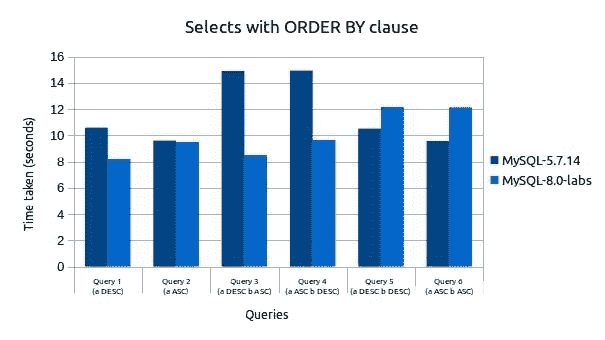

# 第七章：MySQL 8 中的索引

在上一章中，我们了解了存储引擎。现在我们知道了有哪些类型的存储引擎可用，以及哪些存储引擎适合我们的需求。上一章还详细介绍了`InnoDB`存储引擎，以及其他存储引擎信息。它还描述了如何定义用于使用的自定义存储引擎，并提供了一个实际示例。现在是时候了解 MySQL 8 的另一个重要功能，即索引。我们将涵盖不同类型的索引及其功能，这将鼓励您使用索引，并为您提供如何使用它们的指导。因此，您的索引之旅已经开始！让我们开始吧。

本章将涵盖以下主题：

+   索引概述

+   列级索引

+   B-Tree 索引

+   哈希索引

+   索引扩展

+   使用优化器进行索引

+   不可见和降序索引

# 索引概述

在表上定义索引是改善`SELECT`操作性能的最佳方式。索引就像表行的指针，允许查询根据`WHERE`条件快速指向匹配的行。MySQL 8 允许您在所有数据类型上创建索引。尽管索引在查询中提供了良好的性能，但建议以正确的方式定义它，因为不必要的索引会浪费空间和时间（MySQL 8 需要找到最佳使用的索引）。此外，索引还会增加`INSERT`、`UPDATE`和`DELETE`操作的成本，因为在这些操作期间，MySQL 8 将更新每个索引。

正如我们之前所描述的，索引是一种改善操作速度的数据结构。根据结构，索引分为两种主要形式——聚集索引和非聚集索引：

+   **聚集索引**：聚集索引定义了数据在表中的物理存储顺序。因此，每个表只允许一个聚集索引。当以顺序方式检索数据时，无论是相同顺序还是相反顺序，聚集索引都会大大提高检索速度。当选择一系列项目时，聚集索引也提供更好的性能。主键被定义为聚集索引。

+   **非聚集索引**：非聚集索引不定义数据物理存储的顺序。这意味着非聚集索引存储在一个地方，数据存储在另一个地方。因此，每个表允许有多个非聚集索引。它指的是非主键。

正如我们所知，主键代表从表中获取记录最广泛使用的列或列集。主键与之关联的索引用于快速查询性能。它提供了相对较快的性能，因为主键不允许`NULL`值，因此不需要对`NULL`值进行检查。建议如果您的表没有列或列集来定义为主键，那么为了更好的性能，您可以定义一个自动增量字段作为主键。另一方面，如果您的表包含许多列，并且需要执行带有多列组合的查询，则建议将不经常使用的数据转移到单独的表中。将所有单独的表与主键和外键引用相关联，这将帮助您管理数据，并且查询检索会提供良好的性能。

# MySQL 8 中索引的用途

索引主要用于在不迭代完整表的情况下找到特定值的行。如果未定义索引，则 MySQL 8 将从第一行开始搜索，然后读取整个表，这将导致昂贵的操作。MySQL 8 使用索引进行以下操作：

+   在对索引的最左前缀进行排序或分组时。这意味着如果所有键都为`DESC`子句定义，那么键将按相反顺序考虑，如果所有键后跟`ASC`，则键将按正向顺序考虑。

+   查找与`WHERE`子句匹配的行。

+   对于多列索引，可以使用索引的任何最左前缀来查找行。本章后面将以详细示例介绍此主题。

+   如果 MySQL 需要从多个选项中选择一个索引，则会选择具有最小行集的索引。

+   有时，查询会被优化以获取值而不是引用行。例如，如果查询仅使用包含在索引中的列，MySQL 8 将从索引树中获取所选值：

```sql
 SELECT key_part3 FROM table_name WHERE key_part1=10;
```

+   在执行连接时，如果列声明为相同的类型和大小，MySQL 8 将以更有效的方式使用索引。例如，`VARCHAR(15)`和`CHAR(15)`将被视为相同，但`VARCHAR(10)`和`CHAR(15)`将不被视为相同。

+   对于`MIN()`和`MAX()`函数，如果使用了索引列的一部分，优化器将检查索引列的所有其他部分是否在`WHERE`条件中可用。如果提到了，MySQL 8 将执行`MIN()`和`MAX()`函数的单个查找，并用常量替换它们。例如：

```sql
 SELECT MIN(key_part2), MAX(key_part2) FROM tble_name WHERE 
          key_part1=10;
```

# 与索引相关的 SQL 命令

MySQL 8 提供了两个与索引相关的主要命令。我们将在以下部分讨论这些命令。

# 创建 INDEX 命令

以下命令允许用户向现有表中添加索引。此命令也可与`CREATE TABLE`和`ALTER TABLE`一起使用以创建索引：

```sql
CREATE [UNIQUE|FULLTEXT|SPATIAL] INDEX index_name
 [index_type]
 ON tbl_name (index_col_name,...)
 [index_option]
 [algorithm_option | lock_option] ...
index_col_name:
 col_name [(length)] [ASC | DESC]
index_option:
 KEY_BLOCK_SIZE [=] value
 | index_type
 | WITH PARSER parser_name
 | COMMENT 'string'
 | {VISIBLE | INVISIBLE}
index_type:
 USING {BTREE | HASH}
algorithm_option:
 ALGORITHM [=] {DEFAULT|INPLACE|COPY}
lock_option:
 LOCK [=] {DEFAULT|NONE|SHARED|EXCLUSIVE}
```

使用`col_name(length)`语法，用户可以指定索引前缀长度，只考虑字符串值中指定数量的字符。在定义时，前缀考虑以下几点：

+   对于`CHAR`、`VARCHAR`、`BINARY`和`VARBINARY`列索引，前缀是可选的

+   在`BLOB`和`TEXT`列索引中必须指定前缀

+   MySQL 8 将考虑非二进制字符串类型（`CHAR`、`VARCHAR`、`TEXT`）的字符数和二进制类型（`BINARY`、`VARBINARY`、`BLOB`）的字节数作为前缀

+   空间列不允许前缀

在本章后面的*列索引*部分将详细介绍前缀选项的示例。`UNIQUE`索引是一个约束，表示索引中的所有值都将是唯一的。如果尝试添加已经存在的值，MySQL 8 会显示错误。所有类型的存储引擎都允许在`UNIQUE`索引中存在多个空值。在使用`NULL`值时，确保列值在前缀内是唯一的。如果索引前缀超出其大小，MySQL 8 将按以下方式处理索引：

+   **对于非唯一索引**：如果启用了严格的 SQL 模式，MySQL 8 会抛出错误，如果禁用了严格模式，则索引长度将减少到最大列数据类型大小，并产生警告。

+   **对于唯一索引**：在这种情况下，无论 SQL 模式如何，MySQL 8 都会产生错误，因为这可能会破坏列的唯一性。这意味着您定义了一个长度为 25 的列，并尝试在相同列上定义一个前缀长度为 27 的索引，那么 MySQL 8 会报错。

# 空间索引特性

MySQL 8 遵循以下规则来处理空间索引特性：

+   仅适用于`InnoDB`和`MyISAM`存储引擎；如果尝试用于其他存储引擎，MySQL 8 会报错。

+   不允许对索引列使用`NULL`值。

+   此列不允许使用前缀属性。索引将考虑全宽度。

# 非空间索引特性

MySQL 8 遵循以下规则，用于非空间索引特性：

+   对于 `InnoDB`、`MyISAM` 和 `MEMORY` 存储引擎，允许在索引列中使用 `NULL` 值。

+   在每个空间列的情况下，必须指定列前缀长度，如果它存在于非空间索引中。前缀长度将以字节为单位。

+   除了 `ARCHIVE`，它适用于所有支持空间列的存储引擎。

+   对于此索引，允许使用 `NULL` 值，除非它被定义为 `PRIMARY` 键。

+   对于 `InnoDB` 表，在创建表上的索引后，如果启用了 `innodb_stats_persistent` 设置，则运行 `ANALYZE TABLE` 语句。

+   索引类型将取决于存储引擎；目前使用 B-Tree。

+   只有在使用 `InnoDB` 和 `MyISAM` 表定义时，才允许在 `BLOB` 或 `TEXT` 列上使用非空间索引。

`index_col_name` 属性的默认值是升序的，对于具有此属性的 `HASH` 索引，不允许使用 `ASC` 或 `DESC` 值。MySQL 8 提供以下任何一个值与 `index_option`：

+   `KEY_BLOCK_SIZE [=]` value: 此参数定义了索引键块的大小（以字节为单位）。这是一个可选参数，其值被视为提示。如果需要，MySQL 8 可能会使用不同的大小。如果此参数在单个索引级别上定义，则它会覆盖表级别的 `KEY_BLOCK_SIZE` 值。`InnoDB` 引擎不支持此参数在索引级别上；它只允许在表级别上使用。

+   `index_type`：MySQL 8 允许用户在索引创建时定义索引类型。例如：

```sql
 create table employee (id int(11) not null,name varchar(50));
 CREATE INDEX emp_name_index ON employee (name) USING BTREE;
```

请参考以下表格，查找与存储引擎相关的允许的索引类型。在多种类型定义的情况下，将第一个索引类型视为默认类型。如果此表中未提及任何存储引擎，则表示该引擎不支持该索引类型。

| **存储引擎** | **允许的索引类型** |
| --- | --- |
| `InnoDB` | `BTREE` |
| `MyISAM` | `BTREE` |
| `MEMORY`/`HEAP` | `HASH`, `BTREE` |
| `NDB` | `HASH`, `BTREE` |

参考：[`dev.mysql.com/doc/refman/8.0/en/create-index.html`](https://dev.mysql.com/doc/refman/8.0/en/create-index.html)

如果尝试定义存储引擎不支持的索引类型，则 MySQL 8 将其视为支持的索引类型，而不会影响查询结果。请参考以下表格，了解基于存储类型的索引特性：

| **存储引擎** | **索引类型** | **索引类** | **存储 NULL 值** | **允许多个 NULL 值** | **IS NULL 扫描类型** | **IS NOT NULL 扫描类型** |
| --- | --- | --- | --- | --- | --- | --- |
| `InnoDB` | `BTREE` | Primary key | No | No | N/A | N/A |
| Unique | Yes | Yes | Index | Index |
| Key | Yes | Yes | Index | Index |
| 不适用 | `FULLTEXT` | Yes | Yes | Table | Table |
| 不适用 | SPATIAL | No | No | N/A | N/A |
| `MyISAM` | `BTREE` | Primary key | No | No | N/A | N/A |
| Unique | Yes | Yes | Index | Index |
| Key | Yes | Yes | Index | Index |
| 不适用 | `FULLTEXT` | Yes | Yes | Table | Table |
| 不适用 | SPATIAL | No | No | N/A | N/A |
| `MEMORY` | `HASH` | Primary key | No | No | N/A | N/A |
| Unique | Yes | Yes | Index | Index |
| Key | Yes | Yes | Index | Index |
| `BTREE` | Primary | No | No | N/A | N/A |
| Unique | Yes | Yes | Index | Index |
| Key | Yes | Yes | Index | Index |

参考：[`dev.mysql.com/doc/refman/8.0/en/create-index.html`](https://dev.mysql.com/doc/refman/8.0/en/create-index.html)

+   `WITH PARSER parser_name`：此选项仅适用于由 `InnoDB` 和 `MyISAM` 存储引擎支持的 `FULLTEXT` 索引。如果 `FULLTEXT` 索引和搜索操作需要特殊处理，则 MySQL 8 将使用索引的解析器插件。

+   `COMMENT 'string'`：此属性是可选的，允许在注释中使用最多 1024 个字符。此选项还支持`MERGE_THRESHOLD`参数，其默认值为 50。考虑以下命令来定义`MERGE_THRESHOLD`：

```sql
 CREATE INDEX name_index ON employee(name) COMMENT 
          'MERGE_THRESHOLD=40'; 
```

如果索引的页满百分比低于`MERGE_THRESHOLD`值，那么`InnoDB`存储引擎将会将索引页与相邻的索引页合并。

+   `VISIBLE`，`INVISIBLE`：此参数定义了索引的可见性。默认情况下，所有索引都是可见的。优化器在优化过程中不会使用不可见的索引。

当您尝试使用表进行读取或写入，并同时修改其索引时，`ALGORITHM`和`LOCK`属性将产生影响。

# 删除索引命令

以下命令从表中删除索引。我们也可以将此语句映射到`ALTER TABLE`以从表中删除索引：

```sql
DROP INDEX index_name ON tbl_name
 [algorithm_option | lock_option]...
algorithm_option:
 ALGORITHM [=] {DEFAULT|INPLACE|COPY}
lock_option:
 LOCK [=] {DEFAULT|NONE|SHARED|EXCLUSIVE}
```

在此命令中，只有两个选项可用：算法和锁。这两个选项在索引的并发访问和工作情况下非常有用，类似于`CREATE INDEX`命令。例如，要删除员工表的索引，请执行以下命令：

```sql
DROP INDEX name_index ON employee;
```

# 空间索引的创建和优化

MySQL 8 允许您在`InnoDB`和`MyISAM`存储引擎上使用与前述主题中提到的相同语法创建空间索引。标准命令中唯一的变化是在创建索引时使用关键字**spatial**。在定义空间索引时，请确保列声明为`NOT NULL`。以下代码演示了在表上创建空间索引的方法：

```sql
CREATE TABLE geom_data (data GEOMETRY NOT NULL, SPATIAL INDEX(data));
```

默认情况下，空间索引会创建一个 R-Tree 索引。从 MySQL 8.0.3 开始，优化器会检查索引列的**空间参考标识符**（**SRID**）属性，以找到用于比较和执行计算的**空间参考系统**（**SRS**）。对于比较，空间索引中的每个列必须受到 SRID 的限制。这意味着每个列定义必须包含一个 SRID 属性，并且所有列值必须具有相同的 SRID。基于 SRID，空间索引执行以下两个操作：

+   如果列被限制为**笛卡尔 SRID**，那么它会启用笛卡尔边界框计算

+   如果列被限制为**地理 SRID**，那么它会启用地理边界框计算

如上所述，MySQL 8 将忽略没有 SRID 属性的列上的`SPATIAL INDEX`，但 MySQL 仍会管理这些索引，如下所示：

+   这些类型的索引在表被使用`INSERT`，`UPDATE`或`DELETE`命令修改时会被更新。

+   这些索引在转储备份中被考虑，并且可以通过向后兼容性进行恢复。如前所述，没有受到 SRID 限制列的空间索引不会被优化器使用，因此在这种情况下，所有这些列必须被修改。要修改它们，请执行以下步骤：

1.  使用以下命令检查具有相同`ST_SRID`的列的所有值：

```sql
SELECT DISTINCT ST_SRID(column_name) FROM table_name;
```

如果查询返回多行，则表示该列包含混合的 SRID。如果是这样，请更改列的内容为相同的 SRID 值。

1.  为列定义一个显式的 SRID。

1.  重新创建`SPATIAL INDEX`。

# InnoDB 和 MyISAM 索引统计收集

MySQL 8 将根据值组对表统计信息进行考虑，这只是具有相同前缀值的一组行。存储引擎收集与表相关的统计信息，这些信息由优化器使用。从优化的角度来看，平均值组大小是一个重要的统计数据。如果组的平均值大小增加，那么索引就没有意义。因此，最好为每个索引定位少量行。这可以通过表基数来实现，即值组的数量。对于`InnoDB`和`MyISAM`表，MySQL 8 通过`myisam_stats_method`和`innodb_stats_method`系统变量提供了对统计信息的控制。以下是这些变量的可能值：

+   `nulls_ignored`：表示`NULL`值被忽略

+   `nulls_equal`：表示所有`NULL`值相同

+   `nulls_unequal`：表示所有`NULL`值不相同

`innodb_stats_method`系统变量具有全局值，而`myisam_stats_method`系统变量具有全局值和会话值。当我们设置变量的全局值时，它将影响相应存储引擎的表的统计信息收集。在会话值统计的情况下，仅对当前客户端连接可用。这意味着您必须为其他客户端重新生成表的统计信息，而不影响其他客户端，并且需要在会话值中设置它。要重新生成`MyISAM`统计信息，请使用以下方法之一：

+   执行`myisamchk --stats_method=method_name --analyze`命令

+   更改表以使其统计信息过时，然后设置`myisam_stats_method`并发出`ANALYZE TABLE`语句

在使用这两个变量之前，必须考虑一些要点：

+   这些变量仅适用于`InnoDB`和`MyISAM`表。对于其他存储引擎，只有一种方法可用于收集表统计信息，它非常接近`nulls_equal`方法。

+   MySQL 8 提供了一种明确为表生成统计信息的方法，但情况并非总是如此。有时，如果需要，MySQL 8 也会自动生成统计信息。例如，在任何操作的情况下，如果某些 SQL 语句修改了表数据，那么 MySQL 8 将自动收集统计信息。考虑批量插入或删除操作。

+   我们无法确定用于生成表统计信息的方法。

# 列级索引

MySQL 8 允许您在单个列上创建索引，也可以在多个列上创建索引。每个表的最大索引数和最大索引长度取决于存储引擎。大多数存储引擎允许每个表至少有 16 个索引和至少 256 个字节的总索引长度，但大多数存储引擎允许更高的限制。

# 列索引

这是定义只涉及单个列的索引的最常见方法。MySQL 8 将列值的副本存储在数据结构中，以便可以快速访问行。MySQL 8 使用**B-Tree**数据结构来快速访问值。 B-Tree 执行将基于在`where`条件中定义的操作符，例如`=`,`<`,`>`,`BETWEEN`,`IN`等。您可以在下一个主题中了解有关 B-Tree 数据结构及其执行的详细信息。我们将在接下来的部分讨论列索引的特点。

# 索引前缀

此选项允许用户在字符串的情况下指定用于索引的字符数。MySQL 8 在索引创建中提供了`column_name(N)`选项，用于指定字符数。索引优先考虑只指定的字符，这将使索引文件更小。因此，在`BLOB`和`TEXT`列的情况下，您必须为了更好的性能指定前缀长度。考虑以下示例，在`BLOB`类型上创建带有前缀长度的索引：

```sql
CREATE TABLE person (personal_data TEXT, INDEX(personal_data (8)));
```

此命令通过考虑前八个字符在`personal_data`列上创建索引。前缀长度根据存储引擎而变化。`InnoDB`存储引擎允许对`REDUNDANT`或`COMPACT`行格式最多有 767 字节的前缀长度，而对于`DYNAMIC`或`COMPRESSED`行格式，它允许最多 3072 字节。在`MyISAM`存储引擎的情况下，前缀最多可以定义为 1000 字节。

前缀长度将以字节为单位测量二进制字符串类型，例如`BINARY`，`VARBINARY`和`BLOB`，而对于非二进制字符串类型，它将被视为字符数。

# FULLTEXT 索引

正如其名称所示，`FULLTEXT`索引仅允许`CHAR`，`VARCHAR`和`TEXT`列。此索引受`InnoDB`和`MyISAM`存储引擎支持。在这种类型中，索引将在整个列上进行，而不是在前缀长度上。MySQL 8 在查询执行的优化阶段评估全文表达式。在进行执行计划的过程中，优化会在进行估计之前评估全文表达式。因此，全文查询的`EXPLAIN`查询比非全文查询慢。全文查询在以下情况下很有用：

+   当`FULLTEXT`查询返回文档 ID 或文档 ID 和搜索排名时

+   当`FULLTEXT`查询按降序对匹配行进行排序并使用`LIMIT`子句获取*N*行数时，只应用单个降序`ORDER BY`子句，并且不要在其中使用`WHERE`子句进行优化

+   当`FULLTEXT`查询从行中获取`COUNT(*)`值而没有任何额外的`WHERE`子句时，应用`WHERE`子句为`WHERE MATCH(text)` `AGAINST ('other_text')`，而不使用`>` 0 比较运算符

# 空间索引

MySQL 8 允许您在空间数据类型上创建索引。`InnoDB`和`MyISAM`存储引擎支持空间数据的 R-Tree，而其他存储引擎使用 B-Tree。自 MySQL 5.7 以来，空间索引在`MyISAM`和`InnoDB`数据库引擎中得到支持。

# 内存存储引擎中的索引

内存存储引擎支持`HASH`索引和 B-Tree 索引，但默认情况下，`MEMORY`存储引擎设置为`HASH`索引。

# 多列索引

MySQL 8 允许您在单个索引创建中使用多个列，这也被称为**复合索引**。它允许在复合索引中最多使用 16 列。在使用复合索引时，请确保遵循在索引创建期间提到的相同列的顺序。多列索引包含通过连接索引列的值生成的值。请考虑以下示例以了解多列索引：

```sql
CREATE TABLE Employee (
id INT NOT NULL,
lastname varchar(50) not null,
firstname varchar(50) not null,
PRIMARY KEY (id),
INDEX name (lastname, firstname)
);
```

如上所述，我们使用两列`lastname`和`firstname`定义了复合索引。以下查询使用了名称索引：

```sql
SELECT * FROM Employee WHERE lastname='Shah';
SELECT * FROM Employee WHERE lastname ='Shah' AND firstname ='Mona';
SELECT * FROM Employee WHERE lastname ='Shah' AND (firstname ='Michael' OR firstname ='Mona');
SELECT * FROM Employee WHERE lastname ='Shah' AND firstname >='M' AND firstname < 'N';
```

在所有前述的查询中，我们可以看到列的顺序在`WHERE`条件中保持不变，类似于索引声明的顺序。当我们仅在`WHERE`子句中定义`lastname`列时，索引也可以起作用，因为它是索引中定义的最左边的列。现在，有一些查询中复合索引将不起作用：

```sql
SELECT * FROM Employee WHERE firstname='Mona';
SELECT * FROM Employee WHERE lastname='Shah' OR firstname='Mona';
```

请记住，在多列索引的情况下，优化器可以使用索引的任何最左前缀来搜索行。例如，如果索引是按顺序定义的三列`column1`，`column2`和`column3`，那么您可以在`WHERE`子句中定义它，使用索引功能(`column1`, `column2`, `column3`), (`column1`), (`column1`, `column2`)。

# B-Tree 索引

B-Tree 索引的主要目的是减少物理读取操作的次数。B-Tree 索引是通过对搜索键进行排序并维护分层搜索数据结构来创建的，这有助于搜索正确的数据条目页。默认情况下，`InnoDB`和`MyISAM`存储引擎使用 B-Tree 索引。B-Tree 设法使所有叶节点到根节点的距离相等。这个索引加快了数据访问，因为不需要扫描整个数据来获取所需的输出。相反，它从根节点开始。根节点保存子节点的指针，存储引擎遵循这些指针以找到下一个路径。它通过考虑节点页中的值来找到正确的路径。节点页定义了子节点中值的上限和下限。在搜索过程结束时，存储引擎要么成功到达叶页，要么得出结论，即没有与搜索相关联的值。请记住，叶页指向索引数据，而不是其他页面。现在，让我们参考一个图表，以更详细地了解 B-Tree 索引：

以下是 B-Tree 无法使用的查询：

现在，让我们通过考虑以下表格来了解 B-Tree 索引在选择查询中的工作原理：

```sql
CREATE TABLE Employee (
 lastname varchar(50) not null,
 firstname varchar(50) not null,
 dob date not null,
 gender char(1) not null,
 key(lastname, firstname, dob)
 );
```

根据表定义，索引将包含三列`firstname`、`lastname`和`dob`的组合值。它将根据先前给定的顺序对值进行排序；这意味着如果某些员工具有相似的名称，则它们将按其出生日期进行排序。考虑以下类型的查询，这些查询将受益于 B-Tree 索引：

+   **匹配完整值**：查找名为 Mohan Patel 且出生于 1981 年 11 月 28 日的员工。

+   **精确匹配一部分并与另一列的范围匹配**：查找姓氏为 Patel 且名字以 A 开头的员工。

+   正如之前讨论的，当查询针对索引列执行时，MySQL 8 查询引擎从根节点开始，并通过中间节点到达叶节点。让我们举个例子，假设您想在索引列中找到值 89。在这种情况下，查询引擎会引用根节点以获取中间页的引用。因此，它将指向**1-100**。然后，它确定下一个中间级别，并指向值**51-100**。然后查询引擎转到第三页，即下一个中间级别，**76-100**。从那里，它将找到值 89 的叶节点。叶节点包含整行或指向该行的指针，具体取决于索引是聚集还是非聚集。

+   **与列前缀匹配**：查找姓氏以 M 开头的员工。它只使用索引中的第一列。

+   哈希索引

**匹配值范围**：查找姓氏为 Patel 和 Gupta 的员工。

+   **在范围条件之后不要使用任何条件**：例如，您已经放置了`WHERE`条件`lastname='Patel'`和`firstname`类似`‘A%'`和`dob=' 28/11/1981'`。在这里，只考虑前两列用于索引，因为`LIKE`是一个范围条件。

+   **不要跳过索引中定义的任何列**：这意味着您不允许使用`lastname`和`dob`来查找在`WHERE`条件中缺少`firstname`的员工。

+   查找不是从索引列的最左侧开始的：例如，如果您查找名为`Mohan`且`dob`在特定日期的员工，则索引将不起作用。在此查询中，定义的列不是索引中最左侧的列。同样，如果您查找姓氏以某些内容结尾的员工，则索引也不起作用。

# **匹配最左侧前缀**：查找所有有姓氏的员工。这些只使用索引中的第一列。

通过完整的树遍历多个级别来从大型数据库中找到单个值是非常困难的。为了克服这个问题，MySQL 提供了另一种索引类型，称为**哈希索引**。这个索引创建了一个哈希表，而不是 B-Tree 索引所具有的结构非常扁平。哈希主要使用哈希函数来生成数据的地址。与哈希相关的两个重要术语是：

+   **哈希函数**：映射函数，用于将搜索键与存储实际记录的地址进行映射。

+   **Bucket**：桶是哈希索引存储数据的存储单元。一个桶表示一个完整的磁盘块，可以存储一个或多个记录。

除了哈希机制之外，哈希索引还具有一些特殊特性，如下所述：

+   整个键用于搜索行。而在 B-Tree 的情况下，只使用键的最左前缀来查找行。

+   优化器不会使用哈希索引来加速`ORDER BY`操作。换句话说，这个索引永远不会用于查找下一个条目。

+   哈希索引用于使用`=`或`<=>`运算符进行相等比较。它永远不会使用返回一系列值的比较运算符。例如，`<`（小于）运算符。

+   范围优化器实际上无法估计两个值之间有多少行可用。而且，如果我们使用哈希索引的`MEMORY`表而不是`InnoDB`或`MyISAM`，那么它也可能影响查询。

# 索引扩展

索引扩展是 MySQL 8 通过附加主键扩展次要索引的功能。如果需要，`InnoDB`引擎会自动扩展次要索引。为了控制索引扩展的行为，MySQL 8 在`optimizer_switch`系统变量中定义了一个`use_index_extensions`标志。默认情况下，此选项已启用，但用户可以使用以下命令在运行时更改它：

```sql
SET optimizer_switch = 'use_index_extensions=off';
```

让我们看一个例子，以深入了解索引扩展。让我们创建一个表，并插入以下值：

```sql
CREATE TABLE table1 (
 c1 INT NOT NULL DEFAULT 0,
 c2 INT NOT NULL DEFAULT 0,
 d1 DATE DEFAULT NULL,
 PRIMARY KEY (c1, c2),
 INDEX key1 (d1)
) ENGINE = InnoDB;

--Insert values into table
INSERT INTO table1 VALUES
(1, 1, '1990-01-01'), (1, 2, '1991-01-01'),
(1, 3, '1992-01-01'), (1, 4, '1993-01-01'),
(1, 5, '1994-01-01'), (2, 1, '1990-01-01'),
(2, 2, '1991-01-01'), (2, 3, '1992-01-01'),
(2, 4, '1993-01-01'), (2, 5, '1994-01-01'),
(3, 1, '1990-01-01'), (3, 2, '1991-01-01'),
(3, 3, '1992-01-01'), (3, 4, '1993-01-01'),
(3, 5, '1994-01-01'), (4, 1, '1990-01-01'),
(4, 2, '1991-01-01'), (4, 3, '1992-01-01'),
(4, 4, '1993-01-01'), (4, 5, '1994-01-01'),
(5, 1, '1990-01-01'), (5, 2, '1991-01-01'),
(5, 3, '1992-01-01'), (5, 4, '1993-01-01'),
(5, 5, '1994-01-01');
```

这个表在列`c1`、`c2`上有一个主键，以及在列`d1`上有一个次要索引`key_d1`。现在，为了理解扩展效果，首先关闭它，然后执行以下带有解释命令的选择查询：

```sql
--Index extension is set as off
SET optimizer_switch = 'use_index_extensions=off';

--Execute select query with explain
EXPLAIN SELECT COUNT(*) FROM table1 WHERE c1 = 3 AND d1 = '1992-01-01';

--Output of explain query
*************************** 1\. row ***************************
 id: 1
 select_type: SIMPLE
 table: table1
 type: ref
possible_keys: PRIMARY,key1
 key: PRIMARY
 key_len: 4
 ref: const
 rows: 5
 Extra: Using where
```

同样，我们现在将打开扩展并再次执行解释计划查询以检查效果，使用以下代码：

```sql
--Index extension is set as on
SET optimizer_switch = 'use_index_extensions=on';

--Execute select query with explain
EXPLAIN SELECT COUNT(*) FROM table1 WHERE c1 = 3 AND d1 = '1992-01-01';

--Output of explain query
*************************** 1\. row ***************************
 id: 1
 select_type: SIMPLE
 table: table1
 type: ref
possible_keys: PRIMARY,key1
 key: key1
 key_len: 8
 ref: const,const
 rows: 1
 Extra: Using index
```

现在，我们将检查这两种方法之间的区别：

+   `key_len`值从 4 个字节变为 8 个字节，这表明键查找使用了列 d1 和 c1，而不仅仅是 d1。

+   `ref`值从`(const)`变为`(const, const)`，这表明键查找使用了两个键部分而不是一个。

+   `rows`计数从 5 变为 1，这表明`InnoDB`需要比第一种方法更少的行来生成结果。

+   `Extra`值从**Using where**变为**Using index**。这表明行可以通过仅使用索引来读取，而不需要查询数据行中的任何其他列。

# 使用索引的优化器

MySQL 8 允许您在生成列上创建索引。生成列是其值从列定义中包含的表达式计算出来的列。考虑以下示例，我们定义了一个生成列`c2`，并在该列上创建了一个索引：

```sql
CREATE TABLE t1 (c1 INT, c2 INT AS (c1 + 1) STORED, INDEX (c2));
```

根据表的先前定义，优化器将在执行计划中考虑生成列的索引。此外，如果我们在查询中使用`WHERE`、`GROUP BY`或`ORDER BY`子句中指定相同的表达式，那么优化器将使用生成列的索引。例如，如果我们执行以下查询，则优化器将使用生成列上定义的索引：

```sql
SELECT * FROM t1 WHERE c1 + 1 > 100;
```

在这里，优化器将识别表达式与列`c2`的定义相同。我们可以使用`EXPLAIN`命令来检查，如下所示：

```sql
mysql> explain SELECT * FROM t1 WHERE c1 + 1 > 100;
*************************** 1\. row ***************************
 id: 1
 select_type: SIMPLE
 table: t1
 partitions: NULL
 type: range
 possible_keys: c2
 key: c2
 key_len: 5
 ref: NULL
 rows: 1
 filtered: 100.00
 Extra: Using index condition
```

生成列索引有一些限制：

+   查询表达式必须与生成的列定义完全匹配。例如，如果我们在列定义中将表达式定义为`c1+1`，那么在查询中使用相同的表达式，而不是应用`1+c1`。

+   在生成列定义中使用 JSON 字符串时，使用`JSON_UNQUOTE()`从值中删除额外的引号。例如，不要使用以下列定义：

```sql
 name TEXTAS(JSON_EXTRACT(emp,'$.name'))STORED
```

+   我们将使用以下代码代替前面的代码：

```sql
 name TEXTAS(JSON_UNQUOTE(JSON_EXTRACT(emp,'$.name')))STORED
```

+   优化适用于这些运算符：`=`, `<`, `<=`, `>`, `>=`, `BETWEEN`和`IN()`。

+   在生成列表达式中不要仅使用其他列的引用。也就是说，不要使用以下代码：

```sql
 c2 INT AS (c1) STORED in column definition.
```

+   如果优化器尝试使用错误的索引，请使用索引提示，这将禁用它并强制优化器使用不同的选择

# 不可见和降序索引

**不可见索引**是一个特殊功能，它将索引标记为优化器不可用。MySQL 8 将维护不可见索引，并在数据修改时保持其最新状态。这将适用于主键以外的索引。我们知道，默认情况下索引是可见的；我们必须在创建时或使用`alter`命令时显式地将它们设置为不可见。MySQL 8 提供了`VISIBLE`和`INVISIBLE`关键字来维护索引的可见性。降序索引是按降序存储键值的方法。降序索引更有效，因为它可以按正向顺序扫描。让我们通过示例详细了解这些索引。

# 不可见索引

如前所述，优化器不使用不可见索引。那么这个索引有什么用呢？这个问题会出现在我们的脑海中，对吧？我们将向您解释一些不可见索引的用例：

+   当定义了许多索引，但不确定哪个索引未被使用时。在这种情况下，您可以使一个索引不可见并检查性能影响。如果有影响，那么您可以立即使该索引可见。

+   只有一个查询使用索引的特殊情况。在这种情况下，不可见索引是一个很好的解决方案。

在以下示例中，我们将使用`CREATE TABLE`、`CREATE INDEX`或`ALTER TABLE`命令创建一个不可见索引：

```sql
CREATE TABLE `employee` (
 `id` int(11) NOT NULL AUTO_INCREMENT,
 `department_id` int(11),
 `salary` int(11),
 PRIMARY KEY (`id`)
 ) ENGINE=InnoDB;

CREATE INDEX idx1 ON employee (department_id) INVISIBLE;
ALTER TABLE employee ADD INDEX idx2 (salary) INVISIBLE;
```

要更改索引的可见性，请使用以下命令：

```sql
 ALTER TABLE employee ALTER INDEX idx1 VISIBLE;
 ALTER TABLE employee ALTER INDEX idx1 INVISIBLE;
```

要获取有关索引的信息，请以以下方式执行`INFORMATION_SCHEMA.STATISTICStable`或`SHOW INDEX`命令：

```sql
mysql>SELECT * FROM information_schema.statistics WHERE is_visible='NO';
*************************** 1\. row ***************************
TABLE_CATALOG: def
TABLE_SCHEMA: db1
TABLE_NAME: employee
NON_UNIQUE: 1
INDEX_SCHEMA: db1
INDEX_NAME: idx1
SEQ_IN_INDEX: 1 
COLUMN_NAME: department_id
COLLATION: A 
CARDINALITY: 0 
SUB_PART: NULL 
PACKED: NULL 
NULLABLE: YES
INDEX_TYPE: BTREE 
COMMENT: 
INDEX_COMMENT: 
IS_VISIBLE: NO

mysql>SELECT INDEX_NAME, IS_VISIBLE FROM INFORMATION_SCHEMA.STATISTICS
 -> WHERE TABLE_SCHEMA = 'db1' AND TABLE_NAME = 'employee';
+------------+------------+
| INDEX_NAME | IS_VISIBLE |
+------------+------------+
| idx1 | NO |
| idx2 | NO |
| PRIMARY | YES |
+------------+------------+

mysql> SHOW INDEXES FROM employee;
*************************** 1\. row ***************************
Table:employee
Non_unique:1
Key_name:idx1
Seq_in_index:1
Column_name: department_id
Collation:A
Cardinality:0
Sub_part: NULL
Packed: NULL
Null:YES
Index_type: BTREE
Comment:
Index_comment:
Visible: NO
```

MySQL 8 在`optimizer_switch`系统变量中提供了一个`use_invisible_indexes`标志，用于控制查询优化器使用的不可见索引。如果此标志打开，则优化器在执行计划构建中使用不可见索引，而如果标志关闭，则优化器将忽略不可见索引。MySQL 8 提供了一个隐式主键的功能，如果您在`NOT NULL`列上定义了一个`UNIQUE`索引。一旦在此字段上定义了索引，MySQL 8 将不允许您将其设置为不可见。为了理解这种情况，让我们以以下表为例。让我们尝试执行以下命令，使`idx1`索引不可见：

```sql
CREATE TABLE table2 (
 field1 INT NOT NULL,
 field2 INT NOT NULL,
 UNIQUE idx1 (field1)
) ENGINE = InnoDB;
```

现在，服务器将会给出一个错误，如下所示的命令：

```sql
mysql> ALTER TABLE table2 ALTER INDEX idx1 INVISIBLE;
ERROR 3522 (HY000): A primary key index cannot be invisible
```

现在让我们使用以下命令将主键添加到表中：

```sql
ALTER TABLE table2 ADD PRIMARY KEY (field2);
```

现在，我们将尝试使`idex1`不可见。这次，服务器允许了，如下所示的命令：

```sql
mysql> ALTER TABLE table2 ALTER INDEX idx1 INVISIBLE;
Query OK, 0 rows affected (0.06 sec)
Records: 0 Duplicates: 0 Warnings: 0
```

# 降序索引

降序索引是按降序顺序存储键值的索引。这个索引按正向顺序扫描，与其他索引相比性能更好。降序索引允许用户定义组合升序和降序顺序的多列索引。实际知识总是比理论知识更容易理解，对吧？所以，让我们看一些例子，以深入了解降序索引。首先，创建一个具有以下定义的表：

```sql
CREATE TABLE t1 (
 a INT, b INT,
 INDEX idx1 (a ASC, b ASC),
 INDEX idx2 (a ASC, b DESC),
 INDEX idx3 (a DESC, b ASC),
 INDEX idx4 (a DESC, b DESC)
);
```

根据表定义，MySQL 8 将创建四个不同的索引，因此优化器对每个`ORDER BY`子句执行前向索引扫描。考虑以下不同版本的`ORDER BY`子句：

```sql
ORDER BY a ASC, b ASC -- optimizer can use idx1
ORDER BY a DESC, b DESC -- optimizer can use idx4
ORDER BY a ASC, b DESC -- optimizer can use idx2
ORDER BY a DESC, b ASC -- optimizer can use idx3
```

现在，让我们看一下相同表定义的第二种情况，它将描述与 MySQL 5.7.14 版本相比，降序索引对性能的影响。考虑以下选择查询以测量性能：

```sql
Query 1: SELECT * FROM t1 ORDER BY a DESC;
Query 2: SELECT * FROM t1 ORDER BY a ASC;
Query 3: SELECT * FROM t1 ORDER BY a DESC, b ASC;
Query 4: SELECT * FROM t1 ORDER BY a ASC, b DESC;
Query 5: SELECT * FROM t1 ORDER BY a DESC, b DESC;
Query 6: SELECT * FROM t1 ORDER BY a ASC, b ASC;
```

以下统计图是由 MySQL 8 提供的，针对先前提到的查询，有 1000 万行数据：



参考：[`mysqlserverteam.com/mysql-8-0-labs-descending-indexes-in-mysql/`](https://mysqlserverteam.com/mysql-8-0-labs-descending-indexes-in-mysql/)

在使用降序索引时，有一些重要的要点需要记住，如下所示：

+   所有升序索引支持的数据类型也支持降序索引。

+   降序索引支持`BTREE`，但不支持`HASH`、`FULLTEXT`和`SPATIAL`索引。如果您尝试为`HASH`、`FULLTEXT`和`SPATIAL`索引显式使用`ASC`和`DESC`关键字，那么 MySQL 8 将生成错误。

+   降序索引仅支持`InnoDB`存储引擎，但`InnoDB` SQL 解析器不使用降序索引。如果主键包括降序索引，则不支持对辅助索引的更改缓冲。

+   `DISTINCT`可以使用任何索引，包括降序键，但对于`MIN()`/`MAX()`，不使用降序键部分。

+   非生成和生成列都允许使用降序索引。

# 总结

当你了解它是如何工作的时候，一切都变得非常有趣，对吧？我们希望您在本章中对索引有相同的看法。我们已经涵盖了非常有用的信息，这将帮助您在正确的列上定义索引以获得更好的性能。除此之外，我们还描述了各种类型的索引及其存储结构。

在下一章中，我们将为您提供有关复制的信息。我们将详细解释复制的配置和实现。
