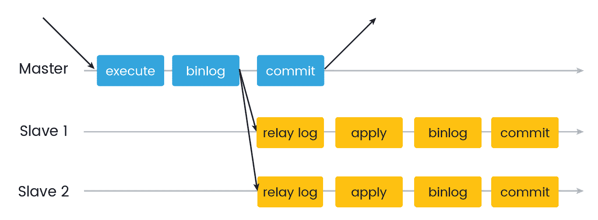
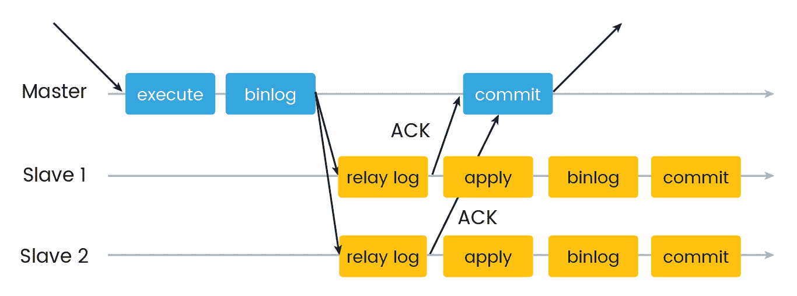
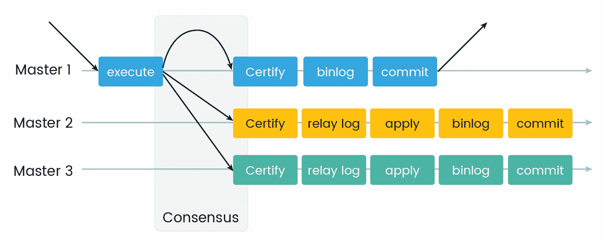

# 第八章：MySQL 8 中的复制

在上一章中，我们深入探讨了 MySQL 8 索引。索引是任何数据库管理系统的重要实体。它们通过限制要访问的记录数量来提高 SQL 查询性能。致力于性能改进的数据库管理员必须了解这一重要技术。本章详细解释了索引的类型及其优势。本章还解释了 MySQL 8 中索引的工作原理。这将是一个非常信息丰富的章节！

沿着同样的线路继续前进，在本章中，我们将讨论数据库复制。我们已经对数据库复制有多少了解并不重要。本章涵盖了有关数据库复制的深入细节。如果您已经了解数据库复制，本章将为您增加更多知识。如果您第一次听说它，您将在本章中找到使其正常工作所需的每一个细节。那么，我们准备好开始了吗？以下是本章将涵盖的主题列表：

+   复制概述

+   配置复制

+   实施复制

+   组复制与集群

+   复制解决方案

# 复制概述

在本节中，我们将介绍数据库复制的基础知识。我们将了解复制是什么，它提供的优势以及复制可能有益的场景。

# 什么是 MySQL 复制？

假设您正在阅读本文有两个原因。您熟悉 MySQL 复制并愿意获取更多知识，也许您不熟悉 MySQL 复制并希望学习。

MySQL 复制对于服务许多不同的目的都是有用的。通常，当人们开始有更多的查询超过单个数据库服务器可以处理时，他们开始考虑 MySQL 复制。基于此，你对 MySQL 复制有什么猜测吗？复制是一种技术，可以设置多个数据库来为单个或多个客户端应用程序提供服务。客户端可以是最终用户或发送来自不同设备（如计算机、手机、平板电脑等）的读取数据或写入数据的任何查询请求的人。这些数据库是相同数据库的副本。这意味着参与数据库复制的所有数据库彼此完全相同。复制通过频繁地将数据从一个数据库复制到所有其他副本数据库来工作。这些数据库可以位于同一数据库服务器上、不同的数据库服务器上或完全不同的机器上。

如前所述，数据库复制有各种目的。这取决于为什么设置 MySQL 数据库复制。MySQL 复制是为了扩展数据库或由数据库支持的应用程序。它还用于维护数据库备份和报告目的。我们稍后将在本章中详细讨论这些问题。

MySQL 复制主要用于扩展读取。在任何 Web 应用程序中，读取操作的数量相对于写入数据库操作要高得多。大多数常见的 Web 应用程序都是读取密集型的。考虑一个社交网络网站的例子。如果我们导航到用户个人资料页面，我们会看到很多信息，如用户的个人信息、人口统计信息、社交关系、一些评分等等。如果仔细观察，我们会发现在数据库上执行的`SELECT`查询的数量要比`INSERT`、`UPDATE`或`DELETE`查询要高得多。通过 MySQL 数据库复制，我们可以将读取操作定向到特定的数据库上，以便实现更高的性能。

MySQL 复制看起来很简单，可以在几个小时内设置好，但很容易变得复杂。在新数据库上设置非常容易。相反，在生产数据库上设置它非常复杂。我们不应该将 MySQL 复制与分布式数据库系统混淆。在分布式数据库系统中，数据库保存不同的数据集。数据库操作根据一些关键信息路由到特定的数据库。

在传统的 MySQL 复制中，一个数据库充当主数据库，其余数据库充当从数据库。并不总是必须只有一个主数据库。我们可以在复制中有多个主数据库。这种技术称为多主复制。从服务器从主数据库复制数据。在传统的 MySQL 复制中，复制数据的过程是异步的。这意味着从数据库服务器与主数据库服务器并非永久连接。MySQL 支持不同级别的复制。我们可以将所有主数据库、选定的数据库或选定的主数据库中的表复制到从数据库中。

MySQL 8 提供了不同的数据库复制方法。MySQL 8 有一个二进制日志文件。文件的内容是描述数据库更改的事件。事件可以是“基于语句”的或“基于行”的类型。更改包括数据定义更改和数据操作更改，或者可能修改数据库的语句，如`DELETE`语句。二进制日志还包含每个 SQL 语句更新数据库所花费的时间的信息。传统的 MySQL 数据库复制方法基于主数据库服务器上的二进制日志文件同步数据库到从服务器。从服务器根据文件中日志记录的位置复制或复制主数据库服务器的二进制日志文件的内容。

MySQL 8 还支持基于二进制日志文件的数据库复制方法以及新的方法。在 MySQL 8 数据库服务器上提交的每个事务都被视为唯一的。每个在主数据库服务器上提交的事务都与唯一的全局事务标识符（GTID）相关联。正如其名称所示，全局标识符不仅仅是在创建它的主数据库服务器上唯一的，而且在参与 MySQL 8 复制的所有数据库中都是唯一的。因此，每个提交的事务和全局事务标识符之间存在一对一的映射。MySQL 复制的新方法基于 GTID。它极大地简化了复制过程，因为它不依赖于二进制日志文件及其位置的事件。GTID 表示为一对冒号（“：”）分隔的坐标，如下所示：

```go
GTID = source_id:transaction_id
```

`source_id`是源自 GTID 的数据库服务器的标识符。通常，数据库服务器的`server_uuid`用作`source_id`。 `transaction_id`是事务在数据库服务器上提交的顺序号。例如，以下示例显示了第一个提交事务的 GTID：

```go
1A22AF74-17AC-E111-393E-80C49AB653A2:1
```

提交的事务的序列号从`1`开始。它永远不可能是`0`。

基于 GTID 的 MySQL 复制方法是事务性的，这就是为什么它比基于二进制日志文件的复制方法更可靠。只要在主数据库服务器上提交的所有事务也在所有从数据库服务器上应用，GTID 就可以保证复制的准确性和一致性。

如前所述，MySQL 数据库复制通常是异步的。但是，MySQL 8 支持不同类型的复制同步。同步的常规方法是异步的。这意味着一个服务器充当主数据库服务器。它将所有事件写入二进制日志文件。其他数据库服务器充当从服务器。从服务器从主数据库服务器中读取和复制基于位置的事件记录。因此，它总是从主数据库服务器到从数据库服务器。MySQL 8 还支持半同步同步方法。在半同步复制方法中，任何在主数据库服务器上提交的事务都会被阻塞，直到主数据库服务器收到至少一个从数据库服务器已接收并记录了事务事件的确认。延迟复制是 MySQL 8 支持的另一种复制方法。在延迟复制中，从数据库服务器故意将事务事件记录在主数据库服务器之后一段时间。

# MySQL 复制的优势

现在我们已经熟悉了 MySQL 数据库复制是什么，是时候评估维护多个数据库服务器的增加复杂性是否值得了。

MySQL 8 数据库复制的优势如下：

1.  **扩展解决方案**：如前所述，通常 Web 应用程序是读密集型应用程序。读操作的数量远远高于写操作。这些应用程序提供需要在数据库服务器上执行复杂的 SQL 查询的功能。这些不是毫秒级执行的查询。这样复杂的查询可能需要几秒到几分钟的执行时间。执行这样的查询会给数据库服务器带来沉重的负载。在这种情况下，最好将这些读操作在主数据库服务器上执行而不是在主数据库服务器上执行。写数据库操作将始终在主数据库服务器上执行。你知道为什么吗？因为它触发数据库修改。这些修改的事件必须写入二进制日志文件，以便从从服务器进行复制同步。此外，同步是从主服务器到从服务器。因此，如果我们在从服务器上执行写数据库操作，这些操作将永远不会在主数据库服务器上可用。这种方法通过在多个从服务器上执行读操作来提高写操作的性能，并增加读操作的速度。

1.  **数据安全**：安全性通常是每个 Web 应用程序都需要的重要功能。安全性可以在应用程序层或数据库层上进行。数据安全性可防止数据丢失。通过定期备份数据库来实现数据安全性。如果没有设置复制，备份生产数据库需要将应用程序置于维护模式。这是必需的，因为应用程序和备份过程同时访问数据库可能会损坏数据。有了复制，我们可以使用其中一个从服务器进行备份。由于从数据库服务器始终与主数据库服务器同步，我们可以备份从数据库服务器。为此，我们可以使从数据库服务器在备份过程运行时停止从主数据库服务器复制。这不需要 Web 应用程序停止使用主数据库服务器。事实上，它不会以任何方式影响主数据库服务器。另一个数据安全性方面是为生产或主数据库服务器提供基于角色的访问。我们只能让少数角色从后端访问主数据库服务器。其余用户或角色可以访问从数据库服务器。这减少了由于人为错误而导致的意外数据丢失的风险。

1.  **分析**：分析和报告始终是数据库支持的应用程序的重要功能。这些功能需要频繁地从数据库中获取信息，以便对数据进行分析。如果设置了数据库复制，我们可以从从数据库服务器获取分析所需的数据，而不会影响主数据库服务器的性能。

1.  **远程数据分发**：应用程序开发人员通常需要在本地开发环境中复制生产数据。在启用数据库复制的基础设施中，可以使用从数据库服务器在开发数据库服务器上准备数据库副本，而无需经常访问主数据库服务器。

# 配置复制

在本节中，我们将学习不同类型的 MySQL 8 复制方法的配置。它包括逐步设置和配置复制的说明。

# 基于二进制日志文件的复制

MySQL 数据库复制最常见的传统方法之一是二进制日志文件位置方法。本节重点介绍了二进制日志文件位置复制的配置。在我们进入配置部分之前，最好复习和了解基于二进制日志位置的复制的基础知识。

如前所述，MySQL 数据库服务器之一充当主服务器，其余的 MySQL 数据库服务器成为从服务器。主数据库服务器是数据库更改的起点。主数据库服务器根据数据库的更新或更改在二进制日志文件中写入事件。写入二进制日志文件的信息记录的格式根据记录的数据库更改而变化。MySQL `REPLICATION SLAVE`数据库服务器被配置为从主数据库服务器读取二进制日志事件。从服务器在本地数据库二进制日志文件上执行事件。这样从服务器就可以将数据库与主数据库同步。当从数据库服务器从主数据库服务器读取二进制日志文件时，从服务器会获得整个二进制日志文件的副本。一旦接收到二进制日志文件，就由从服务器决定在从服务器二进制日志文件上执行哪些语句。可以指定应在从数据库服务器的二进制日志文件上执行来自主数据库服务器二进制日志文件的所有语句。也可以处理特定数据库或表过滤的事件。

只有从数据库服务器可以配置过滤来自主数据库服务器日志文件的事件。无法配置主数据库服务器仅记录特定事件。

MySQL 8 提供了一个系统变量，可以帮助唯一标识数据库服务器。参与 MySQL 复制的所有数据库服务器都必须配置为具有唯一的 ID。每个从数据库服务器都必须配置主数据库服务器的主机名、日志文件名和日志文件中的位置。设置完成后，可以在从数据库服务器上使用`CHANGE MASTER TO`语句在 MySQL 会话中修改这些细节。

当从数据库服务器从主数据库二进制日志文件中读取信息时，它会跟踪二进制日志坐标的记录。 二进制日志坐标包括文件名和文件内的位置，从主数据库服务器读取和处理。 从数据库服务器读取主数据库服务器的二进制日志文件的效率非常高，因为可以将多个从数据库服务器连接到主数据库服务器，并从主数据库服务器处理二进制日志文件的不同部分。 主数据库服务器的操作保持不变，因为从主数据库服务器连接和断开从数据库服务器的控制由从服务器自己控制。 如前所述，每个从数据库服务器都会跟踪二进制日志文件中的当前位置。 因此，从数据库服务器可以断开连接并重新连接到主数据库服务器，并恢复二进制日志文件处理。

MySQL 中提供了多种设置数据库复制的方法。 复制的确切方法取决于数据库中是否已存在数据以及如何设置复制。 以下各节中的每个部分都是配置 MySQL 复制的步骤。

# 复制主配置

在设置复制主数据库服务器之前，必须确保数据库服务器已建立唯一 ID 并启用了二进制日志记录。 可能需要在进行这些配置后重新启动数据库服务器。 主数据库服务器二进制日志是 MySQL 8 数据库复制的基础。

要启用二进制日志记录，应将`log_bin`系统变量设置为`ON`。 默认情况下，MySQL 数据库服务器启用了二进制日志记录。 如果使用`mysqld`手动使用`--initialize`或`--initialize-insecure`选项初始化数据目录，则默认情况下禁用了二进制日志记录。 必须通过指定`--log-bin`选项来启用它。 `--log-bin`选项指定要用于二进制日志文件的基本名称。

如果启动选项未指定文件名，则二进制日志文件名将基于数据库服务器主机名进行设置。 建议使用`--log-bin`选项指定二进制日志文件名。 如果使用`--log_bin=old_host_name-bin`指定日志文件名，则即使更改数据库服务器主机，日志文件名也将保留。

要设置主数据库服务器，请在主数据库服务器上打开 MySQL 配置文件：

```go
sudo vim /etc/mysql/my.cnf
```

在配置文件中进行以下更改。

首先，找到将服务器绑定到 localhost 的部分：

```go
bind-address = 127.0.0.1
```

用实际数据库服务器 IP 地址替换本地 IP 地址。 这一步很重要，因为从服务器可以使用主数据库服务器的公共 IP 地址访问主数据库服务器：

```go
bind-address = 175.100.170.1
```

需要对主数据库服务器进行配置以配置唯一 ID。 还包括设置主二进制日志文件所需的配置：

```go
[mysqld]
log-bin=/var/log/mysql/mysql-bin.log
server-id=1
```

现在，让我们配置数据库在从数据库服务器上进行复制。 如果需要在从数据库服务器上复制多个数据库，则多次重复以下行：

```go
binlog_do_db = database_master_one
binlog_do_db = database_master_two
```

完成这些更改后，使用以下命令重新启动数据库服务器：

```go
sudo service mysql restart
```

现在，我们已经设置好了主数据库服务器。 下一步是授予从用户权限如下：

```go
mysql> mysql -u root -p
mysql> CREATE USER 'slaveone'@'%' IDENTIFIED BY 'password';
mysql> GRANT REPLICATION SLAVE ON *.* TO 'slaveone'@'%' IDENTIFIED BY 'password';
```

上述命令创建了从用户，在主数据库服务器上授予了权限，并刷新了数据库缓存的权限。

现在，我们必须备份要复制的数据库。 我们将使用`mysqldump`命令备份数据库。 此数据库将用于创建`slave`数据库。 主状态输出显示要复制的二进制日志文件名、当前位置和数据库名称：

```go
mysql> USE database_master_one;
mysql> FLUSH TABLES WITH READ LOCK;
mysql> SHOW MASTER STATUS;
+------------------+----------+---------------------+------------------+ 
|       File       | Position |     Binlog_Do_DB    | Binlog_Ignore_DB | 
+------------------+----------+---------------------+------------------+ 
| mysql-bin.000001 |    102   | database_master_one |                  | 
+------------------+----------+---------------------+------------------+ 
1 row in set (0.00 sec)

mysqldump -u root -p database_master_one > database_master_one_dump.sql
```

在使用`mysqldump`命令进行数据库备份之前，我们必须锁定数据库以检查当前位置。稍后将使用此信息设置从数据库服务器。

数据库转储完成后，应使用以下命令解锁数据库：

```go
mysql> UNLOCK TABLES;
mysql> QUIT;
```

我们已经完成了设置复制主数据库服务器所需的所有配置，并使其可以被`REPLICATION SLAVE`数据库服务器访问。

以下选项对主数据库服务器设置产生影响：

1.  `innodb_flush_log_at_trx_commit=1`和`sync_binlog=1`选项应该设置为实现更高的耐久性和一致性。这些选项可以在`my.cnf`配置文件中设置。

1.  `skip-networking`选项不能被启用。如果启用了，从服务器就无法与主服务器通信，数据库复制将失败。

# REPLICATION SLAVE 配置

与主数据库服务器类似，每个从数据库服务器必须有一个唯一的 ID。设置完成后，这将需要数据库服务器重启：

```go
[mysqld]
server-id=2
```

要设置多个从数据库服务器，必须配置一个唯一的非零`server-id`，该 ID 与主服务器或任何其他从数据库服务器不同。不需要在从数据库服务器上启用二进制日志记录以设置复制。如果启用了，在从数据库服务器上的二进制日志文件可以用于数据库备份和崩溃恢复。

现在，创建一个新的数据库，它将成为主数据库的副本，并从主数据库的数据库转储中导入数据库如下：

```go
mysql> CREATE DATABASE database_slave_one;
mysql> QUIT;

# mysql -u root -p database_slave_one &lt; /path/to/database_master_one_dump.sql
```

现在，我们必须在`my.cnf`文件中配置其他一些选项。与二进制日志类似，中继日志由带有数据库更改事件的编号文件组成。它还包含一个索引文件，其中包含所有已使用的中继日志文件的名称。以下配置设置了中继日志文件、二进制日志文件和从服务器数据库的名称，该名称是主数据库的副本，如下所示：

```go
relay-log = /var/log/mysql/mysql-relay-bin.log
log_bin = /var/log/mysql/mysql-bin.log
binlog_do_db = database_slave_one
```

在进行此配置更改后，需要重新启动数据库服务器。下一步是在 MySQL shell 提示符中启用从服务器复制。执行以下命令设置`slave`数据库服务器所需的`master`数据库信息：

```go
mysql> CHANGE MASTER TO MASTER_HOST='12.34.56.789', MASTER_USER='slaveone', MASTER_PASSWORD='password', MASTER_LOG_FILE='mysql-bin.000001', MASTER_LOG_POS= 103;
```

作为最后一步，激活从服务器：

```go
mysql> START SLAVE;
```

如果在`slave`数据库服务器上启用了二进制日志记录，从服务器可以参与复杂的复制策略。在这样的复制设置中，数据库服务器`A`充当数据库服务器`B`的主服务器。`B`充当`A`的`master`数据库服务器的从服务器。现在，`B`反过来可以充当`C`的`slave`数据库服务器的主数据库服务器。类似的情况如下所示：

```go
A -> B -> C
```

# 添加从服务器进行复制

可以向现有的复制配置中添加一个新的从数据库服务器。这不需要停止主数据库服务器。方法是复制现有的`slave`数据库服务器。复制后，我们必须修改`server-id`配置选项的值。

以下说明设置了一个新的从数据库服务器到现有的复制配置。首先，应该关闭现有的从数据库服务器如下：

```go
mysql> mysqladmin shutdown
```

现在，应该将现有从服务器的数据目录复制到新的从数据库服务器。除了数据目录，还必须复制二进制日志和中继日志文件。建议为新的从数据库服务器使用与现有从数据库服务器相同的`--relay-log`值。

如果主信息和中继日志信息存储库使用文件，则必须从现有的从数据库服务器复制这些文件到新的从数据库服务器。这些文件保存了主服务器的当前二进制日志坐标和从服务器的中继日志。

现在，启动之前停止的现有从服务器。

现在，我们应该能够启动新的从服务器。如果尚未设置，必须在启动新的从服务器之前配置唯一的`server-id`。

# 基于全局事务标识符的复制

本节重点介绍基于全局事务标识符的复制。它解释了在 MySQL 服务器中如何定义、创建和表示 GTID。它描述了设置和启动基于 GTID 的复制的过程。

使用基于 GTID 的复制，每个事务在提交到原始数据库服务器时都被分配一个唯一的事务 ID，称为**GTID**。这个唯一标识符是全局的，这意味着它在参与复制的所有数据库服务器中是唯一的。使用 GTID，更容易跟踪和处理每个事务在提交到`master`数据库服务器时。使用这种复制方法，不需要依赖日志文件来同步`master`和`slave`数据库。也更容易确定`master`和`slave`数据库是否一致，因为这种复制方法是基于事务的。只要在`master`数据库上提交的所有事务也在从服务器上应用，`master`和`slave`数据库之间的一致性就是有保证的。可以使用基于语句或基于行的复制与 GTID。如前所述，GTID 用由冒号(`:`)分隔的一对坐标表示，如下例所示：

```go
GTID = source_id:transaction_id
```

使用基于 GTID 的复制方法的优点是：

1.  通过这种复制方法，可以在服务器故障转移的情况下切换主数据库服务器。全局事务标识符在所有参与的数据库服务器上是唯一的。从服务器使用 GTID 跟踪最后执行的事务。这意味着如果主数据库服务器切换到新的数据库服务器，从服务器更容易继续使用新的主数据库服务器并恢复复制处理。

1.  从服务器数据库服务器的状态以一种崩溃安全的方式维护。使用更新的复制技术，`slave`数据库服务器在名为`mysql.gtid_slave_pos`的系统表中跟踪当前位置。使用诸如`InnoDB`之类的事务存储引擎，状态的更新记录在与数据库操作相同的事务中。因此，如果从服务器崩溃，重新启动后，从服务器将启动崩溃恢复，并确保记录的复制位置与复制的更改匹配。这在传统的基于二进制日志文件的复制中是不可能的，因为中继日志文件独立于实际数据库更改而更新，如果从服务器崩溃，很容易出现不同步。

在深入了解基于 GTID 的复制配置之前，让我们先了解一些其他术语。

`gtid_set`是一组全局事务标识符。它在以下示例中表示：

```go
gtid_set:
 uuid_set [, uuid_set] ...
 | ''

uuid_set:
 uuid:interval[:interval]...

uuid:
 hhhhhhhh-hhhh-hhhh-hhhh-hhhhhhhhhhhh

h:
 [0-9|A-F]

interval:
 n[-n]
 (n >= 1)
```

GTID 集的使用方式有几种。系统变量`gtid_executed`和`gtid_purged`用 GTID 集表示。MySQL 函数`GTID_SUBSET()`和`GTID_SUBTRACT()`需要 GTID 集作为输入参数。

主数据库服务器和从数据库服务器都保留 GTID。一旦在一个服务器上使用一个 GTID 提交了一个事务，那个服务器就会忽略任何后续具有相似 GTID 的事务。这意味着在`master`数据库服务器上提交的事务只能在`slave`数据库服务器上提交或应用一次。这有助于保持`master`和`slave`数据库之间的一致性。

以下是 GTID 的生命周期摘要：

1.  事务在主数据库服务器上执行并提交。使用主服务器的 UUID 为该事务分配一个 GTID。GTID 被写入主数据库服务器的二进制日志文件。

1.  一旦二进制日志文件被从服务器接收并记录在从服务器的中继日志中，从服务器会将`gtid_next`系统变量的值设置为读取的 GTID。这表示给`slave`指示下一个要执行的事务是具有此 GTID 的事务。

1.  `slave`数据库服务器在二进制日志文件中维护其已处理事务的 GTID 集。在应用由`gtid_next`指示的事务之前，它会检查二进制日志文件中是否记录了或记录了该 GTID。如果在二进制日志文件中找不到 GTID，则从服务器会处理与 GTID 相关联的事务，并将 GTID 写入二进制日志文件。这样，从服务器可以保证同一个事务不会被执行多次。

现在，让我们转到基于 GTID 的 MySQL 复制的主配置。首先，打开`my.cnf`文件并进行以下更改：

```go
[mysqld]
server-id = 1
log-bin = mysql-bin 
binlog_format = ROW 
gtid_mode = on 
enforce_gtid_consistency 
log_slave_updates
```

这些配置更改需要服务器重启。前面的配置是不言自明的。`gtid_mode`选项启用了基于 GTID 的数据库复制。

1.  现在，在从服务器上为访问主数据库创建一个用户。同时，使用`mysqldump`命令进行数据库备份。数据库备份将用于设置从服务器。

```go
 > CREATE USER 'slaveuser'@'%' IDENTIFIED BY 'password'; 
 > GRANT REPLICATION SLAVE ON *.* TO 'slaveuser'@'%' IDENTIFIED 
          BY 'password';
 > mysqldump -u root -p databaseName > databaseName.sql
```

这就是主数据库配置的全部内容。让我们继续进行从服务器端的配置。

1.  在`slave`数据库服务器的 shell 提示符上，按照以下步骤从`master`数据库服务器备份中导入数据库：

```go
 > mysql -u root -p databaseName &lt; /path/to/databaseName.sql
```

1.  现在，在从服务器的`my.cnf`文件中添加以下配置：

```go
 [mysqld]
 server_id = 2
 log_bin = mysql-bin
 binlog_format = ROW
 skip_slave_start
 gtid_mode = on
 enforce_gtid_consistency
 log_slave_updates
```

1.  完成这些配置后，使用以下命令重新启动数据库服务器：

```go
 sudo service mysql restart
```

1.  下一步是在`slave`数据库服务器上使用`CHANGE MASTER TO`命令设置主数据库服务器信息：

```go
 > CHANGE MASTER TO MASTER_HOST='170.110.117.12', MASTER_PORT=3306, 
 MASTER_USER='slaveuser', MASTER_PASSWORD='password', MASTER_AUTO_POSITION=1;
```

1.  现在，启动`slave`服务器：

```go
 START SLAVE;
```

在这种复制方法中，主数据库备份已经包含了 GTID 信息。因此，我们只需要提供从服务器应该开始同步的位置。

1.  这是通过设置`GTID_PURGED`系统变量来完成的：

```go
 -- -- GTID state at the beginning of the backup -- 
 mysql> SET @@GLOBAL.GTID_PURGED='b9b4712a-df64-11e3-b391-60672090eb04:1-7';
```

# MySQL 多源复制

本节重点介绍了并行从多个主服务器复制的方法。这种方法称为**多源复制**。使用多源复制，`REPLICATION SLAVE`可以同时从多个源接收事务。每个`master`都会为`REPLICATION SLAVE`创建一个通道，从中接收事务。

多源复制配置需要至少配置两个主服务器和一个从服务器。主服务器可以使用基于二进制日志位置的复制或基于 GTID 的复制进行配置。复制存储库存储在`FILE`或`TABLE`存储库中。`TABLE`存储库是崩溃安全的。MySQL 多源复制需要`TABLE`存储库。设置`TABLE`存储库有两种方法。

一种是使用以下选项启动`mysqld`：

```go
mysqld —master-info-repostiory=TABLE && –relay-log-info-repository=TABLE
```

另一种做法是修改`my.cnf`文件如下：

```go
[mysqld] 
master-info-repository = TABLE 
relay-log-info-repository = TABLE
```

可以修改正在使用`FILE`存储库的现有`REPLICATION SLAVE`以使用`TABLE`存储库。以下命令动态转换现有存储库：

```go
STOP SLAVE; 
SET GLOBAL master_info_repository = 'TABLE'; 
SET GLOBAL relay_log_info_repository = 'TABLE';
```

以下命令可用于将基于 GTID 的新复制主服务器添加到现有的多源`REPLICATION SLAVE`。它将主服务器添加到现有的从服务器通道：

```go
CHANGE MASTER TO MASTER_HOST='newmaster', MASTER_USER='masteruser', MASTER_PORT=3451, MASTER_PASSWORD='password', MASTER_AUTO_POSITION = 1 FOR CHANNEL 'master-1';
```

以下命令可用于将基于二进制日志文件位置的新复制主服务器添加到现有的多源`REPLICATION SLAVE`。它将主服务器添加到现有的从服务器通道：

```go
CHANGE MASTER TO MASTER_HOST='newmaster', MASTER_USER='masteruser', MASTER_PORT=3451, MASTER_PASSWORD='password' MASTER_LOG_FILE='master1-bin.000006', MASTER_LOG_POS=628 FOR CHANNEL 'master-1';
```

以下命令`START`/`STOP`/`RESET`所有配置的复制通道：

```go
START SLAVE thread_types; -- To start all channels
STOP SLAVE thread_types; -- To stop all channels
RESET SLAVE thread_types; -- To reset all channels
```

以下命令使用`FOR CHANNEL`子句`START`/`STOP`/`RESET`命名通道：

```go
START SLAVE thread_types FOR CHANNEL channel;
STOP SLAVE thread_types FOR CHANNEL channel;
RESET SLAVE thread_types FOR CHANNEL channel;

```

# 复制管理任务

本节描述了一些常见的 MySQL 复制管理任务。通常情况下，一旦设置好，MySQL 复制就不需要定期监控。

最常见的任务之一是确保主数据库服务器和从数据库服务器之间的复制没有错误。使用`SHOW SLAVE STATUS` MySQL 语句进行如下检查：

```go
mysql> SHOW SLAVE STATUS\G
*************************** 1\. row ***************************
 Slave_IO_State: Waiting for master to send event
 Master_Host: master1
 Master_User: root
 Master_Port: 3306
 Connect_Retry: 60
 Master_Log_File: mysql-bin.000004
 Read_Master_Log_Pos: 931
 Relay_Log_File: slave1-relay-bin.000056
 Relay_Log_Pos: 950
 Relay_Master_Log_File: mysql-bin.000004
 Slave_IO_Running: Yes
 Slave_SQL_Running: Yes
 Replicate_Do_DB:
 Replicate_Ignore_DB:
 Replicate_Do_Table:
 Replicate_Ignore_Table:
 Replicate_Wild_Do_Table:
 Replicate_Wild_Ignore_Table:
 Last_Errno: 0
 Last_Error:
 Skip_Counter: 0
 Exec_Master_Log_Pos: 931
 Relay_Log_Space: 1365
 Until_Condition: None
 Until_Log_File:
 Until_Log_Pos: 0
 Master_SSL_Allowed: No
 Master_SSL_CA_File:
 Master_SSL_CA_Path:
 Master_SSL_Cert:
 Master_SSL_Cipher:
 Master_SSL_Key:
 Seconds_Behind_Master: 0
Master_SSL_Verify_Server_Cert: No
 Last_IO_Errno: 0
 Last_IO_Error:
 Last_SQL_Errno: 0
 Last_SQL_Error:
 Replicate_Ignore_Server_Ids: 0
```

在前面的输出中，以下是一些关键字段的解释：

+   `Slave_IO_State`：从服务器的当前状态

+   `Slave_IO_Running`：指示读取主日志文件的 I/O 线程是否正在运行

+   `Slave_SQL_Running`：指示执行事件的 SQL 线程是否正在运行

+   `Last_IO_Error, Last_SQL_Error`：I/O 或 SQL 线程处理中继线程报告的最后错误

+   `Seconds_Behind_Master`**：**指示从服务器 SQL 线程运行落后于主服务器处理主二进制日志的秒数

我们可以使用`SHOW_PROCESSLIST`语句来检查连接的从服务器的状态：

```go
mysql> SHOW PROCESSLIST \G;
*************************** 4\. row ***************************
 Id: 10
 User: root
 Host: slave1:58371
 db: NULL
Command: Binlog Dump
 Time: 777
 State: Has sent all binlog to slave; waiting for binlog to be updated
 Info: NULL
```

当在主服务器上执行`SHOW_SLAVE_HOSTS`语句时，提供关于从服务器的信息如下：

```go
mysql> SHOW SLAVE HOSTS;
+-----------+--------+------+-------------------+-----------+
| Server_id |  Host  | Port | Rpl_recovery_rank | Master_id |
+-----------+--------+------+-------------------+-----------+
|     10    | slave1 | 3306 |         0         |      1    |
+-----------+--------+------+-------------------+-----------+
1 row in set (0.00 sec)
```

另一个重要的复制管理任务是能够在`slave`数据库服务器上启动或停止复制。以下命令用于执行此操作：

```go
mysql> STOP SLAVE;
mysql> START SLAVE;
```

还可以通过指定线程的类型来停止和启动单个线程，如下所示：

```go
mysql> STOP SLAVE IO_THREAD; 
mysql> STOP SLAVE SQL_THREAD;

mysql> START SLAVE IO_THREAD; 
mysql> START SLAVE SQL_THREAD;

```

# 实施复制

复制的基础是主数据库服务器跟踪主数据库上发生的所有更改。这些更改以事件的形式在二进制日志文件中进行跟踪，自服务器启动以来。`SELECT`操作不会被记录，因为它们既不修改数据库也不修改内容。每个`REPLICATION SLAVE`从`master`拉取二进制日志文件的副本，而不是主数据库推送日志文件到`slave`。从服务器依次执行从主二进制日志文件中读取的事件。这保持了`master`和`slave`服务器之间的一致性。在 MySQL 复制中，每个`slave`都独立于`master`和其他`slave`服务器。因此，从服务器可以在不影响`master`或`slave`功能的情况下，在方便的时候请求主的二进制日志文件。

本章节的重点是 MySQL 复制的详细信息。我们已经了解了基础知识，这将帮助我们理解深入的细节。

# 复制格式

正如我们现在已经知道的那样，MySQL 复制是基于从主服务器生成的二进制日志中的事件进行复制的。稍后，这些事件将被从服务器读取和处理。我们还不知道的是这些事件以何种格式记录在二进制日志文件中。复制格式是本节的重点。

当事件记录在主二进制日志文件中时，使用的复制格式取决于使用的二进制日志格式。基本上，存在两种二进制日志格式：基于语句和基于行。

使用基于语句的二进制日志记录，SQL 语句被写入主二进制日志文件。从服务器上的复制通过在`slave`数据库上执行 SQL 语句来工作。这种方法称为**基于语句**复制。它对应于 MySQL 基于语句的二进制日志格式。这是直到 MySQL 版本 5.1.4 和更早版本存在的唯一传统格式。

使用基于行的二进制日志记录，主二进制日志中写入的事件指示单个表行如何更改。在这种情况下，复制是通过从服务器复制表示表行更改的事件来工作的。这称为基于行的复制。基于行的日志记录是默认的 MySQL 复制方法。

MySQL 支持配置以混合基于语句和基于行的日志记录。使用日志格式的决定取决于被记录的更改。这被称为混合格式日志记录。当使用混合格式日志记录时，基于语句的日志记录是默认格式。根据使用的语句类型和存储引擎，日志会自动切换到基于行的格式。基于混合日志格式的复制被称为混合格式复制。

`binlog_format`系统变量控制着运行中的 MySQL 服务器中使用的日志格式。在会话或全局范围设置`binlog_format`系统变量需要`SYSTEM_VARIABLES_ADMIN`或`SUPER`权限。

# 基于语句与基于行的复制

在前面的部分中，我们学习了三种不同的日志格式。每种格式都有其自己的优点和缺点。通常情况下，混合格式应该提供最佳的完整性和性能组合。然而，要从基于语句或基于行的复制中获得最佳性能，本节中描述的优点和缺点是有帮助的。

与基于行的复制相比，基于语句的复制是一种传统且经过验证的技术。日志文件中记录的记录或事件数量较少。如果一个语句影响了许多行，只有一个语句将被写入二进制日志文件。在基于行的复制中，对于每个修改的表行，都将输入一条记录，尽管作为单个语句的一部分。实质上，这意味着基于语句的复制需要更少的存储空间用于日志文件。这也意味着备份、恢复或复制事件的速度更快。

除了前面描述的优点之外，基于语句的复制也有缺点。由于复制是基于 SQL 语句的，因此可能无法使用基于语句的复制复制修改数据的所有语句。以下是一些示例：

+   SQL 语句依赖于用户定义的函数，当这些用户定义的函数返回的值依赖于除了提供给它的参数之外的因素时，它是不确定的。

+   带有`LIMIT`子句但没有`ORDER BY`子句的`UPDATE`和`DELETE`语句是不确定的，因为在复制过程中可能已经改变了顺序。

+   使用`NOWAIT`或`SKIP LOCKED`选项的`FOR UPDATE`或`FOR SHARE`锁定读取语句。

+   用户定义的函数必须应用于从数据库。

+   使用函数的 SQL 语句，如`LOAD_FILE()`，`UUID()`，`USER()`，`UUID_SHORT()`，`FOUND_ROWS()`，`SYSDATE()`，`GET_LOCK()`等，无法使用基于语句的复制正确地进行复制。

+   `INSERT`或`SELECT`语句需要更多的行级锁。

+   使用表扫描的`UPDATE`需要锁定更多的行。

+   复杂的 SQL 语句必须在从数据库服务器上执行和评估，然后再插入或更新行。

让我们看看基于行的复制提供的优势。基于行的复制是最安全的复制形式，因为它不依赖于 SQL 语句，而是依赖于表行中存储的值。因此，每个更改都可以被复制。在`INSERT...SELECT`语句中需要更少的行锁。不使用键的`UPDATE`和`DELETE`语句需要更少的行级锁。

基于行的复制的主要缺点是它生成了更多必须记录的数据。使用基于语句的复制，一个 DML SQL 语句就足够记录，尽管它修改了许多行。在基于行的复制中，需要为每个更改的行记录日志。基于行的复制的二进制日志文件增长非常快。复制确定性用户定义的函数生成大型`BLOB`值需要更长的时间。

# 复制实现细节

在 MySQL 中，有三个线程参与实现复制。这三个线程中，一个在主服务器上，另外两个在`slave`数据库服务器上。让我们深入了解这些线程的细节：

+   **Binlog 转储线程：** 当从属数据库服务器请求二进制日志文件时，主服务器负责将内容发送到从属数据库服务器。为了实现这一点，当从属数据库服务器连接到主数据库服务器时，主数据库服务器会创建一个线程。`binlog`转储线程将二进制日志内容发送到从属数据库服务器。在主数据库服务器上执行`SHOW PROCESSLIST`命令的输出中，可以将此线程标识为`Binlog Dump`线程。`binlog`转储线程锁定主服务器上的二进制日志文件，以便读取要发送到从属数据库服务器的每个事件。一旦事件被读取，锁就会被释放，甚至在发送到从属数据库服务器之前。

+   **从属 I/O 线程：** 从属 I/O 线程的主要责任是从主数据库服务器请求二进制日志更新。当执行`START SLAVE`命令时，从属数据库服务器会创建 I/O 线程。该线程连接到主数据库服务器，并请求从二进制日志发送更新。一旦主服务器的`binlog`转储线程发送内容，从属 I/O 线程读取内容并将其复制到本地文件，包括从属的中继日志。可以通过`SHOW SLAVE STATUS`或`SHOW STATUS`命令获取此线程的状态。

+   **从属 SQL 线程：** 从属 I/O 线程将事件写入从属的中继日志。从属 SQL 线程负责在从属数据库服务器上执行这些事件。从属 SQL 线程读取从属 I/O 线程写入的中继日志中的事件并执行它们。

根据前述描述，每个主从连接对都会创建三个线程。如果主服务器有多个`slave`数据库服务器，它会为每个当前连接的从属创建一个专用的二进制日志转储线程。另一方面，每个从属都会创建自己的 I/O 和 SQL 线程。从属数据库服务器为什么要创建两个单独的线程，一个用于写入事件，另一个用于执行事件？原因是通过这种方法，读取语句的任务不会被执行语句所减慢。考虑到从属服务器没有运行，其 I/O 线程在`slave`服务器启动时会快速从主数据库获取所有二进制日志，而不管 SQL 线程是否落后。此外，如果`slave`数据库服务器在 SQL 线程执行所有这些语句之前停止，这些语句将记录在从属中继日志中。因此，当从属再次启动时，SQL 线程可以执行这些语句。因此，中继日志作为从主数据库服务器读取的语句的安全副本。

`SHOW PROCESSLIST`语句提供了关于`master`或`slave`数据库服务器上发生的情况的信息。在`master`数据库服务器上执行该语句时的输出如下所示：

```go
mysql> SHOW PROCESSLIST\G
*************************** 1\. row ***************************
 Id: 2
 User: root
 Host: localhost:32931
 db: NULL
Command: Binlog Dump
 Time: 94
 State: Has sent all binlog to slave; waiting for binlog to be updated
 Info: NULL
```

前述输出显示线程 2 是主服务器的`binlog`转储线程。状态表明所有最近的更新都已发送到从属。

当在从属数据库服务器上执行`SHOW PROCESSLIST`语句时，输出如下所示：

```go
mysql> SHOW PROCESSLIST\G
*************************** 1\. row ***************************
 Id: 10
 User: system user
 Host:
 db: NULL
Command: Connect
 Time: 11
 State: Waiting for master to send event
 Info: NULL
*************************** 2\. row ***************************
 Id: 11
 User: system user
 Host:
 db: NULL
Command: Connect
 Time: 11
 State: Has read all relay log; waiting for the slave I/O thread to update it
 Info: NULL
```

在输出中，线程 10 是从属的 I/O 线程，线程 11 是从属的 SQL 线程。I/O 线程正在等待主服务器的`binlog`转储线程发送二进制日志内容。SQL 线程已经读取了在`slave`中继日志中记录的所有语句。从`Time`列可以确定`slave`落后于`master`的速度有多慢。

# 复制通道

复制通道是从主服务器到从服务器的事务流路径。本节解释了通道在复制中的使用方式。MySQL 服务器在启动时会自动创建一个名为`""`（空字符串）的默认通道。默认通道始终存在，用户无法创建或销毁。如果没有创建其他通道，则复制语句将在默认通道上执行。本节描述了在至少存在一个命名通道时应用于复制通道的语句。

在多源复制中，`slave`数据库服务器打开多个通道，每个通道对应一个主服务器。每个通道都有自己的中继日志和 SQL 线程。复制通道具有主机名和端口关联。多个通道可以分配给相同的主机名和端口组合。在 MySQL 8 中，多源复制拓扑结构中的一个从服务器最多可以添加 256 个通道。通道必须具有非空的唯一名称。

`FOR CHANNEL`子句与各种 MySQL 语句一起使用，用于在单个通道上执行复制操作。该子句可应用于以下语句：

+   `CHANGE MASTER TO`

+   `START SLAVE`

+   `STOP SLAVE`

+   `RESET SLAVE`

+   `SHOW RELAYLOG EVENTS`

+   刷新中继日志

+   `SHOW SLAVE STATUS`

除此之外，以下函数具有额外的通道参数：

+   `MASTER_POS_WAIT()`

+   `WAIT_UNTIL_SQL_THREAD_AFTER_GTIDS()`

为使多源复制正常工作，必须配置以下启动选项：

+   --relay-log-info-repository：如前所述，对于多源复制，必须设置为`TABLE`。在 MySQL 8 中，`FILE`选项已被弃用，`TABLE`是默认选项。

+   --master-info-repository：必须设置为`TABLE`。

+   --log-slave-updates：从主服务器接收的事务写入二进制日志。

+   --relay-log-purge：每个通道自动清除自己的中继日志。

+   --slave-transaction-retries：所有通道的 SQL 线程重试事务。

+   --skip-slave-start：任何通道上都不启动复制线程。

+   --slave-skip-errors：所有通道继续执行并跳过错误。

+   --max-relay-log-size=size：中继日志文件在达到最大大小后进行轮换。

+   --relay-log-space-limit=size：每个单独通道的所有中继日志的总大小上限。

+   --slave-parallel-workers=value：每个通道的从服务器并行工作者数量。

+   --slave-checkpoint-group：I/O 线程的等待时间。

+   --relay-log-index=filename：每个通道的中继日志索引文件名。

+   --relay-log=filename：每个通道的中继日志文件名。

+   --slave-net-timeout=N：每个通道等待 N 秒以检查断开的连接。

+   --slave-skip-counter=N：每个通道从主服务器跳过 N 个事件。

# 复制中继和状态日志

`REPLICATION SLAVE`服务器创建保存从主数据库服务器发送的二进制日志事件的日志。记录有关中继日志的当前状态和位置的信息。在此过程中使用三种类型的日志：

1.  **中继日志**：中继日志包含从主服务器二进制日志发送的事件。这些事件由从服务器的 I/O 线程写入。从服务器的中继日志中的事件由从服务器的 SQL 线程执行。

1.  **主服务器信息日志**：主服务器信息日志包含有关从服务器连接到主数据库服务器的状态和当前配置的信息。主服务器信息日志中包含的信息包括主机名、登录凭据以及指示从服务器在读取主服务器二进制日志时的位置的坐标。这些日志写入`mysql.slave_master_info`表中。

1.  **中继日志信息日志**：中继日志信息日志存储有关从服务器中继日志内执行点的信息。中继日志信息日志写入`mysql.slave_relay_log_info`表中。

不应尝试手动在`slave_master_info`或`slave_relay_log_info`表中插入或更新行。这可能会导致意外行为。在 MySQL 复制中不支持这样做。

从服务器中继日志由一个索引文件和一组编号的日志文件组成。索引文件包含所有中继日志文件的名称。MySQL 数据目录是中继日志文件的默认位置。中继日志文件指的是包含事件的单独编号文件。而中继日志指的是一组编号的中继日志文件和一个索引文件的集合。中继日志文件的格式与二进制日志文件相同。中继日志的索引文件名默认为`host_name-relay-bin.index`，用于默认通道，对于非默认复制通道，默认的中继日志文件和中继日志索引文件的位置可以通过`--relay-log`和`--relay-log-index`服务器启动选项进行覆盖。如果在设置了复制后更改了从服务器的主机名，并且从服务器使用默认基于主机名的中继日志文件名，可能会在中继日志初始化期间抛出错误，例如**无法打开中继日志**和**找不到目标日志**。这可能会导致复制失败。可以通过使用`--relay-log`和`--relay-log-index`选项来明确指定中继日志文件名来避免此类错误。在从服务器设置上使用这些选项将使名称与服务器主机名无关。

# 评估复制过滤规则

本节重点介绍了过滤规则以及服务器如何评估这些规则。基本上，如果主服务器不记录语句，则从服务器不会复制该语句。如果主服务器在其二进制日志文件中记录了该语句，则从服务器会接收该语句。但是，从服务器数据库服务器是否处理该语句或忽略它取决于从服务器启动时使用的`--replicate-*`选项。一旦从服务器启动，`CHANGE REPLICATION FILTER`语句可以用于动态设置选项。

所有复制过滤选项都遵循与数据库和表的名称大小写敏感性相同的规则，包括`lower_case_table_names`系统变量。

# 组复制

本章节解释了组复制是什么，如何设置组复制，配置和监控组复制。基本上，MySQL 组复制是一个插件，使我们能够创建弹性、高可用、容错的复制拓扑。

组复制的目的是创建一个容错系统。为了创建一个容错系统，组件应该是冗余的。组件应该在不影响系统操作方式的情况下被移除。设置这样的系统存在挑战。这样一个系统的复杂性是不同层次的。复制的数据库需要维护和管理多个服务器，而不仅仅是一个。服务器合作创建一个组，这带来了与网络分区和脑裂场景相关的问题。因此，最终的挑战是让多个服务器就系统和数据的状态在每次对系统应用更改后达成一致意见。这意味着服务器需要作为分布式状态机运行。

MySQL 组复制可以提供具有服务器之间强协调的分布式状态机复制。属于同一组的服务器会自动协调。在一个组中，一次只有一个服务器接受更新。主服务器的选举是自动进行的。这种模式称为单主模式。

MySQL 提供了一个组成员服务，负责保持组的视图一致并对所有服务器可用。当服务器加入或离开组时，视图会得到更新。如果有任何服务器意外离开组，故障检测机制会通知组视图发生变化。这种行为是自动的。

大多数组成员必须就事务在全局事务序列中的顺序达成一致意见。决定是否提交或中止事务取决于各个服务器，但所有服务器都做出相同的决定。如果由于网络分区而导致无法达成一致意见，系统将不会继续进行。这意味着系统具有内置的自动分裂脑保护机制。所有这些都是由**组通信系统**（**GCS**）协议完成的。它提供了故障检测机制、组成员服务、安全和完全有序的消息传递。Paxos 算法的实现是这项技术的核心，它充当了组通信引擎。

# 主从复制与组复制

这一部分侧重于复制工作的一些背景细节。这将有助于理解组复制的要求以及它与经典的异步 MySQL 复制有何不同。

以下图展示了传统的异步主从复制是如何工作的。主服务器是主服务器，从服务器是连接到主服务器的一个或多个从服务器，如下图所示：



图 1. MySQL 异步复制

MySQL 还支持半同步复制，其中**主服务器**等待至少一个从服务器确认事务接收：



图 2. MySQL 半同步复制

图中的蓝色箭头表示服务器和客户端应用程序之间传递的消息。

通过组复制，提供了一个通信层，保证了原子消息和总序消息传递。所有读写事务只有在组批准后才提交。只读事务立即提交，因为它不需要协调。因此，在组复制中，提交事务的决定并不是由发起服务器单方面做出的。当事务准备提交时，发起服务器广播写入值和相应的写入集。所有服务器以相同的顺序接收相同的事务集。因此，所有服务器以相同的顺序应用相同的事务。这样所有服务器在组内保持一致：



图 3. MySQL 组复制协议

# 组复制配置

这一部分侧重于配置组复制。

首先，打开`my.cnf`配置文件，并在`mysqld`部分中添加以下条目：

```go
[mysqld] 
gtid_mode = ON 
enforce_gtid_consistency = ON 
master_info_repository = TABLE 
relay_log_info_repository = TABLE 
binlog_checksum = NONE 
log_slave_updates = ON 
log_bin = binlog 
binlog_format = ROW 
transaction_write_set_extraction = XXHASH64 
loose-group_replication_bootstrap_group = OFF 
loose-group_replication_start_on_boot = OFF 
loose-group_replication_ssl_mode = REQUIRED 
loose-group_replication_recovery_use_ssl = 1
```

这些是与组复制相关的全局事务 ID 和二进制日志记录所需的一般配置。

接下来的步骤是设置组复制配置。这些配置包括组 UUID、组成员白名单和指示种子成员：

```go
# Shared replication group configuration 
loose-group_replication_group_name = "929ce641-538d-415d-8164-ca00181be227" 
loose-group_replication_ip_whitelist = "177.110.117.1,177.110.117.2,177.110.117.3"
loose-group_replication_group_seeds = "177.110.117.1:33061,177.110.117.2:33061,177.110.117.3:33061"
 . . . Choosing
```

为决定是设置单主组还是多主组，需要以下配置。要启用多主组，取消注释

`loose-group_replication_single_primary_mode`和

`loose-group_replication_enforce_update_everywhere_checks`指令。它将设置多主或多主组：

```go
. . . 
# Single or Multi-primary mode? Uncomment these two lines 
# for multi-primary mode, where any host can accept writes
loose-group_replication_single_primary_mode = OFF 
loose-group_replication_enforce_update_everywhere_checks = ON
```

必须确保所有服务器上的这些配置都相同。对这些配置的任何更改都需要重新启动 MySQL 组。

以下配置在组中的每台服务器上都不同：

```go
. . . 
# Host specific replication configuration 
server_id = 1 
bind-address = "177.110.117.1" 
report_host = "177.110.117.1" 
loose-group_replication_local_address = "177.110.117.1:33061"
```

`server-id`必须在组中的所有服务器上是唯一的。端口 33061 是成员用于协调组复制的端口。在进行这些更改后需要重新启动 MySQL 服务器。

如果尚未完成，我们必须使用以下命令允许访问这些端口：

```go
sudo ufw allow 33061 
sudo ufw allow 3306
```

下一步是创建复制用户并启用复制插件。每个服务器都需要复制用户来建立组复制。在复制用户创建过程中，我们需要关闭二进制日志记录，因为每个服务器的用户都不同，如下所示：

```go
SET SQL_LOG_BIN=0; 
CREATE USER 'mysql_user'@'%' IDENTIFIED BY 'password' REQUIRE SSL;
GRANT REPLICATION SLAVE ON *.* TO 'mysql_user'@'%'; 
FLUSH PRIVILEGES; 
SET SQL_LOG_BIN=1;
```

现在，使用`CHANGE MASTER TO`来配置服务器使用`group_replication_recovery`通道的凭据：

```go
CHANGE MASTER TO MASTER_USER='mysql_user', MASTER_PASSWORD='password' FOR CHANNEL 'group_replication_recovery';
```

现在，我们已经准备好安装插件了。连接到服务器并执行以下命令：

```go
INSTALL PLUGIN group_replication SONAME 'group_replication.so';
```

使用以下语句验证插件是否已激活：

```go
SHOW PLUGINS;
```

下一步是启动组。在组的一个成员上执行以下语句：

```go
SET GLOBAL group_replication_bootstrap_group=ON; 
START GROUP_REPLICATION; 
SET GLOBAL group_replication_bootstrap_group=OFF;
```

现在，我们可以在另一台服务器上启动组复制：

```go
START GROUP_REPLICATION;
```

我们可以使用以下 SQL 查询检查组成员列表：

```go
mysql> SELECT * FROM performance_schema.replication_group_members; 
+---------------------------+--------------------------------------+
|        CHANNEL_NAME       |                MEMBER_ID             |
+---------------------------+--------------------------------------+
| group_replication_applier | 13324ab7-1b01-11e7-9dd1-22b78adaa992 |
| group_replication_applier | 1ae4b211-1b01-11e7-9d89-ceb93e1d5494 |
| group_replication_applier | 157b597a-1b01-11e7-9d83-566a6de6dfef |
+---------------------------+--------------------------------------+
+---------------+-------------+--------------+ 
|   MEMBER_HOST | MEMBER_PORT | MEMBER_STATE | 
+---------------+-------------+--------------+
| 177.110.117.1 |     3306    |     ONLINE   | 
| 177.110.117.2 |     3306    |     ONLINE   | 
| 177.110.117.3 |     3306    |     ONLINE   | 
+---------------+-------------+--------------+ 
3 rows in set (0.01 sec)
```

# 组复制用例

MySQL 组复制功能提供了一种通过在一组服务器上复制系统状态来构建容错系统的方法。只要大多数服务器正常运行，组复制系统就会保持可用，即使其中一些服务器出现故障。服务器故障由组成员服务跟踪。组成员服务依赖于分布式故障检测器，如果任何服务器离开组（自愿或由于意外停机），则会发出信号。分布式恢复过程确保服务器加入组时会自动更新。因此，使用 MySQL 组复制可以保证持续的数据库服务。不过，存在一个问题。尽管数据库服务可用，但连接到它的客户端在服务器崩溃时必须被重定向到另一台服务器。组复制不会尝试解决这个问题。这应该由连接器、负载均衡器、路由器或其他中间件来处理。

以下是 MySQL 组复制的典型用例：

1.  **弹性复制**：组复制适用于服务器数量在流动环境中动态增长或缩减，且副作用最小的情况。例如，云数据库服务。

1.  **高度可用的分片**：MySQL 组复制可用于实现高度可用的写扩展分片，其中每个复制组映射到一个分片。

1.  **主从复制的替代方案**：组复制可以是单主服务器复制中出现争用问题的解决方案。

1.  **自主系统**：MySQL 组复制可以用于复制协议内置的自动化。

# 复制解决方案

MySQL 复制在许多不同的场景中都很有用，以满足各种目的。本节重点介绍特定的用例，并提供有关如何使用复制的一般信息。

其中一个主要用例是将复制用于备份目的。`master`的数据可以在`slave`数据库服务器上复制，然后可以备份`slave`上的数据。`slave`数据库服务器可以关闭而不影响`master`数据库服务器上运行的操作。

另一个用例是处理`REPLICATION SLAVE`的意外停止。为了实现这一点，一旦`slave`重新启动，I/O 线程必须能够恢复有关已接收事务和 SQL 线程执行的事务的信息。这些信息存储在 `InnoDB` 表中。由于 `InnoDB` 存储引擎是事务性的，它总是可恢复的。正如前面提到的，为了使 MySQL 8 复制使用表，`relay_log_info_repository` 和 `master_info_repository` 必须设置为 `TABLE`。

在基于行的复制中，可以通过性能模式工具阶段来监视从服务器的 SQL 线程的当前进度。要跟踪所有三种基于行的复制事件类型的进度，使用以下语句启用三个性能模式阶段：

```go
mysql> UPDATE performance_schema.setup_instruments SET ENABLED = 'YES' WHERE NAME LIKE 'stage/sql/Applying batch of row changes%';
```

MySQL 8 复制过程可以工作，即使主服务器上的源表和从服务器上的目标表使用不同的引擎类型。`default_storage_engine` 系统变量不会被复制。这是复制中的一个巨大优势，不同的引擎类型可以用于不同的复制场景。一个例子是扩展场景，我们希望所有读操作在从数据库服务器上执行，而所有写操作应在主数据库服务器上执行。在这种情况下，我们可以在主服务器上使用事务性的 `InnoDB` 引擎，在从数据库服务器上使用非事务性的 `MyISAM` 引擎类型。

考虑一个想要将销售数据分发给不同部门以分担数据分析负载的组织的例子。MySQL 复制可以用于让单个主服务器将不同的数据库复制到不同的从服务器。这可以通过在每个从服务器上使用 `--replicate-wild-do-table` 配置选项来限制二进制日志语句来实现。

一旦设置了 MySQL 复制，随着连接到主服务器的从服务器数量的增加，负载也会增加。主服务器上的网络负载也会增加，因为每个从服务器都应该接收二进制日志的完整副本。主数据库服务器也忙于处理请求。在这种情况下，提高性能变得必要。提高性能的解决方案之一是创建更深层次的复制结构，使主服务器只复制到一个从服务器。其余的从服务器连接到主从服务器进行操作。

# 总结

在本章中，我们了解了关于 MySQL 8 复制的深刻细节，复制是什么，以及它如何帮助解决特定问题。我们还学习了如何设置基于语句和基于行的复制类型。在此过程中，我们还了解了复制的系统变量和服务器启动选项。在本章的后半部分，我们深入探讨了组复制以及它与传统的 MySQL 复制方法的不同之处。我们还学习了日志记录和复制格式。最后但并非最不重要的是，我们简要了解了不同的复制解决方案。我们涵盖了很多东西，是吧？

现在是时候进入我们的下一章了，在那里我们将设置几种类型的分区，并探索分区的选择和分区的修剪。它还解释了在分区时如何应对限制和限制。读者将能够根据需求了解哪种类型的分区适合某种情况。
