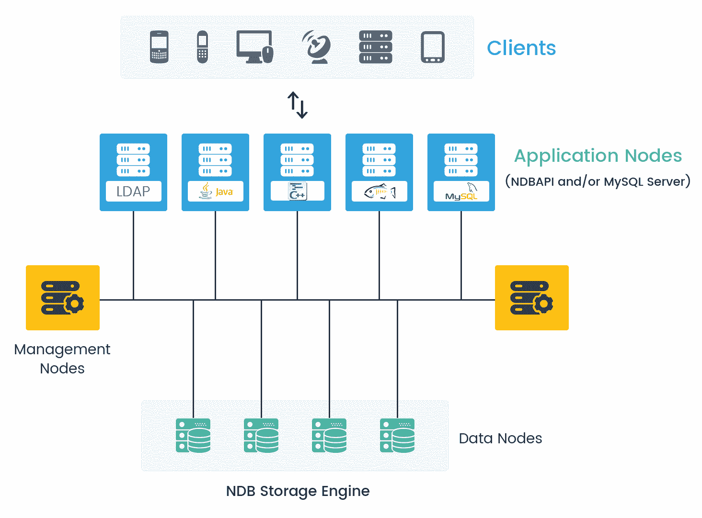
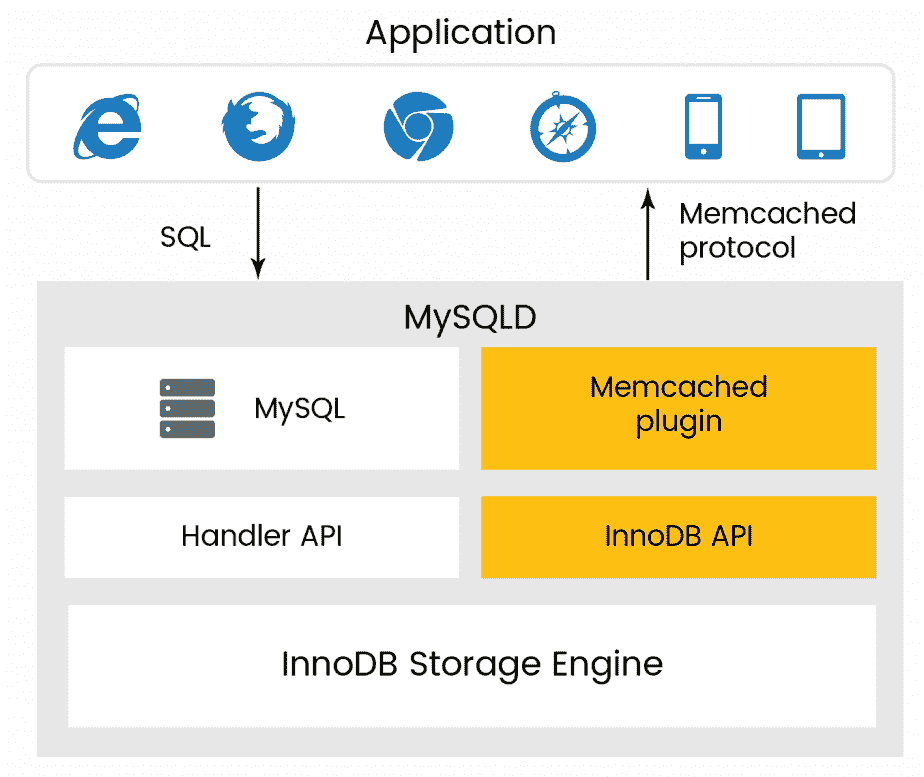
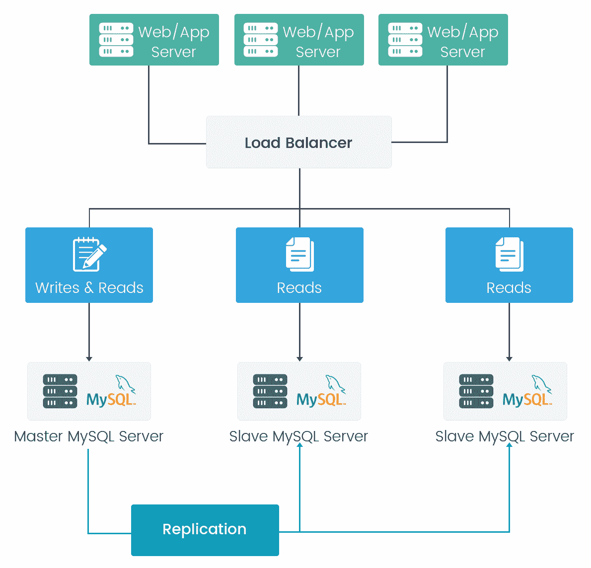

# 第十章：MySQL 8 – 可扩展性和高可用性

在本章中，我们将涵盖 MySQL 8 可扩展性和高可用性的以下重要主题：

+   MySQL 8 中可扩展性和高可用性的概述

+   扩展 MySQL 8

+   MySQL 8 的扩展性挑战

+   实现高可用性

在我们继续详细讨论之前，让我们先来了解一下 MySQL 8 中的可扩展性和高可用性

# MySQL 8 中可扩展性和高可用性的概述

在任何类型的应用程序中，无论是移动、Web 门户、网站、社交、电子商务、企业还是云应用程序，数据都是业务的核心部分。数据可用性被认为是任何企业或组织的最重要关注点。数据丢失或应用程序的任何停机都可能导致严重的财务损失，也会影响公司在市场上的信誉。

如果我们考虑一个在线购物网站的例子，它在特定区域有一个良好覆盖的市场，有客户和良好的商业信誉。如果这家企业面临数据丢失或任何应用程序服务器或数据库服务器的停机问题，将影响整个业务。许多客户会失去对企业的信任，企业也会在财务和信用方面遭受损失。

没有一个单一的公式可以提供解决方案。不同的企业有他们自己的应用程序需求、业务需求、不同的流程、不同地点的不同基础设施和运营能力。在这些情况下，技术在实现高可用性方面起着重要作用。

根据可扩展性和高可用性的要求，MySQL 可以用于各种应用程序，并且根据需要能够克服故障，包括 MySQL 的故障、操作系统的故障或可能影响可用性的任何计划维护活动。简单来说，可扩展性具有在 MySQL 服务器之间分配数据库负载和应用程序查询的能力。

选择正确的高可用性解决方案时，重要的属性取决于系统可以被称为高可用性的程度，因此这些要求因系统而异。对于较小的应用程序，用户负载预计不会很高，设置复制或集群环境可能会导致非常高的成本。在这种情况下，提供正确的 MySQL 配置也足以减少应用程序负载。

以下部分简要描述了 MySQL 8 支持的主要高可用性解决方案。

# MySQL 复制

MySQL 复制允许将一个服务器上的数据复制到多个 MySQL 服务器上。MySQL 复制提供主从设计，因此组中的一个服务器充当主服务器，应用程序执行写操作，然后主服务器将数据复制到多个从服务器。复制是高可用性的一个成熟解决方案，被 Facebook、Twitter 等社交巨头使用。

# MySQL 集群

这是 MySQL 的另一个流行的高可用性解决方案。集群使数据能够自动共享到多个 MySQL 服务器上进行复制。它旨在提供更好的可用性和吞吐量。

# Oracle MySQL 云服务

Oracle MySQL 云服务提供了一种有效的方式来构建一个安全、具有成本效益的 MySQL 数据库服务，用于现代应用程序。与本地部署相比，它被证明是可扩展和成本效益的，资源利用率较低。

# 具有 Solaris 集群的 MySQL

MySQL 数据服务提供的 Sun Solaris 集群提供了有序启动和关闭、故障监控和 MySQL 服务的自动故障转移机制。Sun 集群 HA 保护的 MySQL 数据服务的以下 MySQL 组件。

使用第三方解决方案可以获得更多选项。用于实现高可用数据库服务的每种架构都因其提供的可用性水平而有所不同。这些架构可以分为三个主要类别：

+   数据复制

+   集群化和虚拟化系统

+   地理复制集群

根据问题的最佳答案，您可以选择适合您的应用程序的正确选项，以实现最低成本和高可用性解决方案。这次讨论为我们提供了 MySQL 8 高可用性的公平概述。

# MySQL 8 的扩展

可伸缩性是将任何应用程序查询的负载分布到各种 MySQL 实例的能力。对于某些情况，数据不能超过某个限制或用户数量不会超出范围是不可预测的。可扩展的数据库将是一个更可取的解决方案，以便在任何时候我们都能满足规模的意外需求。MySQL 是一个有回报的数据库系统，因为它具有可扩展性，可以在水平和垂直方面进行扩展；在数据方面，将客户端查询分布到各种 MySQL 实例是相当可行的。向 MySQL 集群添加性能非常容易，以处理负载。

实现高可用性（HA）和可伸缩性的要求可能因系统而异。每个系统都需要不同的配置才能实现这些能力。当我们考虑在 MySQL 中进行扩展时，会有许多问题，而在我们在 MySQL 中执行扩展操作时：

+   为什么需要扩展？

+   在 MySQL 中扩展的优势是什么？

+   在我们在 MySQL 中进行扩展时，需要牢记哪些要点？

+   如何进行扩展工作？

+   数据安全吗-它是否提供数据安全的保证？

+   还有很多...

让我们举一个实时例子来理解为什么我们需要在 MySQL 中进行扩展。我们有一个在线电子商务网站，它已经覆盖了一个小市场，用户和网站的点击量有限，只有一个数据库服务器。业务正在不断增长；业务的性能不断提高，用户数量也在增加，但我们的单个数据库服务器并不能始终满足所有请求和性能的扩展。这可能导致服务器崩溃，业务可能会在利润和市场信用方面遭受损失。为了避免这种情况，可伸缩性将发挥重要作用。如果由于任何原因客户的请求失败，或者节点宕机，其他节点将迅速处理并向客户提供适当的响应。

扩展是为了持续提高数据库响应时间的性能和提高产品的生产力。它将有助于最终产品在数据可伸缩性、性能和更好结果方面。集群和复制都是 MySQL 中可以用于扩展的关键功能。

# 使用集群进行扩展

基本集群架构分为四个不同的层：

+   客户端节点

+   应用节点

+   管理节点

+   数据节点

这些显示在以下图像中：

# 客户端节点

客户端节点是发送来自不同设备（如计算机、手机、平板电脑等）的读取数据或写入数据的查询请求的最终用户或应用程序。

# 应用节点

应用节点旨在提供应用程序逻辑和包含 MySQL 数据的节点之间的桥梁。应用程序可以通过 SQL 访问存储在 MySQL 集群中的数据，使用 SQL 的一个或多个 MySQL 服务器。在应用程序中，我们有多种技术可以连接到 MySQL 服务器。我们使用标准的 MySQL 连接器连接 MySQL 服务器，这使我们能够与各种访问技术连接。

作为另一种选择，我们有 NDB API；一个高性能接口，可用于控制实时用户体验并提供更好的吞吐量。在 MySQL 中，我们有 NDB API，它在 NoSQL 接口之外添加了一层，具有直接访问集群的能力。应用节点可以从所有数据节点获取数据，因此故障的唯一原因可能是应用服务不可用，因为应用可以使用所有数据节点来执行数据操作。

# 管理节点

管理节点在其集群中发布相关的集群信息，以及节点管理。管理节点在所有节点希望加入 MySQL 集群以及需要重新配置系统时启动时起作用。管理节点可以停止并重新启动所有服务，而不会损害或影响正在进行的操作、执行或数据和应用节点的处理。

# 数据节点

数据节点存储数据。表在数据节点之间共享，这也有助于处理负载平衡、复制和高可用性故障转移。

数据节点是 MySQL 集群解决方案的主要节点。它提供以下功能和好处：

# 磁盘和内存数据的数据存储和管理

在共享无情景况下，数据存储在至少一个副本中，而无需使用共享磁盘空间。MySQL 创建数据库的一个副本，进行同步复制过程。如果任何数据节点由于任何特定原因失败，复制的数据将处理并提供相应的输出。它对节点进行同步复制，因此它包含与主节点数据相同的数据。

根据需求，我们可以将数据存储在内存中或部分存储在磁盘上。频繁更改的数据建议存储在内存中。内存中的数据会定期与本地磁盘进行检查，并协调将数据更新到其余数据节点。

# 表的自动和用户定义的分区或分片

MySQL 集群提供低延迟、高吞吐量、可伸缩性和高可用性。它采用水平扩展和自动分片来通过不同的 NoSQL 查询提供重载读/写操作。NDB 集群是一组不同的节点，每个任务在其自己的处理器上运行。

# 数据节点之间的同步数据复制

当我们为数据节点进行数据复制时，它遵循同步复制，因此任何时候所有节点数据都将同步。如果任何节点由于任何原因失败，其他节点具有相同的数据，因此将能够为查询提供数据。因此，MySQL 提供了完美的无数据响应停机时间的解决方案。

# 数据检索和事务

MySQL 支持可以映射的每个事务，因为它在主服务器上提交并应用于从服务器上。这种方法不是指`binlog`文件或`binlog`文件中的相关位置。`GTID`复制仅基于事务工作；很容易确定主服务器和从服务器是否同步。

# 自动故障转移

如果任何数据节点由于任何原因失败，其他节点将负责并响应请求。数据库的复制在停机或任何节点发生故障的关键情况下非常有帮助。

# 故障后自动重新同步进行自我修复。

如果任何节点失败，它将自动启动并再次对其余节点执行数据同步，并在节点中复制所有最新数据。在这种情况下，它对故障进行自我修复。

# 在 MySQL 8 中使用 memcached 进行扩展

在 MySQL 8 中，使用 memcached 是实现可伸缩性的一种方式。Memcached 是一种简单且高度可伸缩的解决方案，可以在内存可用时以键值形式将数据存储在缓存中。Memcached 通常用于快速访问数据。存储在内存中的数据不需要执行 I/O 操作来获取数据。

由于所有信息都存储在内存中，因此数据的访问速度比每次从磁盘加载要快得多，并且可以在数据库服务器上获得更好的查询执行时间。该插件还具有序列化功能，可以将二进制文件、代码块或任何其他对象转换为可以存储的字符串，并提供了检索这些对象的简单方法。在指定内存分配时，不应大于服务器可用的物理内存。

如果指定的值过大，那么为 memcached 分配的一些内存将使用交换空间而不是物理内存。这可能会导致存储和检索值时出现延迟，因为数据被交换到磁盘而不是直接存储在内存中。

前面的图片描述了 memcached 架构，显示了数据从 memcached 流向客户端或最终用户，或者从应用程序请求数据的流程。

在 memcached 中的数据永远不会存储在数据库中。它始终在内存中可用。如果其中一个 memcached 服务器失败，数据将从数据库中获取，因此不会影响最终用户的数据检索，也不会对应用程序产生重大性能影响。在使用 memcached 服务器时唯一需要牢记的是，与任何重要信息相关的数据，例如财务交易，不应放置在 memcached 中。在这种情况下，如果 memcached 发生故障，可能无法检索数据。在 memcached 服务器中，数据完整性不健康，因为它存储在内存中，因此在发生故障时最好不要将重要数据保存在 memcached 中。在配置 memcached 服务器时，内存大小是关键因素。如果配置不当，就可能会出现糟糕的情况。

通过这种方式，我们可以使用 memcached 来扩展 MySQL 服务器，以提高数据响应时间，并提供更快的性能。这将减轻 MySQL 服务器和多个服务器的负载作为缓存组的一部分，并为多种语言提供接口。建议在有大量读取操作时使用。

# NoSQL API

MySQL 集群提供了许多方法来帮助访问数据存储。最通用的方法之一是利用 SQL；然而，在实际用例中，我们也可以依赖于本机 API，它允许从数据库内部获取数据，而不会影响性能或增加进一步的复杂性，因为需要开发应用程序来转换 SQL。

# 使用复制进行扩展

复制是 MySQL 数据库的复制。MySQL 提供了不同的复制方法。MySQL 具有复制功能，提供了扩展解决方案、数据安全、远程数据分发等许多好处。我们在第八章中详细讨论了这一点，*MySQL 8 中的复制*。以下图片解释了 MySQL 中复制的基本架构：

复制是 MySQL 的最佳功能之一。它简单地将数据复制到新服务器或另一台物理机器上，该服务器将从主服务器导入数据。每当需要数据时，它将填充准确的结果。它遵循主从复制的方法。主数据库是应用程序的实际数据库，从数据库是由 MySQL 在另一台物理服务器的数据库服务器中创建的，其中包含来自主服务器的复制数据。我们可以为特定操作配置从数据库，例如当查询涉及从数据库读取数据时，我们可以在从服务器上执行此操作。在这种情况下，主数据的负载将比以前少。假设我们有 40%的写入数据查询和 60%的读取数据查询比例；在这种情况下，如果我们有一台单独的服务器，它将处理与读写操作相关的所有操作。但是，如前图所定义，我们已经将数据库复制到两个不同的服务器中，并且读操作是在从服务器上执行的，因此我们可以利用其中一个从服务器来执行复杂的读查询。这使得在 MySQL 8 上进行数据分析报告成为可能，因为执行复杂的读查询不会影响整体应用程序性能。

在标准的 MySQL 复制中，主服务器创建二进制日志文件并维护日志文件的索引以维护和跟踪日志轮换。二进制日志文件用于记录更新，并发送到从服务器。当从服务器连接到主数据库服务器时，它会考虑它在日志文件中读取的最后位置，之后从服务器将接收自那时以来发生的任何更新。从服务器随后会阻塞并等待主服务器通知其进行进一步更新。

心中的问题是为什么我们需要复制？或者，复制的目的是什么？如果复制需要另一个数据库服务器、复杂性和额外的配置，它会增加维护和监控时间。尽管如此，对于企业和数据库管理员来说，我们仍然有许多额外的好处。

# 单服务器依赖

在任何情况下，如果主数据库服务器失败，我们可以轻松地将数据库连接切换到复制的从服务器，以在关键情况下提供稳定性。这包括网络故障、服务器故障、硬件问题等失败原因。

# 性能

性能是数据库的主要部分。当我们在多个服务器上拥有分布式数据库时，我们可以将不同的应用程序连接到不同的数据库服务器以提高性能。此功能减少了查询的响应时间。

# 备份和恢复

复制有助于备份主数据库。它比将数据库存储在磁盘上更有效。用户可以使用复制的数据库将数据库存储在主数据库中，作为备份，而不是挖掘备份文件。当需要恢复主服务器的数据时，用户可以轻松地从从服务器获取，而无需处理备份文件并寻找最后的更新和其他操作。

# 负载分布

通过使用数据库的复制负载，可以减少查询执行；我们可以将读写操作分割到不同的数据库中。如果我们在主数据库中执行写操作，并在从数据库中执行读操作，这将改善应用程序的响应时间。我们可以在 MySQL 中创建负载平衡的环境，以分享对数据库服务器的所有请求的负载。负载平衡器随后进一步将请求发送到可以处理每个事务的数据库，从而获得更好的吞吐量。

# 异步数据复制

异步数据复制意味着数据从一台机器复制到另一台机器，会有一定的延迟。这种延迟基于网络带宽、资源可用性或管理员在配置中设置的时间间隔。正确的配置和时间设置可以提供准确的响应结果。这是基于网络管理员的配置。同步数据复制意味着数据同时提交到一个或多个机器。

# 地理数据分布

组复制使得可以将主服务器的数据复制到位于远程位置的从服务器，并为一个独立的客户组执行读操作，而不会影响主服务器的操作。

# GTID 复制

**全局事务标识符**（**GTID**）使用基于事务的数据复制，而不是基于二进制日志文件的复制。除非在所有从服务器上存在在主服务器上操作和提交的事务，否则 GTID 不会考虑复制处于一致状态。

在 MySQL 8 中，复制可以在异步模式或半同步模式下进行。在异步模式下，写操作立即在主服务器上执行，而在从服务器上的复制是根据配置定期进行的。

在复制的半同步模式中，如果在主节点和至少一个从节点上启用了半同步配置，则主节点上的事务在获得事务超时之前会等待，直到半同步启用的节点确认已接收到所需的数据或更新。超时后，主节点再次寻找半同步从节点并执行复制。

MySQL 8 提供了一种新的复制方法，GTID，其中为在主服务器上保存或提交的每个事务创建并连接了一个唯一标识符。这些标识符的唯一性在创建它的服务器中的所有服务器以及复制的服务器中都是如此。GTID 在所有事务之间有一对一的映射。在启动新的从服务器创建或故障转移到新的 MySQL 主服务器时，不需要使用日志文件引用文件中的位置的概念。您可以在 GTID 中使用基于行或基于语句的复制。

使用全局事务 ID 主要提供了两个主要的好处：

+   **在故障转移期间很容易将主服务器更改为连接从服务器**：GTID 在复制组中的所有服务器中是唯一的。从服务器记住了来自旧主服务器的最后一个事件的全局事务 ID。这意味着很容易确定在新的 MySQL 主服务器上重新初始化复制的位置，因为全局事务 ID 在整个复制层次结构中都是已知的。

+   **从服务器的状态提供了一种崩溃安全的方法**：从服务器在`mysql.gtid_slave_pos`系统表中保存当前位置信息。如果该表使用事务性存储引擎（例如默认的`InnoDB`），则进一步的更新将在同一事务中进行。

GTID 是在主服务器上提交的每个事务（插入和更新操作）上创建并关联的唯一键。该键不仅对主服务器是唯一的，而且在复制的所有服务器中也是唯一的。

# ZFS 复制

ZFS 文件系统具有提供服务器文件的快照、将快照传输到另一台机器并提取快照以在不同服务器上重新创建文件系统的能力。用户可以随时创建快照，并可以根据需要创建多个快照。通过不断创建、传输和恢复快照，可以在一个或多个机器之间提供类似于 DRBD 的同步。

我们已经看到了使用不同技术在 MySQL 中扩展数据库的所有可能方法。根据业务需求和灵活性，我们可以通过数据库备份来进行扩展。扩展并不是一项容易的任务，但在 MySQL 8 中是可能的，只要具备对业务需求的正确理解和 MySQL 8 提供的配置。对于数据库扩展，我们必须对数据库的整个工作流程和通信方法有适当的理解。

# MySQL 8 扩展中的挑战

我们已经看到了扩展的工作原理以及扩展的优势和目的。当我们开始在 MySQL 8 中进行扩展时，我们将面临哪些挑战，以及在我们朝着扩展的方向努力时需要记住哪些步骤？我们必须考虑如果我们正在进行扩展并且主服务器失败，达到了限制，读写操作无法处理应用程序的请求，或者在重新平台化数据库时。扩展并不是一项容易的任务；它需要确保能够处理增加的交易而不会出现任何困难。在进行扩展时，我们需要记住许多要点，例如主服务器和从服务器中的写入和读取操作限制。数据库负载平衡是帮助减少交易流量的方法之一，但它需要完美，需要正确理解负载平衡配置。以下是我们进行扩展时面临的主要挑战。

# 业务类型和灵活性

这是在进行扩展时需要记住的第一点。业务类型或业务行为是核心部分；如果业务是电子商务，我们已经知道电子商务业务具有许多功能和关于客户的非常关键的数据，例如产品细节，业务的优惠和折扣的垄断。最重要的是客户细节和付款信息，如信用卡细节，借记卡细节和客户反馈。

在这种情况下，当我们在 MySQL 8 中进行扩展时，需要记住所有参数，例如数据库备份、安全性、数据库的角色/权限和扩展的向后兼容性。在通过集群进行扩展时，所有数据节点都需要保持一致。如果应用程序使用多种技术开发，并且我们为每个堆栈进行扩展，我们可以有不同的数据节点可用；在这种情况下，在进行扩展时需要确保数据库同步是最重要的事情之一。在设计扩展之前，应明确哪些类型的数据应该驻留在 memcached 的缓存内，哪些类型的数据应该驻留在磁盘上。

应用程序的行为从共享数据节点访问数据。如果我们有一个电子商务网站，并且我们对其进行分片，并且在某个特定级别上，客户端无法使用其他分片服务器的数据，那么在那时将需要跨节点事务。这完全取决于业务行为，并取决于业务在接受有关数据库扩展的变化时有多灵活。

# 了解服务器工作负载

为了灵活性、规模和性能的提高，在 MySQL 8 中有许多选项和操作。许多人在执行此类活动时会遇到问题，因为他们没有足够的理解或知识来处理各种技术堆栈和配置选项选择，这些选项可以改善应用程序和部署活动的可扩展性、性能、安全性和灵活性。这些配置选项包括集群、复制、分片、内存缓存、存储引擎等，可以很好地设计来处理应用程序的整个工作负载。数据库工作负载和业务行为有助于决定 MySQL 的配置。

# 读写操作限制

如果主数据库服务器的读写限制达到并且事务在增加，会发生什么情况。MySQL 有容量限制；例如，如果许多客户在进行读写操作的同时访问网站，而服务器或节点未同步，那么这将给最终用户带来困惑或误解。或者，在电子商务网站上，如果一个客户购买了最后一件库存中剩下的产品，并且同时另一个客户搜索相同的产品并且它仍然可用，那么在数据库的读写操作方面，这两个操作都不同步。

最后，其他客户可能会购买我们仓库中没有的同一产品。这会影响库存计算，并且客户对购买周期的过程产生疑虑。在这种情况下，我们将失去客户对业务的信任，业务的信用也会受到影响。

另一种方法是进行数据库分片。分片可以简单地理解为将数据库分成多个服务器的分区。分片有助于减轻单个数据库或主数据库的负载。如果我们在地理上进行数据库分片，并且对于不同的国家或地区，我们有不同的数据库服务器，我们可以解决 MySQL 服务器上读取和写入操作的限制问题。但是，我们用于分片的技术也决定了数据库的性能。我们已经在《第九章》*MySQL 8 中的分区*中详细了解了这一点。

# 维护

在 MySQL 8 中进行了扩展时，我们必须知道如何管理主服务器和从服务器，以及在执行扩展时需要哪些配置。在服务器处于关键阶段时需要注意哪些步骤？在分片、集群或数据库服务器复制时需要执行哪些步骤？

扩展是可能的，但并不是一项容易的操作。如果我们想要进行扩展，我们应该知道数据库可以处理更多的事务而不会出现任何问题。我们应该知道适当的配置来克服主服务器上写入和读取操作的默认限制。完成后，我们需要执行类似的步骤来配置从数据库服务器，该服务器应该只为最终用户提供读取操作，并且应始终与主数据库同步。

如果我们有多个服务器，那么服务器的维护也将成为一项昂贵的开销。所有服务器都需要保持一致，配置应该合理，服务器的成本也会影响业务。如果数据量不断增加，那么服务器空间也需要以适当的方式进行管理。

# 主服务器故障

如果主服务器失败并且在那时数据对客户不可用，最终用户会感到沮丧，业务将在市场信用和失去客户方面受到影响。业务将不得不承受损失。

# 同步

无论我们是通过集群还是复制来执行扩展，都需要确保同步。所有从服务器应该有与主服务器相同的数据库。如果在主服务器上执行写操作并在从服务器上执行读操作，那么所有数据都需要同步。所有结果应该是相同的，如果在数据未同步的情况下某个服务器在某个时间段内宕机，将会导致数据丢失的问题。

# 数据库安全。

如果我们有不同的服务器并且进行了分片，我们如何保护数据库？如果在不同地点有不同的数据库服务器，并且在那个时候数据库的访问不是特定用户专用的，那么数据泄漏是一个很有可能的问题。我们必须完全了解数据库服务器的 IP 配置的数据访问点，以及对执行各种活动的数据库用户的适当角色和权限。哪些 IP 有访问权限，哪些 IP 需要限制从服务器传输数据？在进行数据库的跨节点事务时，应该有准确的数据；不应该允许从服务器访问受限数据的权限。

# 跨节点事务

在进行扩展后，如果有多个节点并且一个节点需要其他节点的数据作为输入的一部分，则需要跨节点事务。例如，如果我们在不同地点有不同的节点，并且在那个时候所有地点都有单一的库存，那么当一个用户请求任何一个在那个时候不在数据节点上的产品时，就必须根据用户的请求与其他数据节点通信以获取产品的信息。

# 发展团队以进行开发

当应用程序可能有积极的响应并且其持续的成功增加了业务团队时，数据库管理员的扩展也将是必要的。当我们在 MySQL 8 中进行分片、扩展或复制时，需要具有适当知识和经验的团队成员来处理持续扩展和数据库服务器的管理。这不仅仅局限于设置数据库服务器；我们还需要关注服务器的维护并且持续监视服务器活动。

# 管理变更请求

当数据库结构发生变化并且我们已经进行了扩展或复制时，需要在变更请求的一部分中注意一些事项，或者如果我们添加了新功能或增强了功能。这包括更新分片键、修改节点的数据分布、更新查询以考虑复制延迟以避免正在管理分片时的陈旧数据、数据平衡，并确保新更新的数据可用。

# 扩展和扩展

扩展描述了最大化单个 MySQL 节点处理能力的过程。扩展的过程可能涉及优化调整数据库软件和选择正确的存储引擎，正如之前在第六章中讨论的*MySQL 8 存储引擎*，并选择适当的硬件。单个节点的扩展有一定的限制，这些限制由数据大小、模式复杂性、CPU 周期、系统内存和磁盘 IO 操作的某种组合确定。尽管由于需要处理日益庞大的数据集，扩展一直备受关注，但重要的是要记住，我们扩展得越好，我们就需要越少的扩展节点，因此我们在硬件上的开销就越少。

扩展可以用于提供涵盖几种不同用例的解决方案。其中一些最常见的用例是通过复制来增加读取容量，或者使用数据库分片来增加总数据库大小和整体事务吞吐量。

在扩展 MySQL 8 时面临的关键挑战。在进行 MySQL 8 数据库扩展时，需要考虑这些挑战。一个错误可能会让业务陷入我们都不想面对的境地。扩展是改善数据库性能的更好方式。

# 实现高可用性

高可用性指的是系统具有耐用性，并且可以在移动、网络门户、网站、社交、电子商务、企业和云应用程序的任何请求或响应所需的数据上执行操作而不受任何干扰。数据可用性被认为是任何企业或组织的最关注的问题。任何停机问题可能会影响业务信用，并且在某些情况下，企业可能会遭受财务损失。

例如，如果我们有一个单个数据库服务器的电子商务应用程序，如果由于硬件故障、网络问题、病毒或操作系统问题等原因，该服务器宕机，也会影响数据。电子商务应用程序可能会在同一时间有大量的客户访问，任何服务器无法为用户请求提供响应的故障都会影响用户；他们会寻找其他购买商品的选择。

MySQL 8 具有提供应用程序后端的能力，帮助实现高可用性和准备一个完全可扩展的系统。系统保持连接持久性的能力，以防止基础设施的一部分失败，以及系统从此类故障中恢复的能力被认为是高可用性。系统的故障可能是由系统的一部分进行维护活动，如硬件或软件升级，或者由安装的软件的故障引起的。

# 高可用性的目的

实现高可用性和可扩展性的要求可能因系统而异。每个系统都需要不同的配置才能实现这些能力。MySQL 8 还支持不同的方法，例如在多个 MySQL 服务器之间复制数据，或者根据地理位置准备多个数据中心，并从最接近客户位置的数据中心为客户请求提供服务。这样的解决方案可以用来实现 MySQL 的最高运行时间。

如今，在竞争激烈的市场中，组织的关键点是使其系统保持运行。任何故障或停机都会直接影响业务和收入。因此，高可用性是一个不容忽视的因素。MySQL 非常可靠，并且使用集群和复制配置始终可用。集群服务器可以立即处理故障，并管理故障转移部分，以使系统几乎始终可用。如果一个服务器宕机，它将重定向用户的请求到另一个节点，并执行所请求的操作。

# 数据可用性

数据在任何情况下都是可用的。在任何应用程序中，数据都是核心部分，实际上是应用程序所有者的财富。如果我们有一个医疗保健系统，在任何患者的医疗检查时，由于服务器宕机或其他原因，他们的数据不可用，可能会阻碍医生的进一步处理，在这种情况下会影响患者的生命。

# 数据安全

首先想到的是保护数据，因为如今数据变得非常宝贵，如果不满足法律义务，可能会影响业务的连续性；事实上，情况可能会很糟糕，甚至可能会迅速关闭您的业务。MySQL 是最安全可靠的数据库管理系统，被许多知名企业使用，如 Facebook、Twitter 和 Wikipedia。它确实提供了一个良好的安全层，可以保护敏感信息免受入侵者的侵害。MySQL 提供访问控制管理，因此在用户身上授予和撤销所需的访问权限很容易。还可以定义角色，并为用户授予或撤销权限列表。所有用户密码都以加密格式存储，使用特定的插件算法。

# 数据同步

当我们只有一个数据库服务器时，如果由于任何原因它宕机，我们将丢失整个数据库，如果我们备份数据库直到当天，我们可以恢复数据库直到那一天，但在这种情况下，所有当前事务也将丢失。那时最后的交易数据将不可用。

# 数据备份

当一个企业有任何基于服务器的应用程序，其中单个数据库服务器执行所有任务时，应该在计划中备份数据库直到最后一个事务。在进行高可用性时，需要在架构中包括备份和恢复操作的所有场景。

# 竞争激烈的市场

在市场上有许多竞争对手提供相同性质的业务。在这种情况下，如果一个企业在数据可用性方面出现问题，客户可能会选择另一个提供商而不是继续与该企业合作。这是业务连续性的一个重要部分。

# 性能

高可用性在数据操作的性能方面也很重要。如果我们只有一个服务器，并且所有操作都在该服务器上执行，那么在某个阶段它将达到其极限，服务器容量将耗尽。因此，在这种情况下，如果我们实施了高可用性架构，它将提供一种平衡事务和数据操作性能的手段。复制和集群使并发性更好，并管理工作负载。

# 系统更新

当任何在线站点或应用程序需要更新或计划进行任何新的生产发布时，它直接影响最终用户。如果一个应用程序在那个时候只有有限的用户，我们可以通过电子邮件或应用程序内的消息管理所有最终用户的更新。但是，在一个应用程序中有大量用户的情况下，这将影响业务。它将同时停止所有用户，由于这个正在运行的事务会受到影响。

# 选择解决方案

再次，我们必须考虑选择可用性的正确解决方案。在我们计划在 MySQL 中实现高可用性时，需要牢记许多事情。实现 HA 和可伸缩性的要求可能因系统而异。每个系统都需要不同的配置才能实现这些能力。

这样的解决方案可以用来实现 MySQL 在以下方面的最高运行时间：

+   所需的可用性级别

+   部署的应用程序类型

+   自己环境中的最佳实践

在 MySQL 中，复制和集群是实现高可用性的最佳选择。所有应用程序都有自己的架构，当我们选择任何技术来实现 MySQL 8 的高可用性时，需要考虑其业务性质。

# 高可用性的优势

当我们在 MySQL 中执行高可用性时，我们拥有以下优势：

+   MySQL 非常可靠，并且使用集群和复制配置具有持续的可用性。

+   集群服务器可以立即处理故障并管理故障转移部分，以使系统几乎始终可用。如果一个服务器宕机，它将重定向用户的请求到另一个节点并执行请求的操作。

+   系统保持连接持久的能力，即使基础设施的一部分失败，系统从此类故障中恢复的能力被视为高可用性。

+   MySQL 8 还支持不同的方法，例如在多个 MySQL 服务器之间复制数据，或者基于地理位置准备多个数据中心，并从最接近客户位置的数据中心提供客户请求。

+   MySQL 以最佳速度进行事务处理。它可以缓存结果，提高读取性能。

+   复制和集群使并发性更好，并管理工作负载。组复制基本上负责在大多数组复制成员已经同时确认事务已被接收时提交事务。如果写入的总数不超过组复制成员的容量，则可以创建更好的吞吐量。

+   集群使数据能够复制到多个 MySQL 服务器并进行自动共享。它旨在提供更好的可用性和吞吐量。

+   Memcached 去除了 SQL 层，直接访问 InnoDB 数据库表。因此，诸如 SQL 解析之类的开销操作将不再执行，这确实会影响性能。

+   Memcached 与 MySQL 还为您提供了一种使内存中的数据持久化的方法，以便我们可以在不丢失数据的情况下使用各种数据类型。

+   Memcached API 可用于不同的编程语言，如 Perl、Python、Java、PHP、C 和 Ruby。借助 Memcached API，应用程序可以与 Memcached 接口交互，存储和检索信息。

# 总结

在本章中，我们从 MySQL 8 的可伸缩性和高可用性概述开始，涵盖了各种可伸缩性需求、优势、方法以及在设计可伸缩性 MySQL 8 时需要注意的关键点。我们还讨论了在进行可伸缩性时通常遇到的缺点以及如何通过适当的解决方案克服挑战。我们学习了 MySQL 8 的扩展和扩展 MySQL 8 的故障排除挑战。我们还学习了在 MySQL 8 中实现高可用性的许多不同方法。

在接下来的章节中，我们将学习如何确保 MySQL 8 的安全性。我们将了解影响安全性的一般因素，核心 MySQL 8 文件的安全性，访问控制以及保护数据库系统本身。我们还将学习安全插件的详细信息，并深入了解关系数据库的数据库安全性。
