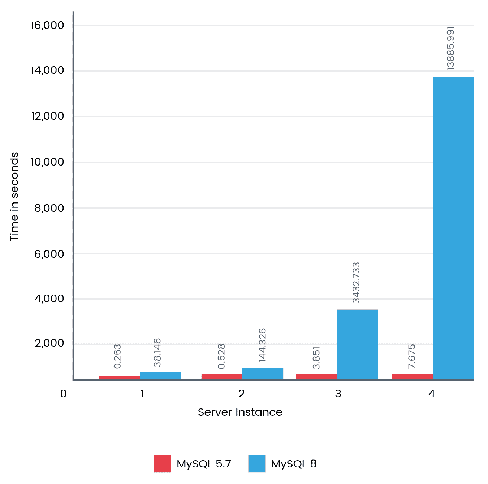
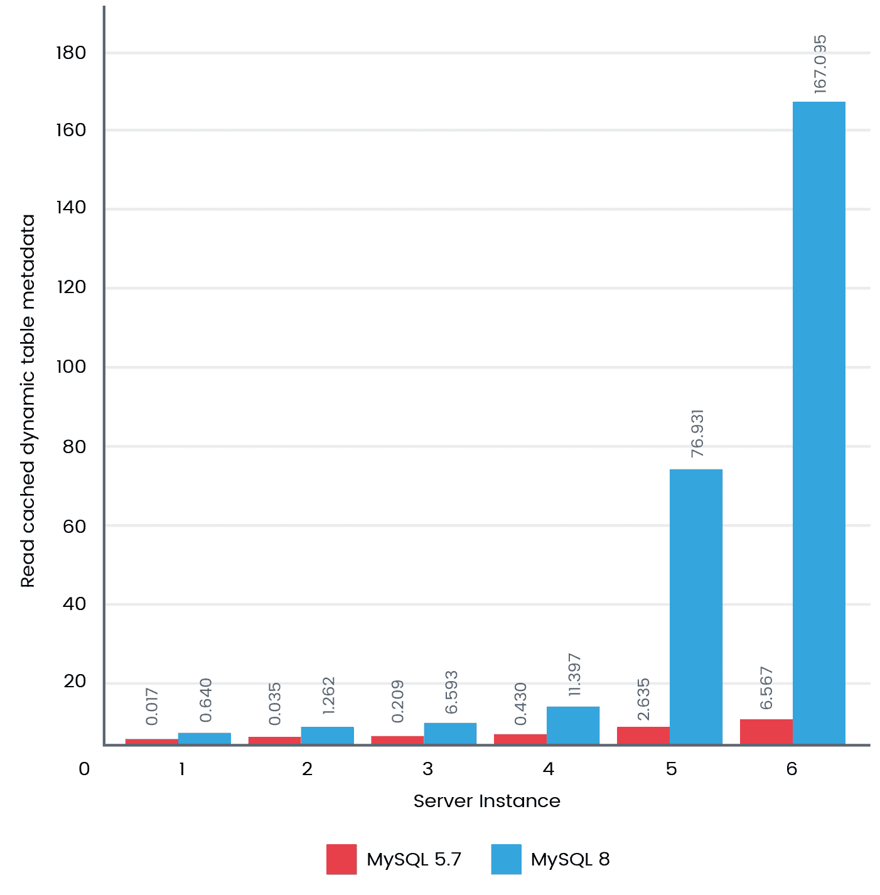
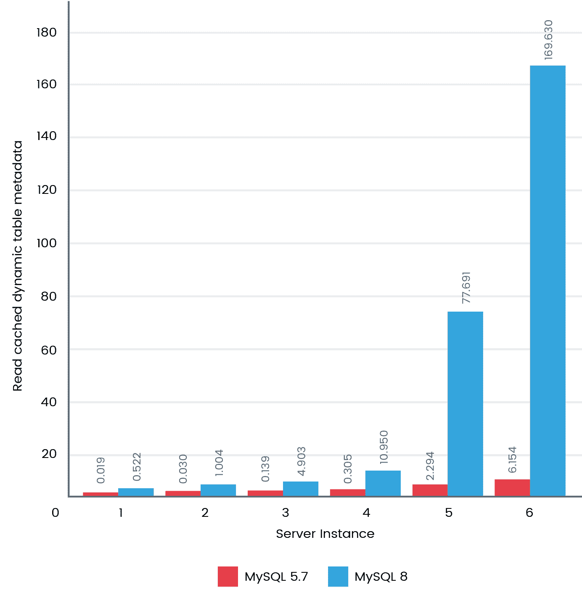
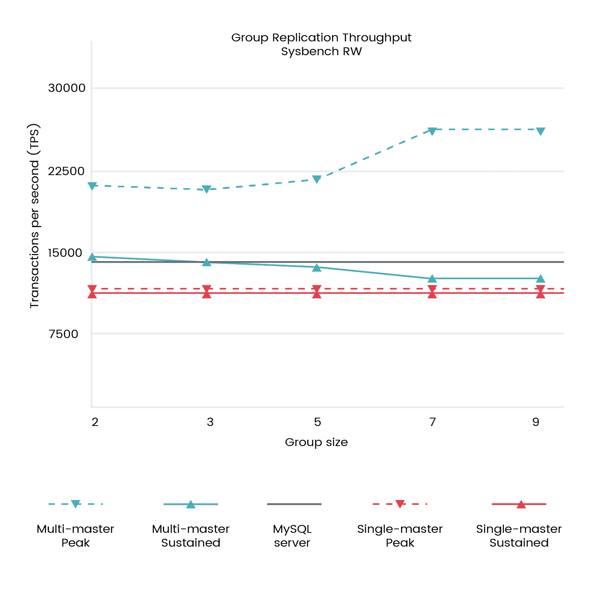

# 第十四章：MySQL 8 最佳实践和基准测试

在上一章中，你学习了如何扩展 MySQL 8。它涵盖了许多有趣的方面，比如扩展插件并通过 MySQL 8 中的服务调用它们，向 MySQL 8 添加和调试新功能等等。在本章中，我们将介绍 MySQL 8 的最佳实践，这是一个备受期待的版本，承诺解决之前版本的许多不足之处，并具有令人兴奋的新功能。MySQL 8 承诺不仅是一个独立的数据库，而且还将在包括大数据解决方案在内的各个领域发挥重要作用。我们将学习如何在 MySQL 8 中实施最佳实践以最大程度地利用其功能。基准测试将进一步增进我们的理解。

我们将在本章中涵盖以下主题：

+   MySQL 基准测试和工具

+   memcached 的最佳实践

+   复制的最佳实践

+   数据分区的最佳实践

+   查询和索引的最佳实践

由于突出的优化和改变，MySQL 8 直接从 MySQL 5.7 的发布中提升了版本。MySQL 8 将不再有文件限制，这之前限制了你可以拥有的数据库数量。还有许多令人兴奋的功能，我们在《MySQL 8 简介》第一章中已经介绍了。MySQL 8 现在可以在一个数据库中存储数百万个表。它还可以快速修改表。

我很兴奋地阅读这一章，因为 MySQL 8 的最佳实践不仅影响着你的数据库性能、可伸缩性、安全性和可用性，而且整体上还会暴露出你的系统对最终用户的表现。这是我们的最终目标，不是吗？让我们看看在我们的测试实验室中得出的一些基准测试结果，这些结果肯定会让你眼前一亮：


# MySQL 基准测试和工具

我们已经研究了 MySQL 8 中的各种新功能和改进。这让我们更加兴奋，因为性能一直是我们渴望的。由于 MySQL 8 尚未普遍可用，Oracle 还没有发布其基准测试结果。我们没有等待它这样做，而是在一些领域进行了自己的分析。

MySQL 的最佳配置实践是锦上添花；没有樱桃，蛋糕看起来就不完整。除了配置，基准测试还帮助我们验证并找到瓶颈并解决它们。让我们看看一些特定领域，这将帮助我们了解配置和性能基准测试的最佳实践。

# 资源利用

IO 活动、CPU 和内存使用是你不应该错过的东西。这些指标帮助我们了解系统在进行基准测试和扩展时的表现。它还帮助我们推导每个事务的影响。

# 延长基准测试时间

我们可能经常希望快速查看性能指标；然而，确保 MySQL 在较长时间的测试中表现一致也是一个关键因素。有一些基本的东西可能会影响性能，比如内存碎片化、IO 的退化、数据积累后的影响、缓存管理等等。

我们不希望我们的数据库因为清理垃圾而重新启动，对吧？因此，建议长时间运行基准测试以验证稳定性和性能。

# 复制生产设置

让我们在一个生产复制环境中进行基准测试。等等！在复制环境中禁用数据库复制，直到我们完成基准测试。搞定！我们得到了一些不错的数字！

经常发生的情况是，我们并没有完全模拟我们将在生产环境中配置的所有内容。这可能会证明是代价高昂的，因为我们可能无意中在一个可能在生产中产生不利影响的环境中进行基准测试。在进行基准测试时，在你的复制环境中复制生产设置、数据、工作负载等。

# 吞吐量和延迟的一致性

吞吐量和延迟是相辅相成的。重点应该放在吞吐量上；然而，随着时间的推移，延迟可能是需要注意的。在`InnoDB`的早期版本中注意到了性能下降、缓慢或停顿。自那时以来它已经有了很大的改进，但由于可能有其他情况取决于你的工作负载，所以始终关注吞吐量和延迟是很好的。

# Sysbench 可以做更多

Sysbench 是一个很好的工具，可以模拟你的工作负载，无论是成千上万的表、事务密集型、内存中的数据等等。它是一个很好的模拟工具，并为你提供了很好的表示。

# 虚拟化世界

我想保持简单；裸金属与虚拟化并不相同。因此，在进行基准测试时，根据你的环境来衡量你的资源。如果你进行比较，你可能会惊讶地看到结果的差异。

# 并发

大数据坐落在沉重的数据工作负载上；高并发是重要的。MySQL 8 在每个新版本中都在扩展其最大 CPU 核心支持，根据你的需求和硬件资源优化并发应该得到关注。

# 隐藏的工作负载

不要错过在后台运行的因素，比如用于大数据分析的报告、备份以及在基准测试时进行的即时操作。这些隐藏的工作负载或过时的基准测试工作负载的影响可能会让你的日子（和夜晚）变得痛苦。

# 你的查询的神经

哎呀！我们错过了优化器吗？还没有。优化器是一个强大的工具，它会读取你的查询的神经并提供建议。这是我在对查询进行更改之前在生产环境中使用的工具。当你需要优化复杂的查询时，它就是救星。

这些是我们应该注意的几个领域。现在让我们看一下我们在 MySQL 8 上进行的一些基准测试，并将它们与 MySQL 5.7 上的基准测试进行比较。

# 基准测试

首先，让我们从所有的`InnoDB`表中获取所有列名。以下是我们执行的查询：

```sql
SELECT t.table_schema, t.table_name, c.column_name
FROM information_schema.tables t,
information_schema.columns c
WHERE t.table_schema = c.table_schema
AND t.table_name = c.table_name
AND t.engine='InnoDB';
```

以下图表显示了当有四个实例时，MySQL 8 的性能比 MySQL 5.7 快一千倍：



接着，我们还进行了基准测试，以查找静态表元数据。以下是我们执行的查询：

```sql
SELECT TABLE_SCHEMA, TABLE_NAME, TABLE_TYPE, ENGINE, ROW_FORMAT 
FROM INFORMATION_SCHEMA.TABLES
WHERE TABLE_SCHEMA LIKE 'chintan%';
```

以下图表显示了 MySQL 8 的性能比 MySQL 5.7 快大约 30 倍：



这让我们渴望更详细地了解一下。因此，我们想做最后一次测试，以找到动态表元数据。

以下是我们执行的查询：

```sql
SELECT TABLE_ROWS
FROM INFORMATION_SCHEMA.TABLES
WHERE TABLE_SCHEMA LIKE 'chintan%';
```

以下图表显示了 MySQL 8 的性能比 MySQL 5.7 快大约 30 倍：



MySQL 8.0 为表带来了巨大的性能改进。扩展到一百万个表，这是许多大数据需求的需要，现在是可以实现的。一旦 MySQL 8 可用于一般用途，我们期待着更多的基准测试被正式发布。

现在让我们看看我们的下一个主题，这将让你的生活更轻松。这一切都是关于考虑 memcached 的最佳实践。

# memcached 的最佳实践

现在可以使用`InnoDB` memcached 插件进行多个`get`操作，这将真正有助于提高读取性能。现在可以在单个 memcached 查询中获取多个键值对。频繁的通信流量也已经最小化，因为我们可以一次获取多个数据。

对于 memcached 配置最佳实践，您应该考虑的关键要点现在将要介绍。

# 资源分配

对于 memcached 的内存分配不应超过可用物理内存，也不应忽视其他可能使用内存的资源。如果我们过度分配内存，memcached 有很高的机会从交换空间中分配内存。这可能导致在插入或提取值时出现延迟，因为交换空间存储在磁盘上，比内存慢。

# 操作系统架构

由于操作系统架构为 32 位，需要谨慎。我们知道，在 32 位操作系统架构中，资源分配存在限制。

同样，具有 32 位操作系统架构的 4 GB RAM 的 memcached 不应设置超过 3.5 GB RAM，因为这可能会导致性能异常和崩溃。

# 默认配置

一些关键的默认配置参数应该根据您的需求进行调整：

+   **内存分配**：默认情况下，这是 64 MB；而应该根据您的需求和测试重新配置

+   **连接**：默认情况下，这是 1,024 个并发连接；而应该根据您的需求和测试重新配置

+   **端口**：默认情况下，这在端口`11211`上监听；而应该出于安全考虑监听另一个端口

+   **网络接口**：默认情况下，这接受来自所有网络接口的连接；为了安全起见，应该限制

# 最大对象大小

您应该考虑配置最大对象大小，默认情况下为 1 MB。但是，它可以增加到 128 MB。这纯粹取决于您要存储的数据类型，因此应允许其最大对象大小。允许将开销数据存储在 memcached 中可能会产生不利影响，因为可能有更多的数据需要检索，这可能会导致失败。

# 积压队列限制

积压队列限制是关于如果达到允许的连接限制，应该保留在 memcached 队列中的连接数。理想情况下，您允许的连接数应该配置得足够满足大部分需求。当 memcached 出现意外的高负载时，积压队列限制可能会有所帮助。理想情况下，它不应超过总连接数的 20%，否则可能会影响系统从 memcached 中获取信息的体验，因为会出现严重延迟。

# 大页支持

在支持大内存页的系统上，您应该启用 memcached 来利用它们。大页支持有助于分配大数据块来存储数据，并且还减少了使用这种方法的缓存未命中调用的数量。

# 敏感数据

在 memcached 中存储敏感数据可能构成安全威胁，因为可以访问 memcached 的人可以查看敏感信息。您显然应该采取预防措施来限制 memcached 的曝光。您还可以在将敏感信息存储在 memcached 之前对其进行加密。

# 限制曝光

Memcached 没有许多内置的安全功能。其中一项措施涉及在所需边界内暴露 memcached 访问。如果您的应用服务器需要与 memcached 通信，它只允许从该服务器访问 memcached，借助系统防火墙规则，如 IP Tables 或类似技术。

# 故障转移

Memcached 没有良好的故障转移技术。建议您配置应用程序以使其能够故障转移到不可用节点，并在另一个实例中重新生成数据。最好至少配置两个 memcached 以避免由于实例不可用而导致的故障。

# 命名空间

您可以利用 memcached 提供的命名空间，在将数据存储在 memcached 中之前基本上添加前缀。当您有多个应用程序与 memcached 通信时，这将会有所帮助。这是有帮助的，使用一些基本的命名约定原则，您可以得出一个解决方案。如果有存储名和姓的数据，您可以分别使用前缀，例如 FN 和 LN。这将帮助您轻松地从应用程序中识别和检索数据。

# 缓存机制

开始利用 memcached 中的缓存的最简单方法之一是使用两列表；您可以利用 memcached 提供的命名空间，基本上添加前缀。第一列将是主键，并且数据库架构应该是通过主键映射以及唯一约束的地址要求的唯一标识符。如果您想通过组合多个列值来获得单个项目值，您应该确保选择适当的数据类型。

具有单个`WHERE`子句的查询可以轻松映射到 memcached 查找，同时在查询本身中使用`=`或`IN`运算符。在使用多个`WHERE`子句或解析复杂操作（如`<`、`>`、`LIKE`和`BETWEEN`）的情况下，memcached 可以帮助您解决挑战。建议您使用传统的 SQL 查询将这些复杂操作添加到数据库中。

将整个对象缓存在 memcached 中，而不是选择缓存来自 MySQL 8 的单个行，这将是有益的。例如，对于博客网站，应该在 memcached 中缓存博客端的整个对象。

# Memcached 常规统计信息

为了帮助您更好地了解 memcached 的统计信息，我们将提供健康和性能的概述。下表显示了 memcached 返回的统计信息及其含义：

用于定义每个统计信息值的术语是：

+   **32u**：32 位无符号整数

+   **64u**：64 位无符号整数

+   **32u:32u**：由冒号分隔的两个 32 位无符号整数

+   **字符串**：字符字符串

| **统计** | **数据类型** | **描述** |
| --- | --- | --- |
| `pid` | 32u | memcached 实例的进程 ID。 |
| `uptime` | 32u | 该 memcached 实例的正常运行时间（以秒为单位）。 |
| `time` | 32u | 当前时间（作为时期）。 |
| `version` | 字符串 | 该实例的版本字符串。 |
| `pointer_size` | 字符串 | 该主机指定的指针大小（32 位或 64 位）。 |
| `rusage_user` | 32u:32u | 该实例的总用户时间（秒：微秒）。 |
| `rusage_system` | 32u:32u | 该实例的总系统时间（秒：微秒）。 |
| `curr_items` | 32u | 该实例存储的当前项目数量。 |
| `total_items` | 32u | 在该实例的生命周期内存储的项目总数。 |
| `bytes` | 64u | 该服务器用于存储项目的当前字节数。 |
| `curr_connections` | 32u | 当前打开连接的数量。 |
| `total_connections` | 32u | 服务器运行以来打开的连接总数。 |
| `connection_structures` | 32u | 服务器分配的连接结构的数量。 |
| `cmd_get` | 64u | 检索请求（`get`操作）的总数。 |
| `cmd_set` | 64u | 存储请求（`set`操作）的总数。 |
| `get_hits` | 64u | 请求并找到的键的数量。 |
| `get_misses` | 64u | 请求但未找到的项目数。 |
| `delete_hits` | 64u | 已删除并找到的键的数量。 |
| `delete_misses` | 64u | 删除但未找到的项目数。 |
| `incr_hits` | 64u | 增加并找到的键的数量。 |
| `incr_misses` | 64u | 增加但未找到的项目数。 |
| `decr_hits` | 64u | 已减少并找到的键的数量。 |
| `decr_misses` | 64u | 减少但未找到的项目数。 |
| `cas_hits` | 64u | 已比较并交换并找到的键的数量。 |
| `cas_misses` | 64u | 已比较并交换但未找到的项目数量。 |
| `cas_badvalue` | 64u | 已比较并交换，但比较（原始）值与提供的值不匹配的键的数量。 |
| `驱逐` | 64u | 从缓存中移除的有效项目数量，以释放内存供新项目使用。 |
| `bytes_read` | 64u | 该服务器从网络中读取的总字节数。 |
| `bytes_written` | 64u | 该服务器发送到网络的总字节数。 |
| `limit_maxbytes` | 32u | 该服务器允许用于存储的字节数。 |
| `threads` | 32u | 请求的工作线程数量。 |
| `conn_yields` | 64u | 连接的让步次数（与-R 选项相关）。 |

参考：[`dev.mysql.com/doc/refman/8.0/en/ha-memcached-stats-general.html`](https://dev.mysql.com/doc/refman/8.0/en/ha-memcached-stats-general.html)

这些是一些有用的项目，应该随时掌握 memcached 的最佳实践。现在是时候继续前进，看看复制的最佳实践了。

# 复制的最佳实践

MySQL 8 在复制方面取得了一些重大进展。MySQL 8 主要关注的是扩展性、性能和安全性，以及数据的最高完整性，这有望成为大数据领域的一个改变者。

# 组复制中的吞吐量

组复制基本上负责在大多数组复制成员同时确认接收事务后提交事务。如果写入的总数不超过组复制成员的容量，这将导致更好的吞吐量。如果容量规划不合适，受影响的成员会出现滞后，与组内其他成员相比。

# 基础设施规模

基础设施规模是性能和最佳实践清单的常见成功因素。如果基础设施规模不合适或在组复制的节点之间不均匀，可能会对复制基本拓扑产生不利影响。在考虑所需的组件吞吐量时，应考虑每个组件。

# 恒定的吞吐量

实现恒定的吞吐量是一个很好的成功因素。如果您开始经历影响组复制中其他成员的工作负载，可能是您的主服务器不断接受额外的工作负载并滞后，然后在耗尽所有资源之前可能返回到可接受的水平。此外，您可以实施一个排队方法，可以防止资源耗尽，并且只允许您将工作负载传递给根据容量预定义的成员。

在考虑排队方法时，您不能允许队列呈指数增长。这会影响最终用户，因为数据更新会有延迟。但是，您需要根据自己的需求和业务需求来决定，以实现系统的恒定吞吐量。

# 矛盾的工作负载

基本上，组复制旨在允许来自组中任何成员的更新。基于行重叠的事务回滚会检查每个事务；其余的将被提交并发送以更新到组中的其他成员。如果同一行上频繁发生多次更新，可能会导致多次回滚。您可能会遇到循环情况，其中一个服务器更新，请求其他服务器更新，并且同时另一个服务器已经为同一行更新。这将导致回滚。

为了防止这种情况，您可以让组中的最后一个成员应用更新，然后再进行下一个成员。您可以从先前执行更新的相同节点路由类似的更新，以防止循环回滚条件的发生。

# 写扩展性

通过分享写操作来分配您的写入工作负载，这可能会导致更好的吞吐量和更好的写入性能可伸缩性。这将取决于您在系统中预期的矛盾工作负载。当您的高峰工作负载是可以共享负载的情况下，这是有帮助的。通常情况下，如果您对写入可伸缩性进行了良好的容量规划，您将看到微不足道的改进。

请参考下面的图表：



您会注意到，通过多主分发，您的负载具有更好的吞吐量。它还考虑了多主配置中的组大小。

# 数据分区的最佳实践

一般来说，分区是将任何东西逻辑上分成多个子组，以便每个子组可以独立识别并组合成一个单一分区。

现在让我们学习不同的分区方法以及分区如何在存在大型数据表的情况下提供帮助。

对于任何组织来说，以一种能够提供可伸缩性、性能、可用性和安全性的方式存储数据非常重要。例如，在一个访问量很高的电子商务商店中，经常会有成千上万的订单。因此，为了维护日常订单交付并显示当前订单的仪表板，需要查询显示过去五年的订单表；使用当前数据执行这个过程将需要很长时间。在这里，历史订单数据用于分析用户行为或趋势，但这将需要在有限的数据集上执行。

有各种方法可以实现高可用性、可伸缩性和高性能架构的最佳解决方案；关键因素是分区。在数据库中，每个表中的数据存储在物理文件组中。因此，将这些数据表从单个文件组分割为多个文件组可以减少文件大小，并帮助我们创建一个可伸缩和高性能的数据库。

以下是在数据库中使用分区的关键好处：

+   **可伸缩性**：由于数据将在多个分区之间共享，服务器可以配置为使用多个节点，并且可以在多个节点之间配置分区。这样做将消除任何硬件限制，并允许数据库大规模扩展以容纳大量数据。

+   **高性能**：由于数据存储在多个分区中，每个查询将在数据的一小部分上执行。例如，在一个订单历史超过两年的电子商务商店中，要获取本月下的订单列表只需要检查一个分区而不是整个订单历史，从而减少查询执行时间。为了在多个分区上获取查询，我们也可以并行运行，从而减少从数据库获取数据的总时间。

+   **高可用性**：在分区中，数据被分割到多个文件组中。每个文件组在逻辑上连接在一起，但可以独立访问和处理。因此，如果一个文件组或分区损坏，或者服务器中的一个节点失败，那么我们不会失去对整个表的访问权限，而只是数据库的一部分不可用，从而消除了系统故障的可能性，使您的系统高度可用。

+   **安全性**：可能有些表中的数据需要高安全措施以避免数据窃取或数据泄漏。通过分区，您可以为一个或多个分区提供额外的安全性，以避免任何安全问题，从而提高数据的可访问性和安全性。

一般来说，分区是将任何东西逻辑上分成多个子组，以便每个子组可以独立识别并组合成一个单一分区。让我们了解在关系型数据库管理系统中分区意味着什么。

分区通常用于将数据分成多个逻辑文件组，以提高性能、可用性和可管理性。在处理大数据时，数据通常以数十亿条记录的形式存在。因此，为了提高数据库的性能，最好将数据分成多个文件组。这些文件组可以在单台机器上或跨多台机器共享，并由一个键标识。这些文件组被称为分区数据。

表中的数据可以通过两种方式进行分区：

+   水平分区

+   垂直分区

# 水平分区

当表中的行数非常大时，表可以被分成多个分区；这被称为**水平分区**。使用水平分区时，表的每个分区包含相同数量的列。可以同时访问所有分区，也可以单独访问每个分区。

# 垂直分区

在垂直分区中，表的列被分区以实现性能和更好地管理数据库。垂直分区可以通过两种方式实现。第一种是通过规范化表。可以将表中的列分成多个表，通过数据的划分。第二种是通过为表中定义的列创建单独的物理文件组。MySQL 8 目前不支持垂直分区。

让我们看看与分区相关的一些好处：

+   如果表包含历史数据，比如应用程序的日志，六个月前的数据对于应用程序的活跃性没有任何意义。如果基于月份创建分区，可以轻松地删除其中一个分区。

+   在前面的日志案例中，如果我们想要在两个日期之间过滤数据，MySQL 优化器可以识别特定的分区，从中找到过滤记录，这可能会导致查询结果更快，因为要检查的行数大大减少。

+   MySQL 8 还支持在特定分区上查询数据。当您知道需要查询所需数据的分区时，可以减少要检查的记录数。

# 在 MySQL 中修剪分区

修剪是数据的选择性提取。由于我们有多个分区，在检索过程中将遍历每个分区，这是耗时的并且会影响性能。在搜索时，一些分区也会被包括在内，而请求的数据在该分区内并不可用，这是一个额外的过程。修剪在这里有助于仅搜索具有相关数据的分区，这将避免在检索过程中不必要地包括这些分区。

这种优化避免了扫描可能没有匹配值的分区，被称为**分区修剪**。在分区修剪中，优化器分析 SQL 语句中的`FROM`和`WHERE`子句，以消除不必要的分区，并扫描与 SQL 语句相关的数据库分区。

# 查询和索引的最佳实践

很难为参考和重用编写最佳查询。它将始终根据您的应用程序性质、架构、设计、表结构等而变化。但是，在编写 MySQL 查询时可以采取预防措施，以获得更好的性能、可扩展性和完整性。

让我们来看看在设计或编写 MySQL 查询时应该牢记的一些最佳实践。

# 数据类型

数据库表可能包含多个具有数字或字符串等数据类型的列。MySQL 8 提供了各种数据类型，而不仅仅限于数字或字符串：

+   小尺寸是好的。由于 MySQL 将数据加载到内存中，大数据量会对其性能产生不利影响。较小的数据集可以在内存中容纳更多数据，并减少资源利用的开销。

+   修复您的长度。如果不修复数据类型长度，每次需要时它都必须去获取所需的信息。因此，无论在哪里，您都可以使用 char 数据类型来限制数据长度。

# 非空

MySQL 不太喜欢非空数据。非空列使用更多存储空间，影响性能，并需要在 MySQL 中进行额外处理。

优化引用空数据的查询也很困难。当空数据列被索引时，它会为每个条目使用额外的字节。

# 索引

索引很重要，因为它可以改善您设计不良的查询和表结构的性能，甚至可以将一个设计良好的查询变成一个性能不佳的查询，这也会影响性能。

# 搜索字段索引

通常，我们在 MySQL 查询中用作过滤器的字段上进行索引。这显然有助于更快地读取，但可能会对写入/更新产生不利影响，因此只索引您需要的内容将是一个明智的决定。

# 数据类型和连接

MySQL 可以对不同数据类型进行连接，但如果要求 MySQL 使用不同的数据类型进行连接字段，性能可能会受到影响，因为它必须将每一行从一种类型转换为另一种类型。

# 复合索引

如果一个查询要引用表的多个列，那么为这些列创建一个复合索引可能会有所帮助。复合索引按照第一列、第二列等结果集中的列进行引用。

列的顺序在查询的性能中起着重要作用，因此在设计表结构和索引时，您需要有效地使用它。

# 缩短主键

对于主键来说，小尺寸也是好的。缩短主键会像我们讨论数据类型那样有益。由于主键较小，您的索引大小将更小，因此缓存的使用量将更少，因此可以在内存中容纳更多数据。

最好使用数字类型，因为这些比字符要小得多，以实现缩短主键的目标。在进行连接时可能会有所帮助，因为通常会引用主键进行连接。

# 索引一切

索引一切是一个好主意；然而，MySQL 不会这样做。您知道吗，如果 MySQL 要扫描的索引高于 30%，它将执行全表扫描吗？不要对不需要索引的值进行索引。

我们需要记住，索引在正确使用时有助于获取数据；然而，在编写/更新数据时，它是一种负担。

# 获取所有数据

`select *...` - 啊！除非真的需要，否则不要使用这个。到目前为止，我的经验还没有需要这个。获取所有数据会减慢执行时间，并且严重影响 MySQL 服务器的资源利用率。您需要提供一个特定的列名或适当的条件。

# 让应用程序来完成工作

让应用程序也为 MySQL 完成工作。您可以通过让应用程序进行排序来避免使用`order by`等子句。在 MySQL 中进行排序比在应用程序中慢得多。您可以确定应该由应用程序处理的查询。

# 数据的存在

使用`EXISTS`子句检查数据的存在要快得多。`EXISTS`子句将在从获取的数据中获取第一行后立即返回输出。

# 限制自己

限制自己只获取需要的数据。在获取数据时，始终确保使用适当的限制，因为获取不需要的数据将毫无用处，并影响性能。在你的 SQL 查询中使用`LIMIT`子句。

# 分析慢查询

这是一个要遵循的良好实践。随着数据的增长，我们可能会错过要么优化要么意识到对查询产生不利影响的查询。你可能会对需要获取的数据的需求发生变化，而我们可能会忽视查询的影响。始终密切关注可以在 MySQL 中配置并优化的慢查询是很好的。

# 查询成本

你的查询成本是多少？解释是对这个问题的正确回答。使用`explain`查询参数来了解你的查询受到了什么影响——无论是全表扫描、索引扫描、范围访问等等。明智地利用`explain`提供的信息，进一步优化查询。这是 MySQL 的一个奇妙、快速、方便的工具。如果你知道你已经尽力了，索引将成为一个救世主，根据你的需求进一步优化它。

编写查询的最佳实践始于需求、设计、实施和持续维护。这是一个我们无法分散的完整生命周期。理解模式、索引和分析起着重要作用。对我们来说，响应时间和最佳资源利用率至关重要。

我个人喜欢深入研究这个领域，远远超出我们在这里所能提及的范围——这是一个关系的世界！你的查询将会遇到表的行或列，或者与另一个表连接。除此之外，如果你没有做对，你会试图从一个不需要的子集中找到一个关系。我们怎么能忘记适当使用的索引是救世主呢？所有这些加在一起将展示我们的关系，并迅速响应请求的查询。

# 总结

我相信在阅读本章时，你已经记住了需要注意的事项，或者在回忆这些事项，如果你的 MySQL 8 实现中有任何遗漏。在这些章节中，我们讨论了 MySQL 8 的最佳实践，这些最佳实践在实施、使用、管理和故障排除等各个阶段都会有所帮助，并且会成为 MySQL 8 最佳实践的指引；这些可能会根据不同的用例而有所不同。适当的测试和验证将有助于确认实施最佳实践的好处。

我们广泛涵盖了一些关于 MySQL 8 基准测试和一些配置参数以及 memcached 最佳实践的令人兴奋的主题。我们讨论了 MySQL 复制的最佳实践，其中我们经历了一些关键要点。最后，还讨论了 MySQL 查询和索引的指针，以及数据分区的最佳实践。这一章中的任何内容都不足以涵盖所有内容，但提供的指针是必要的。

到目前为止，我们应该对 MySQL 8 有了很好的理解；现在是解决问题的时候了。

现在让我们转到下一章，看看我们如何可能遇到许多常见问题，识别错误代码以及用于排除 MySQL 8 故障的真实场景。
